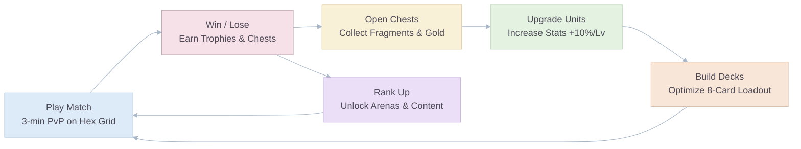

# Goo Galaxy: Game Design Document

## Elevator Pitch

> **"Goo Galaxy"** is a real-time PvP mobile strategy game where players deploy squads of sentient, self-replicating alien slimes onto a hexagonal grid to convert and dominate their opponent's territory. Think **Clash Royale meets Ataxx** — fast 3-minute matches, deep deck-building, and a board that shifts with every move.

---

## Executive Summary

"Goo Galaxy" fuses the deterministic, spatial-domination logic of classic board games **Ataxx** and **Hexxagon** with the asymmetrical deck-building, real-time unit deployment, and elixir-based resource management popularized by **Clash Royale**. The result is a competitively deep yet immediately accessible mobile experience designed for the mid-core strategy audience.

The game is built on the **Unity Engine** using **Netcode for GameObjects (NGO)** for multiplayer, targeting iOS and Android with a Free-to-Play (F2P) business model driven by cosmetic monetization, a Battle Pass ("Galaxy Pass"), and a fair progression system.

> **Note:** For MVP testing scope and project phases, see `09_MVP_And_Roadmap.md`. This document and the rest of the GDD describe the **complete product vision**.

---

## Unique Selling Proposition (USP)

| Dimension            | What Makes Goo Galaxy Unique                                                                                                                            |
| :------------------- | :------------------------------------------------------------------------------------------------------------------------------------------------------ |
| **Core Mechanic**    | No other mobile game combines Ataxx-style spatial conversion with real-time elixir-based card deployment. Every piece placed can flip the entire board. |
| **Tactical Depth**   | Clone vs. Jump movement creates a constant risk/reward dilemma absent from lane-based games like Clash Royale.                                          |
| **Visual Identity**  | Neon-drenched sentient slimes in sterile corporate labs — a charming, IP-rich aesthetic with high merchandising potential.                              |
| **Fair Competition** | Komi system (energy compensation for Player 2) mathematically neutralizes first-mover advantage — a problem no competitor has formally solved.          |
| **Spectator Appeal** | The hex grid's visual clarity and dramatic territory swings make matches highly watchable and streamable.                                               |

---

## Game Pillars

### 1. Strategic Depth via Spatial Control

The hexagonal grid is the arena. Victory depends on **positioning**, not brute force. Every Clone expands territory; every Jump repositions power. The interplay between unit abilities and grid geometry creates emergent tactical depth that rewards planning over reflexes alone.

### 2. Dynamic Pacing

A strict **3-minute match** with a **1-minute 2x Energy Overtime** ensures no game overstays its welcome. The overtime phase creates dramatic comebacks and tests both strategic foresight and execution speed — the perfect blend for mobile sessions.

### 3. Accessible yet Deep Meta-Game

Card collection, fragment-based upgrades, and a 10-Arena ranking ladder create a long progression arc. The 10% uniform stat scaling per level ensures all card interactions remain mathematically identical at every skill tier.

### 4. Pristine "Corporate Lab" Aesthetics

A unique visual identity — sterile, hyper-funded intergalactic laboratories juxtaposed against vibrant, bouncy, neon-colored sentient slimes. This charm-meets-menace duality drives global appeal, cosmetic desirability, and IP recognition.

### 5. Fair Competitive Play

Mathematics-driven balance via the $P_v \propto E^2$ power-cost formula, combined with Komi energy compensation for Player 2, ensures competitive integrity. The Draft Mode further strips away progression advantages for pure-skill tournaments.

---

## Core Loop

### Loop Breakdown

| Step | Action            | Engagement Driver                                                           |
| :--: | :---------------- | :-------------------------------------------------------------------------- |
|  1   | **Play Match**    | Core fun — real-time spatial PvP combat on a 61-hex grid.                   |
|  2   | **Earn Rewards**  | Extrinsic motivation — Trophies for ranking, Chests for progression.        |
|  3   | **Open Chests**   | Variable-ratio reinforcement — randomized but deterministic fragment drops. |
|  4   | **Upgrade Units** | Power fantasy — stat increases feel meaningful but preserve balance.        |
|  5   | **Build Decks**   | Self-expression — experiment with 8-card loadouts and discover synergies.   |
|  6   | **Rank Up**       | Long-term aspiration — unlock new Arenas, troops, events, and prestige.     |

---

## Competitive Landscape

| Game                 | Similarity to Goo Galaxy                                               | Key Difference                                                      |
| :------------------- | :--------------------------------------------------------------------- | :------------------------------------------------------------------ |
| **Clash Royale**     | Real-time card deployment, elixir economy, 8-card decks, Arena ranking | Lane-based tower destruction vs. hex grid spatial domination        |
| **Hexxagon / Ataxx** | Hex grid, Clone/Jump movement, conversion mechanic                     | No asymmetric units, no deck-building, no real-time resource system |
| **Chess**            | Deterministic strategy, spatial control, competitive ladder            | Turn-based, no card collection, no meta-game progression            |
| **TFT / Auto Chess** | Meta-game depth, unit synergies, ranked competitive                    | Auto-battler with no direct board manipulation by players           |
| **Brawl Stars**      | Supercell polish, short matches, Trophy Road, cosmetics                | Action/shooter gameplay vs. strategic board control                 |

**Market Positioning:** Goo Galaxy occupies the intersection of **board game tactical depth** and **mobile card-game accessibility** — a niche currently unserved by any major title.

---

## Target Audience & Platform

- **Platform:** Mobile (iOS & Android). Potential future expansion to tablet-optimized layouts.
- **Primary Audience:** Mid-core strategy players (ages 16-35). Fans of Clash Royale, auto-battlers, chess, and tactical board games.
- **Secondary Audience:** Casual players attracted by the charming slime aesthetic and short match length.
- **Monetization Sensitivity:** The audience expects fair F2P. Cosmetic-first monetization with zero pay-to-win mechanics in competitive modes.

---

## Key Performance Indicators (KPI Targets)

| KPI                        | Target          | Industry Benchmark (Mid-Core) |
| :------------------------- | :-------------- | :---------------------------- |
| **Day 1 Retention**        | ≥ 40%           | 25-33%                        |
| **Day 7 Retention**        | ≥ 18%           | 8-15%                         |
| **Day 30 Retention**       | ≥ 7%            | 3-5%                          |
| **Average Session Length** | 8-12 min        | 6-10 min                      |
| **Sessions per Day**       | 4-6             | 3-5                           |
| **P1 vs P2 Win Rate**      | 49-51%          | N/A (unique to Goo Galaxy)    |
| **ARPDAU**                 | USD 0.08 - 0.15 | USD 0.05 - 0.12               |
| **Day 7 Payer Conversion** | ≥ 3%            | 2-3%                          |

---

## Document Index

|  #  | Document                                       | Description                                                     |
| :-: | :--------------------------------------------- | :-------------------------------------------------------------- |
| 00  | **Pitch & Overview** _(this document)_         | Vision, core loop, KPIs, and competitive positioning.           |
| 01  | `01_Mechanics_and_Core_Gameplay.md`            | Hex grid rules, energy system, match flow, controls.            |
| 02  | `02_Mathematics_and_Balancing.md`              | Power-cost formula, progression curves, Komi, matchmaking.      |
| 03  | `03_Troops_Spells_and_Factions.md`             | Full unit roster, stat tables, synergy matrix, deck archetypes. |
| 04  | `04_Economy_and_Monetization.md`               | Dual currency, chest cycle, Galaxy Pass, pricing strategy.      |
| 05  | `05_Meta_Game_Retention_and_LiveOps.md`        | Clans, events, seasonal calendar, daily/weekly challenges.      |
| 06  | `06_Art_Direction_and_UX.md`                   | Visual identity, color system, screen flow, accessibility.      |
| 07  | `07_Audio_and_Sound_Design.md`                 | Adaptive music, SFX catalog, middleware architecture.           |
| 08  | `08_Technical_Architecture_and_Multiplayer.md` | Unity architecture, NGO networking, class diagrams, DevOps.     |
| 09  | `09_MVP_And_Roadmap.md`                        | MVP scope, production phases, Gantt timeline, risk matrix.      |
| 10  | `10_Operations_Security_and_Legal.md`          | GDPR, COPPA, loot box compliance, anti-cheat, soft launch.      |
| 11  | `11_References_and_Appendix.md`                | Glossary, key formulas, bibliography, data structures.          |
