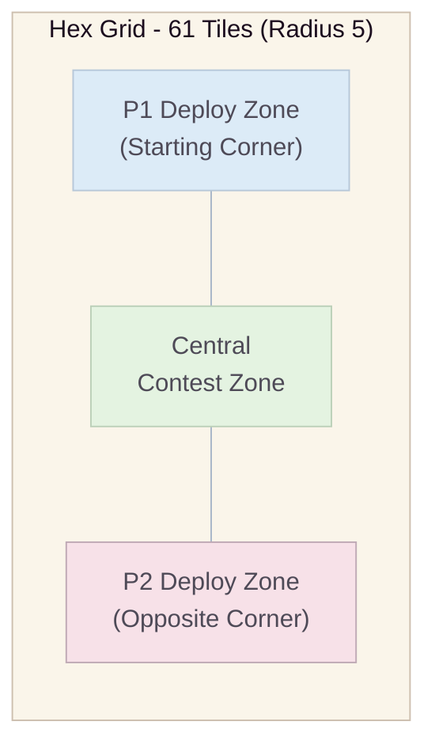
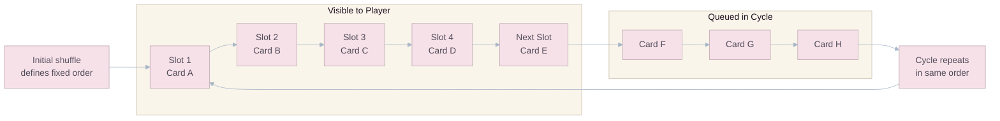
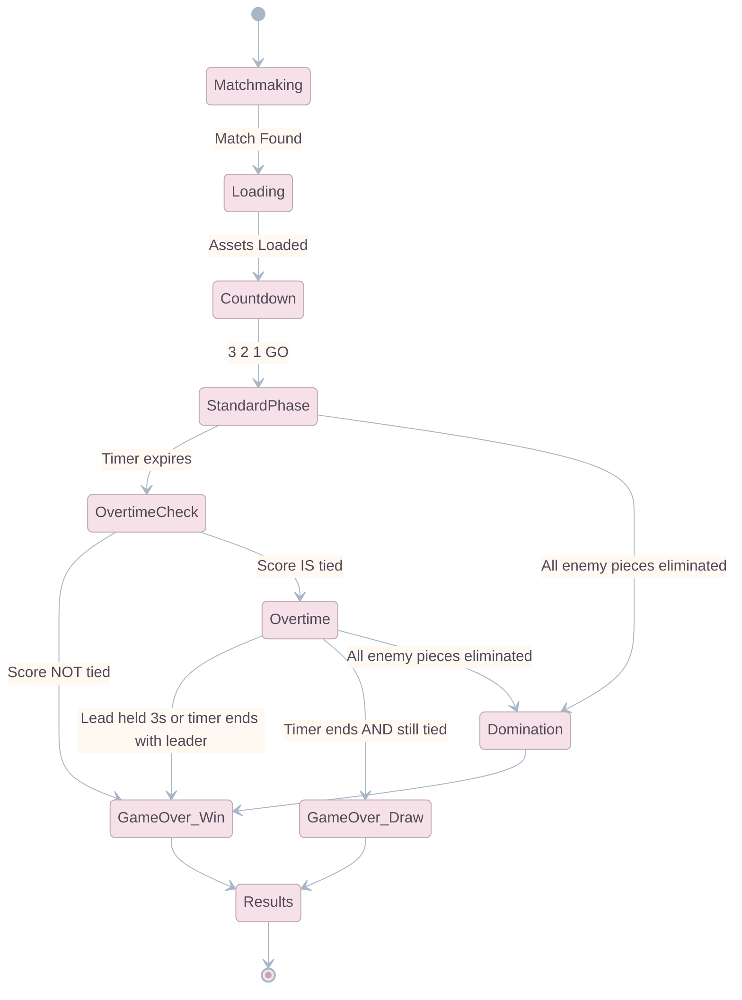

# Mechanics & Core Gameplay

## The Hexagonal Grid

The game takes place on a finite, bounded hexagonal grid consisting of **61 hex tiles** arranged in a flat-top hexagon with a radius of 5 (i.e., 5 hexes from center to edge). The grid uses an **Axial Coordinate System (q, r)** for all spatial calculations.

### Board Layout



### Coordinate System (Axial q, r)

The grid is stored as a `Dictionary<Vector2Int, HexTile>` using axial coordinates. The center hex is `(0, 0)`.

**Distance formula between two hexes:**
$$d = \frac{|q_1 - q_2| + |r_1 - r_2| + |(q_1 + r_1) - (q_2 + r_2)|}{2}$$

**Neighbor directions (6 adjacent hexes):**

```json
{
  "directions": [
    { "name": "E", "q": +1, "r": 0 },
    { "name": "NE", "q": +1, "r": -1 },
    { "name": "NW", "q": 0, "r": -1 },
    { "name": "W", "q": -1, "r": 0 },
    { "name": "SW", "q": -1, "r": +1 },
    { "name": "SE", "q": 0, "r": +1 }
  ]
}
```

### Deployment Zones

Each player has a **starting deployment zone** consisting of 2 pre-placed "Subject Alpha" units at match start. The exact starting positions use **true rotational symmetry** around the board center so neither player receives a geometry advantage before Komi is applied:

| Player                 | Starting Hex 1 | Starting Hex 2                   |
| :--------------------- | :------------- | :------------------------------- |
| **Player 1** (Cyan)    | `(+4, -4)`     | `(-4, +4)` — _diagonal opposite_ |
| **Player 2** (Magenta) | `(+4, 0)`      | `(-4, 0)` — _diagonal opposite_  |

> On a flat-top axial hex grid, Player 2's pair is the **60-degree rotational transform** of Player 1's pair. The launch board therefore keeps opening geometry symmetric and uses **resource Komi**, not positional bias, as the primary first-move compensation lever.

### Blocked Tiles & Map Variants

Some maps contain **blocked tiles** — impassable hexes that no unit can occupy. Blocked tiles are always placed in **rotational symmetry** around the board center to preserve fairness. The MVP ships with a single open map (0 blocked tiles). Post-launch maps introduce 2, 4, or 6 blocked tiles for strategic variety.

### Competitive Map Pool Rules

To keep ranked readable and balanceable, map variety follows strict rules:

| Rule                          | Competitive Standard                                                                                                   |
| :---------------------------- | :--------------------------------------------------------------------------------------------------------------------- |
| **Seasonal ranked pool size** | Maximum **3 maps** at a time.                                                                                          |
| **Geometry complexity**       | Maximum **6 blocked tiles** on ranked maps.                                                                            |
| **Symmetry requirement**      | Rotational symmetry only. No hand-authored asymmetric gimmicks.                                                        |
| **Modifier policy**           | Ranked maps change **geometry first**. Active hex effects are reserved for casual/event playlists until proven stable. |
| **Map bias ceiling**          | No map should shift any major archetype by more than **+4% win rate** versus global baseline.                          |

### Post-Launch Map Catalogue

| Map                | Layout                                                | Strategic Identity                                                         | Release Target     |
| :----------------- | :---------------------------------------------------- | :------------------------------------------------------------------------- | :----------------- |
| **Open Petri**     | 0 blocked tiles                                       | Baseline macro map. Rewards clean cycle play and board reading.            | MVP / Ranked Core  |
| **Ring Labyrinth** | 4 blocked tiles around the central ring               | Rewards Jump timing, flank denial, and Hover counterplay.                  | Season 2           |
| **Split Reactor**  | 6 blocked tiles forming three mirrored approach lanes | Rewards lane commitment, push/pull displacement, and stronger front lines. | Season 4           |
| **Catalyst Wells** | Open geometry + 2 mirrored objective hexes            | Event-only ruleset for testing active tiles without polluting ranked.      | Limited-Time Event |

---

## Core Movement Mechanics

The foundational rules derive from **Ataxx** and **Hexxagon**. When a unit lands adjacent to enemy pieces, it **converts** them to the deploying player's color/faction. Players use an accumulating **Energy** resource to deploy units from their deck.

Abilities trigger **upon landing**, and their efficacy depends on the movement type:

### Clone (1-Hex Range)

- The original piece **stays in place**.
- A **new copy** of the unit appears on the target hex.
- **Net effect:** Total unit count **increases by 1**. Board presence expands.
- **Strategic Use:** Steady territorial expansion. The safest, most efficient way to fill the board.

### Jump (2-Hex Range)

- The original piece **is removed** from its source hex.
- The unit **reappears** on the target hex (2 hexes away).
- **Net effect:** Total unit count **stays the same**. Repositioning without growth.
- **Strategic Use:** Aggressive flanking, activating Jump-specific abilities (e.g., Acid Crawler's hazard trail), breaking through enemy lines.

### Conversion Rules

When a unit lands (via Clone or Jump), **all adjacent enemy units within 1-hex radius are converted** to the deploying player's faction. Conversion changes **ownership only**: the unit keeps its original card identity, passive/impact rules, and active status effects unless a specific card says otherwise. Specific exceptions:

| Unit Type                | Conversion Behavior                                                                                                   |
| :----------------------- | :-------------------------------------------------------------------------------------------------------------------- |
| Standard (Subject Alpha) | Converted normally (1 adjacent event = flip).                                                                         |
| Armored (Bio-Phalanx)    | Requires **2 separate** adjacent conversion events to flip. The first valid event strips armor only. The second valid event converts. Once stripped, armor does **not** regenerate unless a future card explicitly says so. |
| Heavy (Apex Strain)      | Cannot be displaced by push/pull effects, but CAN be converted normally.                                              |
| Frozen (Cryo-Stasis)     | **Cannot be converted** while frozen. Immune to all conversion for the duration.                                      |
| Rooted (Plasmic Leaper)  | Converted normally. The root marker remains until that piece's controller completes their next successful deployment. |

### Action Timing Model (Real-Time)

Goo Galaxy is a **real-time simultaneous** game. Whenever this GDD uses legacy board-game language such as "turn" or "turn cycle," implementation should interpret it as an **action window**, not a literal turn.

- **Successful deployment:** Any troop or spell placement that passes validation, spends Energy, and resolves on the board.
- **Owner action window:** Expires after the effect owner's next successful deployment resolves.
- **Defender action window:** Expires after the affected unit's controller completes their next successful deployment.
- **Immediate resolution:** Effects marked immediate resolve as part of the same landing event and do not persist to a later action window.

This timing model keeps the game readable in real time while preserving the deterministic intent of the original Ataxx-inspired design.

### Interaction Resolution Priority

To prevent edge-case ambiguity as new mechanics are added, every deployment resolves in the same order:

1. **Validation & payment**: legality checks pass and Energy is spent.
2. **Movement resolution**: Clone or Jump places the acting unit on the destination hex.
3. **Standard conversion**: adjacent enemy units flip ownership as allowed by their protections.
4. **Landing impact ability**: the card's unique on-landing effect resolves.
5. **Displacement / board status updates**: push, pull, seal, puddles, and similar board-state modifiers apply.
6. **Self-cleanup**: self-destruct, temporary source cleanup, or delayed removal resolves.
7. **Win-condition check**: Domination, score lead, and post-resolution state are evaluated.

Any future mechanic that cannot fit cleanly into this order should be redesigned before production.

**Armored Resolution Rule:** A single standard landing event can strip a Bio-Phalanx's armor, but it does not both strip and convert that same piece unless a future mechanic explicitly creates multiple separate conversion events. In the launch ruleset, armor stripping and final conversion always happen on different valid conversion attempts.

---

## The Energy System

Energy (also referred to as "Elixir" in design shorthand) is the primary resource governing the tempo of gameplay.

### Energy Parameters

| Parameter                         | Standard Phase                        | Overtime (2x)          |
| :-------------------------------- | :------------------------------------ | :--------------------- |
| **Generation Rate**               | 1 Energy / 2.8 seconds                | 1 Energy / 1.4 seconds |
| **Maximum Cap**                   | 10.0 Energy                           | 10.0 Energy            |
| **P1 Starting Energy**            | 5.0                                   | —                      |
| **P2 Starting Energy**            | 5.5 (Komi)                            | —                      |
| **Effective Energy per 3 min**    | ~64 Energy generated                  | —                      |
| **Effective Energy per 1 min OT** | ~43 Energy generated                  | —                      |
| **Total Match Energy Budget**     | ~107 Energy (P1) / ~107.5 Energy (P2) | —                      |

### Energy Leak Penalty

If a player's Energy bar reaches the **10.0 cap**, excess energy is **wasted** (not banked). This creates a natural pressure to constantly deploy units rather than hoard resources — a mechanic that directly rewards active play and punishes passive turtling.

The same cap behavior remains active during **Overtime**. Faster regeneration increases pressure, but never increases maximum stored Energy.

---

## Deck Building & Hand Management

### Deck Composition

Each player brings a deck of **8 cards** into a match:

| Slot                    | Constraint                                                |
| :---------------------- | :-------------------------------------------------------- |
| Cards 1-8               | Any combination of Troops and/or Spells.                  |
| **Minimum Troops**      | At least **4** troops must be in the deck.                |
| **Maximum Spells**      | No more than **4** spells in a single deck.               |
| **No Duplicates**       | Each card can only appear **once** in a deck.             |
| **Average Elixir Cost** | Displayed but not enforced. Recommended range: 2.5 - 4.0. |

### Hand & Cycle

- At any given time, the player has **4 cards visible** in their hand UI.
- A **5th card** is visible in a "next" slot, showing what will enter the hand next.
- Cards are drawn in a **fixed cycle order** (shuffled once at match start). After all 8 cards are played, the cycle repeats in the same order.
- There is **no random draw** during a match — card order is deterministic after the initial shuffle, rewarding players who track their cycle.



---

## Controls & Interaction

### Primary Input: Drag-and-Drop

1. **Tap a card** in the hand UI to select it. Valid deployment hexes highlight on the grid.
2. **Drag the card** onto a valid hex tile. A preview ghost shows the unit's conversion radius.
3. **Release to deploy.** The system validates Energy cost, target hex legality, and movement range.
4. **Cancel** by dragging back to the hand area or tapping anywhere off-grid.

### Secondary Interactions

| Action           | Input                           | Result                                                        |
| :--------------- | :------------------------------ | :------------------------------------------------------------ |
| **Inspect Unit** | Long-press any unit on the grid | Shows unit type, HP, active status effects, and owner.        |
| **Inspect Card** | Long-press any card in hand     | Shows full card description, stats, and ability preview.      |
| **Emote**        | Tap emote button (top-right)    | Sends a pre-approved emote to the opponent.                   |
| **Surrender**    | Settings menu → Surrender       | Immediately forfeits the match. Confirmation dialog required. |

### Thumb Zone Design

All primary interaction elements (card hand, energy bar) are positioned in the **lower 30%** of the screen within the natural thumb-reach zone. The hex grid occupies the **center 50%**. Match timer, score, and opponent info occupy the **top 20%** — visible but non-interactive during combat.

---

## Match Flow & State Machine



### Phase Details

#### 1. Matchmaking (Pre-Match)

- Player enters queue. System matches based on **Trophy count** (±200 range) and **latency** (<150ms preferred).
- Match Found screen shows both players' profiles, Trophy count, and Arena badge.

#### 2. Standard Phase (3:00 Minutes)

- Energy generates at 1.0 per 2.8 seconds.
- Both players deploy simultaneously in real-time.
- Primary win condition: **Most pieces on the board** when the timer hits 0:00.

#### 3. Overtime Check

- If scores are **not tied** at 3:00, the player with more troops on the board wins immediately.
- If troop counts are **exactly tied**, Overtime begins.

#### 4. Overtime / Sudden Death (1:00 Minute)

- **2x Energy Generation** (1.0 per 1.4 seconds).
- The screen edges glow red. Music tempo increases.
- **Win Condition:** The first player to establish a troop-count lead and **hold it for 3 consecutive seconds** wins. If no player holds a lead for 3 seconds when the timer expires, the player with more troops wins.

#### 5. Domination (Instant Win)

- If at **any point** during the match, a player successfully converts or eliminates **every single enemy piece**, the match immediately ends as a **Domination Victory**.
- Domination grants bonus Trophies and a special victory animation.

#### 6. Draw

- If the board is **perfectly tied** after Overtime, the match results in a **Draw**. No Trophies are gained or lost. No chest is awarded.

### Match Scoring & Timeout Resolution

Goo Galaxy uses **troop count** as its match score for timer-based win checks.

$$Score_{player} = \text{number of troops currently controlled by that player on the board}$$

- **Standard timeout:** At 3:00, compare each player's current troop count.
- **Overtime entry:** If troop counts are equal, Overtime begins.
- **Overtime lead check:** The temporary lead is based on troop count only.
- **Draw condition:** If troop counts are still equal when Overtime expires, the match is a draw.

This keeps the timer-based resolution aligned with the game's primary spatial objective: maintain more live board presence than the opponent.

### Disconnect & Reconnect Rules

- If a player disconnects, the server keeps the match alive for **30 seconds**.
- A reconnecting player resumes from the last acknowledged authoritative state. Any unacknowledged client-side anticipation is discarded.
- If only one player fails to return before the 30-second grace period ends, that player forfeits.
- If both players are disconnected beyond the grace window because of a service-wide incident, the match is recorded as a **no-contest draw** and awards no Trophies.
- Reconnect handling is authoritative-server behavior, not a client option.

---

## Spatial Hierarchy & Design Principle

To prevent asymmetric abilities from invalidating the core Ataxx mechanics, the game enforces a **strict spatial hierarchy**:

1. **Abilities only trigger upon landing.** No persistent auras, no passive area denial (except Acid Crawler's temporary hazard).
2. **The win condition is always piece count.** No alternative win conditions (no tower destruction, no king capture). Territory is everything.
3. **Low-cost efficiency beats high-cost spectacle.** Because $P_v \propto E^2$ (see `02_Mathematics_and_Balancing.md`), the raw Energy-to-pieces ratio of Subject Alpha (1 Energy = 1 piece + conversions) will always mathematically outperform reliance on expensive units alone.
4. **Energy is the universal limiter.** Every action costs Energy. No free actions exist. The Energy cap (10) and generation rate create a natural tempo that prevents any single strategy from dominating.

This ensures that **spatial positioning and board-reading** remain the paramount strategic layers, with abilities serving as tactical modifiers — not replacements — for fundamental grid mastery.
