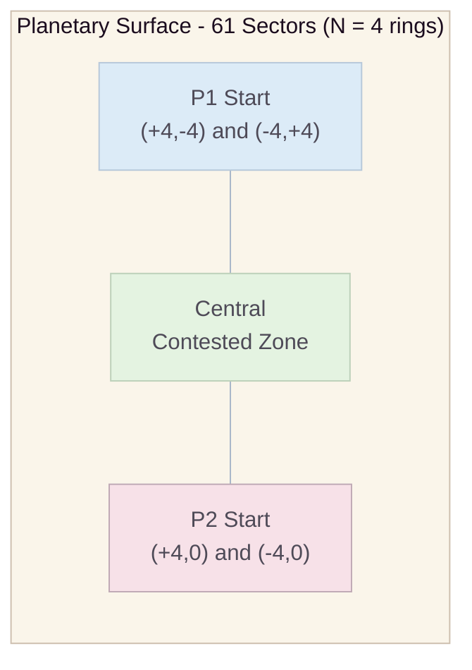
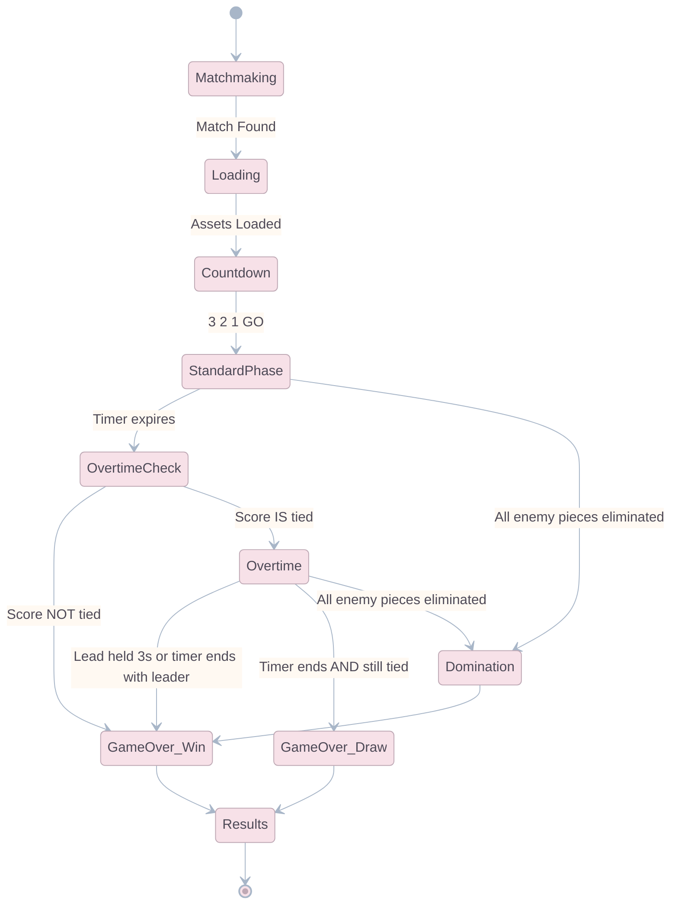

# Mechanics & Core Gameplay

## The Planetary Surface (Hexagonal Grid)

The game takes place on a finite, bounded hexagonal grid consisting of **61 sectors** arranged in a **pointy-top** hexagon with 5 sectors from center to edge (center + 4 concentric rings). Each sector represents a scanned region of the planetary surface. The grid uses an **Axial Coordinate System (q, r)** for all spatial calculations.

> **Implementation Note:** The grid follows the [Red Blob Games](https://www.redblobgames.com/grids/hexagons/) axial convention where `GridRadius = 4` (4 rings beyond the center) produces 61 sectors via the formula `1 + 3 × N × (N + 1)`. The GDD term "5 sectors from center to edge" counts inclusively (1 center + 4 rings). **In code, always use N = 4** — the constant lives in `BoardMetrics` and the authored layout in `Assets/Data/Board/OpenPetriLayout.asset`. Never write "radius 5" in a diagram label or a comment; it is the inclusive count, not the generation parameter.

### Planetary Layout


```mermaid
%%{init: {"theme":"base","themeVariables":{"primaryColor":"#F7E1E8","secondaryColor":"#DCEBF7","tertiaryColor":"#E4F3E1","primaryBorderColor":"#BFA9B5","lineColor":"#A8B6C8","primaryTextColor":"#4E4A57","clusterBkg":"#FAF5EA","clusterBorder":"#CDBFAF","edgeLabelBackground":"#FFF9F2","noteBkgColor":"#F7F1FA","noteTextColor":"#4E4A57","taskBkgColor":"#DCEBF7","taskTextColor":"#4E4A57","taskTextOutsideColor":"#4E4A57","sectionBkgColor":"#E4F3E1","sectionBorderColor":"#BCD0B9","gridColor":"#E8DDD3","todayLineColor":"#C7A7B5","actorBkg":"#F7E1E8","actorBorder":"#BFA9B5","actorTextColor":"#4E4A57","signalColor":"#A8B6C8","signalTextColor":"#4E4A57","labelBoxBkgColor":"#FFF9F2","labelBoxBorderColor":"#CDBFAF","labelTextColor":"#4E4A57"}}}%%
graph TD
    subgraph "Planetary Surface - 61 Sectors (N = 4 rings)"
        direction TB
        A["P1 Start<br/>(+4,-4) and (-4,+4)"] --- CENTER["Central<br/>Contested Zone"]
        CENTER --- B["P2 Start<br/>(+4,0) and (-4,0)"]
    end
    style A fill:#DCEBF7,color:#4E4A57,stroke:#B7C8D9
    style B fill:#F7E1E8,color:#4E4A57,stroke:#BFA9B5
    style CENTER fill:#E4F3E1,color:#4E4A57,stroke:#BCD0B9
```

### Coordinate System (Axial q, r)

The planetary surface is stored as a `Dictionary<HexCoordinates, HexCell>` using axial coordinates (`HexGrid.cs`). The center sector is `(0, 0)`.

**Distance formula between two sectors:**
$$d = \frac{|q_1 - q_2| + |r_1 - r_2| + |(q_1 + r_1) - (q_2 + r_2)|}{2}$$

**Neighbor directions (6 adjacent sectors):**

```json
{
  "directions": [
    { "name": "E", "q": +1, "r": 0 },
    { "name": "NE", "q": +1, "r": -1 },
    { "name": "NW", "q": 0, "r": -1 },
    { "name": "W", "q": -1, "r": 0 },
    { "name": "SW", "q": -1, "r": +1 },
    { "name": "SE", "q": 0, "r": +1 }
  ]
}
```

### Deployment Zones

Each Researcher has a **starting deployment zone** of 2 pre-placed Subject Alpha units, placed so that neither Researcher holds a geometry advantage:

| Player                 | Starting Hex 1 | Starting Hex 2                   |
| :--------------------- | :------------- | :------------------------------- |
| **Player 1** (Cyan)    | `(+4, -4)`     | `(-4, +4)` — _diagonal opposite_ |
| **Player 2** (Magenta) | `(+4, 0)`      | `(-4, 0)` — _diagonal opposite_  |

> **What makes this fair is a reflection, not a rotation.** All four sectors sit at distance 4 from centre, and the 60° rotation does map P1's pair onto P2's — but it does **not** map P2's pair back onto P1's, and no rotation in the hexagon's symmetry group swaps the two Researchers. The transformation that does is the **reflection** $\sigma:(q,r,s) \mapsto (q,s,r)$, which sends P1 → P2 **and** P2 → P1. Because $\sigma$ is an involution, the two opening positions are genuinely interchangeable, and that is the property fairness rests on. Play is also simultaneous, so there is no first-mover effect either: **Komi is 0 here and both Researchers start on 5.0 Energy.** See [`02_Mathematics_and_Balancing.md`](./02_Mathematics_and_Balancing.md#komi-dormant-at-launch-built-for-asymmetric-maps).

### Blocked Sectors & Map Variants

Some maps contain **blocked sectors** — impassable hexes that no unit can occupy. The MVP ships with a single open map (0 blocked sectors). Post-launch maps introduce 2, 4, or 6 for strategic variety.

> **Symmetry requirement — reflection, not rotation.** A blocked-sector set must be invariant under the **same reflection $\sigma$ that swaps the two starting positions**, because that is the transformation which makes the two Researchers interchangeable. Rotational symmetry is **not sufficient** and must not be used as the authoring rule. Minimal counterexample: the set $\{(1,0), (-1,0)\}$ is invariant under a 180° rotation, but $\sigma$ maps $(1,0,-1)$ to $(1,-1,0)$, which is not in the set — so the two Researchers do not face the same geometry. Ring Labyrinth's four blocked sectors are exactly the shape that can satisfy rotation while failing reflection, since 4 is a multiple of neither 3 nor 6. **Validate every candidate map against $\sigma$ before it reaches ranked.**

### Competitive Map Pool Rules

To keep ranked readable and balanceable, map variety follows strict rules:

| Rule                          | Competitive Standard                                                                                                   |
| :---------------------------- | :--------------------------------------------------------------------------------------------------------------------- |
| **Seasonal ranked pool size** | Maximum **3 maps** at a time.                                                                                          |
| **Geometry complexity**       | Maximum **6 blocked sectors** on ranked maps.                                                                          |
| **Symmetry requirement**      | Invariance under the reflection that swaps the starting positions. Rotation alone is insufficient — see above.         |
| **Modifier policy**           | Ranked maps change **geometry first**. Active hex effects are reserved for casual/event playlists until proven stable. |
| **Map bias ceiling**          | No map should shift any major archetype by more than **+4% win rate** versus global baseline.                          |

### Post-Launch Map Catalogue

| Map                | Layout                                                | Strategic Identity                                                         | Release Target     |
| :----------------- | :---------------------------------------------------- | :------------------------------------------------------------------------- | :----------------- |
| **Open Petri**     | 0 blocked tiles                                       | Baseline macro map. Rewards clean cycle play and board reading.            | MVP / Ranked Core  |
| **Ring Labyrinth** | 4 blocked tiles around the central ring               | Rewards Jump timing, flank denial, and Hover counterplay.                  | Season 2           |
| **Split Reactor**  | 6 blocked tiles forming three mirrored approach lanes | Rewards lane commitment, push/pull displacement, and stronger front lines. | Season 4           |
| **Catalyst Wells** | Open geometry + 2 mirrored objective hexes            | Event-only ruleset for testing active tiles without polluting ranked.      | Limited-Time Event |

---

## Core Actions

The foundational rules derive from **Ataxx** and **Hexxagon**. Whenever a unit lands on a sector, it **converts** adjacent enemy units to the acting Researcher's faction.

There are **three distinct actions**, and the distinction is load-bearing: a **Deploy** introduces a new unit type from the Kit, while a **Clone** and a **Jump** operate on a unit already standing on the surface. Cards are not units — a card is played once to put a unit on the board, and that unit then moves on its own for the rest of the expedition.

| Action     | Acts on               | Selected by                  | Net unit count | Requires                                     |
| :--------- | :-------------------- | :--------------------------- | :------------: | :------------------------------------------- |
| **Deploy** | a card in the hand    | tapping the card, then a hex |     **+1**     | target adjacent to a unit the player owns    |
| **Clone**  | one of your own units | tapping the unit, then a hex |     **+1**     | that unit's `canClone`; target within 1 hex  |
| **Jump**   | one of your own units | tapping the unit, then a hex |     **0**      | that unit's `canJump`; target within 2 hexes |

**Universal rule: the target sector must be empty.** No Deploy, Clone, or Jump may target an occupied sector, a blocked sector, or a sector carrying a landing-blocking hazard. Conversion happens to units _adjacent_ to the landing, never to the unit standing on the target.

### Deploy (Play a Card)

- Places a **new unit of the played card's type** on the target sector.
- **Costs the card's authored Energy cost**, exactly once, at deploy. This is the only moment a card's $P_v$ budget is paid.
- **Placement is constrained:** the target must be adjacent to a sector the Researcher already controls. A Researcher can never deploy into open space or behind enemy lines — territory has to be earned by movement first.
- The card leaves the hand and the cycle advances.

### Clone (1-Sector Range)

- The **source unit stays in place**, and a **copy of that same unit type** appears on the target sector.
- The copy inherits the source unit's card identity, not the identity of anything in hand. A Subject Alpha clones into a Subject Alpha.
- Gated by the source unit's **`canClone`** flag. Volatile Mass is authored `canClone: false`, so one on the board can never produce another — the card is the only way to get one.
- **Strategic use:** steady territorial expansion. The cheapest way to add board presence once you have a foothold.

### Jump (2-Sector Range)

- The **source unit is removed** from its sector and **reappears** on the target sector, two sectors away.
- Same unit, same identity — this is a relocation, not a new unit.
- Gated by the source unit's **`canJump`** flag. For Volatile Mass the Jump is also the detonation — see its roster entry.
- **Strategic use:** flanking, escaping a contested edge, and triggering Jump-specific abilities. Acid Crawler's Corrosive Trail fires here, and it fires because **the unit that jumped is an Acid Crawler** — abilities belong to the unit on the board, never to whatever card happens to be in hand.

> **Energy cost of Clone and Jump is not yet fixed.** A free move type cannot work — landing converts, so a free move is free conversion, repeatable without limit in real time. `.docs/refinement/clone-and-jump-energy-cost.md` proposes flat costs (~1.0 for a Clone, ~0.5 for a Jump) with the reasoning and the open tuning questions. Until that lands as a task, treat the costs as **to be determined, but non-zero**.

Abilities trigger **upon landing**, for all three actions.

### Conversion Rules

When a unit lands — by **Deploy, Clone, or Jump** — **every adjacent enemy unit inside the card's `conversionRadius` is converted** to the deploying Researcher's faction (1 hex for every launch card except Volatile Mass, which reaches 2). Conversion changes **ownership only**: the unit keeps its original card identity, passive/impact rules, and active status effects unless a specific card says otherwise. Specific exceptions:

| Unit Type                | Conversion Behavior                                                                                                                                                                                                         |
| :----------------------- | :-------------------------------------------------------------------------------------------------------------------------------------------------------------------------------------------------------------------------- |
| Standard (Subject Alpha) | Converted normally (1 adjacent event = flip).                                                                                                                                                                               |
| Armored (Bio-Phalanx)    | Requires **2 separate** adjacent conversion events to flip. The first valid event strips armor only. The second valid event converts. Once stripped, armor does **not** regenerate unless a future card explicitly says so. |
| Heavy (Apex Strain)      | Cannot be displaced by push/pull effects, but CAN be converted normally.                                                                                                                                                    |
| Frozen (Cryo-Stasis)     | **Cannot be converted** while frozen. Immune to all conversion for the duration.                                                                                                                                            |
| Rooted (Plasmic Leaper)  | Converted normally. The root marker remains until that piece's controller completes their next successful deployment.                                                                                                       |

### Action Timing Model (Real-Time)

Goo Galaxy is a **real-time simultaneous** game. Whenever this GDD uses legacy board-game language such as "turn" or "turn cycle," implementation should interpret it as an **action window**, not a literal turn.

- **Successful deployment:** Any unit or Protocol placement that passes validation, spends Energy, and resolves on the board.
- **Owner action window:** Expires after the effect owner's next successful deployment resolves.
- **Defender action window:** Expires after the affected unit's controller completes their next successful deployment.
- **Immediate resolution:** Effects marked immediate resolve as part of the same landing event and do not persist to a later action window.

This timing model keeps the game readable in real time while preserving the deterministic intent of the original Ataxx-inspired design.

### Interaction Resolution Priority

To prevent edge-case ambiguity as new mechanics are added, every deployment resolves in the same order:

1. **Validation & payment**: legality checks pass and Energy is spent.
2. **Placement resolution**: the acting unit arrives on the destination sector. A **Deploy** instantiates a new unit of the played card's type; a **Clone** adds a copy of the source unit; a **Jump** moves the source unit. All three produce a landing, and every later step treats them identically.
3. **Standard conversion**: adjacent enemy units flip ownership as allowed by their protections.
4. **Landing impact ability**: the card's unique on-landing effect resolves.
5. **Displacement / board status updates**: push, pull, seal, puddles, and similar board-state modifiers apply.
6. **Self-cleanup**: self-destruct, temporary source cleanup, or delayed removal resolves.
7. **Win-condition check**: Domination, score lead, and post-resolution state are evaluated.

Any future mechanic that cannot fit cleanly into this order should be redesigned before production.

**Armored Resolution Rule:** A single standard landing event can strip a Bio-Phalanx's armor, but it does not both strip and convert that same piece unless a future mechanic explicitly creates multiple separate conversion events. In the launch ruleset, armor stripping and final conversion always happen on different valid conversion attempts.

---

## The Energy System

Energy is the primary resource governing the tempo of gameplay. ("Elixir" is retired — see the canonical vocabulary in `11_References_and_Appendix.md`.)

### Energy Parameters

| Parameter                         | Standard Phase                   | Overtime (2x)          |
| :-------------------------------- | :------------------------------- | :--------------------- |
| **Generation Rate**               | 1 Energy / 2.8 seconds           | 1 Energy / 1.4 seconds |
| **Maximum Cap**                   | 10.0 Energy                      | 10.0 Energy            |
| **P1 Starting Energy**            | 5.0                              | —                      |
| **P2 Starting Energy**            | 5.0 (Komi = 0 on symmetric maps) | —                      |
| **Generated over 3 min standard** | ~64 Energy                       | —                      |
| **Generated over 1 min Overtime** | —                                | ~43 Energy             |

**Theoretical match budget** — starting Energy plus everything generated, assuming a match runs the full 3:00 plus Overtime:

| Player | Starting | Generated (3:00 + 1:00) | Total |
| :----- | :------: | :---------------------: | :---: |
| **P1** |   5.0    |          ~107           | ~112  |
| **P2** |   5.0    |          ~107           | ~112  |

> **Read this as a ceiling, not a forecast.** It ignores the 10.0 cap (Energy wasted at the cap is not banked) and the Containment Breach bonus (which adds to the trailing Researcher only). The two rows are identical on symmetric maps; an asymmetric map's Komi would appear as a gap in P2's starting column.

### Energy Leak Penalty

If a player's Energy bar reaches the **10.0 cap**, excess energy is **wasted** (not banked). This creates a natural pressure to constantly deploy units rather than hoard resources — a mechanic that directly rewards active play and punishes passive turtling.

The same cap behavior remains active during **Overtime**. Faster regeneration increases pressure, but never increases maximum stored Energy.

### Containment Breach Protocol (Catch-Up Bonus)

To prevent early snowball scenarios where a small board-presence lead becomes irreversible, a **catch-up energy bonus** activates for the trailing player under specific conditions.

| Parameter                      | Value                             | Description                                                           |
| :----------------------------- | :-------------------------------- | :-------------------------------------------------------------------- |
| **Activation Threshold**       | ≤ 40% of total units on the board | Triggers when the player controls 40% or fewer of all live units.     |
| **Regeneration Bonus**         | +15%                              | Energy regenerates 15% faster during the bonus window.                |
| **Bonus Duration**             | 20 seconds                        | One activation lasts 20 seconds from the moment the threshold is met. |
| **Cooldown**                   | 60 seconds                        | After the bonus expires, it cannot reactivate for 60 seconds.         |
| **Effective Regen (Standard)** | 1 Energy / 2.43 sec               | Standard phase with catch-up active.                                  |
| **Effective Regen (Overtime)** | 1 Energy / 1.22 sec               | Overtime phase with catch-up active.                                  |

**Design Rationale:**

- The +15% bonus is subtle — the rate gain is 0.15/2.8 = 0.0536 E/s, so **one extra Energy takes ~18.7 seconds of active bonus**. Counting the full 20 s-active / 60 s-cooldown cycle, that is ~1.07 Energy per **80 seconds** of sustained disadvantage. It creates **hope and comeback windows** without rubber-banding the leading player's hard-earned advantage.
- The ≤40% threshold ensures the bonus only fires when the gap is significant, not during normal back-and-forth play.
- The 60-second cooldown prevents oscillating activation/deactivation during borderline states and stops players from gaming the system by intentionally staying below threshold.
- This mechanic draws from proven comeback designs in Hearthstone (The Coin), Marvel Snap (risk/reward snapping), and fighting games (Ultra meter buildup on damage taken).

**Visual & Audio Feedback:**

- The Energy bar pulses with a subtle **amber/orange glow** while the bonus is active.
- A brief **containment-breach alarm SFX** plays on activation (distinct from the Overtime siren).
- A small status icon appears near the Energy bar for the duration.

**Remote Tuning:** All four parameters (threshold percentage, regen bonus, duration, cooldown) are remotely tunable server-side without a client update. See `02_Mathematics_and_Balancing.md` for the full tunable parameter list.

---

## Kit Building & Hand Management

### Kit Composition

Each Researcher brings a Kit of **8 cards** into an expedition:

| Slot                    | Constraint                                                 |
| :---------------------- | :--------------------------------------------------------- |
| Cards 1-8               | Any combination of Specimens and/or Protocols.             |
| **Minimum Specimens**   | At least **4** Specimens must be in the Kit.               |
| **Maximum Protocols**   | No more than **4** Protocols in a single Kit.              |
| **No Duplicates**       | Each card can only appear **once** in a Kit.               |
| **Starter Kit**         | New Researchers receive all 8 slots pre-filled. See below. |
| **Average Energy Cost** | Displayed but not enforced. Recommended range: 2.5 - 4.0.  |

> **The first Star Systems unlock fewer than 8 cards.** Gloopiter grants Subject Alpha and Acid Crawler; a Researcher does not own 8 distinct cards until Void's Edge. New accounts therefore start with a **fixed 8-slot Starter Kit** that includes the not-yet-unlocked launch cards at Level 1, and each Star System unlock replaces a starter entry with the permanent, upgradeable version. The no-duplicates rule and the 4-Specimen minimum apply to the Starter Kit exactly as they do to an authored one. Without this, the composition rules above are unsatisfiable for the first six Star Systems.

### Hand & Cycle

- At any given time, the player has **4 cards visible** in their hand UI.
- A **5th card** is visible in a "next" slot, showing what will enter the hand next.
- Cards are drawn in a **fixed cycle order** (shuffled once at match start). After all 8 cards are played, the cycle repeats in the same order.
- There is **no random draw** during a match — card order is deterministic after the initial shuffle, rewarding players who track their cycle.

#### Sample Purge (Strategic Discard)

Players may spend a small amount of Energy to discard a card from their hand and draw the next card in the cycle. This grants agency over hand composition while imposing a real resource cost.

| Parameter               | Value                                          | Description                                                                                                        |
| :---------------------- | :--------------------------------------------- | :----------------------------------------------------------------------------------------------------------------- |
| **Discard Cost**        | 0.5 Energy                                     | Half the cost of a Subject Alpha. A meaningful but not prohibitive tempo sacrifice.                                |
| **Discard Destination** | End of the current cycle                       | The discarded card is placed at the back of the cycle queue and will return after all other cards have been drawn. |
| **Draw Replacement**    | Immediate — next card in cycle enters the hand | The hand size remains constant at 4 cards.                                                                         |
| **Usage Limit**         | None (Energy cost is the only limiter)         | Players may discard multiple times, but each costs 0.5 Energy.                                                     |
| **Time to Regen Cost**  | 1.4 sec (Standard) / 0.7 sec (Overtime)        | How long it takes to regenerate the 0.5 Energy spent.                                                              |

**Design Rationale:**

- A bad opening hand (e.g., three 4+ Energy cards plus one 1-Energy card) currently has no counterplay. Sample Purge gives players a **meaningful choice**: sacrifice tempo now for a better hand later.
- At 0.5 Energy, the cost is low enough to be usable 2-3 times per match without crippling the player, but high enough to prevent degenerate cycling strategies.
- Placing the discarded card at the end of the cycle (rather than destroying it) preserves the deterministic cycle-tracking skill layer and ensures no card is permanently lost.
- This mechanic mirrors best practices from Slay the Spire (card removal at a cost), Legends of Runeterra (toss/predict), and competitive TCGs where hand management is a core skill differentiator.

**UI Implementation:**

- **Swipe Up:** Drag a card upward from the hand toward the top of the screen to discard it. A confirmation glow appears before the Energy is spent.
- **Purge Button:** A small biohazard icon on each card in hand (accessible via long-press or visible on hover) triggers discard.
- **Animation:** The discarded card dissolves with a biohazard-disposal particle effect and the replacement card slides in from the "next" slot.

**Strategic Impact:**

- Cycle Kits (low average Energy) benefit most, as they can afford more discards to dig for key cards.
- Burst Kits (high average Energy) must weigh discard cost carefully — 0.5 Energy may delay their big play by a critical second.
- Adds a skill-testing layer: knowing when to fix a bad hand vs. playing suboptimally to preserve Energy.


```mermaid
%%{init: {"theme":"base","themeVariables":{"primaryColor":"#F7E1E8","secondaryColor":"#DCEBF7","tertiaryColor":"#E4F3E1","primaryBorderColor":"#BFA9B5","lineColor":"#A8B6C8","primaryTextColor":"#4E4A57","clusterBkg":"#FAF5EA","clusterBorder":"#CDBFAF","edgeLabelBackground":"#FFF9F2","noteBkgColor":"#F7F1FA","noteTextColor":"#4E4A57","taskBkgColor":"#DCEBF7","taskTextColor":"#4E4A57","taskTextOutsideColor":"#4E4A57","sectionBkgColor":"#E4F3E1","sectionBorderColor":"#BCD0B9","gridColor":"#E8DDD3","todayLineColor":"#C7A7B5","actorBkg":"#F7E1E8","actorBorder":"#BFA9B5","actorTextColor":"#4E4A57","signalColor":"#A8B6C8","signalTextColor":"#4E4A57","labelBoxBkgColor":"#FFF9F2","labelBoxBorderColor":"#CDBFAF","labelTextColor":"#4E4A57"}}}%%
flowchart LR
    START["Initial shuffle<br/>defines fixed order"] --> H1
    H4 -.->|"playing any slot pulls<br/>the next card in"| NEXT
    subgraph "Visible to Player"
        H1["Slot 1<br/>Card A"] ~~~ H2["Slot 2<br/>Card B"] ~~~ H3["Slot 3<br/>Card C"] ~~~ H4["Slot 4<br/>Card D"]
        NEXT["Next Slot<br/>Card E"]
    end
    subgraph "Queued in Cycle"
        NEXT --> R1["Card F"] --> R2["Card G"] --> R3["Card H"]
    end
    R3 --> REPEAT["Cycle repeats<br/>in same order"]
    REPEAT --> H1
```

---

## Controls & Interaction

### Two Selection Paths

Both paths follow the same shape — **select a source, the board highlights every legal target, commit** — and both end in the same validation. The source is what differs.

**Path A — Move a unit you already have**

1. **Tap one of your units** on the surface.
2. The board highlights every legal target for **that unit**: adjacent empty sectors if it `canClone`, sectors at distance 2 if it `canJump`. A unit that can do neither highlights nothing.
3. **Tap or drag to a highlighted sector** to commit. A preview ghost shows the unit's conversion radius at the destination.

**Path B — Play a card from the hand**

1. **Tap a card** in the Active Samples.
2. The board highlights **every empty sector adjacent to a unit you control** — the legal deploy footprint for any card.
3. **Drag onto a highlighted sector** to commit. The Energy cost is the card's own.

**Both paths:** cancel by dragging back to the hand area or tapping anywhere off-grid. Occupied, blocked, and hazard sectors are never highlighted, so an illegal target cannot be committed by accident.

> **Why the deploy footprint is restricted.** Allowing a card to be played anywhere would make the board's territorial structure irrelevant — a Researcher could answer any threat instantly, from any distance. Requiring adjacency to owned territory means **reach has to be built by movement**, which is what makes Clone's steady expansion and Jump's flanking meaningful.

### Secondary Interactions

| Action           | Input                           | Result                                                        |
| :--------------- | :------------------------------ | :------------------------------------------------------------ |
| **Inspect Unit** | Long-press any unit on the grid | Shows unit type, HP, active status effects, and owner.        |
| **Inspect Card** | Long-press any card in hand     | Shows full card description, stats, and ability preview.      |
| **Emote**        | Tap emote button (top-right)    | Sends a pre-approved emote to the opponent.                   |
| **Surrender**    | Settings menu → Surrender       | Immediately forfeits the match. Confirmation dialog required. |

### Thumb Zone Design

All primary interaction elements (Active Samples, Energy bar, the Researcher's own score) sit in the **bottom 20-30%** of the screen, within the natural thumb-reach zone. The planetary surface occupies the **center 50-60%**. The match timer, the opponent's identity, and the opponent's score occupy the **top 20%** — visible but non-interactive during an expedition. `06_Art_Direction_and_UX.md` owns the authoritative HUD zoning; these are the same three bands.

---

## Match Flow & State Machine


```mermaid
%%{init: {"theme":"base","themeVariables":{"primaryColor":"#F7E1E8","secondaryColor":"#DCEBF7","tertiaryColor":"#E4F3E1","primaryBorderColor":"#BFA9B5","lineColor":"#A8B6C8","primaryTextColor":"#4E4A57","clusterBkg":"#FAF5EA","clusterBorder":"#CDBFAF","edgeLabelBackground":"#FFF9F2","noteBkgColor":"#F7F1FA","noteTextColor":"#4E4A57","taskBkgColor":"#DCEBF7","taskTextColor":"#4E4A57","taskTextOutsideColor":"#4E4A57","sectionBkgColor":"#E4F3E1","sectionBorderColor":"#BCD0B9","gridColor":"#E8DDD3","todayLineColor":"#C7A7B5","actorBkg":"#F7E1E8","actorBorder":"#BFA9B5","actorTextColor":"#4E4A57","signalColor":"#A8B6C8","signalTextColor":"#4E4A57","labelBoxBkgColor":"#FFF9F2","labelBoxBorderColor":"#CDBFAF","labelTextColor":"#4E4A57"}}}%%
stateDiagram-v2
    [*] --> Matchmaking
    Matchmaking --> Loading : Match Found
    Loading --> Countdown : Assets Loaded
    Countdown --> StandardPhase : 3 2 1 GO

    StandardPhase --> OvertimeCheck : Timer expires
    StandardPhase --> Domination : All enemy pieces eliminated

    OvertimeCheck --> GameOver_Win : Score NOT tied
    OvertimeCheck --> Overtime : Score IS tied

    Overtime --> GameOver_Win : Lead held 3s or timer ends with leader
    Overtime --> GameOver_Draw : Timer ends AND still tied
    Overtime --> Domination : All enemy pieces eliminated

    Domination --> GameOver_Win

    GameOver_Win --> Results
    GameOver_Draw --> Results
    Results --> [*]
```

### Phase Details

#### 1. Matchmaking (Pre-Match)

- Researcher enters queue. System matches based on **Discovery Points** (±200 range) and **latency** (<150ms preferred).
- Match Found screen shows both Researchers' profiles, DP, and Star System badge.

#### 2. Standard Phase (3:00 Minutes)

- Energy generates at 1.0 per 2.8 seconds.
- Both players deploy simultaneously in real-time.
- Primary win condition: **most units on the surface** when the timer hits 0:00.

#### 3. Overtime Check

- If scores are **not tied** at 3:00, the Researcher with more units on the surface wins immediately.
- If unit counts are **exactly tied**, Overtime begins.

#### 4. Overtime / Sudden Death (1:00 Minute)

- **2x Energy Generation** (1.0 per 1.4 seconds).
- The screen edges glow red. Music tempo increases.
- **Win Condition:** The first Researcher to establish a unit-count lead and **hold it for 3 consecutive seconds** wins. If no one holds a lead for 3 seconds when the timer expires, the Researcher with more units wins.

#### 5. Domination (Instant Win with Bonus)

- If at **any point** during the match, a player successfully converts or eliminates **every single enemy piece**, the match immediately ends as a **Domination Victory**.
- **Domination DP Bonus:** Winning by Domination applies a **+50% multiplier** to the base DP gain ($M_{domination} = 1.5$). This rewards aggressive, risk-taking play over conservative timeout wins. See `02_Mathematics_and_Balancing.md` for the full DP formula.
- A **special victory animation** plays: the winning player's faction color floods the entire board in a radial wave, accompanied by a triumphant fanfare and a "DOMINATION" banner.
- Domination victories are tracked as a player statistic and featured on the profile.

**Design Rationale:**

- Pure Domination is rare in high-level play (experienced opponents rarely lose every piece). The +50% DP bonus creates a **meaningful incentive** to pursue the complete wipe rather than safely running out the clock with a lead.
- The risk/reward calculus: going for Domination often means overextending and risking a counter-attack. The bonus makes that gamble mathematically interesting.
- This draws from fighting game "Perfect" bonuses and Clash Royale's 3-crown victories — spectacle moments that are memorable, shareable, and aspirational.

#### 6. Stalemate (Draw)

- If the surface is **perfectly tied** after Overtime, the expedition ends in a **Stalemate**. No DP is gained or lost. No Capsule is awarded.
- **Stalemate** is the player-facing banner (`06_Art_Direction_and_UX.md`) and the audio stinger name (`07_Audio_and_Sound_Design.md`). **Draw** is the internal state name (`GameOver_Draw`). Both refer to this outcome; prefer Stalemate in player-facing text.

### Match Scoring & Timeout Resolution

Goo Galaxy uses **unit count** as its match score for timer-based win checks.

$$Score_{player} = \text{number of units currently controlled by that player on the board}$$

- **Standard timeout:** At 3:00, compare each Researcher's current unit count.
- **Overtime entry:** If unit counts are equal, Overtime begins.
- **Overtime lead check:** The temporary lead is based on unit count only.
- **Draw condition:** If unit counts are still equal when Overtime expires, the expedition is a draw.

This keeps the timer-based resolution aligned with the game's primary spatial objective: maintain more live board presence than the opponent.

### Disconnect & Reconnect Rules

- If a player disconnects, the server keeps the match alive for **30 seconds**.
- A reconnecting player resumes from the last acknowledged authoritative state. Any unacknowledged client-side anticipation is discarded.
- If only one player fails to return before the 30-second grace period ends, that player forfeits.
- If both players are disconnected beyond the grace window because of a service-wide incident, the expedition is recorded as a **no-contest draw** and awards no DP.
- Reconnect handling is authoritative-server behavior, not a client option.

---

## Spatial Hierarchy & Design Principle

To prevent asymmetric abilities from invalidating the core Ataxx mechanics, the game enforces a **strict spatial hierarchy**:

1. **Abilities only trigger upon landing.** No persistent auras, and no _permanent_ area denial. Effects that occupy or restrict sectors are allowed only as **status and hazard effects with a duration measured in action windows** — the class that today contains acid puddles, Frozen, Rooted, and Sealed. Anything that would outlast its owner's attention belongs outside the ranked ruleset.
2. **The win condition is always unit count.** No alternative win conditions (no tower destruction, no king capture). Territory is everything.
3. **Low-cost efficiency beats high-cost spectacle.** Because $P_v \propto E^2$ (see `02_Mathematics_and_Balancing.md`), the raw Energy-to-pieces ratio of Subject Alpha (1 Energy = 1 piece + conversions) will always mathematically outperform reliance on expensive units alone.
4. **Energy is the universal limiter.** Every action costs Energy. No free actions exist. The Energy cap (10) and generation rate create a natural tempo that prevents any single strategy from dominating.

This ensures that **spatial positioning and board-reading** remain the paramount strategic layers, with abilities serving as tactical modifiers — not replacements — for fundamental grid mastery.
