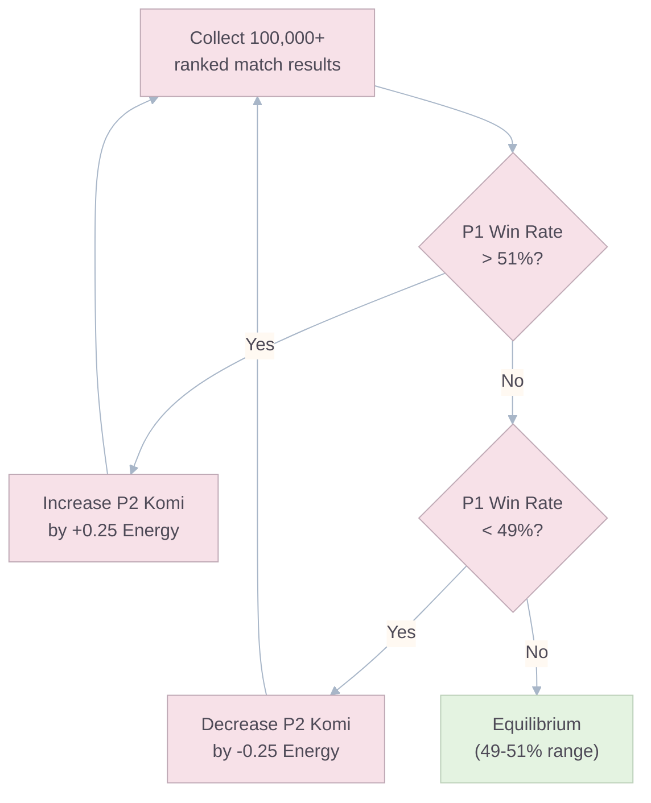
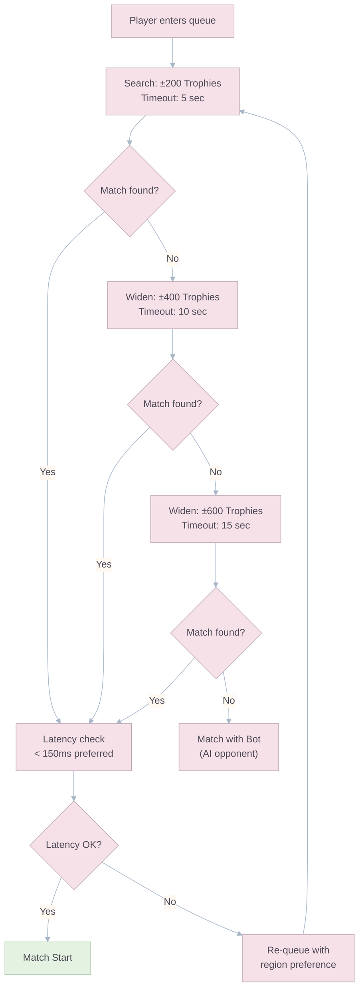

# Mathematics & Balancing

## The Power-Cost Formula

In games with an accumulating resource system, a card's cost represents both **resource deprivation** (you can't spend that Energy on anything else) and **temporal risk** (you're vulnerable while saving up). Therefore, power cannot scale linearly with cost — a 4-Energy card must be significantly more impactful than two 2-Energy cards to justify the deployment window.

### The Quadratic Scaling Law

A card's theoretical **Power Value** ($P_v$) scales with the **square** of its Energy cost ($E$):

$$P_v = k \cdot E^2$$

Where $k$ is a normalization constant set to 1.0 for the baseline unit (Subject Alpha at 1 Energy).

$P_v$ is a **composite metric** combining:

- **Spatial Influence (SI):** Number of hexes affected by landing (conversion radius + ability radius).
- **Temporal Impact (TI):** Duration of status effects or area denial.
- **Strategic Utility (SU):** Qualitative assessment of defensive/offensive versatility.

$$P_v = \alpha \cdot SI + \beta \cdot TI + \gamma \cdot SU$$

Where $\alpha = 0.5$, $\beta = 0.25$, $\gamma = 0.25$ (weights tunable during playtesting).

### Power Budget per Unit

| Unit                         | Energy | $P_v$ Budget ($E^2$) | Primary Power Source                                                                   |
| :--------------------------- | :----: | :------------------: | :------------------------------------------------------------------------------------- |
| Subject Alpha                |   1    |          1           | Pure spatial conversion (baseline).                                                    |
| Acid Crawler                 |   2    |          4           | Conversion + acid-puddle denial for 2 owner action windows.                            |
| Bio-Phalanx                  |   3    |          9           | Conversion + Armored Membrane (requires 2 hits to flip).                               |
| Volatile Mass                |   4    |          16          | 2-hex radius AoE conversion (but self-destructs, no Clone).                            |
| Plasmic Leaper               |   4    |          16          | Conversion + Hover traversal + Root on converted enemies for 1 defender action window. |
| The Apex Strain              |   5    |          25          | Conversion + Seismic push (displaces enemies 1 hex outward).                           |
| Cryo-Stasis _(Spell)_        |   2    |          4           | 3-hex cluster freeze for 1 defender-action window.                                     |
| Sterilization Beam _(Spell)_ |   4    |          16          | 4-hex cluster total wipe (all units removed).                                          |

### Prototype Budget Targets

The following entries are expansion prototypes, not part of the launch roster. Their target budgets are listed here so future design work stays anchored to the same system:

| Prototype             | Energy | Target $P_v$ Budget ($E^2$) | Intended Role                                                    |
| :-------------------- | :----: | :-------------------------: | :--------------------------------------------------------------- |
| Quarantine Drone      |   3    |              9              | Tempo denial through temporary Sealed hexes.                     |
| Detox Mycelium        |   3    |              9              | Anti-control support and localized cleanse.                      |
| Purge Pulse _(Spell)_ |   2    |              4              | Utility answer to Frozen, Rooted, Sealed, and acid puddles.      |
| Phase Relay _(Spell)_ |   3    |              9              | Mobility burst that trades card economy for tactical reposition. |

### Validation Methodology

To confirm that each unit's actual in-game performance matches its $P_v$ budget:

1. **Simulation:** Run 10,000 Monte Carlo matches per card pairing using a basic MCTS AI.
2. **Metric:** Calculate the **Effective Conversion Rate (ECR)** — the average number of enemy hexes flipped per Energy spent.
3. **Target:** Each card's ECR should fall within ±15% of its expected $P_v / E$ ratio.
4. **Correction:** If a card over/underperforms, adjust its ability parameters (radius, duration, etc.) — never its Energy cost — to maintain the $E^2$ progression intact.

### Expansion Guardrails

New content must widen decision space, not just raise ceiling power. Every new troop, spell, map, or event mechanic must pass these checks before entering ranked:

| Guardrail                    | Threshold                                                                                                                      | Why It Exists                                                                  |
| :--------------------------- | :----------------------------------------------------------------------------------------------------------------------------- | :----------------------------------------------------------------------------- |
| **Counterplay availability** | Must have at least **2 practical answers** already in the live card pool.                                                      | Prevents one-card checkmates.                                                  |
| **Map-local dominance**      | Must stay below **54% win rate** on every ranked map class in equal-skill tests.                                               | Avoids "fine globally, broken on one map" releases.                            |
| **Combo inflation**          | No 2-card package may exceed **1.35x** the expected ECR of its combined Energy spend.                                          | Prevents hidden burst packages from invalidating baseline units.               |
| **Cognitive load cap**       | A season introduces at most **1 new status keyword** to ranked play.                                                           | Keeps onboarding and readability under control.                                |
| **Skill-band spread**        | Bronze-to-top-rank win rate spread should stay within **8 percentage points** unless the card is explicitly marked high-skill. | Avoids cards that are useless for most players but oppressive in expert hands. |

> **Release Principle:** If a new card only becomes balanced after nerfing several older cards, the new card is the problem.

---

## Progression Scaling Curve

### The 10% Compound Rule

All numerical stats increase by exactly **10% per level**, applied uniformly across all rarities and card types:

$$\text{Stat}_{Lv} = \text{Stat}_{Base} \times 1.10^{(Lv - 1)}$$

This ensures that **all card interactions remain mathematically identical** at every level. A Level 5 Bio-Phalanx still requires exactly 2 conversion events to flip, regardless of the opponent's level — because both sides scale at the same rate.

### Stat Progression Table (Subject Alpha — Baseline)

|   Level    | Conversion Power | Relative Strength | Fragments Required | Gold Required |
| :--------: | :--------------: | :---------------: | :----------------: | :-----------: |
|     1      |       100        |       1.00x       |         —          |       —       |
|     2      |       110        |       1.10x       |         2          |       5       |
|     3      |       121        |       1.21x       |         4          |      20       |
|     4      |       133        |       1.33x       |         10         |      50       |
|     5      |       146        |       1.46x       |         20         |      150      |
|     6      |       161        |       1.61x       |         50         |      400      |
|     7      |       177        |       1.77x       |        100         |      800      |
|     8      |       195        |       1.95x       |        200         |     1,600     |
|     9      |       214        |       2.14x       |        400         |     3,200     |
|     10     |       236        |       2.36x       |        800         |     6,400     |
|     11     |       259        |       2.59x       |       1,000        |    10,000     |
|     12     |       285        |       2.85x       |       2,000        |    16,000     |
|     13     |       314        |       3.14x       |       5,000        |    32,000     |
| 14 _(Max)_ |       345        |       3.45x       |         —          |       —       |

> **Design Note:** The fragment and gold costs increase exponentially to create a natural progression wall. F2P players reach Level 9 within ~30 days of active play. Level 14 is a long-term goal requiring 90+ days.

### Rarity Scaling

| Rarity        | Starting Level |            Base Stat Multiplier            | Fragment Drop Rate        |
| :------------ | :------------: | :----------------------------------------: | :------------------------ |
| **Common**    |       1        |                    1.0x                    | High (every chest)        |
| **Rare**      |       3        |        1.0x (but higher base stats)        | Medium (1 in 3 chests)    |
| **Epic**      |       6        | 1.0x (but significantly higher base stats) | Low (1 in 10 chests)      |
| **Legendary** |       9        |       1.0x (but highest base stats)        | Very Low (1 in 50 chests) |

> **Important:** Rarity determines **base stats and ability complexity**, not scaling rate. A Legendary card at Level 9 is not inherently "better" than a maxed Common at Level 14. It's **different** — with a unique ability that enables different strategies, but balanced by the $P_v \propto E^2$ budget.

---

## Overtime Mathematics (2x Energy)

When a match enters the 1-minute Overtime phase, Energy generation doubles.

### Impact on Strategy

| Aspect                           | Standard Phase   | Overtime (2x)    |
| :------------------------------- | :--------------- | :--------------- |
| Energy per second                | 0.357 E/s        | 0.714 E/s        |
| Time to save 5 Energy            | 14.0 sec         | 7.0 sec          |
| Viable deploy rate (avg 3E deck) | 1 unit / 8.4 sec | 1 unit / 4.2 sec |
| **APM pressure**                 | Moderate         | **Very High**    |

### Temporal Risk Distortion

Because Energy regenerates 2x faster, the "waiting penalty" for deploying expensive cards is halved. A 5-Energy Apex Strain that normally requires 14 seconds of saving now only requires 7 seconds — making it **proportionally more viable** during Overtime.

**Implication:** Players fielding low-cost "cycle decks" (average 2.5E) must physically execute deployments at **double speed** to avoid capping their Energy bar. This creates a skill ceiling shift from **pure strategy** to **strategy + execution speed** — a natural tie-breaker.

> **Cap Rule Reminder:** Overtime never increases the Energy cap beyond **10.0**. Its balance impact comes from faster regeneration and higher execution pressure, not deeper storage.

---

## Resolving the First Mover Advantage: Komi

### The Problem

In finite, zero-sum games with perfect information, the **First Mover Advantage (FMA)** gives Player 1 an inherent mathematical edge. The strategy-stealing argument proves this for Ataxx-class games. Monte Carlo simulations show P1 win rates of 54-58% without compensation.

### The Solution: Launch Komi

Inspired by Go's Komi system, Goo Galaxy applies **resource Komi** to Player 2 while keeping ranked launch maps geometrically symmetric.

#### 1. Resource Komi

| Player   | Starting Energy |
| :------- | :-------------: |
| Player 1 |       5.0       |
| Player 2 |       5.5       |

The 0.5 Energy head start allows P2 to deploy their first unit **1.4 seconds earlier** than they otherwise could, partially offsetting P1's initiative advantage.

#### 2. Geometry Constraint

Ranked launch maps use **true rotational symmetry** for starting positions and blocked-tile placement. Komi therefore compensates first-mover advantage through **starting Energy**, not positional favoritism.

If the team ever experiments with asymmetric event maps, any spatial compensation must remain event-only until it proves fair in simulation and live data.

### Komi Calibration Process

> **Frequency:** Komi values are reviewed every **2 weeks** during soft launch, and **monthly** after global launch. Changes are applied server-side without requiring a client update.

### Symmetry Validation Requirement

Before any ranked map is approved, the team must verify two conditions in simulation and internal scrims:

1. **Geometry symmetry:** the map and starting positions remain rotationally fair.
2. **Komi equilibrium:** with launch Komi applied, equal-skill simulations should keep Player 1 and Player 2 win rate inside the **49-51%** band.

If geometry is symmetric but the win rate still drifts outside the target band, adjust Komi first. Do not introduce ranked positional bias as a shortcut.

## Live Tuning & Remote Configuration

The GDD assumes a live-tuned game, so the tuning surface must be explicit.

### Remotely Tunable Parameters

- Komi starting Energy offset.
- Matchmaking search windows and bot fallback thresholds.
- Event toggles and weekend rulesets.
- Card ability parameters such as durations, radii, and target caps.
- Map pool rotation and draft-eligible card pool.

### Delivery Model

- Store live gameplay configuration in a **versioned backend config service** such as PlayFab Title Data or Unity Cloud-backed remote config.
- Clients fetch config at app launch, before matchmaking, and on a periodic refresh timer while online.
- The server always validates against the currently active config version.
- Clients cache the last known valid config for offline menu use, but ranked or event matchmaking must refuse stale or mismatched versions.

### Rollback Rule

Every live config publish must support immediate rollback to the previous verified version without requiring a client patch.

---

## Matchmaking & Trophy System

### Trophy Road

Players progress through **10 Arenas** by earning Trophies from competitive matches:

| Arena | Name                 | Trophy Range | Unlocks                                                  |
| :---: | :------------------- | :----------- | :------------------------------------------------------- |
|   1   | **Petri Dish**       | 0 - 299      | Tutorial. Subject Alpha, Acid Crawler unlocked.          |
|   2   | **Observation Lab**  | 300 - 599    | Bio-Phalanx unlocked. Basic emotes.                      |
|   3   | **Containment Wing** | 600 - 999    | Volatile Mass unlocked. Clan feature unlocked.           |
|   4   | **Mutation Chamber** | 1000 - 1399  | Plasmic Leaper unlocked. Cosmetic shop opens.            |
|   5   | **Biohazard Sector** | 1400 - 1799  | Cryo-Stasis unlocked. Draft Mode unlocked.               |
|   6   | **Xenobiology Lab**  | 1800 - 2199  | Sterilization Beam unlocked. Galaxy Pass available.      |
|   7   | **Deep Space Wing**  | 2200 - 2599  | The Apex Strain unlocked. Rare card pool expands.        |
|   8   | **Apex Research**    | 2600 - 2999  | Epic card pool expands. Weekly events unlocked.          |
|   9   | **Director's Suite** | 3000 - 3499  | Legendary card pool. Tournament mode.                    |
|  10   | **The Nexus**        | 3500+        | Infinite ladder. Seasonal leaderboard. Top 1000 rewards. |

### Trophy Gain/Loss Formula

$$\Delta T = T_{base} \times M_{streak} \times M_{arena}$$

| Parameter         | Value                               | Description                                                 |
| :---------------- | :---------------------------------- | :---------------------------------------------------------- |
| $T_{base}$ (Win)  | +30                                 | Base trophies gained on victory.                            |
| $T_{base}$ (Loss) | -25                                 | Base trophies lost on defeat (asymmetric to soften losses). |
| $M_{streak}$      | 1.0 + (0.1 × streak count, max 1.5) | Win streak multiplier (up to +50% bonus).                   |
| $M_{arena}$       | Arenas 1-3: 1.5x gain, 0.5x loss    | Newcomer protection: faster climbing, gentler falls.        |

### Season Reset

At the end of each **4-week Season**, Trophies above 3000 are **soft-reset** to prevent rank stagnation:

$$T_{new} = 3000 + \frac{T_{current} - 3000}{2}$$

This compresses the top end of the ladder, forcing elite players to re-earn their position each season while maintaining a sense of preserved progress.

### Matchmaking Algorithm

> **Design Priority:** Queue time < 10 seconds for 90% of players. Fair matches are important, but mobile players will not wait more than 15 seconds. Beyond that, a skilled bot fills the slot seamlessly.

---

## Balance Testing Framework

### Automated Balance Dashboard

The following metrics are tracked **per card, per Arena, per day** and visualized on an internal dashboard:

| Metric                   | Healthy Range                           | Action if Out of Range                                                     |
| :----------------------- | :-------------------------------------- | :------------------------------------------------------------------------- |
| **Usage Rate**           | 4-25% per card                          | If >25%: card is too dominant. Nerf ability parameters.                    |
| **Win Rate**             | 45-55% per card                         | If >55%: card is overpowered. Reduce $P_v$ components.                     |
| **First-Play Win Rate**  | 49-51% (P1 vs P2)                       | If >52%: adjust Komi. See calibration flow above.                          |
| **Deck Diversity**       | ≥ 15 viable deck archetypes in top 1000 | If < 10: the meta is stale. Deploy balance patch.                          |
| **Overtime Frequency**   | 8-15% of all matches                    | If >20%: matches may be too even (boring). If <5%: snowball is too strong. |
| **Average Match Length** | 2:30 - 3:30                             | If consistently < 2:00: snowball issue. If > 3:30: stalemate issue.        |

### Balance Patch Philosophy

Following Clash Royale's proven approach:

1. **Prefer buffs over nerfs.** Nerfs punish the majority who invested in a card. Buffs uplift underused cards and diversify the meta.
2. **Small, frequent adjustments** (+5% or -5% to a single parameter) over large, disruptive changes.
3. **Never change Energy costs.** The $E^2$ power budget is sacrosanct. Adjust ability parameters (radius, duration, conversion count) instead.
4. **Treat maps as a balance lever.** If a dominance spike is isolated to one geometry class, adjust map pool weighting before rewriting a healthy card.
5. **Monthly balance patches** with full transparency. Release notes published in-app and on social media.
6. **Emergency hotfixes** reserved for game-breaking exploits only (win rate >65% for any single card).
