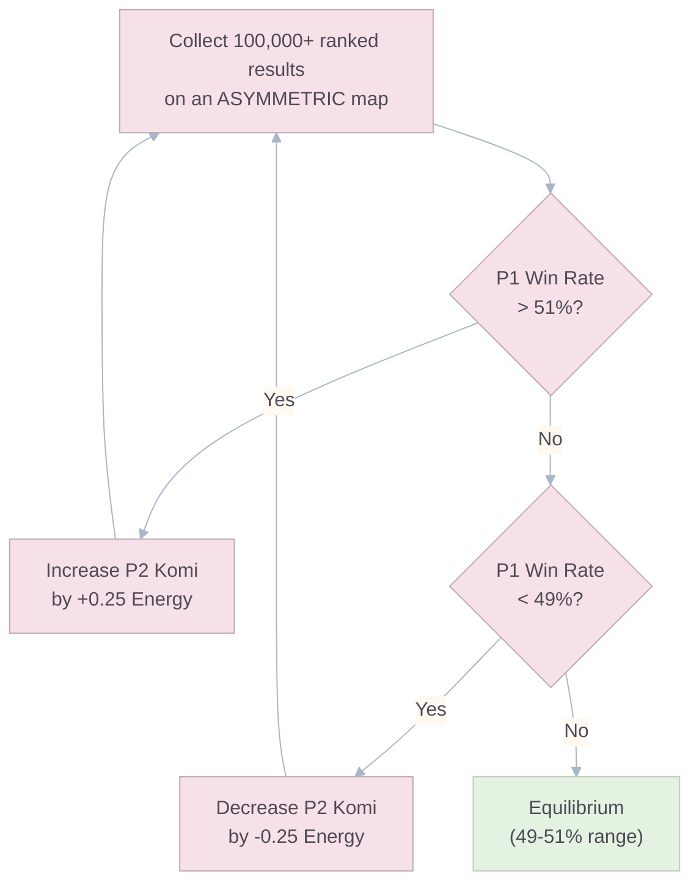
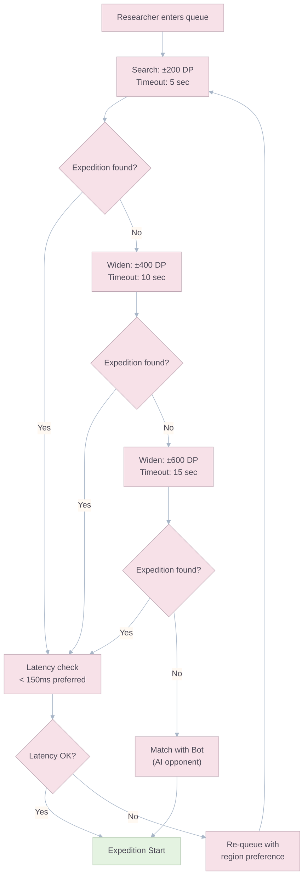

# Mathematics & Balancing

## The Power-Cost Formula

In games with an accumulating resource system, a card's cost represents both **resource deprivation** (you can't spend that Energy on anything else) and **temporal risk** (you're vulnerable while saving up). Therefore, power cannot scale linearly with cost — a 4-Energy card must be significantly more impactful than two 2-Energy cards to justify the deployment window.

### The Quadratic Scaling Law

A card's **Power Value** ($P_v$) is its **budget** — the total impact it is allowed to buy — and it scales with the **square** of its Energy cost ($E$):

$$P_v = E^2$$

That is the whole definition. $P_v$ is derived from cost and nothing else, which is what makes it an independent yardstick to check a card against.

| Unit                            | Energy | $P_v$ Budget | Impact Profile                                                                                          |
| :------------------------------ | :----: | :----------: | :------------------------------------------------------------------------------------------------------ |
| Subject Alpha                   |   1    |      1       | Pure spatial conversion (baseline).                                                                     |
| Acid Crawler                    |   2    |      4       | Conversion + acid-puddle denial for 2 owner action windows.                                             |
| Bio-Phalanx                     |   3    |      9       | Conversion + Armored Membrane (requires 2 hits to flip).                                                |
| Volatile Mass                   |   4    |      16      | 2-hex radius AoE conversion on deploy and again on the Jump that detonates it. No Clone; 3-second fuse. |
| Plasmic Leaper                  |   4    |      16      | Conversion + Hover traversal + Root on converted enemies for 1 defender action window.                  |
| The Apex Strain                 |   5    |      25      | Conversion + Seismic push (displaces enemies 1 hex outward).                                            |
| Cryo-Stasis _(Protocol)_        |   2    |      4       | 3-hex cluster freeze for 1 defender-action window.                                                      |
| Sterilization Beam _(Protocol)_ |   4    |      16      | 4-hex cluster total wipe (all units removed).                                                           |

### Impact Profile — How a Card Spends Its Budget

$P_v$ says how much a card has. The **Impact Profile** says what it bought. These are two different quantities and they are never equal — an earlier draft gave both the name "Power Value," which made them look like rival definitions of one number and produced a contradiction that was never resolvable.

A card's budget divides across three categories, each with a **maximum share**:

| Category                   | Max share of $P_v$ | What it covers                                                       |
| :------------------------- | :----------------: | :------------------------------------------------------------------- |
| **Spatial Influence (SI)** |      **50%**       | Sectors reached by the landing — conversion radius + ability radius. |
| **Temporal Impact (TI)**   |      **25%**       | Duration of status effects or area denial.                           |
| **Strategic Utility (SU)** |      **25%**       | Defensive and offensive versatility, traversal, conditionality.      |

The 50% ceiling on spatial influence is the chapter's most load-bearing design statement: **territory is worth double duration or versatility**, which is what an Ataxx-derived win condition demands.

**Read the shares as caps, not as a formula.** They are enforceable by inspection today, without any scoring rubric — _"no card may spend more than half its budget reaching sectors"_ is a judgement you can make while looking at the card. That is how the roster already reads:

| Card               | Same 16-point budget, opposite wallets                                                                                                                   |
| :----------------- | :------------------------------------------------------------------------------------------------------------------------------------------------------- |
| **Volatile Mass**  | Blows the spatial cap — radius 2 is the engine maximum, reached twice. It **pays** for the excess: no Clone, a 3-second fuse, and removal on detonation. |
| **Plasmic Leaper** | Stays at radius 1 and buys temporal (Root) and utility (Hover) instead.                                                                                  |

> **Not yet quantitative, and deliberately so.** No specimen has published SI/TI/SU numbers, because assigning them needs a scoring rubric — how many spatial points is radius 2 worth against radius 1? — and a rubric invented before there is match data is a guess wearing a lab coat. **The trigger to make this quantitative is per-tier win-rate and usage-rate data from the Lean MVP**, not a design session — see the Validation Methodology above for why ECR cannot carry that job alone. When the data exists, derive the rubric backwards from the six launch cards, which are the examples already believed to be roughly balanced. Until then the Impact Profile is design vocabulary and a set of caps. The worksheet below collects the raw inputs a rubric will need.

> **Energy stays on the budget side — this is a decision, not an omission.** Folding Energy into the Impact Profile as a fourth weighted term has been considered and rejected. It would collapse the budget and the spend into one number, leaving nothing for that number to be checked against; every card would have a Power Value and none could ever be wrong. It would also discard the quadratic justification, since the temporal-risk argument above is precisely why cost enters squared rather than linearly. **Revisit only if the two-sided structure is being replaced wholesale, never as an incremental tweak.**

### Impact Profile Worksheet

This is a **data-collection sheet, not a balance assertion.** It records only what each card observably buys, taken from the roster entries in [`03_Specimens_Protocols_and_Factions.md`](./03_Specimens_Protocols_and_Factions.md) — no scores, no point values, nothing that assumes a rubric. Its purpose is twofold:

1. **It makes cap pressure visible** across the whole roster instead of one prose note at a time.
2. **It is the input the rubric will be derived from.** When live data shows a card out of its win-rate or usage band, the first question is _"which category did it overspend in?"_ — and that is answerable only if the profile was recorded beforehand. Reconstructing it afterwards, with the result already in view, guarantees hindsight bias.

The fourth column is the one that matters most: it collects everything the three categories cannot express.

**Launch roster**

| Card                   | Spatial Influence                                                                 | Temporal Impact                                               | Strategic Utility                                      | Outside the three                                                                                            |
| :--------------------- | :-------------------------------------------------------------------------------- | :------------------------------------------------------------ | :----------------------------------------------------- | :----------------------------------------------------------------------------------------------------------- |
| **Subject Alpha**      | radius 1 (6 sectors)                                                              | —                                                             | —                                                      | board presence **+1** on Clone — the baseline every other entry is read against                              |
| **Acid Crawler**       | radius 1; puddle covers 1                                                         | puddle: 2 owner action windows                                | area denial, chokepoint control                        | the puddle costs a Jump, so it trades away the **+1** a Clone would have given                               |
| **Bio-Phalanx**        | radius 1                                                                          | — (armor is untimed)                                          | —                                                      | **survivability**: 1 armor layer, two conversion events to flip                                              |
| **Volatile Mass**      | **radius 2 — engine maximum**, reached on both the deploy and the detonating Jump | **3-second fuse** — the first wall-clock duration in the game | —                                                      | board presence **0** net, but **+1 for 3 seconds**; **−1** against the +1 a normal card leaves               |
| **Plasmic Leaper**     | radius 1                                                                          | Root: 1 defender action window                                | Hover — traverses blocked, hazard, Sealed              | — _(fits the three cleanly)_                                                                                 |
| **The Apex Strain**    | radius 1                                                                          | — (push is instantaneous)                                     | —                                                      | **displacement** — moves enemy pieces without converting them, with cascade; **immunity** to being displaced |
| **Cryo-Stasis**        | 3-sector cluster                                                                  | Frozen: 1 defender action window                              | dual-use — defensive on own pieces, offensive on enemy | board presence **0** — creates no material                                                                   |
| **Sterilization Beam** | 4-sector cluster                                                                  | — (instantaneous)                                             | unconditional: ignores armor, Frozen, everything       | board presence **−N on both sides**; **permanence** — removal cannot be undone, unlike conversion            |

**Expansion prototypes**

| Card                 | Spatial Influence                                                     | Temporal Impact               | Strategic Utility                  | Outside the three                                         |
| :------------------- | :-------------------------------------------------------------------- | :---------------------------- | :--------------------------------- | :-------------------------------------------------------- |
| **Quarantine Drone** | radius 1 + up to 2 Sealed sectors                                     | Sealed: 1 owner action window | tempo denial on empty space        | — _(fits the three cleanly)_                              |
| **Detox Mycelium**   | radius 1                                                              | **removes** duration          | anti-control answer                | **conditionality** — worth nothing in a control-free meta |
| **Purge Pulse**      | 3-sector cluster                                                      | **removes** duration          | broad utility answer               | board presence **0**; **conditionality**                  |
| **Phase Relay**      | relocation within 2 sectors, then the moved unit's own landing radius | —                             | repositioning without new material | **cycle economics** — does not advance the card cycle     |

#### What the Worksheet Already Shows

Three findings are available from this table alone, before a single playtest:

**1. Ten of twelve cards carry something the three categories cannot express.** Only Plasmic Leaper and Quarantine Drone fit cleanly. A framework that fails to describe 83% of the roster is under-specified, not merely unquantified.

**2. Board presence delta is the strongest missing category, by a wide margin.** It appears in **six** rows of the worksheet above — Subject Alpha (+1), Acid Crawler (trades it away), Volatile Mass (0 net, but +1 for the 3 seconds it is fused), Cryo-Stasis (0), Sterilization Beam (−N on both sides), and Purge Pulse (0). Two things this already exposes: Sterilization Beam is a Protocol with a large **negative** delta, so "Protocols are always 0" is false; and Volatile Mass shows the category needs a declared baseline, because "0 versus the board before the play" and "−1 versus what a normal card leaves" are both true and mean different things. In a game whose **score is unit count**, a factor that moves the score directly outranks one that describes reach. It is the leading candidate for promotion to a fourth weighted category.

**3. Temporal Impact has no sign convention.** It is defined as "duration of status effects or area denial," but Detox Mycelium and Purge Pulse **remove** duration. Cleansing is not negative area denial, and the category as written cannot say whether stripping a Root is worth the same as applying one. This needs resolving before any scoring rubric is written.

Two further gaps show up once each and are worth watching rather than acting on: **survivability** (Bio-Phalanx's armor, Apex Strain's displacement immunity) and **permanence** (a vaporized specimen is gone; a converted one can be taken back).

> **Maintenance rule:** add a row here whenever a card is authored, and fill the fourth column honestly. An empty fourth column is a card that fits the model; a full one is evidence the model needs another category. That evidence is only worth anything if it is collected as it appears.

### Prototype Budget Targets

The following entries are expansion prototypes, not part of the launch roster. Their target budgets are listed here so future design work stays anchored to the same system:

| Prototype                | Energy | Target $P_v$ Budget | Intended Role                                                    |
| :----------------------- | :----: | :-----------------: | :--------------------------------------------------------------- |
| Quarantine Drone         |   3    |          9          | Tempo denial through temporary Sealed hexes.                     |
| Detox Mycelium           |   3    |          9          | Anti-control support and localized cleanse.                      |
| Purge Pulse _(Protocol)_ |   2    |          4          | Utility answer to Frozen, Rooted, Sealed, and acid puddles.      |
| Phase Relay _(Protocol)_ |   3    |          9          | Mobility burst that trades card economy for tactical reposition. |

### Validation Methodology

**Conversion count cannot validate the quadratic budget. Do not try to make it.** This is the single most important constraint on how balance is measured here, and two earlier formulations of this section got it wrong, so the reasoning is spelled out before the method.

Conversions per landing are bounded by hex geometry: at most **6** at radius 1, at most **18** at radius 2 (`BoardMetrics.MaxConversionTargetsPerLanding`). That ceiling does not move when a card costs more. The budget, meanwhile, grows as $E^2$ — 1, 4, 9, 16, 25. So a 5-Energy card is allowed to be worth 25× a Subject Alpha while flipping the same 6 units, and any conversions-per-Energy figure will therefore rank it **below** the cheapest card in the game, permanently, no matter how strong it is.

Neither a raw nor a normalized comparison escapes this:

| Formulation                                                 | Apex Strain ($E = 5$, radius 1)                                     | Verdict         |
| :---------------------------------------------------------- | :------------------------------------------------------------------ | :-------------- |
| Raw: $\text{ECR}$ vs. $P_v/E = E$                           | ceiling $6/5 = 1.2$ against a target of 5                           | unreachable, 4× |
| Normalized: $\text{ECR}_{card}/\text{ECR}_{\alpha}$ vs. $E$ | for equal radius this is exactly $1/E = 0.2$, against a target of 5 | **worse**, 25×  |

The second row is why normalizing is not a fix: dividing by the baseline turns the quantity into $1/E$ while the target stays $E$, so the gap becomes $E^2$. **The band is removed. ECR keeps a narrower, honest job.**

**The method:**

1. **Simulation:** run 10,000 Monte Carlo matches per card pairing using a basic MCTS AI.
2. **Measure ECR per card** — the average number of enemy sectors flipped per Energy spent. Report it; do not compare it to $P_v/E$.
3. **Audit within a cost tier.** Compare cards that cost the same, where the geometric ceiling applies equally and therefore cancels. The two 4-Energy cards are the live example: if Volatile Mass averages 12 conversions and Plasmic Leaper averages 4, Root and Hover had better be worth that 8-conversion gap. A large intra-tier spread with no compensating ability is the signal.
4. **Audit across cost tiers with win rate and usage rate**, from the Balance Testing Framework below — 45-55% win rate and 4-25% usage per card. These are unbounded by board geometry and are the only cross-tier authority.
5. **Correction:** if a card over- or under-performs, adjust its ability parameters (radius, duration, cluster size) — **never its Energy cost** — to keep the $E^2$ progression intact.

> **What ECR describes well, and what it is blind to.** Subject Alpha and Acid Crawler spend nearly their whole budget on conversion, so ECR characterises them accurately. It is blind to everything expensive cards actually buy: Cryo-Stasis and Sterilization Beam convert nothing at all and score a structural **0**, and Apex Strain's displacement — which breaks a formation without flipping anything extra — is invisible. Scoring two of the eight launch cards at zero is not a defect in those cards; it is the metric reaching the edge of what it can see.

> **This changes the trigger for quantifying the Impact Profile.** The rubric can no longer be derived from "measured ECR", because ECR cannot rank cards across cost tiers. Derive it instead from **per-tier win rate and usage rate** once the Lean MVP produces them, using ECR as a supporting signal for the conversion-heavy cards only.

### Expansion Guardrails

New content must widen decision space, not just raise ceiling power. Every new specimen, Protocol, map, or event mechanic must pass these checks before entering ranked:

| Guardrail                    | Threshold                                                                                                                      | Why It Exists                                                                  |
| :--------------------------- | :----------------------------------------------------------------------------------------------------------------------------- | :----------------------------------------------------------------------------- |
| **Counterplay availability** | Must have at least **2 practical answers** already in the live card pool.                                                      | Prevents one-card checkmates.                                                  |
| **Map-local dominance**      | Must stay below **54% win rate** on every ranked map class in equal-skill tests.                                               | Avoids "fine globally, broken on one map" releases.                            |
| **Combo inflation**          | No 2-card package may exceed **1.35x** the win-rate lift of its two cards played independently, at equal skill.                | Prevents hidden burst packages from invalidating baseline units.               |
| **Cognitive load cap**       | An Expedition Cycle introduces at most **1 new status keyword** to ranked play.                                                | Keeps onboarding and readability under control.                                |
| **Skill-band spread**        | Bronze-to-top-rank win rate spread should stay within **8 percentage points** unless the card is explicitly marked high-skill. | Avoids cards that are useless for most players but oppressive in expert hands. |

> **Release Principle:** If a new card only becomes balanced after nerfing several older cards, the new card is the problem.

---

## Progression Scaling Curve

### Open Item — What a Level Actually Changes

**The scaling rule is undecided, and the +10% compound curve below is a placeholder that does not survive contact with the schema.** Recording the state honestly, because every cost table, rarity floor, and anti-P2W claim in this GDD rests on it:

**Nothing in the card schema can scale continuously.** Walking `CardDataSO` field by field: `energyCost` is immutable by the rule above; `canClone`, `canJump`, `hasArmor`, and `ignoresHazards` are booleans; `conversionRadius` is an integer capped at 2 by `BoardMetrics.MaxConversionRadius` and explicitly barred from purchase by the Golden Rule in [`04_Economy_and_Monetization.md`](./04_Economy_and_Monetization.md); and `landingEffects[].duration`, `.radius`, and `.clusterSize` are small integers counted in action windows and hex rings. A 10% increase applied to any of them is either a no-op or a rounding artefact.

**The intended direction is per-card ability scaling, in discrete steps.** A level should widen what the card's ability reaches or how long it lasts — for example, a Cryo-Stasis that freezes a 1-sector cluster at low level, 3 at mid, 5 at high. Each card gets its own progression, designed individually.

That direction has a consequence worth stating before the work starts: **1 → 3 → 5 is not 10% compound growth.** Discrete per-card steps and a uniform exponential curve are incompatible, so adopting the former means retiring the latter — along with the promise that "all card interactions remain mathematically identical at every level," which discrete jumps cannot preserve.

**Until this is decided, treat as design intent rather than specification:** the level curve, the Relative Strength column, the DNA Strand and Stardust cost tables, the rarity starting levels, and Blind Discovery's "Tournament Standard (Level 9)" normalization. None of them is implementable today.

$$\text{Stat}_{Lv} = \text{Stat}_{Base} \times 1.10^{(Lv - 1)} \quad \text{— placeholder curve, pending the decision above}$$

### Stat Progression Table (Subject Alpha — Baseline)

Enhancement is paid for in **DNA Strands and Stardust**. Each row lists the cost to **reach** that level from the one below, so Level 1 has no cost and **Level 14's cost is the one still missing** — 13 transitions need 13 numbers, and only 12 are authored. Price 13→14 before the max level ships; it is the anchor for the "90+ days" long-term goal and for every Stardust sink estimate in `04_Economy_and_Monetization.md`. Galaxy Pass XP plays no part in it — see the two-progression table in [`04_Economy_and_Monetization.md`](./04_Economy_and_Monetization.md#two-progressions-that-never-touch).

|   Level    | Relative Strength | DNA Strands Required | Stardust Required |
| :--------: | :---------------: | :------------------: | :---------------: |
|     1      |       1.00x       |          —           |         —         |
|     2      |       1.10x       |          2           |         5         |
|     3      |       1.21x       |          4           |        20         |
|     4      |       1.33x       |          10          |        50         |
|     5      |       1.46x       |          20          |        150        |
|     6      |       1.61x       |          50          |        400        |
|     7      |       1.77x       |         100          |        800        |
|     8      |       1.95x       |         200          |       1,600       |
|     9      |       2.14x       |         400          |       3,200       |
|     10     |       2.36x       |         800          |       6,400       |
|     11     |       2.59x       |        1,000         |      10,000       |
|     12     |       2.85x       |        2,000         |      16,000       |
|     13     |       3.14x       |        5,000         |      32,000       |
| 14 _(Max)_ |       3.45x       |          —           |         —         |

> **Design Note:** The DNA Strand and Stardust costs increase exponentially to create a natural progression wall. F2P Researchers reach Level 9 within ~30 days of active play. Level 14 is a long-term goal requiring 90+ days.

> **On the absence of a per-specimen power stat:** an earlier draft carried a "Base Conversion Power" column here (100 at Level 1, 345 at Level 14) and a matching value on every roster entry. It was removed, not renamed. The column was pure duplication — it was always `100 × Relative Strength` — and the per-specimen values were unfalsifiable: nothing in the game reads them, and no measurement could show one wrong. Conversion is resolved from `conversionRadius`, ownership, and protections; the power budget is expressed by $P_v = E^2$; the realized outcome is measured by ECR. Those three close the loop, and a fourth number that predicts none of them has no job. Do not reintroduce it under a new name.

### Rarity Scaling

| Rarity        | Starting Level |            Base Stat Multiplier            | DNA Strand Drop Rate        |
| :------------ | :------------: | :----------------------------------------: | :-------------------------- |
| **Common**    |       1        |                    1.0x                    | High (every Capsule)        |
| **Rare**      |       3        |        1.0x (but higher base stats)        | Medium (1 in 3 Capsules)    |
| **Epic**      |       6        | 1.0x (but significantly higher base stats) | Low (1 in 10 Capsules)      |
| **Legendary** |       9        |       1.0x (but highest base stats)        | Very Low (1 in 50 Capsules) |

> **Important:** Rarity determines **base stats and ability complexity**, not scaling rate. A Legendary card at Level 9 is not inherently "better" than a maxed Common at Level 14. It's **different** — with a unique ability that enables different strategies, but balanced by the $P_v \propto E^2$ budget.

---

## Overtime Mathematics (2x Energy)

When a match enters the 1-minute Overtime phase, Energy generation doubles.

### Impact on Strategy

| Aspect                          | Standard Phase   | Overtime (2x)    |
| :------------------------------ | :--------------- | :--------------- |
| Energy per second               | 0.357 E/s        | 0.714 E/s        |
| Time to save 5 Energy           | 14.0 sec         | 7.0 sec          |
| Viable deploy rate (avg 3E Kit) | 1 unit / 8.4 sec | 1 unit / 4.2 sec |
| **APM pressure**                | Moderate         | **Very High**    |

### Temporal Risk Distortion

Because Energy regenerates 2x faster, the "waiting penalty" for deploying expensive cards is halved. A 5-Energy Apex Strain that normally requires 14 seconds of saving now only requires 7 seconds — making it **proportionally more viable** during Overtime.

**Implication:** Players fielding low-cost "cycle Kits" (average 2.5E) must physically execute deployments at **double speed** to avoid capping their Energy bar. This creates a skill ceiling shift from **pure strategy** to **strategy + execution speed** — a natural tie-breaker.

> **Cap Rule Reminder:** Overtime never increases the Energy cap beyond **10.0**. Its balance impact comes from faster regeneration and higher execution pressure, not deeper storage.

---

## Containment Breach Protocol (Catch-Up Mathematics)

The catch-up energy bonus is designed to create comeback windows without rubber-banding. The math must be subtle enough to avoid punishing the leading player.

### Effective Regeneration Rates

$$E_{catchup}(t) = \frac{t}{R} \times 1.15 \quad \text{where } R = 2.8s \text{ (standard)} \text{ or } 1.4s \text{ (overtime)}$$

| Phase             | Standard Regen | Catch-Up Regen (+15%) | Extra Energy over 20s |
| :---------------- | :------------: | :-------------------: | :-------------------: |
| **Standard**      | 1 E / 2.80 sec |    1 E / 2.43 sec     |     +1.07 Energy      |
| **Overtime (2x)** | 1 E / 1.40 sec |    1 E / 1.22 sec     |     +2.14 Energy      |

### Design Safety Margins

| Concern                            | Mitigation                                                                                                                                                                                   |
| :--------------------------------- | :------------------------------------------------------------------------------------------------------------------------------------------------------------------------------------------- |
| Bonus enables degenerate stalling  | 60s cooldown means at most 2-3 activations per match. 20s cap prevents hoarding.                                                                                                             |
| Bonus overshoots into unfair lead  | +1.07 extra Energy per activation in Standard, **+2.14 in Overtime** — one extra Subject Alpha, or two in Overtime. Watch the Overtime figure: it is the phase where the margin is thinnest. |
| Players intentionally stay behind  | Staying ≤40% units means risking Domination loss. The risk far outweighs +15% regen.                                                                                                         |
| Bonus invalidates Komi calibration | Both players have equal access to the catch-up bonus. Komi only affects starting state, not mid-match dynamics.                                                                              |

### Simulation Validation

Before finalizing the threshold and bonus values, run Monte Carlo simulations:

1. **10,000 matches** with varied starting skill deltas.
2. **Metric:** "Comeback Rate" — percentage of matches where the trailing player at the 1:30 mark goes on to win.
3. **Target:** Comeback rate should increase from baseline (no bonus) by **5-10 percentage points** without exceeding 50%.
4. **Correction:** If comeback rate jumps >15pp, reduce bonus to +10%. If <3pp increase, raise to +20%.

## Komi: Dormant at Launch, Built for Asymmetric Maps

### Origin and Current Status

Komi entered this design when Goo Galaxy was conceived as a **turn-based** game. There, the justification is textbook: turn-based Ataxx gives the first player a measurable edge, and Monte Carlo simulations of the turn-based ruleset put P1 win rates at **54-58%** without compensation. Borrowing Go's resource-compensation idea was the obvious answer.

The game then moved to **real-time simultaneous** play (see [`01_Mechanics_and_Core_Gameplay.md`](./01_Mechanics_and_Core_Gameplay.md#action-timing-model-real-time)), and that removed the effect Komi was built to offset. Two things follow, and both matter:

- **There is no turn order to be first in.** Both Researchers act continuously from the same instant.
- **The launch map is provably fair.** P1 starts at `(+4,-4)` / `(-4,+4)` and P2 at `(+4,0)` / `(-4,0)`. The **reflection** $\sigma:(q,r,s)\mapsto(q,s,r)$ maps P1's pair onto P2's **and** P2's back onto P1's, so the two openings are interchangeable. (A 60° rotation maps P1 onto P2 but not the reverse, and therefore proves nothing — see [`01_Mechanics_and_Core_Gameplay.md`](./01_Mechanics_and_Core_Gameplay.md#blocked-sectors--map-variants).) There is no positional bias to compensate.

> **Komi is therefore set to 0 on Open Petri and every other symmetric map. Both Researchers start on 5.0 Energy.** The system is retained — implemented, server-tunable, and calibrated by the loop below — because the roadmap calls for **asymmetric maps with obstacles**, and on those it becomes the intended lever.

### When Komi Applies

| Map class                                     | Komi                | Rationale                                                                                      |
| :-------------------------------------------- | :------------------ | :--------------------------------------------------------------------------------------------- |
| **Reflection-symmetric** (Open Petri, launch) | **0** — both on 5.0 | No turn order, no geometric bias. Nothing to compensate; applying Komi would _create_ an edge. |
| **Asymmetric geometry** (planned post-launch) | Calibrated per map  | Starting Energy is the compensation lever, tuned per map by the loop below until 49-51% holds. |
| **Event / experimental**                      | Calibrated per map  | Must prove fair in simulation before any promotion to ranked.                                  |

**Sizing note for whoever calibrates the first asymmetric map:** 0.5 Energy buys **1.4 seconds** of head start at the standard regeneration rate — half the cost of a Subject Alpha, so roughly half an extra opening deployment. Even so, start at **±0.25** and let the loop walk it: the effect being corrected is usually far smaller than the lever.

### Before Reaching for Komi on Any Map

If a symmetric map ever shows a P1 skew, **that is a defect, not an asymmetry to compensate.** A simultaneous game on a symmetric board has no legitimate source of first-mover advantage, so a measured skew means something in the implementation is ordering the two Researchers. Investigate these first:

1. **Timestamp tie-breaking** — when two commands carry the same authoritative timestamp, does the server always resolve the lower player ID first?
2. **Within-tick client order** — does the server process clients in a fixed order, so the first-processed one has its conversion applied before the second's validation runs?
3. **Initial board construction** — does any rule depend on the order the two starting pairs were placed?

Each of those is a one-line fix. Masking one with Komi is strictly worse: the compensation is orders of magnitude larger than the defect, it distorts opening play, and the day someone fixes the ordering bug without knowing Komi was hiding it, **Komi silently becomes a Player 2 advantage.**

> **Reference implementation note:** the geometry constraint stands regardless. Ranked maps must be invariant under the reflection that swaps the two starting positions — **rotational symmetry is not sufficient and must not be used as the authoring test** ([`01_Mechanics_and_Core_Gameplay.md`](./01_Mechanics_and_Core_Gameplay.md#blocked-sectors--map-variants) carries the rule and a counterexample). Asymmetry is a deliberate, calibrated design choice — never an accident of authoring.

### Komi Calibration Process

```mermaid
%%{init: {"theme":"base","themeVariables":{"primaryColor":"#F7E1E8","secondaryColor":"#DCEBF7","tertiaryColor":"#E4F3E1","primaryBorderColor":"#BFA9B5","lineColor":"#A8B6C8","primaryTextColor":"#4E4A57","clusterBkg":"#FAF5EA","clusterBorder":"#CDBFAF","edgeLabelBackground":"#FFF9F2","noteBkgColor":"#F7F1FA","noteTextColor":"#4E4A57","taskBkgColor":"#DCEBF7","taskTextColor":"#4E4A57","taskTextOutsideColor":"#4E4A57","sectionBkgColor":"#E4F3E1","sectionBorderColor":"#BCD0B9","gridColor":"#E8DDD3","todayLineColor":"#C7A7B5","actorBkg":"#F7E1E8","actorBorder":"#BFA9B5","actorTextColor":"#4E4A57","signalColor":"#A8B6C8","signalTextColor":"#4E4A57","labelBoxBkgColor":"#FFF9F2","labelBoxBorderColor":"#CDBFAF","labelTextColor":"#4E4A57"}}}%%
flowchart TD
    A["Collect 100,000+ ranked results<br/>on an ASYMMETRIC map"] --> B{"P1 Win Rate<br/>> 51%?"}
    B -- Yes --> C["Increase P2 Komi<br/>by +0.25 Energy"]
    B -- No --> D{"P1 Win Rate<br/>< 49%?"}
    D -- Yes --> E["Decrease P2 Komi<br/>by -0.25 Energy"]
    D -- No --> F["Equilibrium<br/>(49-51% range)"]

    style F fill:#E4F3E1,color:#4E4A57,stroke:#BCD0B9
    C --> A
    E --> A
```

> **Frequency:** Komi values are reviewed every **2 weeks** during soft launch, and **monthly** after global launch. Changes are applied server-side without requiring a client update.

### Symmetry Validation Requirement

Before any ranked map is approved, the team must verify two conditions in simulation and internal scrims:

1. **Geometry symmetry:** the map and starting positions are invariant under the reflection that swaps P1 and P2.
2. **Komi equilibrium:** with launch Komi applied, equal-skill simulations should keep Player 1 and Player 2 win rate inside the **49-51%** band.

If a map is symmetric under the reflection and the win rate still drifts outside the band, **do not reach for Komi** — investigate the implementation-ordering suspects listed above. Komi is the lever for maps that are deliberately asymmetric, and nothing else. Never introduce ranked positional bias as a shortcut.

## Live Tuning & Remote Configuration

The GDD assumes a live-tuned game, so the tuning surface must be explicit.

### Remotely Tunable Parameters

- Komi starting Energy offset.
- Matchmaking search windows and bot fallback thresholds.
- Event toggles and weekend rulesets.
- Card ability parameters such as durations, radii, and target caps.
- Map pool rotation and Blind Discovery-eligible card pool.
- **Containment Breach Protocol:** activation threshold (default ≤40%), regen bonus (default +15%), bonus duration (default 20s), and cooldown (default 60s).

### Delivery Model

- Store live gameplay configuration in a **versioned backend config service** such as PlayFab Title Data or Unity Cloud-backed remote config.
- Clients fetch config at app launch, before matchmaking, and on a periodic refresh timer while online.
- The server always validates against the currently active config version.
- Clients cache the last known valid config for offline menu use, but ranked or event matchmaking must refuse stale or mismatched versions.

### Rollback Rule

Every live config publish must support immediate rollback to the previous verified version without requiring a client patch.

---

## Matchmaking & Discovery Point System

### The Star System Ladder

Researchers progress through **10 Star Systems** by earning Discovery Points (DP) from competitive expeditions. This is the ladder for the complete product; `11_References_and_Appendix.md` carries the same ten as a quick reference.

|  #  | Star System           | DP Range    | Unlocks                                                           |
| :-: | :-------------------- | :---------- | :---------------------------------------------------------------- |
|  1  | **Gloopiter**         | 0 - 299     | Tutorial. Subject Alpha, Acid Crawler unlocked.                   |
|  2  | **Sludgar-4**         | 300 - 599   | Bio-Phalanx unlocked. Basic emotes.                               |
|  3  | **Cryo-9**            | 600 - 999   | Volatile Mass unlocked. Crews unlocked.                           |
|  4  | **Toxis Major**       | 1000 - 1399 | Plasmic Leaper unlocked. Galactic Market opens.                   |
|  5  | **Nova Rubra**        | 1400 - 1799 | Cryo-Stasis unlocked. Blind Discovery unlocked.                   |
|  6  | **Nexar Prime**       | 1800 - 2199 | Sterilization Beam unlocked. Galaxy Pass available.               |
|  7  | **Void's Edge**       | 2200 - 2599 | The Apex Strain unlocked. Rare specimen pool expands.             |
|  8  | **Apex Nebula**       | 2600 - 2999 | Epic specimen pool expands. Weekly events unlocked.               |
|  9  | **Singularity Reach** | 3000 - 3499 | Legendary specimen pool. Symposia.                                |
| 10  | **The Galactic Core** | 3500+       | Infinite ladder. Galactic Archives leaderboard. Top 1000 rewards. |

### DP Gain/Loss Formula

$$\Delta DP = DP_{base} \times M_{streak} \times M_{system} \times M_{domination}$$

| Parameter          | Value                                                                                | Description                                                                                                        |
| :----------------- | :----------------------------------------------------------------------------------- | :----------------------------------------------------------------------------------------------------------------- |
| $DP_{base}$ (Win)  | +30                                                                                  | Base DP gained on victory.                                                                                         |
| $DP_{base}$ (Loss) | -25                                                                                  | Base DP lost on defeat (asymmetric to soften losses).                                                              |
| $M_{streak}$       | 1.0 + (0.1 × streak count, max 1.5)                                                  | Win streak multiplier, up to +50%. **Wins only** — a loss never carries a streak multiplier.                       |
| $M_{system}$       | Star Systems 1-3: **1.5x** gain, **0.5x** loss. Star Systems 4-10: **1.0x** on both. | Newcomer protection: faster climbing, gentler falls. The only multiplier that applies to losses.                   |
| $M_{domination}$   | 1.5 on a Domination victory, else 1.0                                                | **Domination Bonus:** assimilating every enemy specimen awards +50% extra DP as a spectacle reward. **Wins only.** |

> **Loss Formula:** because $M_{streak}$ and $M_{domination}$ apply to victories only, a defeat resolves as $\Delta DP = DP_{base} \times M_{system}$ and nothing else.

**Worked Examples:**

| Scenario                                           | $DP_{base}$ | $M_{streak}$ | $M_{system}$ | $M_{domination}$ |    Final DP     |
| :------------------------------------------------- | :---------: | :----------: | :----------: | :--------------: | :-------------: |
| Standard win, Gloopiter (1), no streak             |     +30     |     1.0      |     1.5      |       1.0        |     **+45**     |
| Domination win, Gloopiter (1), no streak           |     +30     |     1.0      |     1.5      |       1.5        | **+67.5 → +68** |
| Standard win, Nova Rubra (5), 3-win streak         |     +30     |     1.3      |     1.0      |       1.0        |     **+39**     |
| Domination win, Nova Rubra (5), 3-win streak       |     +30     |     1.3      |     1.0      |       1.5        | **+58.5 → +59** |
| Standard win, The Galactic Core (10), 5-win streak |     +30     |     1.5      |     1.0      |       1.0        |     **+45**     |
| **Loss**, Gloopiter (1) — newcomer protection      |     -25     |      —       |     0.5      |        —         | **-12.5 → -13** |
| **Loss**, Nova Rubra (5)                           |     -25     |      —       |     1.0      |        —         |     **-25**     |

> **Rounding Rule:** DP changes round away from zero at the half — `+67.5 → +68`, `-12.5 → -13`. Rounding toward zero on losses would silently soften every fractional defeat.

### Expedition Cycle Reset

At the end of each **4-week Expedition Cycle**, DP above 3000 is **soft-reset** to prevent rank stagnation:

$$DP_{new} = 3000 + \frac{DP_{current} - 3000}{2}$$

This compresses the top end of the ladder, forcing elite players to re-earn their position each cycle while maintaining a sense of preserved progress.

### Matchmaking Algorithm

```mermaid
%%{init: {"theme":"base","themeVariables":{"primaryColor":"#F7E1E8","secondaryColor":"#DCEBF7","tertiaryColor":"#E4F3E1","primaryBorderColor":"#BFA9B5","lineColor":"#A8B6C8","primaryTextColor":"#4E4A57","clusterBkg":"#FAF5EA","clusterBorder":"#CDBFAF","edgeLabelBackground":"#FFF9F2","noteBkgColor":"#F7F1FA","noteTextColor":"#4E4A57","taskBkgColor":"#DCEBF7","taskTextColor":"#4E4A57","taskTextOutsideColor":"#4E4A57","sectionBkgColor":"#E4F3E1","sectionBorderColor":"#BCD0B9","gridColor":"#E8DDD3","todayLineColor":"#C7A7B5","actorBkg":"#F7E1E8","actorBorder":"#BFA9B5","actorTextColor":"#4E4A57","signalColor":"#A8B6C8","signalTextColor":"#4E4A57","labelBoxBkgColor":"#FFF9F2","labelBoxBorderColor":"#CDBFAF","labelTextColor":"#4E4A57"}}}%%
flowchart TD
    A["Researcher enters queue"] --> B["Search: ±200 DP<br/>Timeout: 5 sec"]
    B --> C{"Expedition found?"}
    C -- Yes --> D["Latency check<br/>< 150ms preferred"]
    C -- No --> E["Widen: ±400 DP<br/>Timeout: 10 sec"]
    E --> F{"Expedition found?"}
    F -- Yes --> D
    F -- No --> G["Widen: ±600 DP<br/>Timeout: 15 sec"]
    G --> H{"Expedition found?"}
    H -- Yes --> D
    H -- No --> I["Match with Bot<br/>(AI opponent)"]
    I --> K
    D --> J{"Latency OK?"}
    J -- Yes --> K["Expedition Start"]

    style K fill:#E4F3E1,color:#4E4A57,stroke:#BCD0B9
    J -- No --> L["Re-queue with<br/>region preference"]
    L --> B
```

> **Design Priority:** Queue time < 10 seconds for 90% of players. Fair matches are important, but mobile players will not wait more than 15 seconds. Beyond that, a skilled bot fills the slot seamlessly.

---

## Balance Testing Framework

### Automated Balance Dashboard

The following metrics are tracked **per card, per Star System, per day** and visualized on an internal dashboard:

| Metric                   | Healthy Range                          | Action if Out of Range                                                                                                                                                |
| :----------------------- | :------------------------------------- | :-------------------------------------------------------------------------------------------------------------------------------------------------------------------- |
| **Usage Rate**           | 4-25% per card                         | If >25%: card is too dominant. Nerf ability parameters.                                                                                                               |
| **Win Rate**             | 45-55% per card                        | If >55%: card is overpowered. Cut ability parameters, never the Energy cost.                                                                                          |
| **First-Play Win Rate**  | 49-51% (P1 vs P2)                      | Outside the band on an **asymmetric** map: calibrate Komi. On a **symmetric** map: treat as an implementation-ordering defect and investigate — see the Komi section. |
| **Kit Diversity**        | ≥ 15 viable Kit archetypes in top 1000 | If < 10: the meta is stale. Deploy balance patch.                                                                                                                     |
| **Overtime Frequency**   | 8-15% of all matches                   | If >20%: matches may be too even (boring). If <5%: snowball is too strong.                                                                                            |
| **Average Match Length** | 2:30 - 3:30                            | If consistently < 2:00: snowball issue. If > 3:30: stalemate issue.                                                                                                   |

### Balance Patch Philosophy

Following Clash Royale's proven approach:

1. **Prefer buffs over nerfs.** Nerfs punish the majority who invested in a card. Buffs uplift underused cards and diversify the meta.
2. **Small, frequent adjustments** (+5% or -5% to a single parameter) over large, disruptive changes.
3. **Never change Energy costs.** The $E^2$ power budget is sacrosanct. Adjust ability parameters (radius, duration, conversion count) instead.
4. **Treat maps as a balance lever.** If a dominance spike is isolated to one geometry class, adjust map pool weighting before rewriting a healthy card.
5. **Monthly balance patches** with full transparency. Release notes published in-app and on social media.
6. **Emergency hotfixes** reserved for game-breaking exploits only (win rate >65% for any single card).
