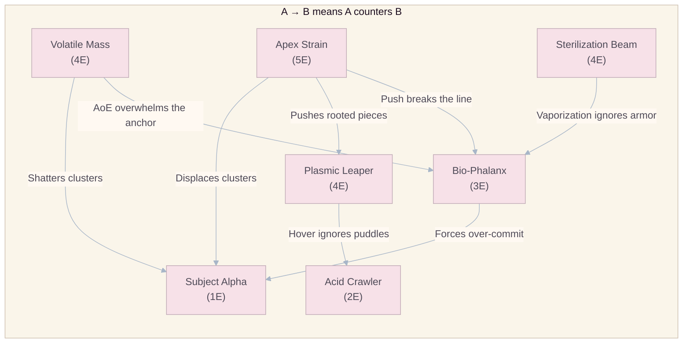

# Specimens, Protocols & Factions

## Design Philosophy

Introducing asymmetrical specimens into a spatial domination game risks disrupting the mathematical purity of the planetary surface. Every ability in this chapter is constrained by the **Spatial Hierarchy** defined in [`01_Mechanics_and_Core_Gameplay.md`](./01_Mechanics_and_Core_Gameplay.md#spatial-hierarchy--design-principle) — that section is canonical, and the two constraints that bind card authoring most tightly are:

1. **Abilities only trigger upon landing.** No persistent auras or ongoing effects, except explicitly defined temporary status effects.
2. **The $P_v \propto E^2$ budget is absolute.** Every card's total impact must fit within its Power Value budget (see [`02_Mathematics_and_Balancing.md`](./02_Mathematics_and_Balancing.md)).

> **Factions:** the faction system this chapter's title promises **has not been designed**. Today "faction" means only specimen ownership — the Electric Cyan / Hot Magenta split in [`06_Art_Direction_and_UX.md`](./06_Art_Direction_and_UX.md). No specimen belongs to a faction, no faction grants an ability, and no Kit-building rule references one. The title is kept as a placeholder for a system that must be designed before it can be documented; if it is cut, drop it from the filename and from `00_Pitch_and_Overview.md`'s index at the same time.

---

## Base Specimen Roster

### 1. Subject Alpha

| Property              | Value            |
| :-------------------- | :--------------- |
| **Energy Cost**       | 1                |
| **Rarity**            | Common           |
| **Type**              | Standard Biomass |
| **Conversion Radius** | 1 hex (standard) |
| **Can Clone**         | Yes              |
| **Can Jump**          | Yes              |
| **Passive**           | None             |

**Design Rationale:** The fundamental baseline unit. Cheap, efficient, and essential for rapid territorial expansion. The "bread and butter" of every viable Kit. A Kit without Subject Alpha struggles to maintain board presence during the critical early game.

**Strategic Notes:**

- Best card for pure cycle efficiency. At 1 Energy, it can be deployed almost continuously.
- In Overtime (2x Energy), Subject Alpha spam becomes extremely powerful due to raw piece-count accumulation.
- Countered by AoE effects (Volatile Mass, Sterilization Beam) that can erase clusters in one move.

---

### 2. Acid Crawler

| Property              | Value                                                                                                                                                |
| :-------------------- | :--------------------------------------------------------------------------------------------------------------------------------------------------- |
| **Energy Cost**       | 2                                                                                                                                                    |
| **Rarity**            | Common                                                                                                                                               |
| **Type**              | Hazard Generator                                                                                                                                     |
| **Conversion Radius** | 1 hex (standard)                                                                                                                                     |
| **Can Clone**         | Yes                                                                                                                                                  |
| **Can Jump**          | Yes                                                                                                                                                  |
| **Passive**           | **Corrosive Trail** — When performing a Jump, leaves a toxic puddle on the vacated hex for **2 owner action windows**. No unit can land on a puddle. |
| **Puddle Duration**   | 2 owner action windows                                                                                                                               |

**Design Rationale:** Introduces area denial. By sacrificing the unit generation of a Clone (Jumping instead), the Researcher can seal off strategic choke points, protecting flanks from enemy jumps and restricting opponent mobility.

> **The puddle costs a turn of setup.** Corrosive Trail fires on a **Jump**, and only a unit already standing on the surface can Jump — playing the card does not produce a puddle. Deploy first, then Jump. Under the three-action model this is a real tempo cost, and it is what keeps area denial from being instant.

**Strategic Notes:**

- Most effective on maps with narrow corridors or near board edges where puddles can completely block passage.
- Countered by Plasmic Leaper (Hover ignores puddles).
- Synergizes with Bio-Phalanx — anchor a defensive line behind acid puddles for a near-impenetrable front.

---

### 3. Bio-Phalanx

| Property              | Value                                                                                                                                                                                                                                                                                                                                                                       |
| :-------------------- | :-------------------------------------------------------------------------------------------------------------------------------------------------------------------------------------------------------------------------------------------------------------------------------------------------------------------------------------------------------------------------- |
| **Energy Cost**       | 3                                                                                                                                                                                                                                                                                                                                                                           |
| **Rarity**            | Rare                                                                                                                                                                                                                                                                                                                                                                        |
| **Type**              | Defensive Anchor                                                                                                                                                                                                                                                                                                                                                            |
| **Conversion Radius** | 1 hex (standard)                                                                                                                                                                                                                                                                                                                                                            |
| **Can Clone**         | Yes                                                                                                                                                                                                                                                                                                                                                                         |
| **Can Jump**          | Yes                                                                                                                                                                                                                                                                                                                                                                         |
| **Passive**           | **Armored Membrane** — Requires **2 distinct adjacent conversion events** to be flipped. The first valid conversion attempt strips the armor only. The second valid conversion attempt converts the piece. Armor does **not** regenerate after being stripped unless a future card explicitly restores it. Visual indicator: armored state shows a translucent shield aura. |
| **Armor HP**          | 1 layer (stripped by first conversion event)                                                                                                                                                                                                                                                                                                                                |

**Design Rationale:** Solves the inherent fragility of borders in Ataxx. A Bio-Phalanx anchors a defensive line, forcing the opponent to commit **multiple resources** (at least 2 units or 1 unit + 1 conversion chain) to breach a specific sector.

**Strategic Notes:**

- Place on the front line of territorial borders. Forces opponent to over-commit to break through.
- Cryo-Stasis can bypass armor entirely — a frozen Bio-Phalanx cannot be converted, but once thawed, the armor remains.
- Vulnerable to Sterilization Beam (vaporization ignores armor entirely).
- Armor is **always exactly one layer**, at every level. Whatever level scaling turns out to be — it is an open design item, see `02_Mathematics_and_Balancing.md` — it will not add armor layers, because a second layer would change how many conversion events a breach costs and that number is the card.
- In the launch ruleset, one landing event can strip armor, but a second separate valid conversion attempt is always required to actually flip the specimen.

---

### 4. Volatile Mass

| Property              | Value                                                                                                                               |
| :-------------------- | :---------------------------------------------------------------------------------------------------------------------------------- |
| **Energy Cost**       | 4                                                                                                                                   |
| **Rarity**            | Epic                                                                                                                                |
| **Type**              | Area of Effect (AoE) Striker                                                                                                        |
| **Conversion Radius** | **2 hexes** (expanded)                                                                                                              |
| **Can Clone**         | **No** (Unstable — lacks structural integrity)                                                                                      |
| **Can Jump**          | **Yes** — its only movement, and the one that detonates it                                                                          |
| **Passive**           | **Unstable** — Deploys normally, then carries a **3-second fuse**. It detonates when it Jumps, or on its own when the fuse expires. |
| **Fuse**              | 3 seconds of real time from the moment it lands                                                                                     |

**Design Rationale:** The quintessential high-risk, high-reward card, and the only one that puts a **visible threat with a clock on it** onto the surface.

**How it plays, in order:**

1. **Deploy** — plays like any other card: an empty sector adjacent to territory the Researcher already controls, paying 4 Energy. The landing converts at radius 2 like any landing.
2. **The fuse starts.** For 3 seconds the Volatile Mass sits on the board, visible to both Researchers. The opponent can see it and has that long to react.
3. **Jump, or don't.** Jumping detonates it: the unit relocates up to 2 sectors, its landing converts at radius 2, and then it is removed. If 3 seconds pass without a Jump, it detonates in place — the fuse expires, it is removed, and nothing further resolves.

**Why the fuse is the card.** A deploy-and-vanish version would be an instant, uncounterable strike. The 3 seconds buy the opponent a real window: freeze it, convert it, or reposition away from the blast. And they force the owner to commit the Jump target under time pressure, which is the skill the card exists to test.

> **Wall-clock duration — the first in the game.** Every other duration in this GDD is measured in **action windows** (see [`01_Mechanics_and_Core_Gameplay.md`](./01_Mechanics_and_Core_Gameplay.md#action-timing-model-real-time)), and `landingEffects[].duration` is documented as an action-window count. Three seconds is real time, and the two are not interchangeable: an action window can be far shorter or longer than 3 s depending on how fast a Researcher is deploying. This needs either a distinct authored field or an explicit unit marker on `duration`; do not overload the existing one silently.

> **Not expressible in today's schema.** `ImpactEffectType.SelfDestruct` fires "once the landing has fully resolved" — that is deploy-time removal, which is exactly the behaviour this card is not. Volatile Mass needs a **fuse** concept: removal triggered by a timer, and separately by the unit's own Jump. This joins the list under [Impact Types Still to Come](#impact-types-still-to-come). The authored `_canJump` in `Assets/Data/Cards/Troops/VolatileMass.asset` must be **`1`**.

> **Board presence over the card's life:** +1 on deploy, then −1 on detonation, so **0** against the state before the play — but with a 3-second interval where it counts as a unit. If the match clock runs out during that window, it counts toward the score. Against the +1 a normal card leaves behind, the comparison is −1; both readings are true and mean different things, which is why the baseline has to be stated.

**Strategic Notes:**

- Best used as a surgical strike to shatter entrenched clusters. The Jump is the aim — the deploy just gets it in range.
- Deploying it is a **telegraph**. Against an attentive opponent, the deploy sector itself gives away the intended target.
- Its reach is **deploy adjacency plus one Jump**, not free placement. Deploy lands next to territory you already hold; the 2-sector Jump is what carries it into an enemy cluster. Plan the approach before spending the 4 Energy.
- Can be combined with Cryo-Stasis: freeze your own front line before detonating behind enemy lines to prevent collateral.
- At 4 Energy with a 3-second commitment, deploying it early is very risky.

**Open questions this design raises** — all need answers before it is authored:

- **Can the opponent convert it during the fuse?** If yes, does the fuse keep running for its new owner, and does it then detonate in their favour? This is the most interesting counterplay in the card and the least specified.
- **What does Frozen do to the fuse?** Frozen prevents Jumping. If the fuse keeps running, freezing it guarantees a detonation in place — a strong, cheap answer. If the fuse pauses, freezing defuses it indefinitely.
- **Does the deploy landing convert at radius 2, the same as the Jump landing?** As written it does, which means one card can produce two radius-2 conversion events for 4 Energy. That may be correct, but it should be a deliberate choice rather than a consequence of the universal landing rule.

---

### 5. Plasmic Leaper

| Property              | Value                                                                                                                                                                                                                                       |
| :-------------------- | :------------------------------------------------------------------------------------------------------------------------------------------------------------------------------------------------------------------------------------------ |
| **Energy Cost**       | 4                                                                                                                                                                                                                                           |
| **Rarity**            | Epic                                                                                                                                                                                                                                        |
| **Type**              | Mobility Specialist                                                                                                                                                                                                                         |
| **Conversion Radius** | 1 hex (standard)                                                                                                                                                                                                                            |
| **Can Clone**         | Yes                                                                                                                                                                                                                                         |
| **Can Jump**          | Yes                                                                                                                                                                                                                                         |
| **Passive**           | **Hover** — May **land on** hazard sectors (acid puddles) and **Sealed** sectors, which block every other unit. **Blocked sectors stay impassable to everything, Hover included** — no action may target one. Authored as `ignoresHazards`. |
| **Impact**            | **Binding Plasma** — Upon landing, applies **Root** to all newly converted enemy pieces for **1 defender action window**. Rooted pieces cannot be moved by their controller until that controller completes one successful deployment.      |
| **Root Duration**     | 1 defender action window                                                                                                                                                                                                                    |

**Design Rationale:** Disrupts enemy counter-attacks. By rooting newly converted pieces, the opponent cannot immediately chain conversions back. Combined with Hover, the Plasmic Leaper is the ultimate position-ignoring mobility tool.

**Strategic Notes:**

- Hard-counters Acid Crawler's area denial (Hover ignores puddles).
- The Root prevents the opponent from using freshly stolen pieces to immediately counter-attack — buys you one defender action window of safety.
- Does NOT root pieces that were already owned by the player — only newly converted ones.
- Synergizes with Apex Strain: convert + root + push = opponent's formation is completely dismantled.

---

### 6. The Apex Strain

| Property              | Value                                                                                                                                                                                                                                     |
| :-------------------- | :---------------------------------------------------------------------------------------------------------------------------------------------------------------------------------------------------------------------------------------- |
| **Energy Cost**       | 5                                                                                                                                                                                                                                         |
| **Rarity**            | Legendary                                                                                                                                                                                                                                 |
| **Type**              | Heavy Disruptor                                                                                                                                                                                                                           |
| **Conversion Radius** | 1 hex (standard)                                                                                                                                                                                                                          |
| **Can Clone**         | Yes                                                                                                                                                                                                                                       |
| **Can Jump**          | Yes                                                                                                                                                                                                                                       |
| **Passive**           | **Heavy Biomass** — Cannot be pushed, pulled, or displaced by any environmental effect, Protocol, or ability.                                                                                                                             |
| **Impact**            | **Seismic Shockwave** — Upon landing, converts adjacent enemies AND pushes them **1 hex outward** in a radial direction. Pushed units may cascade into other enemies, triggering secondary displacement (but NOT additional conversions). |
| **Push Distance**     | 1 hex (radial)                                                                                                                                                                                                                            |

**Design Rationale:** The ultimate board-state manipulator. The push mechanic physically alters the spatial geometry of the opponent's formation, breaking defensive lines and opening multiple vulnerabilities simultaneously. At 5 Energy ($P_v = 25$), this is the most expensive and impactful card in the game.

**Strategic Notes:**

- The push can displace enemies into hazards (acid puddles), off optimal positions, or into clusters that become vulnerable to Volatile Mass follow-ups.
- Push does NOT convert — it only displaces. The conversion happens first (at landing), then the push.
- Pushed units that collide with board edges or blocked tiles simply stop (no wrap-around, no destruction).
- The Heavy Biomass passive makes Apex Strain immune to its own kind's push — two Apex Strains cannot displace each other.

---

## Protocols

Protocols manipulate the planetary surface state without permanently occupying space. Their high costs and lack of surface presence contribution ensure they are tactical tools, not primary win conditions.

### 1. Cryo-Stasis

| Property          | Value                                                                                                                                                                                                                                                        |
| :---------------- | :----------------------------------------------------------------------------------------------------------------------------------------------------------------------------------------------------------------------------------------------------------- |
| **Energy Cost**   | 2                                                                                                                                                                                                                                                            |
| **Rarity**        | Rare                                                                                                                                                                                                                                                         |
| **Type**          | Area Control Protocol                                                                                                                                                                                                                                        |
| **Target**        | 3-hex cluster (1 center hex + 2 adjacent)                                                                                                                                                                                                                    |
| **Effect**        | All pieces within the cluster (friend AND foe) are **Frozen** for **1 defender action window**.                                                                                                                                                              |
| **Frozen Status** | Cannot Clone, Jump, or be converted by an adjacent landing, for the duration. **Immunity is to conversion only** — a Frozen unit can still be removed by Sterilization Beam, displaced by Apex Strain's push, and cleansed by Detox Mycelium or Purge Pulse. |

**Strategic Uses:**

- **Defensive:** Freeze your own vulnerable flank to prevent an imminent enemy conversion wave.
- **Offensive:** Freeze a Bio-Phalanx's armor to bypass it (while frozen, it can't be converted — but once thawed, the armor is still intact). More commonly, freeze enemy pieces near your advancing front to prevent them from being used as counter-attack vectors.
- **Combo Denial:** Freeze an opponent's cluster to prevent them from executing a planned multi-piece chain conversion.

> **Frozen protects against conversion, and nothing else.** A frozen unit can still be vaporized by Sterilization Beam, displaced by Apex Strain's Seismic Shockwave, and cleansed by Detox Mycelium or Purge Pulse. An earlier wording claimed immunity to "all interaction", which three cards in this same roster contradict; the narrow reading is the one the code implements (`StatusType.Frozen`) and the one to design against.

---

### 2. Sterilization Beam

| Property        | Value                                                                                                                                                                                    |
| :-------------- | :--------------------------------------------------------------------------------------------------------------------------------------------------------------------------------------- |
| **Energy Cost** | 4                                                                                                                                                                                        |
| **Rarity**      | Epic                                                                                                                                                                                     |
| **Type**        | Board Wipe Protocol                                                                                                                                                                      |
| **Target**      | 4-hex cluster (1 center hex + 3 adjacent)                                                                                                                                                |
| **Effect**      | All pieces within the radius are instantly **vaporized** — removed from the board entirely, returning hexes to empty/neutral state. Ignores armor, frozen status, and all other effects. |

**Strategic Uses:**

- **Last Resort:** When the opponent has completely overwhelmed a quadrant, this Protocol resets the area.
- **Precision Strike:** Target a cluster where the opponent has more pieces than you. If 3 enemy and 1 friendly piece are hit, the net effect is +2 in your favor (opponent loses 3, you lose 1).
- **Warning:** Using this on your own dense territory is almost never correct — the Energy cost and piece loss are devastating.

---

## New Expansion Prototypes

These specimens are proposed for the second design pass because they add missing forms of **counterplay, tempo control, and surface interaction** without violating the existing $P_v \propto E^2$ budget.

### 7. Quarantine Drone

| Property              | Value                                                                                                                                                                                                                                                                                                                                                                                                                                             |
| :-------------------- | :------------------------------------------------------------------------------------------------------------------------------------------------------------------------------------------------------------------------------------------------------------------------------------------------------------------------------------------------------------------------------------------------------------------------------------------------ |
| **Energy Cost**       | 3                                                                                                                                                                                                                                                                                                                                                                                                                                                 |
| **Rarity**            | Rare                                                                                                                                                                                                                                                                                                                                                                                                                                              |
| **Type**              | Tempo Controller                                                                                                                                                                                                                                                                                                                                                                                                                                  |
| **Conversion Radius** | 1 hex (standard)                                                                                                                                                                                                                                                                                                                                                                                                                                  |
| **Can Clone**         | Yes                                                                                                                                                                                                                                                                                                                                                                                                                                               |
| **Can Jump**          | Yes                                                                                                                                                                                                                                                                                                                                                                                                                                               |
| **Impact**            | **Seal Protocol** — After landing, mark up to **2 adjacent empty hexes** as **Sealed** for **1 owner action window**. Sealed sectors cannot receive **any landing — Deploy, Clone, or Jump** — except from a unit with Hover, which may land on them normally. (This wording predates the three-action model and named only Clone and Jump; without Deploy the card would be trivially bypassed by simply playing a card into the sealed sector.) |

**Design Rationale:** The live roster had area denial through Acid Crawler, but not a cleaner **tempo denial** tool that targets empty space instead of leaving a trail. Quarantine Drone gives control Kits a proactive way to delay counter-angles without hard-locking the board.

**Strategic Notes:**

- Best when used to close one side of a choke after a favorable conversion.
- Countered by Plasmic Leaper and any Kit willing to play around the 1 owner action window duration.
- Should be tested carefully on Split Reactor; if it overperforms there, the map is likely the issue before the card is.

### 8. Detox Mycelium

| Property              | Value                                                                                                                                                                             |
| :-------------------- | :-------------------------------------------------------------------------------------------------------------------------------------------------------------------------------- |
| **Energy Cost**       | 3                                                                                                                                                                                 |
| **Rarity**            | Rare                                                                                                                                                                              |
| **Type**              | Stabilizer / Support                                                                                                                                                              |
| **Conversion Radius** | 1 hex (standard)                                                                                                                                                                  |
| **Can Clone**         | Yes                                                                                                                                                                               |
| **Can Jump**          | Yes                                                                                                                                                                               |
| **Impact**            | **Purge Bloom** — Upon landing, all friendly units within **1 hex** are cleansed of **Root** and **Frozen**. Any acid puddle under those friendly units is immediately dissolved. |

**Design Rationale:** The first roster had strong disruption tools but a thin answer set. Detox Mycelium adds a readable anti-control card that protects interactive play without removing the value of status-heavy strategies.

**Strategic Notes:**

- Creates a healthy answer to Cryo-Stasis, Plasmic Leaper, and Acid Crawler shells.
- Its power is reactive, so it should underperform in metas with little control; that is acceptable and desirable.
- Encourages formation play, because players are rewarded for grouping units worth cleansing.

---

## New Protocol Prototypes

### 3. Purge Pulse

| Property        | Value                                                                                                                                  |
| :-------------- | :------------------------------------------------------------------------------------------------------------------------------------- |
| **Energy Cost** | 2                                                                                                                                      |
| **Rarity**      | Rare                                                                                                                                   |
| **Type**        | Utility / Cleanse Protocol                                                                                                             |
| **Target**      | 3-hex cluster                                                                                                                          |
| **Effect**      | Removes **Frozen**, **Rooted**, and **Sealed** from all affected units/hexes. Also dissolves any acid puddles in the targeted cluster. |

**Strategic Uses:**

- Gives cycle and hybrid Kits a clean answer to status stacking.
- Keeps sealed or frozen board states from becoming too deterministic.
- Because it creates **no board presence**, it should never replace Specimens in Kits that need proactive pressure.

### 4. Phase Relay

| Property        | Value                                                                                                                                                                                                                                     |
| :-------------- | :---------------------------------------------------------------------------------------------------------------------------------------------------------------------------------------------------------------------------------------- |
| **Energy Cost** | 3                                                                                                                                                                                                                                         |
| **Rarity**      | Epic                                                                                                                                                                                                                                      |
| **Type**        | Mobility Protocol                                                                                                                                                                                                                         |
| **Target**      | 1 allied Specimen                                                                                                                                                                                                                         |
| **Effect**      | The chosen Specimen immediately performs a **free Jump** to any valid empty hex within **2 hexes**, resolving its landing conversion and impact normally. This does not count as playing a new Specimen card or advancing the card cycle. |

**Strategic Uses:**

- Converts dead board states into tactical re-engagement without adding new material to the board.
- Enables skilled repositioning for Bio-Phalanx, Apex Strain, and Quarantine Drone.
- **Detonates a Volatile Mass on demand.** Because the Jump is what sets Volatile Mass off, Phase Relay triggers it without waiting on its 3-second fuse and without the owner's own action. That is a genuine combo — 3 + 4 Energy for a radius-2 blast placed exactly where it is wanted — and it is the first interaction to check when tuning either card.
- Must remain expensive enough that it is a combo enabler, not a default mobility tax in every Kit.

---

## Synergy & Counter Matrix



> **Diagram convention:** the arrow points **from** the card holding the advantage **to** the card at a disadvantage. Every edge between two Specimens restates a cell of the table below; the one Protocol edge (Sterilization Beam → Bio-Phalanx) has no table row, because the matrix covers Specimens only — see the coverage note under it. Reciprocity is strict: if X **Counters** Y, then Y is **Countered** by X, never merely "Weak". If you edit one, edit both.

### Counter Matrix Table

| Attacker ↓ / Defender → | Subject Alpha | Acid Crawler | Bio-Phalanx  | Volatile Mass | Plasmic Leaper |  Apex Strain  |
| :---------------------- | :-----------: | :----------: | :----------: | :-----------: | :------------: | :-----------: |
| **Subject Alpha**       |       =       |      =       |     Weak     | **Countered** |       =        | **Countered** |
| **Acid Crawler**        |       =       |      =       |      =       |       =       | **Countered**  |       =       |
| **Bio-Phalanx**         |    Strong     |      =       |      =       | **Countered** |       =        | **Countered** |
| **Volatile Mass**       | **Counters**  |      =       | **Counters** |       =       |       =        |       =       |
| **Plasmic Leaper**      |       =       | **Counters** |      =       |       =       |       =        | **Countered** |
| **Apex Strain**         | **Counters**  |      =       | **Counters** |       =       |  **Counters**  |       =       |

> **Legend:** "Counters" = holds a significant strategic advantage. "Strong" = holds a mild advantage. "Countered" = is at a significant disadvantage. "Weak" = is at a mild disadvantage. "=" = neutral matchup.

> **Coverage gap:** this matrix covers the six launch Specimens only. The two launch Protocols (Cryo-Stasis, Sterilization Beam) and the four expansion prototypes have no rows or columns, even though Sterilization Beam's advantage over Bio-Phalanx is asserted in the diagram above and in that specimen's Strategic Notes. Filling the remaining matchups is design work, not transcription — do not infer them from the prose.

---

## Kit Archetypes

### 1. Cycle / Swarm

- **Core Cards:** Subject Alpha, Acid Crawler, Cryo-Stasis
- **Average Energy:** 1.67
- **Strategy:** Overwhelm with volume. Constantly deploy cheap units to fill the board. Use Cryo-Stasis defensively to protect flanks.
- **Weakness:** Vulnerable to AoE (Volatile Mass, Sterilization Beam).

### 2. Control / Fortress

- **Core Cards:** Bio-Phalanx, Acid Crawler, Cryo-Stasis
- **Average Energy:** 2.33
- **Strategy:** Build impenetrable defensive walls with armored units behind acid puddles. Slowly advance while denying enemy territory.
- **Weakness:** Slow. Can be outpaced by Swarm Kits that fill the board before the fortress is built.

### 3. Burst / Aggro

- **Core Cards:** Volatile Mass, Apex Strain, Plasmic Leaper
- **Average Energy:** 4.33
- **Strategy:** Save Energy for devastating combo plays. Use Volatile Mass to shatter enemy clusters, followed by Apex Strain to push survivors out of position.
- **Weakness:** Very expensive. Vulnerable to early-game pressure and Energy leaking.

### 4. Hybrid / Balanced

- **Core Cards:** Subject Alpha, Bio-Phalanx, Plasmic Leaper, Sterilization Beam
- **Average Energy:** 3.00
- **Strategy:** Flexible. Adapt to the opponent's strategy. Use cheap units for early presence, tech into abilities mid-game, and finish with surgical Sterilization Beams.
- **Weakness:** Jack of all trades, master of none. Can be outperformed by dedicated archetypes.

### 5. Lockdown / Tempo Control

- **Core Cards:** Quarantine Drone, Acid Crawler, Purge Pulse, Bio-Phalanx
- **Average Energy:** 2.50
- **Strategy:** Close off the most efficient enemy responses, then slowly convert small leads into irreversible territory gains.
- **Weakness:** Vulnerable to Kits that can ignore or cleanse temporary denial, especially Hover and cleanse-heavy shells.

### 6. Reset / Reposition

- **Core Cards:** Detox Mycelium, Phase Relay, Plasmic Leaper, Apex Strain
- **Average Energy:** 3.75
- **Strategy:** Survive the opponent's first control spike, then re-open the board with cleanses and precision repositioning.
- **Weakness:** Can leak Energy badly if the opponent refuses to commit into its reactive tools.

## Conversion Resolution Clarification

To keep card behavior deterministic, launch Specimens follow these additional rules:

- A **conversion attempt** is any valid ownership-flip check generated by a landing event or Protocol effect.
- Bio-Phalanx consumes the **first** valid conversion attempt by losing armor only.
- After armor is stripped, that Bio-Phalanx remains vulnerable until it is converted, removed, or the match ends.
- Launch cards do not reapply armor and do not create infinite stall loops through armor refresh.

---

## Landing Impact Targeting

Every landing impact — a unit's own impact ability or a Protocol's Protocol effect — is authored as one or more entries with a `Target` filter, a `Radius`, a `Duration`, and a `ClusterSize`. This section documents how those fields resolve in play, because `01_Mechanics_and_Core_Gameplay.md`'s [Interaction Resolution Priority](./01_Mechanics_and_Core_Gameplay.md#interaction-resolution-priority) has a consequence a card author needs before choosing a `Target` value: standard conversion (step 3) has already run by the time the landing impact (step 4) reads unit ownership.

### Target Filter Semantics

| Filter             | Meaning                                                                                                                                                                                                                                                                                                     |
| :----------------- | :---------------------------------------------------------------------------------------------------------------------------------------------------------------------------------------------------------------------------------------------------------------------------------------------------------- |
| **Self**           | The unit that just landed. A Protocol has no acting unit on the board, so `Self` selects nobody on a Protocol.                                                                                                                                                                                              |
| **Ally**           | Belongs to the acting player **at the moment the impact resolves** — this includes the pieces this very landing just converted.                                                                                                                                                                             |
| **Enemy**          | Does **not** belong to the acting player at the moment the impact resolves. In practice, this is "whoever survived the conversion": armored units that only lost their shell, frozen units that were immune, and anything standing outside the card's conversion radius but inside the impact's own radius. |
| **NewlyConverted** | Exactly the units standard conversion flipped on this landing, and nothing else.                                                                                                                                                                                                                            |
| **All**            | Every living unit in the area, friendly and hostile alike.                                                                                                                                                                                                                                                  |

> **Implementation Note:** `Enemy` and `NewlyConverted` are genuinely different sets, and the difference is load-bearing. Plasmic Leaper's Binding Plasma says it "applies Root to all newly converted enemy pieces" and explicitly "does NOT root pieces that were already owned by the player." A Bio-Phalanx standing adjacent that only lost its armor was never converted — flipping it needs a second, separate conversion event — so it is not part of the set this landing took. `Enemy` would still select that Bio-Phalanx, because it does not belong to the acting player; that is the wrong set for Binding Plasma. `NewlyConverted` is the filter that means "the pieces I actually just took," which is why it exists as its own value instead of folding into `Enemy`.

> **Design Caution:** Pair `Ally` carefully with a restrictive status (`Frozen`, `Rooted`). Because standard conversion runs before the landing impact, an `Ally` filter carrying a restrictive status lands that status on the spoils of the very same deployment. Nothing exempts a deployment from the conditions it just applied, so those pieces stay locked through the acting player's own next action window. A cleansing effect reading its own newly-taken pieces is the intended shape for `Ally`; a restrictive status belongs on `Enemy` or `NewlyConverted` instead.

### Protocol Target Clusters

A Protocol's target area is authored with the same two fields a Specimen's impact uses — `ClusterSize` and `Radius` — read together as one contract instead of two independent settings:

- **`ClusterSize`** is the exact number of hexes the player must pick.
- **`Radius`** is the maximum distance every picked hex may sit from the **first** hex the player picked, which is the cluster's center.

Target validation requires all four of the following: the player picked exactly `ClusterSize` hexes, every hex exists on the board, no hex repeats, and every hex sits within `Radius` of the center hex.

> **UI Contract:** Order matters. The center hex must be the **first** hex the targeting UI emits, because validation measures every other picked hex's distance against the first one in the list. Three hexes in a straight line pass validation with the middle hex emitted first, and fail it with either end hex emitted first — the targeting UI is responsible for always emitting the center first; the resolver has no way to infer it.

`ClusterSize` and `Radius` are already committed to for all three Protocols this GDD defines by cluster — the two launch-roster Protocols (Cryo-Stasis, Sterilization Beam) and the Season 3 addition (Purge Pulse, see the Future Expansion Roadmap below):

| Protocol           | ClusterSize | Radius | GDD Description                           |
| :----------------- | :---------: | :----: | :---------------------------------------- |
| Cryo-Stasis        |      3      |   1    | 3-hex cluster (1 center hex + 2 adjacent) |
| Sterilization Beam |      4      |   1    | 4-hex cluster (1 center hex + 3 adjacent) |
| Purge Pulse        |      3      |   1    | 3-hex cluster                             |

> **Implementation Status:** Cryo-Stasis is the only Protocol with a shipped `CardDataSO` asset (`Assets/Data/Cards/Spell/CryoStasis.asset`). Four Specimen assets ship alongside it — `Troops/SubjectAlpha.asset`, `Troops/AcidCrawler.asset`, `Troops/BioPhalanx.asset`, `Troops/VolatileMass.asset` — which together are exactly the Lean MVP roster in [`09_MVP_And_Roadmap.md`](./09_MVP_And_Roadmap.md). Sterilization Beam and Purge Pulse are not yet authored; the cluster values above are what the ability resolver already validates against once those assets exist, not a claim that they are playable now.

> **Implementation Note:** `ClusterSize` means something different depending on the card's type. On a unit's landing impact it is a ceiling — zero means no cap, so an occupied area wider than the authored cluster still resolves, just capped at that many units. On a Protocol it is the exact hex count the player must pick, and zero is not "no cap" there — it is a count no selection can ever satisfy, so the card fails target validation and is unplayable. Author a Protocol's `ClusterSize` explicitly; the card asset's own validation warns in the Inspector when a Spell-type card ships a landing effect with `ClusterSize` left at zero.

---

## Card Data Schema (ScriptableObject)

All card data is authored as **ScriptableObject** assets in Unity (`CardDataSO`, `Assets/Scripts/Runtime/Cards/Data/CardDataSO.cs`) and stored under `Assets/Data/Cards`. The schema below reflects the fields `CardDataSO` actually serializes today. It is intentionally smaller than an earlier draft of this document, which described visual/audio asset references and level-scaling data that have not been authored into the pipeline yet — those are called out under "Planned Fields" below instead of being silently dropped.

### Implemented Fields

Every `CardDataSO` asset serializes:

| Field              | Type                            | Meaning                                                                                                                           |
| :----------------- | :------------------------------ | :-------------------------------------------------------------------------------------------------------------------------------- |
| `cardId`           | string                          | Unique, stable lookup key.                                                                                                        |
| `displayName`      | string                          | Player-facing name.                                                                                                               |
| `description`      | string                          | Player-facing ability text.                                                                                                       |
| `type`             | `CardType` (`Troop` \| `Spell`) | `Troop` deploys a Specimen; `Spell` resolves a Protocol.                                                                          |
| `energyCost`       | int                             | Energy required to play the card.                                                                                                 |
| `canClone`         | bool                            | Whether the card may perform a 1-hex Clone.                                                                                       |
| `canJump`          | bool                            | Whether the card may perform a 2-hex Jump.                                                                                        |
| `ignoresHazards`   | bool                            | Whether the card's unit may land on a hazardous hex (Plasmic Leaper's Hover, once authored).                                      |
| `hasArmor`         | bool                            | Whether the unit needs two conversion events to flip (Bio-Phalanx). Always a single layer — see Planned Fields.                   |
| `conversionRadius` | int (1-2)                       | Hex rings around the landing whose enemies receive a conversion attempt. 1 is standard; 2 is Volatile Mass.                       |
| `landingEffects`   | array of impact entries         | Zero or more impacts resolved on landing, in authored order, after standard conversion. Empty for a card with no landing ability. |

Each entry in `landingEffects` is one authored impact:

| Field         | Type                                                       | Meaning                                                                                                                        |
| :------------ | :--------------------------------------------------------- | :----------------------------------------------------------------------------------------------------------------------------- |
| `type`        | `None` \| `ApplyStatus` \| `SpawnHazard` \| `SelfDestruct` | What the impact does. `None` is a no-op — the value a forgotten field defaults to.                                             |
| `status`      | `None` \| `Frozen` \| `Rooted`                             | The condition applied. Only read by `ApplyStatus`.                                                                             |
| `radius`      | int                                                        | Hex rings around the landing hex this impact reaches. On a Protocol, doubles as one half of the target-cluster contract above. |
| `duration`    | int                                                        | How long the result lasts, in action windows. Zero or less is a no-op.                                                         |
| `target`      | `Self` \| `Enemy` \| `All` \| `Ally` \| `NewlyConverted`   | Which units inside the radius are affected — see [Target Filter Semantics](#target-filter-semantics) above.                    |
| `clusterSize` | int                                                        | Ceiling on affected units on a Specimen (0 = no ceiling); exact required hex count on a Protocol (0 = unplayable).             |

This is a real authored example — Cryo-Stasis, exactly as it ships in `Assets/Data/Cards/Spell/CryoStasis.asset`:

```json
{
  "cardId": "cryo_stasis",
  "displayName": "Cryo-Stasis",
  "description": "Freezes every unit in a three-sector cluster.",
  "type": "Spell",
  "energyCost": 2,
  "canClone": false,
  "canJump": false,
  "ignoresHazards": false,
  "hasArmor": false,
  "conversionRadius": 1,
  "landingEffects": [
    {
      "type": "ApplyStatus",
      "status": "Frozen",
      "radius": 1,
      "duration": 1,
      "target": "All",
      "clusterSize": 3
    }
  ]
}
```

> **Implementation Note:** Each `CardDataSO` asset lives under `Assets/Data/Cards` (`Troops/` or `Spell/`), referenced by `CardPresenter` through its `CardId`. Runtime code programs against the read-only `ICardData` interface, never against `CardDataSO` directly — see `08_Technical_Architecture_and_Multiplayer.md`.

### Planned Fields (Not Yet Implemented)

The fields below appear elsewhere in this GDD's card tables and roadmap but have no field on `CardDataSO` yet. Treat them as design intent, not shipped schema, until a task adds them:

- **`rarity`** — Common/Rare/Epic/Legendary, used throughout this chapter's roster tables. Not yet an authored field; nothing reads it at runtime.
- **`armorLayers`** — `hasArmor` is a single boolean; there is no authored layer count. Armor is always exactly one layer today, matching the launch ruleset in `01_Mechanics_and_Core_Gameplay.md`.
- **`selfDestructs`** — Expressed today as a `SelfDestruct`-type entry in `landingEffects`, not as its own boolean field.
- **`visualAssets` / `audioAssets`** — Card art, unit prefab, VFX, and SFX references are not yet part of `CardDataSO`.
- **`upgradeScaling`** — Level-based stat scaling (referenced in the Bio-Phalanx strategic notes as "the 10% stat scaling") has no authored field yet. Note that the removed per-specimen power stat is **not** on this list: it was cut, not deferred — see the design note in [`02_Mathematics_and_Balancing.md`](./02_Mathematics_and_Balancing.md#stat-progression-table-subject-alpha--baseline).

### Impact Types Still to Come

`ImpactEffectType` ships four members — `None`, `ApplyStatus`, `SpawnHazard`, `SelfDestruct` — and that set is **exactly sized for the Lean MVP roster**, which is what the pipeline is built for today. Every Lean MVP card is fully expressible:

| Lean MVP card     | Ability          | Expressed as                        |
| :---------------- | :--------------- | :---------------------------------- |
| **Subject Alpha** | none             | no `landingEffects` entry           |
| **Acid Crawler**  | Corrosive Trail  | `SpawnHazard`                       |
| **Bio-Phalanx**   | Armored Membrane | the `hasArmor` field, not an impact |
| **Volatile Mass** | Unstable         | `SelfDestruct`                      |
| **Cryo-Stasis**   | Freeze           | `ApplyStatus` + `Frozen`            |

Three launch cards are not yet authored: Plasmic Leaper, Sterilization Beam, and The Apex Strain. **Plasmic Leaper needs nothing new** — `ApplyStatus` + `Rooted` + `NewlyConverted` already express Binding Plasma. The other two each need a member that does not exist yet. Neither is blocked today; both are design work that must land before those cards are authored:

| Card                   | Ability                               | Needs                   | Why an existing member does not fit                                           |
| :--------------------- | :------------------------------------ | :---------------------- | :---------------------------------------------------------------------------- |
| **Sterilization Beam** | Vaporize a 4-hex cluster              | removal of target units | `SelfDestruct` removes the **acting** unit, never targets.                    |
| **The Apex Strain**    | Seismic Shockwave — 1-hex radial push | displacement            | No member moves a unit. Push is step 5 of the resolution order, with cascade. |

**Sterilization Beam is the smaller of the two.** Its effect is unconditional — it ignores armor, Frozen, and everything else — so the only open question is a win-condition edge case: `01_Mechanics_and_Core_Gameplay.md` counts Domination when a Researcher "converts **or eliminates** every single enemy piece", and the Beam removes friendly units too. **If one Beam empties both sides at once, the match result is undefined.** Decide that before authoring the card.

**Seismic Shockwave is a subsystem, not an enum value.** Five rules have to be written first:

1. **Direction.** Radial-outward is well-defined only because the radius is 1 and every target is one of six neighbours. It becomes ambiguous the moment a push effect uses radius 2.
2. **Cascade order.** Pushed units displace whatever occupies their destination. That chain needs a resolution order, a termination rule, and an answer for two units pushed onto the same destination.
3. **Hazards.** A unit shoved to a stop on an acid puddle has not _landed_ there, and "no unit can land on a puddle" therefore does not decide the case.
4. **Heavy Biomass.** An Apex Strain cannot be pushed, so a cascade that reaches one stops — and the specimens queued behind it need a defined outcome.
5. **Where it lives.** Displacement is **step 5** of the Interaction Resolution Priority, after the landing impact at step 4. So push is not a `landingEffects` entry in today's model at all. Either the schema gains a concept or the resolution order changes.

Volatile Mass needs one too, and it is a launch card: a **fuse** — removal triggered by a real-time timer, and separately by the unit performing its own Jump. `SelfDestruct` fires at the end of the deploy landing, which is the opposite of what that card does.

The expansion prototypes need three more beyond those: **Seal** (Quarantine Drone), **cleanse / status removal** (Detox Mycelium, Purge Pulse), and **free Jump** (Phase Relay).

> Adding a member is safe — the enum's values are explicit precisely so authored assets survive it — but **renumbering or reordering silently repoints every asset already saved**. Append; never insert.

---

## Future Expansion Roadmap

> **Order, not schedule.** The cycle numbers below are the intended **sequence** of releases. `09_MVP_And_Roadmap.md`'s Post-Launch LiveOps Roadmap is the authority on **when** each ships, and its blocks span two cycles each; where the two disagree on a number, chapter 09 wins.

| Season        | Proposed Release                          | Theme           | Balance Intent                                                            |
| :------------ | :---------------------------------------- | :-------------- | :------------------------------------------------------------------------ |
| **Season 2**  | Quarantine Drone + Ring Labyrinth         | Containment     | Add tempo control and the first non-open ranked geometry.                 |
| **Season 3**  | Purge Pulse                               | Decontamination | Introduce a clean answer card before more control tools enter the pool.   |
| **Season 4**  | Detox Mycelium + Split Reactor            | Field Surgery   | Strengthen anti-control play and expand lane-shaped maps.                 |
| **Season 5**  | — (no new card or map)                    | Consolidation   | A deliberate gap: let the Season 2-4 additions settle before adding more. |
| **Season 6**  | Phase Relay + Catalyst Wells (event-only) | Phase Shift     | Test mobility spikes in limited scope before ranked adoption.             |
| **Season 7+** | One card or one map per season            | Rotating themes | Maintain diversity without forcing constant relearning.                   |

> **Balance Rule:** No new card may exceed 5 Energy cost. The Apex Strain's $P_v = 25$ is the maximum power budget ceiling. New cards with the same Energy cost must offer **different** utility, not **more** utility.

> **Content Rule:** A cycle ships **either** one major new card **or** one new ranked map. Paired releases are the exception and need both simulation and live telemetry to support them.
>
> **The table above does not yet obey this rule.** Three of its four content cycles pair a card with a map (Seasons 2, 4, and 6). Either the pairings are split across adjacent cycles, or the rule is rewritten to say what is actually intended — but 75% paired is not "occasional", and leaving both in place makes the rule unenforceable.
