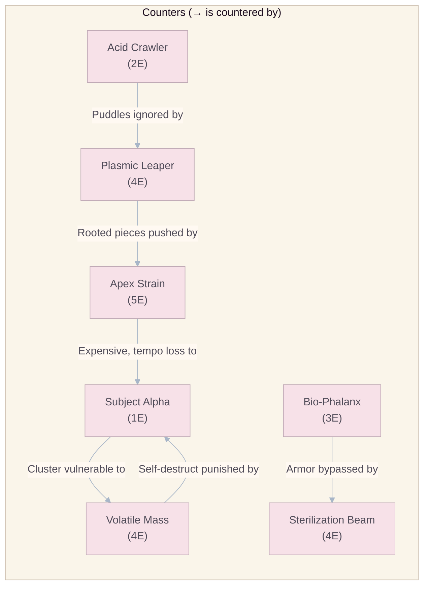

# Troops, Spells & Factions

## Design Philosophy

Introducing asymmetrical troops into a spatial domination game risks disrupting the mathematical purity of the board. To preserve tactical depth, all abilities are constrained by two rules:

1. **Abilities only trigger upon landing.** No persistent auras or ongoing effects (except explicitly defined temporary status effects).
2. **The $P_v \propto E^2$ budget is absolute.** Every card's total impact must fit within its Power Value budget (see `02_Mathematics_and_Balancing.md`).

---

## Base Troop Roster

### 1. Subject Alpha

| Property                  | Value            |
| :------------------------ | :--------------- |
| **Energy Cost**           | 1                |
| **Rarity**                | Common           |
| **Type**                  | Standard Biomass |
| **Conversion Radius**     | 1 hex (standard) |
| **Can Clone**             | Yes              |
| **Can Jump**              | Yes              |
| **Passive**               | None             |
| **Base Conversion Power** | 100              |

**Design Rationale:** The fundamental baseline unit. Cheap, efficient, and essential for rapid territorial expansion. The "bread and butter" of every viable deck. A deck without Subject Alpha struggles to maintain board presence during the critical early game.

**Strategic Notes:**

- Best card for pure cycle efficiency. At 1 Energy, it can be deployed almost continuously.
- In Overtime (2x Energy), Subject Alpha spam becomes extremely powerful due to raw piece-count accumulation.
- Countered by AoE effects (Volatile Mass, Sterilization Beam) that can erase clusters in one move.

---

### 2. Acid Crawler

| Property                  | Value                                                                                                                                                |
| :------------------------ | :--------------------------------------------------------------------------------------------------------------------------------------------------- |
| **Energy Cost**           | 2                                                                                                                                                    |
| **Rarity**                | Common                                                                                                                                               |
| **Type**                  | Hazard Generator                                                                                                                                     |
| **Conversion Radius**     | 1 hex (standard)                                                                                                                                     |
| **Can Clone**             | Yes                                                                                                                                                  |
| **Can Jump**              | Yes                                                                                                                                                  |
| **Passive**               | **Corrosive Trail** — When performing a Jump, leaves a toxic puddle on the vacated hex for **2 owner action windows**. No unit can land on a puddle. |
| **Base Conversion Power** | 100                                                                                                                                                  |
| **Puddle Duration**       | 2 owner action windows                                                                                                                               |

**Design Rationale:** Introduces area denial. By sacrificing the piece generation of a Clone (Jumping instead), the player can seal off strategic choke points, protecting flanks from enemy jumps and restricting opponent mobility.

**Strategic Notes:**

- Most effective on maps with narrow corridors or near board edges where puddles can completely block passage.
- Countered by Plasmic Leaper (Hover ignores puddles).
- Synergizes with Bio-Phalanx — anchor a defensive line behind acid puddles for a near-impenetrable front.

---

### 3. Bio-Phalanx

| Property                  | Value                                                                                                                                                                                                                |
| :------------------------ | :------------------------------------------------------------------------------------------------------------------------------------------------------------------------------------------------------------------- |
| **Energy Cost**           | 3                                                                                                                                                                                                                    |
| **Rarity**                | Rare                                                                                                                                                                                                                 |
| **Type**                  | Defensive Anchor                                                                                                                                                                                                     |
| **Conversion Radius**     | 1 hex (standard)                                                                                                                                                                                                     |
| **Can Clone**             | Yes                                                                                                                                                                                                                  |
| **Can Jump**              | Yes                                                                                                                                                                                                                  |
| **Passive**               | **Armored Membrane** — Requires **2 distinct adjacent conversion events** to be flipped. The first valid conversion attempt strips the armor only. The second valid conversion attempt converts the piece. Armor does **not** regenerate after being stripped unless a future card explicitly restores it. Visual indicator: armored state shows a translucent shield aura. |
| **Base Conversion Power** | 100                                                                                                                                                                                                                  |
| **Armor HP**              | 1 layer (stripped by first conversion event)                                                                                                                                                                         |

**Design Rationale:** Solves the inherent fragility of borders in Ataxx. A Bio-Phalanx anchors a defensive line, forcing the opponent to commit **multiple resources** (at least 2 units or 1 unit + 1 conversion chain) to breach a specific sector.

**Strategic Notes:**

- Place on the front line of territorial borders. Forces opponent to over-commit to break through.
- Cryo-Stasis can bypass armor entirely — a frozen Bio-Phalanx cannot be converted, but once thawed, the armor remains.
- Vulnerable to Sterilization Beam (vaporization ignores armor entirely).
- At higher levels, the 10% stat scaling increases its Conversion Power but does NOT add additional armor layers — armor is always 1 layer.
- In the launch ruleset, one landing event can strip armor, but a second separate valid conversion attempt is always required to actually flip the troop.

---

### 4. Volatile Mass

| Property                  | Value                                                                                                                                 |
| :------------------------ | :------------------------------------------------------------------------------------------------------------------------------------ |
| **Energy Cost**           | 4                                                                                                                                     |
| **Rarity**                | Epic                                                                                                                                  |
| **Type**                  | Area of Effect (AoE) Striker                                                                                                          |
| **Conversion Radius**     | **2 hexes** (expanded)                                                                                                                |
| **Can Clone**             | **No** (Unstable — lacks structural integrity)                                                                                        |
| **Can Jump**              | Yes (only movement option)                                                                                                            |
| **Passive**               | **Unstable** — Cannot Clone. Self-destructs **immediately after its landing/conversion resolution completes**, leaving the hex empty. |
| **Base Conversion Power** | 130                                                                                                                                   |
| **Self-Destruct**         | Immediate post-resolution cleanup                                                                                                     |

**Design Rationale:** The quintessential high-risk, high-reward card. Its 2-hex conversion radius can flip up to **18 enemy pieces** in a perfect scenario, but it cannot Clone (no board expansion), and it self-destructs. Net board presence: **-1** (you lose the Volatile Mass itself).

**Strategic Notes:**

- Best used as a surgical strike to shatter entrenched enemy clusters. Timing is everything.
- The self-destruct means it's **pure offense** — no defensive value whatsoever.
- Can be combined with Cryo-Stasis: freeze your own front line before detonating Volatile Mass behind enemy lines to prevent collateral.
- At 4 Energy, deploying it early game is very risky due to the high opportunity cost.

---

### 5. Plasmic Leaper

| Property                  | Value                                                                                                                                                                                                                                  |
| :------------------------ | :------------------------------------------------------------------------------------------------------------------------------------------------------------------------------------------------------------------------------------- |
| **Energy Cost**           | 4                                                                                                                                                                                                                                      |
| **Rarity**                | Epic                                                                                                                                                                                                                                   |
| **Type**                  | Mobility Specialist                                                                                                                                                                                                                    |
| **Conversion Radius**     | 1 hex (standard)                                                                                                                                                                                                                       |
| **Can Clone**             | Yes                                                                                                                                                                                                                                    |
| **Can Jump**              | Yes                                                                                                                                                                                                                                    |
| **Passive**               | **Hover** — Can traverse over blocked tiles, hazards (acid puddles), and destroyed tiles without penalty.                                                                                                                              |
| **Impact**                | **Binding Plasma** — Upon landing, applies **Root** to all newly converted enemy pieces for **1 defender action window**. Rooted pieces cannot be moved by their controller until that controller completes one successful deployment. |
| **Base Conversion Power** | 110                                                                                                                                                                                                                                    |
| **Root Duration**         | 1 defender action window                                                                                                                                                                                                               |

**Design Rationale:** Disrupts enemy counter-attacks. By rooting newly converted pieces, the opponent cannot immediately chain conversions back. Combined with Hover, the Plasmic Leaper is the ultimate position-ignoring mobility tool.

**Strategic Notes:**

- Hard-counters Acid Crawler's area denial (Hover ignores puddles).
- The Root prevents the opponent from using freshly stolen pieces to immediately counter-attack — buys you one defender action window of safety.
- Does NOT root pieces that were already owned by the player — only newly converted ones.
- Synergizes with Apex Strain: convert + root + push = opponent's formation is completely dismantled.

---

### 6. The Apex Strain

| Property                  | Value                                                                                                                                                                                                                                     |
| :------------------------ | :---------------------------------------------------------------------------------------------------------------------------------------------------------------------------------------------------------------------------------------- |
| **Energy Cost**           | 5                                                                                                                                                                                                                                         |
| **Rarity**                | Legendary                                                                                                                                                                                                                                 |
| **Type**                  | Heavy Disruptor                                                                                                                                                                                                                           |
| **Conversion Radius**     | 1 hex (standard)                                                                                                                                                                                                                          |
| **Can Clone**             | Yes                                                                                                                                                                                                                                       |
| **Can Jump**              | Yes                                                                                                                                                                                                                                       |
| **Passive**               | **Heavy Biomass** — Cannot be pushed, pulled, or displaced by any environmental effect, spell, or ability.                                                                                                                                |
| **Impact**                | **Seismic Shockwave** — Upon landing, converts adjacent enemies AND pushes them **1 hex outward** in a radial direction. Pushed units may cascade into other enemies, triggering secondary displacement (but NOT additional conversions). |
| **Base Conversion Power** | 140                                                                                                                                                                                                                                       |
| **Push Distance**         | 1 hex (radial)                                                                                                                                                                                                                            |

**Design Rationale:** The ultimate board-state manipulator. The push mechanic physically alters the spatial geometry of the opponent's formation, breaking defensive lines and opening multiple vulnerabilities simultaneously. At 5 Energy ($P_v = 25$), this is the most expensive and impactful card in the game.

**Strategic Notes:**

- The push can displace enemies into hazards (acid puddles), off optimal positions, or into clusters that become vulnerable to Volatile Mass follow-ups.
- Push does NOT convert — it only displaces. The conversion happens first (at landing), then the push.
- Pushed units that collide with board edges or blocked tiles simply stop (no wrap-around, no destruction).
- The Heavy Biomass passive makes Apex Strain immune to its own kind's push — two Apex Strains cannot displace each other.

---

## Spells

Spells manipulate the board state without permanently occupying space. Their high costs and lack of board presence contribution ensure they are tactical tools, not primary win conditions.

### 1. Cryo-Stasis

| Property          | Value                                                                                           |
| :---------------- | :---------------------------------------------------------------------------------------------- |
| **Energy Cost**   | 2                                                                                               |
| **Rarity**        | Rare                                                                                            |
| **Type**          | Area Control Spell                                                                              |
| **Target**        | 3-hex cluster (1 center hex + 2 adjacent)                                                       |
| **Effect**        | All pieces within the cluster (friend AND foe) are **Frozen** for **1 defender action window**. |
| **Frozen Status** | Cannot Clone, Jump, or be converted by adjacent landings. Immune to all interaction.            |

**Strategic Uses:**

- **Defensive:** Freeze your own vulnerable flank to prevent an imminent enemy conversion wave.
- **Offensive:** Freeze a Bio-Phalanx's armor to bypass it (while frozen, it can't be converted — but once thawed, the armor is still intact). More commonly, freeze enemy pieces near your advancing front to prevent them from being used as counter-attack vectors.
- **Combo Denial:** Freeze an opponent's cluster to prevent them from executing a planned multi-piece chain conversion.

---

### 2. Sterilization Beam

| Property        | Value                                                                                                                                                                                    |
| :-------------- | :--------------------------------------------------------------------------------------------------------------------------------------------------------------------------------------- |
| **Energy Cost** | 4                                                                                                                                                                                        |
| **Rarity**      | Epic                                                                                                                                                                                     |
| **Type**        | Board Wipe Spell                                                                                                                                                                         |
| **Target**      | 4-hex cluster (1 center hex + 3 adjacent)                                                                                                                                                |
| **Effect**      | All pieces within the radius are instantly **vaporized** — removed from the board entirely, returning hexes to empty/neutral state. Ignores armor, frozen status, and all other effects. |

**Strategic Uses:**

- **Last Resort:** When the opponent has completely overwhelmed a quadrant, this spell resets the area.
- **Precision Strike:** Target a cluster where the opponent has more pieces than you. If 3 enemy and 1 friendly piece are hit, the net effect is +2 in your favor (opponent loses 3, you lose 1).
- **Warning:** Using this on your own dense territory is almost never correct — the Energy cost and piece loss are devastating.

---

## New Expansion Prototypes

These cards are proposed for the second design pass because they add missing forms of **counterplay, tempo control, and map interaction** without violating the existing $P_v \propto E^2$ budget.

### 7. Quarantine Drone

| Property                  | Value                                                                                                                                                                                                                  |
| :------------------------ | :--------------------------------------------------------------------------------------------------------------------------------------------------------------------------------------------------------------------- |
| **Energy Cost**           | 3                                                                                                                                                                                                                      |
| **Rarity**                | Rare                                                                                                                                                                                                                   |
| **Type**                  | Tempo Controller                                                                                                                                                                                                       |
| **Conversion Radius**     | 1 hex (standard)                                                                                                                                                                                                       |
| **Can Clone**             | Yes                                                                                                                                                                                                                    |
| **Can Jump**              | Yes                                                                                                                                                                                                                    |
| **Impact**                | **Seal Protocol** — After landing, mark up to **2 adjacent empty hexes** as **Sealed** for **1 owner action window**. Sealed hexes cannot receive Clone/Jump landings, but Hover movement may pass over them normally. |
| **Base Conversion Power** | 100                                                                                                                                                                                                                    |

**Design Rationale:** The live roster had area denial through Acid Crawler, but not a cleaner **tempo denial** tool that targets empty space instead of leaving a trail. Quarantine Drone gives control decks a proactive way to delay counter-angles without hard-locking the board.

**Strategic Notes:**

- Best when used to close one side of a choke after a favorable conversion.
- Countered by Plasmic Leaper and any deck willing to play around the 1 owner action window duration.
- Should be tested carefully on Split Reactor; if it overperforms there, the map is likely the issue before the card is.

### 8. Detox Mycelium

| Property                  | Value                                                                                                                                                                             |
| :------------------------ | :-------------------------------------------------------------------------------------------------------------------------------------------------------------------------------- |
| **Energy Cost**           | 3                                                                                                                                                                                 |
| **Rarity**                | Rare                                                                                                                                                                              |
| **Type**                  | Stabilizer / Support                                                                                                                                                              |
| **Conversion Radius**     | 1 hex (standard)                                                                                                                                                                  |
| **Can Clone**             | Yes                                                                                                                                                                               |
| **Can Jump**              | Yes                                                                                                                                                                               |
| **Impact**                | **Purge Bloom** — Upon landing, all friendly units within **1 hex** are cleansed of **Root** and **Frozen**. Any acid puddle under those friendly units is immediately dissolved. |
| **Base Conversion Power** | 100                                                                                                                                                                               |

**Design Rationale:** The first roster had strong disruption tools but a thin answer set. Detox Mycelium adds a readable anti-control card that protects interactive play without removing the value of status-heavy strategies.

**Strategic Notes:**

- Creates a healthy answer to Cryo-Stasis, Plasmic Leaper, and Acid Crawler shells.
- Its power is reactive, so it should underperform in metas with little control; that is acceptable and desirable.
- Encourages formation play, because players are rewarded for grouping units worth cleansing.

---

## New Spell Prototypes

### 3. Purge Pulse

| Property        | Value                                                                                                                                  |
| :-------------- | :------------------------------------------------------------------------------------------------------------------------------------- |
| **Energy Cost** | 2                                                                                                                                      |
| **Rarity**      | Rare                                                                                                                                   |
| **Type**        | Utility / Cleanse Spell                                                                                                                |
| **Target**      | 3-hex cluster                                                                                                                          |
| **Effect**      | Removes **Frozen**, **Rooted**, and **Sealed** from all affected units/hexes. Also dissolves any acid puddles in the targeted cluster. |

**Strategic Uses:**

- Gives cycle and hybrid decks a clean answer to status stacking.
- Keeps sealed or frozen board states from becoming too deterministic.
- Because it creates **no board presence**, it should never replace troops in decks that need proactive pressure.

### 4. Phase Relay

| Property        | Value                                                                                                                                                                                                                           |
| :-------------- | :------------------------------------------------------------------------------------------------------------------------------------------------------------------------------------------------------------------------------ |
| **Energy Cost** | 3                                                                                                                                                                                                                               |
| **Rarity**      | Epic                                                                                                                                                                                                                            |
| **Type**        | Mobility Spell                                                                                                                                                                                                                  |
| **Target**      | 1 allied troop                                                                                                                                                                                                                  |
| **Effect**      | The chosen troop immediately performs a **free Jump** to any valid empty hex within **2 hexes**, resolving its landing conversion and impact normally. This does not count as playing a new troop card or advancing card cycle. |

**Strategic Uses:**

- Converts dead board states into tactical re-engagement without adding new material to the board.
- Enables skilled repositioning for Bio-Phalanx, Apex Strain, and Quarantine Drone.
- Must remain expensive enough that it is a combo enabler, not a default mobility tax in every deck.

---

## Synergy & Counter Matrix



### Counter Matrix Table

| Attacker ↓ / Defender → | Subject Alpha | Acid Crawler | Bio-Phalanx  | Volatile Mass | Plasmic Leaper | Apex Strain |
| :---------------------- | :-----------: | :----------: | :----------: | :-----------: | :------------: | :---------: |
| **Subject Alpha**       |       =       |      =       |     Weak     |     Weak      |       =        |    Weak     |
| **Acid Crawler**        |       =       |      =       |      =       |       =       | **Countered**  |      =      |
| **Bio-Phalanx**         |    Strong     |      =       |      =       |     Weak      |       =        |    Weak     |
| **Volatile Mass**       | **Counters**  |      =       | **Counters** |       =       |       =        |      =      |
| **Plasmic Leaper**      |       =       | **Counters** |      =       |       =       |       =        |    Weak     |
| **Apex Strain**         | **Counters**  |      =       | **Counters** |       =       |  **Counters**  |      =      |

> **Legend:** "Counters" = has a significant strategic advantage against. "Countered" = is at a disadvantage. "Weak" = vulnerable to. "=" = neutral matchup.

---

## Deck Archetypes

### 1. Cycle / Swarm

- **Core Cards:** Subject Alpha, Acid Crawler, Cryo-Stasis
- **Average Elixir:** 1.75
- **Strategy:** Overwhelm with volume. Constantly deploy cheap units to fill the board. Use Cryo-Stasis defensively to protect flanks.
- **Weakness:** Vulnerable to AoE (Volatile Mass, Sterilization Beam).

### 2. Control / Fortress

- **Core Cards:** Bio-Phalanx, Acid Crawler, Cryo-Stasis
- **Average Elixir:** 2.33
- **Strategy:** Build impenetrable defensive walls with armored units behind acid puddles. Slowly advance while denying enemy territory.
- **Weakness:** Slow. Can be outpaced by Swarm decks that fill the board before the fortress is built.

### 3. Burst / Aggro

- **Core Cards:** Volatile Mass, Apex Strain, Plasmic Leaper
- **Average Elixir:** 4.33
- **Strategy:** Save Energy for devastating combo plays. Use Volatile Mass to shatter enemy clusters, followed by Apex Strain to push survivors out of position.
- **Weakness:** Very expensive. Vulnerable to early-game pressure and Energy leaking.

### 4. Hybrid / Balanced

- **Core Cards:** Subject Alpha, Bio-Phalanx, Plasmic Leaper, Sterilization Beam
- **Average Elixir:** 3.00
- **Strategy:** Flexible. Adapt to the opponent's strategy. Use cheap units for early presence, tech into abilities mid-game, and finish with surgical Sterilization Beams.
- **Weakness:** Jack of all trades, master of none. Can be outperformed by dedicated archetypes.

### 5. Lockdown / Tempo Control

- **Core Cards:** Quarantine Drone, Acid Crawler, Purge Pulse, Bio-Phalanx
- **Average Elixir:** 2.75
- **Strategy:** Close off the most efficient enemy responses, then slowly convert small leads into irreversible territory gains.
- **Weakness:** Vulnerable to decks that can ignore or cleanse temporary denial, especially Hover and cleanse-heavy shells.

### 6. Reset / Reposition

- **Core Cards:** Detox Mycelium, Phase Relay, Plasmic Leaper, Apex Strain
- **Average Elixir:** 3.75
- **Strategy:** Survive the opponent's first control spike, then re-open the board with cleanses and precision repositioning.
- **Weakness:** Can leak Energy badly if the opponent refuses to commit into its reactive tools.

## Conversion Resolution Clarification

To keep card behavior deterministic, launch troops follow these additional rules:

- A **conversion attempt** is any valid ownership-flip check generated by a landing event or spell effect.
- Bio-Phalanx consumes the **first** valid conversion attempt by losing armor only.
- After armor is stripped, that Bio-Phalanx remains vulnerable until it is converted, removed, or the match ends.
- Launch cards do not reapply armor and do not create infinite stall loops through armor refresh.

---

## Card Data Schema (ScriptableObject)

All card data is authored as **ScriptableObject** assets in Unity and stored under `Assets/Data/Cards`. Below is the canonical data structure:

```json
{
  "cardId": "troop_subject_alpha",
  "displayName": "Subject Alpha",
  "rarity": "Common",
  "cardType": "Troop",
  "energyCost": 1,
  "description": "The fundamental biomass unit. Standard conversion, no frills.",
  "baseStats": {
    "conversionPower": 100,
    "conversionRadius": 1,
    "canClone": true,
    "canJump": true,
    "hasArmor": false,
    "armorLayers": 0,
    "selfDestructs": false
  },
  "passive": {
    "id": "none",
    "displayName": "",
    "description": ""
  },
  "impactAbility": {
    "id": "standard_conversion",
    "displayName": "Standard Conversion",
    "description": "Converts all adjacent enemy units within 1-hex radius.",
    "radius": 1,
    "statusEffect": "none",
    "statusDuration": 0
  },
  "visualAssets": {
    "cardArtAsset": "Assets/Art/Sprites/Cards/SubjectAlpha",
    "unitPrefabAsset": "Assets/Prefabs/Cards/Units/SubjectAlpha",
    "deployVFXAsset": "Assets/Prefabs/Shared/Runtime/DeployVFX_Standard",
    "conversionVFXAsset": "Assets/Prefabs/Shared/Runtime/ConversionVFX_Standard"
  },
  "audioAssets": {
    "deploySFX": "Assets/Audio/SFX/Gameplay/Squish_Light",
    "conversionSFX": "Assets/Audio/SFX/Gameplay/Pop_Cascade",
    "abilitySFX": ""
  },
  "upgradeScaling": {
    "statMultiplierPerLevel": 1.1,
    "maxLevel": 14
  }
}
```

> **Implementation Note:** Each `CardDataSO` ScriptableObject should live in `Assets/Data/Cards` and reference prefabs, sprites, and audio from their dedicated content roots rather than loading general gameplay assets from `Resources`. Runtime card deployment then resolves those references through the feature services described in `08_Technical_Architecture_and_Multiplayer.md`.

---

## Future Expansion Roadmap

| Season        | Proposed Release                          | Theme           | Balance Intent                                                          |
| :------------ | :---------------------------------------- | :-------------- | :---------------------------------------------------------------------- |
| **Season 2**  | Quarantine Drone + Ring Labyrinth         | Containment     | Add tempo control and the first non-open ranked geometry.               |
| **Season 3**  | Purge Pulse                               | Decontamination | Introduce a clean answer card before more control tools enter the pool. |
| **Season 4**  | Detox Mycelium + Split Reactor            | Field Surgery   | Strengthen anti-control play and expand lane-shaped maps.               |
| **Season 6**  | Phase Relay + Catalyst Wells (event-only) | Phase Shift     | Test mobility spikes in limited scope before ranked adoption.           |
| **Season 7+** | One card or one map per season            | Rotating themes | Maintain diversity without forcing constant relearning.                 |

> **Balance Rule:** No new card may exceed 5 Energy cost. The Apex Strain's $P_v = 25$ is the maximum power budget ceiling. New cards with the same Energy cost must offer **different** utility, not **more** utility.

> **Content Rule:** A season should ship **either** one major new card **or** one new ranked map, with only occasional paired releases when simulation and live telemetry both support it.
