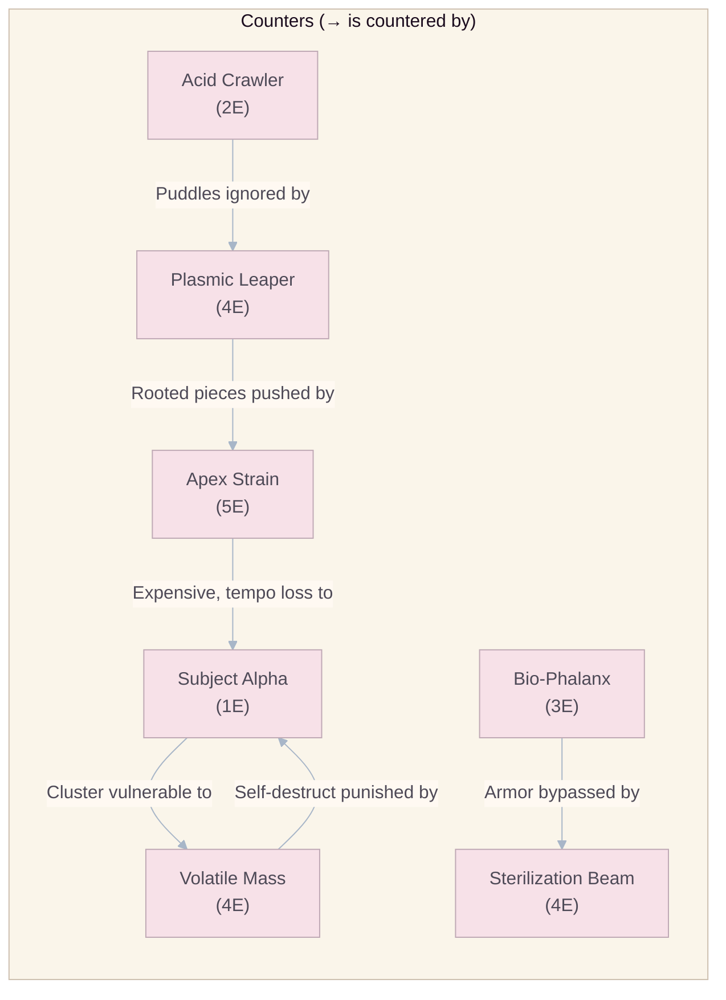

# Specimens, Protocols & Factions

## Design Philosophy

Introducing asymmetrical specimens into a spatial domination game risks disrupting the mathematical purity of the planetary surface. To preserve tactical depth, all abilities are constrained by two rules:

1. **Abilities only trigger upon landing.** No persistent auras or ongoing effects (except explicitly defined temporary status effects).
2. **The $P_v \propto E^2$ budget is absolute.** Every card's total impact must fit within its Power Value budget (see `02_Mathematics_and_Balancing.md`).

---

## Base Specimen Roster

### 1. Subject Alpha

| Property                  | Value            |
| :------------------------ | :--------------- |
| **Energy Cost**           | 1                |
| **Rarity**                | Common           |
| **Type**                  | Standard Biomass |
| **Conversion Radius**     | 1 hex (standard) |
| **Can Clone**             | Yes              |
| **Can Jump**              | Yes              |
| **Passive**               | None             |
| **Base Conversion Power** | 100              |

**Design Rationale:** The fundamental baseline unit. Cheap, efficient, and essential for rapid territorial expansion. The "bread and butter" of every viable deck. A deck without Subject Alpha struggles to maintain board presence during the critical early game.

**Strategic Notes:**

- Best card for pure cycle efficiency. At 1 Energy, it can be deployed almost continuously.
- In Overtime (2x Energy), Subject Alpha spam becomes extremely powerful due to raw piece-count accumulation.
- Countered by AoE effects (Volatile Mass, Sterilization Beam) that can erase clusters in one move.

---

### 2. Acid Crawler

| Property                  | Value                                                                                                                                                |
| :------------------------ | :--------------------------------------------------------------------------------------------------------------------------------------------------- |
| **Energy Cost**           | 2                                                                                                                                                    |
| **Rarity**                | Common                                                                                                                                               |
| **Type**                  | Hazard Generator                                                                                                                                     |
| **Conversion Radius**     | 1 hex (standard)                                                                                                                                     |
| **Can Clone**             | Yes                                                                                                                                                  |
| **Can Jump**              | Yes                                                                                                                                                  |
| **Passive**               | **Corrosive Trail** — When performing a Jump, leaves a toxic puddle on the vacated hex for **2 owner action windows**. No unit can land on a puddle. |
| **Base Conversion Power** | 100                                                                                                                                                  |
| **Puddle Duration**       | 2 owner action windows                                                                                                                               |

**Design Rationale:** Introduces area denial. By sacrificing the piece generation of a Clone (Jumping instead), the player can seal off strategic choke points, protecting flanks from enemy jumps and restricting opponent mobility.

**Strategic Notes:**

- Most effective on maps with narrow corridors or near board edges where puddles can completely block passage.
- Countered by Plasmic Leaper (Hover ignores puddles).
- Synergizes with Bio-Phalanx — anchor a defensive line behind acid puddles for a near-impenetrable front.

---

### 3. Bio-Phalanx

| Property                  | Value                                                                                                                                                                                                                                                                                                                                                                       |
| :------------------------ | :-------------------------------------------------------------------------------------------------------------------------------------------------------------------------------------------------------------------------------------------------------------------------------------------------------------------------------------------------------------------------- |
| **Energy Cost**           | 3                                                                                                                                                                                                                                                                                                                                                                           |
| **Rarity**                | Rare                                                                                                                                                                                                                                                                                                                                                                        |
| **Type**                  | Defensive Anchor                                                                                                                                                                                                                                                                                                                                                            |
| **Conversion Radius**     | 1 hex (standard)                                                                                                                                                                                                                                                                                                                                                            |
| **Can Clone**             | Yes                                                                                                                                                                                                                                                                                                                                                                         |
| **Can Jump**              | Yes                                                                                                                                                                                                                                                                                                                                                                         |
| **Passive**               | **Armored Membrane** — Requires **2 distinct adjacent conversion events** to be flipped. The first valid conversion attempt strips the armor only. The second valid conversion attempt converts the piece. Armor does **not** regenerate after being stripped unless a future card explicitly restores it. Visual indicator: armored state shows a translucent shield aura. |
| **Base Conversion Power** | 100                                                                                                                                                                                                                                                                                                                                                                         |
| **Armor HP**              | 1 layer (stripped by first conversion event)                                                                                                                                                                                                                                                                                                                                |

**Design Rationale:** Solves the inherent fragility of borders in Ataxx. A Bio-Phalanx anchors a defensive line, forcing the opponent to commit **multiple resources** (at least 2 units or 1 unit + 1 conversion chain) to breach a specific sector.

**Strategic Notes:**

- Place on the front line of territorial borders. Forces opponent to over-commit to break through.
- Cryo-Stasis can bypass armor entirely — a frozen Bio-Phalanx cannot be converted, but once thawed, the armor remains.
- Vulnerable to Sterilization Beam (vaporization ignores armor entirely).
- At higher levels, the 10% stat scaling increases its Conversion Power but does NOT add additional armor layers — armor is always 1 layer.
- In the launch ruleset, one landing event can strip armor, but a second separate valid conversion attempt is always required to actually flip the troop.

---

### 4. Volatile Mass

| Property                  | Value                                                                                                                                 |
| :------------------------ | :------------------------------------------------------------------------------------------------------------------------------------ |
| **Energy Cost**           | 4                                                                                                                                     |
| **Rarity**                | Epic                                                                                                                                  |
| **Type**                  | Area of Effect (AoE) Striker                                                                                                          |
| **Conversion Radius**     | **2 hexes** (expanded)                                                                                                                |
| **Can Clone**             | **No** (Unstable — lacks structural integrity)                                                                                        |
| **Can Jump**              | Yes (only movement option)                                                                                                            |
| **Passive**               | **Unstable** — Cannot Clone. Self-destructs **immediately after its landing/conversion resolution completes**, leaving the hex empty. |
| **Base Conversion Power** | 130                                                                                                                                   |
| **Self-Destruct**         | Immediate post-resolution cleanup                                                                                                     |

**Design Rationale:** The quintessential high-risk, high-reward card. Its 2-hex conversion radius can flip up to **18 enemy pieces** in a perfect scenario, but it cannot Clone (no board expansion), and it self-destructs. Net board presence: **-1** (you lose the Volatile Mass itself).

**Strategic Notes:**

- Best used as a surgical strike to shatter entrenched enemy clusters. Timing is everything.
- The self-destruct means it's **pure offense** — no defensive value whatsoever.
- Can be combined with Cryo-Stasis: freeze your own front line before detonating Volatile Mass behind enemy lines to prevent collateral.
- At 4 Energy, deploying it early game is very risky due to the high opportunity cost.

---

### 5. Plasmic Leaper

| Property                  | Value                                                                                                                                                                                                                                  |
| :------------------------ | :------------------------------------------------------------------------------------------------------------------------------------------------------------------------------------------------------------------------------------- |
| **Energy Cost**           | 4                                                                                                                                                                                                                                      |
| **Rarity**                | Epic                                                                                                                                                                                                                                   |
| **Type**                  | Mobility Specialist                                                                                                                                                                                                                    |
| **Conversion Radius**     | 1 hex (standard)                                                                                                                                                                                                                       |
| **Can Clone**             | Yes                                                                                                                                                                                                                                    |
| **Can Jump**              | Yes                                                                                                                                                                                                                                    |
| **Passive**               | **Hover** — Can traverse over blocked tiles, hazards (acid puddles), and destroyed tiles without penalty.                                                                                                                              |
| **Impact**                | **Binding Plasma** — Upon landing, applies **Root** to all newly converted enemy pieces for **1 defender action window**. Rooted pieces cannot be moved by their controller until that controller completes one successful deployment. |
| **Base Conversion Power** | 110                                                                                                                                                                                                                                    |
| **Root Duration**         | 1 defender action window                                                                                                                                                                                                               |

**Design Rationale:** Disrupts enemy counter-attacks. By rooting newly converted pieces, the opponent cannot immediately chain conversions back. Combined with Hover, the Plasmic Leaper is the ultimate position-ignoring mobility tool.

**Strategic Notes:**

- Hard-counters Acid Crawler's area denial (Hover ignores puddles).
- The Root prevents the opponent from using freshly stolen pieces to immediately counter-attack — buys you one defender action window of safety.
- Does NOT root pieces that were already owned by the player — only newly converted ones.
- Synergizes with Apex Strain: convert + root + push = opponent's formation is completely dismantled.

---

### 6. The Apex Strain

| Property                  | Value                                                                                                                                                                                                                                     |
| :------------------------ | :---------------------------------------------------------------------------------------------------------------------------------------------------------------------------------------------------------------------------------------- |
| **Energy Cost**           | 5                                                                                                                                                                                                                                         |
| **Rarity**                | Legendary                                                                                                                                                                                                                                 |
| **Type**                  | Heavy Disruptor                                                                                                                                                                                                                           |
| **Conversion Radius**     | 1 hex (standard)                                                                                                                                                                                                                          |
| **Can Clone**             | Yes                                                                                                                                                                                                                                       |
| **Can Jump**              | Yes                                                                                                                                                                                                                                       |
| **Passive**               | **Heavy Biomass** — Cannot be pushed, pulled, or displaced by any environmental effect, spell, or ability.                                                                                                                                |
| **Impact**                | **Seismic Shockwave** — Upon landing, converts adjacent enemies AND pushes them **1 hex outward** in a radial direction. Pushed units may cascade into other enemies, triggering secondary displacement (but NOT additional conversions). |
| **Base Conversion Power** | 140                                                                                                                                                                                                                                       |
| **Push Distance**         | 1 hex (radial)                                                                                                                                                                                                                            |

**Design Rationale:** The ultimate board-state manipulator. The push mechanic physically alters the spatial geometry of the opponent's formation, breaking defensive lines and opening multiple vulnerabilities simultaneously. At 5 Energy ($P_v = 25$), this is the most expensive and impactful card in the game.

**Strategic Notes:**

- The push can displace enemies into hazards (acid puddles), off optimal positions, or into clusters that become vulnerable to Volatile Mass follow-ups.
- Push does NOT convert — it only displaces. The conversion happens first (at landing), then the push.
- Pushed units that collide with board edges or blocked tiles simply stop (no wrap-around, no destruction).
- The Heavy Biomass passive makes Apex Strain immune to its own kind's push — two Apex Strains cannot displace each other.

---

## Protocols

Protocols manipulate the planetary surface state without permanently occupying space. Their high costs and lack of surface presence contribution ensure they are tactical tools, not primary win conditions.

### 1. Cryo-Stasis

| Property          | Value                                                                                           |
| :---------------- | :---------------------------------------------------------------------------------------------- |
| **Energy Cost**   | 2                                                                                               |
| **Rarity**        | Rare                                                                                            |
| **Type**          | Area Control Spell                                                                              |
| **Target**        | 3-hex cluster (1 center hex + 2 adjacent)                                                       |
| **Effect**        | All pieces within the cluster (friend AND foe) are **Frozen** for **1 defender action window**. |
| **Frozen Status** | Cannot Clone, Jump, or be converted by adjacent landings. Immune to all interaction.            |

**Strategic Uses:**

- **Defensive:** Freeze your own vulnerable flank to prevent an imminent enemy conversion wave.
- **Offensive:** Freeze a Bio-Phalanx's armor to bypass it (while frozen, it can't be converted — but once thawed, the armor is still intact). More commonly, freeze enemy pieces near your advancing front to prevent them from being used as counter-attack vectors.
- **Combo Denial:** Freeze an opponent's cluster to prevent them from executing a planned multi-piece chain conversion.

---

### 2. Sterilization Beam

| Property        | Value                                                                                                                                                                                    |
| :-------------- | :--------------------------------------------------------------------------------------------------------------------------------------------------------------------------------------- |
| **Energy Cost** | 4                                                                                                                                                                                        |
| **Rarity**      | Epic                                                                                                                                                                                     |
| **Type**        | Board Wipe Spell                                                                                                                                                                         |
| **Target**      | 4-hex cluster (1 center hex + 3 adjacent)                                                                                                                                                |
| **Effect**      | All pieces within the radius are instantly **vaporized** — removed from the board entirely, returning hexes to empty/neutral state. Ignores armor, frozen status, and all other effects. |

**Strategic Uses:**

- **Last Resort:** When the opponent has completely overwhelmed a quadrant, this spell resets the area.
- **Precision Strike:** Target a cluster where the opponent has more pieces than you. If 3 enemy and 1 friendly piece are hit, the net effect is +2 in your favor (opponent loses 3, you lose 1).
- **Warning:** Using this on your own dense territory is almost never correct — the Energy cost and piece loss are devastating.

---

## New Expansion Prototypes

These specimens are proposed for the second design pass because they add missing forms of **counterplay, tempo control, and surface interaction** without violating the existing $P_v \propto E^2$ budget.

### 7. Quarantine Drone

| Property                  | Value                                                                                                                                                                                                                  |
| :------------------------ | :--------------------------------------------------------------------------------------------------------------------------------------------------------------------------------------------------------------------- |
| **Energy Cost**           | 3                                                                                                                                                                                                                      |
| **Rarity**                | Rare                                                                                                                                                                                                                   |
| **Type**                  | Tempo Controller                                                                                                                                                                                                       |
| **Conversion Radius**     | 1 hex (standard)                                                                                                                                                                                                       |
| **Can Clone**             | Yes                                                                                                                                                                                                                    |
| **Can Jump**              | Yes                                                                                                                                                                                                                    |
| **Impact**                | **Seal Protocol** — After landing, mark up to **2 adjacent empty hexes** as **Sealed** for **1 owner action window**. Sealed hexes cannot receive Clone/Jump landings, but Hover movement may pass over them normally. |
| **Base Conversion Power** | 100                                                                                                                                                                                                                    |

**Design Rationale:** The live roster had area denial through Acid Crawler, but not a cleaner **tempo denial** tool that targets empty space instead of leaving a trail. Quarantine Drone gives control decks a proactive way to delay counter-angles without hard-locking the board.

**Strategic Notes:**

- Best when used to close one side of a choke after a favorable conversion.
- Countered by Plasmic Leaper and any deck willing to play around the 1 owner action window duration.
- Should be tested carefully on Split Reactor; if it overperforms there, the map is likely the issue before the card is.

### 8. Detox Mycelium

| Property                  | Value                                                                                                                                                                             |
| :------------------------ | :-------------------------------------------------------------------------------------------------------------------------------------------------------------------------------- |
| **Energy Cost**           | 3                                                                                                                                                                                 |
| **Rarity**                | Rare                                                                                                                                                                              |
| **Type**                  | Stabilizer / Support                                                                                                                                                              |
| **Conversion Radius**     | 1 hex (standard)                                                                                                                                                                  |
| **Can Clone**             | Yes                                                                                                                                                                               |
| **Can Jump**              | Yes                                                                                                                                                                               |
| **Impact**                | **Purge Bloom** — Upon landing, all friendly units within **1 hex** are cleansed of **Root** and **Frozen**. Any acid puddle under those friendly units is immediately dissolved. |
| **Base Conversion Power** | 100                                                                                                                                                                               |

**Design Rationale:** The first roster had strong disruption tools but a thin answer set. Detox Mycelium adds a readable anti-control card that protects interactive play without removing the value of status-heavy strategies.

**Strategic Notes:**

- Creates a healthy answer to Cryo-Stasis, Plasmic Leaper, and Acid Crawler shells.
- Its power is reactive, so it should underperform in metas with little control; that is acceptable and desirable.
- Encourages formation play, because players are rewarded for grouping units worth cleansing.

---

## New Protocol Prototypes

### 3. Purge Pulse

| Property        | Value                                                                                                                                  |
| :-------------- | :------------------------------------------------------------------------------------------------------------------------------------- |
| **Energy Cost** | 2                                                                                                                                      |
| **Rarity**      | Rare                                                                                                                                   |
| **Type**        | Utility / Cleanse Spell                                                                                                                |
| **Target**      | 3-hex cluster                                                                                                                          |
| **Effect**      | Removes **Frozen**, **Rooted**, and **Sealed** from all affected units/hexes. Also dissolves any acid puddles in the targeted cluster. |

**Strategic Uses:**

- Gives cycle and hybrid decks a clean answer to status stacking.
- Keeps sealed or frozen board states from becoming too deterministic.
- Because it creates **no board presence**, it should never replace troops in decks that need proactive pressure.

### 4. Phase Relay

| Property        | Value                                                                                                                                                                                                                           |
| :-------------- | :------------------------------------------------------------------------------------------------------------------------------------------------------------------------------------------------------------------------------ |
| **Energy Cost** | 3                                                                                                                                                                                                                               |
| **Rarity**      | Epic                                                                                                                                                                                                                            |
| **Type**        | Mobility Spell                                                                                                                                                                                                                  |
| **Target**      | 1 allied troop                                                                                                                                                                                                                  |
| **Effect**      | The chosen troop immediately performs a **free Jump** to any valid empty hex within **2 hexes**, resolving its landing conversion and impact normally. This does not count as playing a new troop card or advancing card cycle. |

**Strategic Uses:**

- Converts dead board states into tactical re-engagement without adding new material to the board.
- Enables skilled repositioning for Bio-Phalanx, Apex Strain, and Quarantine Drone.
- Must remain expensive enough that it is a combo enabler, not a default mobility tax in every deck.

---

## Synergy & Counter Matrix


```mermaid
%%{init: {"theme":"base","themeVariables":{"primaryColor":"#F7E1E8","secondaryColor":"#DCEBF7","tertiaryColor":"#E4F3E1","primaryBorderColor":"#BFA9B5","lineColor":"#A8B6C8","primaryTextColor":"#4E4A57","clusterBkg":"#FAF5EA","clusterBorder":"#CDBFAF","edgeLabelBackground":"#FFF9F2","noteBkgColor":"#F7F1FA","noteTextColor":"#4E4A57","taskBkgColor":"#DCEBF7","taskTextColor":"#4E4A57","taskTextOutsideColor":"#4E4A57","sectionBkgColor":"#E4F3E1","sectionBorderColor":"#BCD0B9","gridColor":"#E8DDD3","todayLineColor":"#C7A7B5","actorBkg":"#F7E1E8","actorBorder":"#BFA9B5","actorTextColor":"#4E4A57","signalColor":"#A8B6C8","signalTextColor":"#4E4A57","labelBoxBkgColor":"#FFF9F2","labelBoxBorderColor":"#CDBFAF","labelTextColor":"#4E4A57"}}}%%
graph LR
    subgraph "Counters (→ is countered by)"
        SA["Subject Alpha<br/>(1E)"] -->|"Cluster vulnerable to"| VM["Volatile Mass<br/>(4E)"]
        AC["Acid Crawler<br/>(2E)"] -->|"Puddles ignored by"| PL["Plasmic Leaper<br/>(4E)"]
        BP["Bio-Phalanx<br/>(3E)"] -->|"Armor bypassed by"| SB["Sterilization Beam<br/>(4E)"]
        VM -->|"Self-destruct punished by"| SA
        PL -->|"Rooted pieces pushed by"| AS["Apex Strain<br/>(5E)"]
        AS -->|"Expensive, tempo loss to"| SA
    end
```

### Counter Matrix Table

| Attacker ↓ / Defender → | Subject Alpha | Acid Crawler | Bio-Phalanx  | Volatile Mass | Plasmic Leaper | Apex Strain |
| :---------------------- | :-----------: | :----------: | :----------: | :-----------: | :------------: | :---------: |
| **Subject Alpha**       |       =       |      =       |     Weak     |     Weak      |       =        |    Weak     |
| **Acid Crawler**        |       =       |      =       |      =       |       =       | **Countered**  |      =      |
| **Bio-Phalanx**         |    Strong     |      =       |      =       |     Weak      |       =        |    Weak     |
| **Volatile Mass**       | **Counters**  |      =       | **Counters** |       =       |       =        |      =      |
| **Plasmic Leaper**      |       =       | **Counters** |      =       |       =       |       =        |    Weak     |
| **Apex Strain**         | **Counters**  |      =       | **Counters** |       =       |  **Counters**  |      =      |

> **Legend:** "Counters" = has a significant strategic advantage against. "Countered" = is at a disadvantage. "Weak" = vulnerable to. "=" = neutral matchup.

---

## Kit Archetypes

### 1. Cycle / Swarm

- **Core Cards:** Subject Alpha, Acid Crawler, Cryo-Stasis
- **Average Elixir:** 1.75
- **Strategy:** Overwhelm with volume. Constantly deploy cheap units to fill the board. Use Cryo-Stasis defensively to protect flanks.
- **Weakness:** Vulnerable to AoE (Volatile Mass, Sterilization Beam).

### 2. Control / Fortress

- **Core Cards:** Bio-Phalanx, Acid Crawler, Cryo-Stasis
- **Average Elixir:** 2.33
- **Strategy:** Build impenetrable defensive walls with armored units behind acid puddles. Slowly advance while denying enemy territory.
- **Weakness:** Slow. Can be outpaced by Swarm decks that fill the board before the fortress is built.

### 3. Burst / Aggro

- **Core Cards:** Volatile Mass, Apex Strain, Plasmic Leaper
- **Average Elixir:** 4.33
- **Strategy:** Save Energy for devastating combo plays. Use Volatile Mass to shatter enemy clusters, followed by Apex Strain to push survivors out of position.
- **Weakness:** Very expensive. Vulnerable to early-game pressure and Energy leaking.

### 4. Hybrid / Balanced

- **Core Cards:** Subject Alpha, Bio-Phalanx, Plasmic Leaper, Sterilization Beam
- **Average Elixir:** 3.00
- **Strategy:** Flexible. Adapt to the opponent's strategy. Use cheap units for early presence, tech into abilities mid-game, and finish with surgical Sterilization Beams.
- **Weakness:** Jack of all trades, master of none. Can be outperformed by dedicated archetypes.

### 5. Lockdown / Tempo Control

- **Core Cards:** Quarantine Drone, Acid Crawler, Purge Pulse, Bio-Phalanx
- **Average Elixir:** 2.75
- **Strategy:** Close off the most efficient enemy responses, then slowly convert small leads into irreversible territory gains.
- **Weakness:** Vulnerable to decks that can ignore or cleanse temporary denial, especially Hover and cleanse-heavy shells.

### 6. Reset / Reposition

- **Core Cards:** Detox Mycelium, Phase Relay, Plasmic Leaper, Apex Strain
- **Average Elixir:** 3.75
- **Strategy:** Survive the opponent's first control spike, then re-open the board with cleanses and precision repositioning.
- **Weakness:** Can leak Energy badly if the opponent refuses to commit into its reactive tools.

## Conversion Resolution Clarification

To keep card behavior deterministic, launch troops follow these additional rules:

- A **conversion attempt** is any valid ownership-flip check generated by a landing event or spell effect.
- Bio-Phalanx consumes the **first** valid conversion attempt by losing armor only.
- After armor is stripped, that Bio-Phalanx remains vulnerable until it is converted, removed, or the match ends.
- Launch cards do not reapply armor and do not create infinite stall loops through armor refresh.

---

## Landing Impact Targeting

Every landing impact — a troop's own impact ability or a Protocol's spell effect — is authored as one or more entries with a `Target` filter, a `Radius`, a `Duration`, and a `ClusterSize`. This section documents how those fields resolve in play, because `01_Mechanics_and_Core_Gameplay.md`'s [Interaction Resolution Priority](./01_Mechanics_and_Core_Gameplay.md#interaction-resolution-priority) has a consequence a card author needs before choosing a `Target` value: standard conversion (step 3) has already run by the time the landing impact (step 4) reads unit ownership.

### Target Filter Semantics

| Filter             | Meaning                                                                                                                                                                                                                        |
| :------------------ | :------------------------------------------------------------------------------------------------------------------------------------------------------------------------------------------------------------------------- |
| **Self**             | The unit that just landed. A Protocol has no acting unit on the board, so `Self` selects nobody on a spell.                                                                                                                 |
| **Ally**             | Belongs to the acting player **at the moment the impact resolves** — this includes the pieces this very landing just converted.                                                                                            |
| **Enemy**            | Does **not** belong to the acting player at the moment the impact resolves. In practice, this is "whoever survived the conversion": armored units that only lost their shell, frozen units that were immune, and anything standing outside the card's conversion radius but inside the impact's own radius. |
| **NewlyConverted**   | Exactly the units standard conversion flipped on this landing, and nothing else.                                                                                                                                             |
| **All**              | Every living unit in the area, friendly and hostile alike.                                                                                                                                                                   |

> **Implementation Note:** `Enemy` and `NewlyConverted` are genuinely different sets, and the difference is load-bearing. Plasmic Leaper's Binding Plasma says it "applies Root to all newly converted enemy pieces" and explicitly "does NOT root pieces that were already owned by the player." A Bio-Phalanx standing adjacent that only lost its armor was never converted — flipping it needs a second, separate conversion event — so it is not part of the set this landing took. `Enemy` would still select that Bio-Phalanx, because it does not belong to the acting player; that is the wrong set for Binding Plasma. `NewlyConverted` is the filter that means "the pieces I actually just took," which is why it exists as its own value instead of folding into `Enemy`.

> **Design Caution:** Pair `Ally` carefully with a restrictive status (`Frozen`, `Rooted`). Because standard conversion runs before the landing impact, an `Ally` filter carrying a restrictive status lands that status on the spoils of the very same deployment. Nothing exempts a deployment from the conditions it just applied, so those pieces stay locked through the acting player's own next action window. A cleansing effect reading its own newly-taken pieces is the intended shape for `Ally`; a restrictive status belongs on `Enemy` or `NewlyConverted` instead.

### Protocol Target Clusters

A Protocol's target area is authored with the same two fields a troop's impact uses — `ClusterSize` and `Radius` — read together as one contract instead of two independent settings:

- **`ClusterSize`** is the exact number of hexes the player must pick.
- **`Radius`** is the maximum distance every picked hex may sit from the **first** hex the player picked, which is the cluster's center.

Target validation requires all four of the following: the player picked exactly `ClusterSize` hexes, every hex exists on the board, no hex repeats, and every hex sits within `Radius` of the center hex.

> **UI Contract:** Order matters. The center hex must be the **first** hex the targeting UI emits, because validation measures every other picked hex's distance against the first one in the list. Three hexes in a straight line pass validation with the middle hex emitted first, and fail it with either end hex emitted first — the targeting UI is responsible for always emitting the center first; the resolver has no way to infer it.

`ClusterSize` and `Radius` are already committed to for all three Protocols this GDD defines by cluster — the two launch-roster Protocols (Cryo-Stasis, Sterilization Beam) and the Season 3 addition (Purge Pulse, see the Future Expansion Roadmap below):

| Protocol            | ClusterSize | Radius | GDD Description                            |
| :------------------- | :---------: | :----: | :------------------------------------------ |
| Cryo-Stasis           |      3      |   1    | 3-hex cluster (1 center hex + 2 adjacent)   |
| Sterilization Beam    |      4      |   1    | 4-hex cluster (1 center hex + 3 adjacent)   |
| Purge Pulse           |      3      |   1    | 3-hex cluster                               |

> **Implementation Status:** Only Cryo-Stasis has a shipped `CardDataSO` asset today (`Assets/Data/Cards/Spell/CryoStasis.asset`). Sterilization Beam and Purge Pulse are not yet authored into the asset pipeline; the values above are what the ability resolver is already built to validate against once those assets exist, not a claim that they are playable now.

> **Implementation Note:** `ClusterSize` means something different depending on the card's type. On a troop's landing impact it is a ceiling — zero means no cap, so an occupied area wider than the authored cluster still resolves, just capped at that many units. On a Protocol it is the exact hex count the player must pick, and zero is not "no cap" there — it is a count no selection can ever satisfy, so the card fails target validation and is unplayable. Author a Protocol's `ClusterSize` explicitly; the card asset's own validation warns in the Inspector when a Spell-type card ships a landing effect with `ClusterSize` left at zero.

---

## Card Data Schema (ScriptableObject)

All card data is authored as **ScriptableObject** assets in Unity (`CardDataSO`, `Assets/Scripts/Runtime/Cards/Data/CardDataSO.cs`) and stored under `Assets/Data/Cards`. The schema below reflects the fields `CardDataSO` actually serializes today. It is intentionally smaller than an earlier draft of this document, which described visual/audio asset references and level-scaling data that have not been authored into the pipeline yet — those are called out under "Planned Fields" below instead of being silently dropped.

### Implemented Fields

Every `CardDataSO` asset serializes:

| Field              | Type                                          | Meaning                                                                                                    |
| :------------------ | :--------------------------------------------- | :----------------------------------------------------------------------------------------------------------- |
| `cardId`             | string                                          | Unique, stable lookup key.                                                                                  |
| `displayName`        | string                                          | Player-facing name.                                                                                          |
| `type`               | `CardType` (`Troop` \| `Spell`)                 | Troop deploys a unit; Spell resolves a Protocol.                                                             |
| `energyCost`         | int                                              | Energy required to play the card.                                                                            |
| `canClone`           | bool                                             | Whether the card may perform a 1-hex Clone.                                                                   |
| `canJump`            | bool                                             | Whether the card may perform a 2-hex Jump.                                                                    |
| `ignoresHazards`     | bool                                             | Whether the card's unit may land on a hazardous hex (Plasmic Leaper's Hover, once authored).                 |
| `hasArmor`           | bool                                             | Whether the unit needs two conversion events to flip (Bio-Phalanx). Always a single layer — see Planned Fields. |
| `conversionRadius`   | int (1-2)                                        | Hex rings around the landing whose enemies receive a conversion attempt. 1 is standard; 2 is Volatile Mass.   |
| `landingEffects`     | array of impact entries                          | Zero or more impacts resolved on landing, in authored order, after standard conversion. Empty for a card with no landing ability. |

Each entry in `landingEffects` is one authored impact:

| Field         | Type                                                                 | Meaning                                                                                                                    |
| :------------- | :--------------------------------------------------------------------- | :--------------------------------------------------------------------------------------------------------------------------- |
| `type`          | `None` \| `ApplyStatus` \| `SpawnHazard` \| `SelfDestruct`               | What the impact does. `None` is a no-op — the value a forgotten field defaults to.                                          |
| `status`        | `None` \| `Frozen` \| `Rooted`                                          | The condition applied. Only read by `ApplyStatus`.                                                                          |
| `radius`        | int                                                                     | Hex rings around the landing hex this impact reaches. On a Protocol, doubles as one half of the target-cluster contract above. |
| `duration`      | int                                                                     | How long the result lasts, in action windows. Zero or less is a no-op.                                                       |
| `target`        | `Self` \| `Enemy` \| `All` \| `Ally` \| `NewlyConverted`                | Which units inside the radius are affected — see [Target Filter Semantics](#target-filter-semantics) above.                 |
| `clusterSize`   | int                                                                     | Ceiling on affected units on a troop (0 = no ceiling); exact required hex count on a Protocol (0 = unplayable).              |

This is a real authored example — Cryo-Stasis, exactly as it ships in `Assets/Data/Cards/Spell/CryoStasis.asset`:

```json
{
  "cardId": "cryo_stasis",
  "displayName": "Cryo-Stasis",
  "type": "Spell",
  "energyCost": 2,
  "canClone": false,
  "canJump": false,
  "ignoresHazards": false,
  "hasArmor": false,
  "conversionRadius": 1,
  "landingEffects": [
    {
      "type": "ApplyStatus",
      "status": "Frozen",
      "radius": 1,
      "duration": 1,
      "target": "All",
      "clusterSize": 3
    }
  ]
}
```

> **Implementation Note:** Each `CardDataSO` asset lives under `Assets/Data/Cards` (`Troops/` or `Spell/`), referenced by `CardPresenter` through its `CardId`. Runtime code programs against the read-only `ICardData` interface, never against `CardDataSO` directly — see `08_Technical_Architecture_and_Multiplayer.md`.

### Planned Fields (Not Yet Implemented)

The fields below appear elsewhere in this GDD's card tables and roadmap but have no field on `CardDataSO` yet. Treat them as design intent, not shipped schema, until a task adds them:

- **`rarity`** — Common/Rare/Epic/Legendary, used throughout this chapter's roster tables. Not yet an authored field; nothing reads it at runtime.
- **`description`** — Player-facing ability text. Not yet authored.
- **`conversionPower`** — The "Base Conversion Power" values in the roster tables (100, 130, 110, 140) are `02_Mathematics_and_Balancing.md` design values, not a `CardDataSO` field. Conversion in code reads only `conversionRadius` and unit ownership; no per-card conversion-power number is read at runtime.
- **`armorLayers`** — `hasArmor` is a single boolean; there is no authored layer count. Armor is always exactly one layer today, matching the launch ruleset in `01_Mechanics_and_Core_Gameplay.md`.
- **`selfDestructs`** — Expressed today as a `SelfDestruct`-type entry in `landingEffects`, not as its own boolean field.
- **`visualAssets` / `audioAssets`** — Card art, unit prefab, VFX, and SFX references are not yet part of `CardDataSO`.
- **`upgradeScaling`** — Level-based stat scaling (referenced in the Bio-Phalanx strategic notes as "the 10% stat scaling") has no authored field yet.

---

## Future Expansion Roadmap

| Season        | Proposed Release                          | Theme           | Balance Intent                                                          |
| :------------ | :---------------------------------------- | :-------------- | :---------------------------------------------------------------------- |
| **Season 2**  | Quarantine Drone + Ring Labyrinth         | Containment     | Add tempo control and the first non-open ranked geometry.               |
| **Season 3**  | Purge Pulse                               | Decontamination | Introduce a clean answer card before more control tools enter the pool. |
| **Season 4**  | Detox Mycelium + Split Reactor            | Field Surgery   | Strengthen anti-control play and expand lane-shaped maps.               |
| **Season 6**  | Phase Relay + Catalyst Wells (event-only) | Phase Shift     | Test mobility spikes in limited scope before ranked adoption.           |
| **Season 7+** | One card or one map per season            | Rotating themes | Maintain diversity without forcing constant relearning.                 |

> **Balance Rule:** No new card may exceed 5 Energy cost. The Apex Strain's $P_v = 25$ is the maximum power budget ceiling. New cards with the same Energy cost must offer **different** utility, not **more** utility.

> **Content Rule:** A season should ship **either** one major new card **or** one new ranked map, with only occasional paired releases when simulation and live telemetry both support it.
