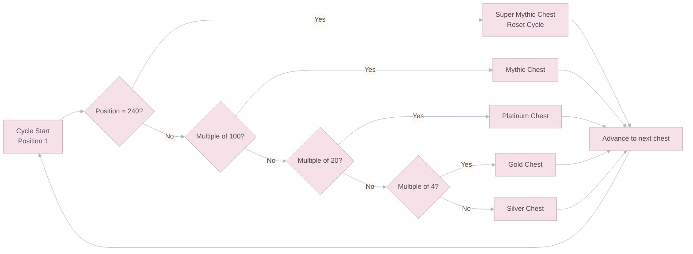

# Economy & Monetization

## Anti-P2W Philosophy

The contemporary mobile gaming market rejects overt "pay-to-win" mechanics, especially in competitive strategy environments. The monetization strategy for Goo Galaxy is built on the **SUV Framework**:

| Pillar      | Description                                                                     | Goo Galaxy Implementation                                        |
| :---------- | :------------------------------------------------------------------------------ | :--------------------------------------------------------------- |
| **Social**  | Items that enhance social interaction and self-expression.                      | Emotes, profile banners, clan badges, shareable replays.         |
| **Utility** | Items that save time or reduce friction without affecting competitive fairness. | Chest timer skips, extra deck slots, deck presets/loadout slots. |
| **Vanity**  | Pure cosmetics with zero gameplay impact.                                       | Goo skins, board themes, deployment animations, mascots/pets.    |

> **Golden Rule:** No purchasable item may ever increase a player's Conversion Power, Energy generation rate, or provide any stat advantage in ranked matches. Draft Mode (normalized levels) exists specifically to prove this commitment.

---

## Dual-Currency System

### Gold (Soft Currency)

| Source                            | Amount         |
| :-------------------------------- | :------------- |
| Victory Chest                     | 50-200 Gold    |
| Chest Cycle (free timed chests)   | 30-500 Gold    |
| Clan Donations (per card donated) | 5 Gold + 1 XP  |
| Daily Win Bonus (first 5 wins)    | 20 Gold each   |
| Weekly Challenges                 | 200-1,000 Gold |

**Primary Sinks:** Card upgrades (see cost table in `02_Mathematics_and_Balancing.md`), cosmetic shop (basic tier).

### Premium Gems (Hard Currency)

| Source                                   | Amount                  |
| :--------------------------------------- | :---------------------- |
| Real-Money Purchase                      | See pricing table below |
| Free in Milestone Chests (Arena unlocks) | 10-50 Gems              |
| Galaxy Pass Free Track (weekly)          | 5-10 Gems               |
| Tournament Top 3 Rewards                 | 50-200 Gems             |
| Achievement Milestones                   | 10-100 Gems             |

**Primary Sinks:** Galaxy Pass premium track, cosmetic shop (premium tier), chest timer acceleration, special event entries.

### Gem Pricing Table

| Pack             |  Gems  | USD Price | Gems/USD | Bonus      |
| :--------------- | :----: | :-------: | :------: | :--------- |
| **Handful**      |   80   | USD 0.99  |   80.8   | —          |
| **Pouch**        |  500   | USD 4.99  |  100.2   | +25% value |
| **Bucket**       | 1,200  | USD 9.99  |  120.1   | +49% value |
| **Barrel**       | 2,500  | USD 19.99 |  125.1   | +55% value |
| **Tank**         | 6,500  | USD 49.99 |  130.0   | +61% value |
| **Galaxy Vault** | 14,000 | USD 99.99 |  140.0   | +73% value |

> **Anchor Strategy:** The USD 0.99 pack is intentionally the worst value. It exists to set a psychological anchor. The USD 4.99 and USD 9.99 packs are the **target conversion points** — high perceived value drives first-time purchase.

---

## The Chest System

### Chest Types

| Chest               | Unlock Time | Cards |   Gold   |    Guaranteed Rare+    | Source                      |
| :------------------ | :---------: | :---: | :------: | :--------------------: | :-------------------------- |
| **Silver Chest**    |   3 hours   |   3   |  50-100  |           —            | Victory (most common)       |
| **Gold Chest**      |   8 hours   |   5   | 100-300  |         1 Rare         | Victory (1 in 4)            |
| **Platinum Chest**  |  12 hours   |   8   | 200-500  |         2 Rare         | Victory (1 in 20)           |
| **Mythic Chest**    |  24 hours   |  12   | 500-1000 |    1 Epic + 3 Rare     | Victory (1 in 100)          |
| **Legendary Chest** |      —      |   1   |    —     | 1 Legendary guaranteed | Arena unlock milestone only |
| **Free Chest**      |   4 hours   |   2   |  20-50   |           —            | Passive (no win required)   |

### The 240-Chest Cycle

Chests follow a **deterministic 240-chest cycle**. The player sees "random" chests, but the sequence is fixed:

Sample window of the first 20 positions:

| Position | 1   | 2   | 3   | 4   | 5   | 6   | 7   | 8   | 9   | 10  | 11  | 12  | 13  | 14  | 15  | 16  | 17  | 18  | 19  | 20  |
| :------- | :-- | :-- | :-- | :-- | :-- | :-- | :-- | :-- | :-- | :-- | :-- | :-- | :-- | :-- | :-- | :-- | :-- | :-- | :-- | :-- |
| Chest    | S   | S   | S   | G   | S   | S   | S   | G   | S   | S   | S   | G   | S   | S   | S   | G   | S   | S   | S   | P   |

| Position in Cycle | Chest Type                           |
| :---------------- | :----------------------------------- |
| Every 4th chest   | Gold Chest                           |
| Every 20th chest  | Platinum Chest                       |
| Every 100th chest | Mythic Chest                         |
| Position 240      | **Super Mythic Chest** (cycle reset) |

This guarantees that every player who plays consistently receives the same distribution of card rarities over time — eliminating "bad luck" frustration while maintaining the excitement of variable rewards.

### Chest Slots

Players have **4 chest unlock slots**. Only **1 chest** can be actively unlocking at a time. Additional victory chests are queued (up to 4). If all slots are full and the queue is full, subsequent victories award **Gold only** (no chest) — creating a natural incentive to return regularly.

---

## The Galaxy Pass (Battle Pass)

### Structure

Each Season (4 weeks) features a new Galaxy Pass with **35 tiers**, split into a Free Track and a Premium Track.

**Premium Pass Price:** 500 Gems (USD 4.99 equivalent — the target conversion price point).

### Tier Rewards

|     Tier     | Free Track         | Premium Track                                        |
| :----------: | :----------------- | :--------------------------------------------------- |
|      1       | 50 Gold            | 5 Gems + 50 Gold                                     |
|      5       | Silver Chest       | Gold Chest + Emote                                   |
|      10      | 100 Gold           | Exclusive Goo Skin (Season-themed)                   |
|      15      | 2 Rare Cards       | 500 Gold + 10 Gems                                   |
|      20      | Gold Chest         | Platinum Chest + Board Skin                          |
|      25      | 200 Gold           | 5 Epic Cards + 20 Gems                               |
|      30      | Platinum Chest     | Mythic Chest + Exclusive Deploy Animation            |
| 35 _(Final)_ | 500 Gold + 10 Gems | **Exclusive Mascot/Pet** + 50 Gems + Legendary Chest |

### Galaxy Pass XP

- **20 XP per win** (capped at 200 XP/day from wins).
- **Daily Challenges** (3 per day): 50-100 XP each.
- **Weekly Challenges** (3 per week): 200-500 XP each.
- **Target pace:** A player completing all dailies and winning ~10 matches/day reaches Tier 35 in 25 days (5 days buffer in a 30-day season).

---

## The 30-Day Player Progression Journey

```mermaid
%%{init: {"theme":"base","themeVariables":{"primaryColor":"#F7E1E8","secondaryColor":"#DCEBF7","tertiaryColor":"#E4F3E1","primaryBorderColor":"#BFA9B5","lineColor":"#A8B6C8","primaryTextColor":"#4E4A57","clusterBkg":"#FAF5EA","clusterBorder":"#CDBFAF","edgeLabelBackground":"#FFF9F2","noteBkgColor":"#F7F1FA","noteTextColor":"#4E4A57","taskBkgColor":"#DCEBF7","taskTextColor":"#4E4A57","taskTextOutsideColor":"#4E4A57","sectionBkgColor":"#E4F3E1","sectionBorderColor":"#BCD0B9","gridColor":"#E8DDD3","todayLineColor":"#C7A7B5","actorBkg":"#F7E1E8","actorBorder":"#BFA9B5","actorTextColor":"#4E4A57","signalColor":"#A8B6C8","signalTextColor":"#4E4A57","labelBoxBkgColor":"#FFF9F2","labelBoxBorderColor":"#CDBFAF","labelTextColor":"#4E4A57"}}}%%
gantt
    title Player Progression Journey (30 Days)
    dateFormat X
    axisFormat %d

    section Engagement
    Incubation (Arena 1-2)    :a1, 0, 3
    Mutation (Arena 3-4)      :a2, 3, 10
    Symbiosis (Arena 5-6)     :a3, 10, 20
    Apex (Arena 7+)           :a4, 20, 30

    section Monetization
    Free Chests & FTUE        :m1, 0, 3
    Starter Bundles Offered   :m2, 3, 7
    Galaxy Pass Push          :m3, 7, 14
    Premium Cosmetics & Targeted Offers :m4, 14, 30
```

| Timeline       | Phase      | Arena | Meta-Game Focus                                             | Monetization Events                                                                                                    |
| :------------- | :--------- | :---- | :---------------------------------------------------------- | :--------------------------------------------------------------------------------------------------------------------- |
| **Day 1-3**    | Incubation | 1-2   | Tutorial, core loop mastery. Learn Clone vs. Jump.          | High-velocity fast-unlock chests (dopamine loops). Galaxy Pass free track introduced.                                  |
| **Day 4-10**   | Mutation   | 3-4   | Deck-building experimentation. Unlock asymmetric troops.    | **Starter Bundle** (USD 2.99 — 500 Gems + Gold + Guaranteed Rare): highest conversion-rate offer. Cosmetic shop opens. |
| **Day 11-20**  | Symbiosis  | 5-6   | Social integration. Join Laboratories (Clans). Co-op goals. | Mid-tier progression wall. Premium Galaxy Pass push. Alliance-specific banners and Mascots.                            |
| **Day 21-30+** | Apex       | 7+    | High-stakes competitive ladder. Deck optimization.          | Mythic board skins, legendary deploy animations. Targeted fragment packs for specific upgrades.                        |

### Starter Bundle Details

| Bundle                   | Price    | Contents                                                    | Target                                                         |
| :----------------------- | :------- | :---------------------------------------------------------- | :------------------------------------------------------------- |
| **Welcome Pack**         | USD 0.99 | 100 Gems + 500 Gold + Silver Chest                          | Micro-conversion. "Break the seal" purchase.                   |
| **Researcher's Kit**     | USD 2.99 | 500 Gems + 2,000 Gold + Gold Chest + 1 Guaranteed Rare      | Primary conversion target. Best value in the game (once only). |
| **Lab Director's Vault** | USD 9.99 | 1,500 Gems + 10,000 Gold + Platinum Chest + Exclusive Frame | Whale bait. Premium anchor.                                    |

> **Once-Only Rule:** Each Starter Bundle can only be purchased **once per account**. This prevents them from undermining the long-term economy while maximizing their conversion impact.

---

## Revenue Projection Model

### Assumptions

| Parameter                         | Value     |
| :-------------------------------- | :-------- |
| DAU (Month 1, post soft-launch)   | 50,000    |
| DAU (Month 6, post global launch) | 500,000   |
| Payer Conversion Rate             | 3%        |
| Average Monthly Spend (Payers)    | USD 15.00 |
| ARPDAU (blended)                  | USD 0.10  |

### Projected Monthly Revenue

|         Month          | DAU  | Payers |   Revenue   |
| :--------------------: | :--: | :----: | :---------: |
|    1 (Soft Launch)     | 50K  | 1,500  | USD 22,500  |
| 3 (Regional Expansion) | 150K | 4,500  | USD 67,500  |
|   6 (Global Launch)    | 500K | 15,000 | USD 225,000 |
|      12 (Mature)       | 300K | 12,000 | USD 180,000 |

> **Note:** These are conservative estimates. Actual revenue depends heavily on UA spend, retention optimization, and live-ops event cadence. The numbers serve as minimum viability targets for sustaining the development team.

---

## Cosmetic Shop (Vanity Vectors)

### Cosmetic Categories

| Category              | Price Range (Gems) | Description                                                                               |
| :-------------------- | :----------------: | :---------------------------------------------------------------------------------------- |
| **Goo Skins**         |      100-500       | Alternate appearances for troops on the hex grid. No stat changes.                        |
| **Board Themes**      |     500-1,500      | Full 3D environment swap (alien landscape, cyberpunk arena, underwater lab).              |
| **Deploy Animations** |      200-800       | Custom unit deployment VFX (drop pod, teleporter, hatching egg).                          |
| **Color Palettes**    |      100-300       | Alternate neon faction colors (within WCAG contrast guidelines).                          |
| **Emotes**            |       50-200       | Animated reactions sent during matches.                                                   |
| **Profile Frames**    |      100-500       | Decorative frames around player avatar in matchmaking screen.                             |
| **Mascots/Pets**      |    1,000-2,500     | Interactive companions on the board periphery. React to game state. Zero gameplay impact. |

### Shop Rotation

- **Featured Items:** 4 items refreshed every 48 hours, prominently displayed.
- **Daily Deals:** 2 items at 30% discount, refreshed every 24 hours.
- **Season Collection:** Themed cosmetics available for the full 30-day season.
- **Vault Items:** Retired seasonal items return periodically at full price (FOMO + exclusivity cycle).
