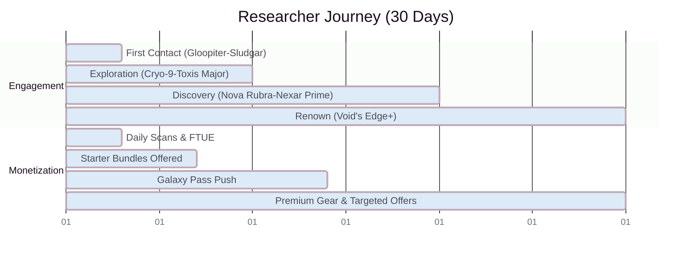

# Economy & Monetization

## Anti-P2W Philosophy

The contemporary mobile gaming market rejects overt "pay-to-win" mechanics, especially in competitive strategy environments. The monetization strategy for Goo Galaxy is built on the **SUV Framework**:

| Pillar      | Description                                                                     | Goo Galaxy Implementation                                                                            |
| :---------- | :------------------------------------------------------------------------------ | :--------------------------------------------------------------------------------------------------- |
| **Social**  | Items that enhance social interaction and self-expression.                      | Emotes, Researcher ID frames, Crew badges, shareable Expedition Logs.                                |
| **Utility** | Items that save time or reduce friction without affecting competitive fairness. | Capsule timer skips, extra Kit slots, Kit presets/loadout slots.                                     |
| **Vanity**  | Pure cosmetics with zero gameplay impact.                                       | Researcher gear (coats, helmets, species skins), specimen skins, starship themes, deploy animations. |

> **Golden Rule:** No purchase may grant a **competitive capability** a free Researcher cannot also earn. Concretely: nothing bought may raise a specimen's conversion radius, ability duration, cluster size, or Energy generation rate; no purchase may unlock a card ahead of its Star System; and no ranked mode may read a purchased value.
>
> **What money may buy is time.** DNA Strand packs, Capsule timer acceleration, and the Galaxy Pass premium track all **accelerate acquisition** of progression a free Researcher reaches on the same ceiling — the same maximum level, the same cards, the same caps. That is the line this design accepts, and it must be stated rather than implied: an earlier wording banned raising "a specimen's level", which this chapter's own DNA Strand packs (`Day 21-30` monetization), Capsule acceleration, and the Belgian direct-purchase variant in `10_Operations_Security_and_Legal.md` all violate.
>
> **Blind Discovery is the proof.** Normalizing every specimen to one level removes acquisition speed from the equation entirely, which is why it exists and why it must stay in the product.

---

## Two Progressions That Never Touch

Goo Galaxy runs two independent progression tracks. They share no resource, and neither can be spent on the other:

| Track           | What it advances                 | Fuelled by                                            | Where it lives                    |
| :-------------- | :------------------------------- | :---------------------------------------------------- | :-------------------------------- |
| **Enhance**     | a single specimen's **level**    | **DNA Strands + Stardust**                            | `02_Mathematics_and_Balancing.md` |
| **Galaxy Pass** | the seasonal pass's **35 tiers** | **Galaxy Pass XP** — victories, Contracts, Milestones | this chapter                      |

**Galaxy Pass XP is never a card stat.** It is account-level progress toward pass rewards and nothing else — it does not level a specimen, does not unlock one, and is not spendable. A specimen's level moves only through Enhance, and Enhance never consumes XP. Wherever this GDD writes a bare "XP", it means Galaxy Pass XP.

---

## Dual-Currency System

### Stardust (Soft Currency)

| Source                               | Amount                        |
| :----------------------------------- | :---------------------------- |
| Expedition Cache                     | 50-200 Stardust               |
| Capsule Cycle (free timed capsules)  | 20-1,000 Stardust             |
| Sample Sharing (per strand shared)   | 5 Stardust + 1 Galaxy Pass XP |
| Daily Discovery Bonus (first 5 wins) | 20 Stardust each              |
| Weekly Research Contracts            | 200-1,000 Stardust            |

**Primary Sinks:** Specimen Enhancements (see cost table in `02_Mathematics_and_Balancing.md`), Galactic Market (basic tier).

### Nova Cores (Hard Currency)

| Source                                        | Amount                  |
| :-------------------------------------------- | :---------------------- |
| Real-Money Purchase                           | See pricing table below |
| Free in Mythic Capsules (Star System unlocks) | 10-50 Nova Cores        |
| Galaxy Pass Free Track (weekly)               | 5-10 Nova Cores         |
| Symposium Top 3 Rewards                       | 50-200 Nova Cores       |
| Achievement Milestones                        | 10-100 Nova Cores       |

**Primary Sinks:** Galaxy Pass premium track, Galactic Market (premium tier), capsule timer acceleration, special event entries.

### Nova Core Pricing Table

| Pack             | Nova Cores | USD Price | Cores/USD | Bonus      |
| :--------------- | :--------: | :-------: | :-------: | :--------- |
| **Handful**      |     80     | USD 0.99  |   80.8    | —          |
| **Pouch**        |    500     | USD 4.99  |   100.2   | +24% value |
| **Bucket**       |   1,200    | USD 9.99  |   120.1   | +49% value |
| **Barrel**       |   2,500    | USD 19.99 |   125.1   | +55% value |
| **Tank**         |   6,500    | USD 49.99 |   130.0   | +61% value |
| **Galaxy Vault** |   14,000   | USD 99.99 |   140.0   | +73% value |

> **Anchor Strategy:** The USD 0.99 pack is intentionally the worst value. It exists to set a psychological anchor. The USD 4.99 and USD 9.99 packs are the **target conversion points** — high perceived value drives first-time purchase.

---

## The Capsule System

### Capsule Types

| Capsule              | Unlock Time | Specimens | Stardust |    Guaranteed Rare+    | Source                            |
| :------------------- | :---------: | :-------: | :------: | :--------------------: | :-------------------------------- |
| **Standard Capsule** |   3 hours   |     3     |  50-100  |           —            | Expedition (most common)          |
| **Enhanced Capsule** |   8 hours   |     5     | 100-300  |         1 Rare         | Expedition (1 in 4)               |
| **Premium Capsule**  |  12 hours   |     8     | 200-500  |         2 Rare         | Expedition (1 in 20)              |
| **Exotic Capsule**   |  24 hours   |    12     | 500-1000 |    1 Epic + 3 Rare     | Expedition (1 in 100)             |
| **Mythic Capsule**   |      —      |     1     |    —     | 1 Legendary guaranteed | Star System unlock milestone only |
| **Daily Scan**       |   4 hours   |     2     |  20-50   |           —            | Passive (no expedition required)  |

### The 240-Capsule Discovery Cycle

Capsules follow a **deterministic 240-capsule cycle**: the Researcher sees "random" contents, but the sequence of rarity slots is fixed, guaranteeing every consistent player the same distribution over a full cycle.

> **Open item — the cycle and the legal disclosure format are not yet reconciled.** A fixed sequence has no per-capsule probability: capsule _n_ contains what the cycle says it contains. But Apple and Google both require **exact drop probabilities** before purchase, and the disclosure JSON in `10_Operations_Security_and_Legal.md` is written in probabilities. Two reconciliations are viable — publish the **cycle composition** ("1 Legendary per 240") and derive the stated probability from it, or make purchased capsules genuinely probabilistic while earned capsules stay cyclic. **The cycle's composition table has never been written.** Until it is, neither the fairness claim nor the disclosure is verifiable.

> **Contents are DNA Strands, not whole specimens.** The Capsule Types table counts DNA Strands; a Researcher assembles a specimen from strands. The disclosure JSON in chapter 10 uses the same unit.

### Capsule Bay

Researchers have **4 capsule bay slots** on their starship. Only **1 capsule** can be actively decapsulating at a time. Additional expedition capsules are queued (up to 4). If all bays are full and the queue is full, subsequent expedition victories award **Stardust only** (no capsule) — creating a natural incentive to return regularly.

---

## The Galaxy Pass

### Structure

Each Expedition Cycle (4 weeks / 28 days) features a new Galaxy Pass with **35 tiers**, split into a Free Track and a Premium Track.

**Premium Pass Price:** 500 Nova Cores (USD 4.99 equivalent — the target conversion price point).

### Tier Rewards

|     Tier     | Free Track                   | Premium Track                                                  |
| :----------: | :--------------------------- | :------------------------------------------------------------- |
|      1       | 50 Stardust                  | 5 Nova Cores + 50 Stardust                                     |
|      5       | Standard Capsule             | Enhanced Capsule + Emote                                       |
|      10      | 100 Stardust                 | Exclusive Specimen Skin (Cycle-themed)                         |
|      15      | 2 Rare Specimens             | 500 Stardust + 10 Nova Cores                                   |
|      20      | Enhanced Capsule             | Premium Capsule + Starship Theme                               |
|      25      | 200 Stardust                 | 5 Epic Specimens + 20 Nova Cores                               |
|      30      | Premium Capsule              | Exotic Capsule + Exclusive Deploy Animation                    |
| 35 _(Final)_ | 500 Stardust + 10 Nova Cores | **Exclusive Researcher Gear** + 50 Nova Cores + Mythic Capsule |

### Galaxy Pass XP

- **20 XP per expedition victory** (capped at 200 XP/day from victories).
- **Daily Research Contracts** (3 per day): 75-150 XP each.
- **Weekly Expedition Milestones** (3 per week): 200-500 XP each.
- **Open item — XP per tier is never stated, and the target pace assumes an outlier player.** The GDD has never declared what a tier costs, so any "Tier 35 in N days" claim is not derivable from this chapter. Worse, the pace it was calibrated against — **~10 victories/day** — implies **~20 expeditions/day** at the 49-51% win rate this GDD targets. That is 2.5-4x the **5-8 matches/day** in `10_Operations_Security_and_Legal.md`'s engagement panel, and roughly 80 min/day of matches against the 32-72 min/day total that `00_Pitch_and_Overview.md`'s session KPIs allow.
- **Calibrate against the KPI player, not the outlier.** At 5-8 matches/day a Researcher earns roughly 60-80 XP from victories, 225-450 from dailies, and ~100-250 amortized from weeklies — about **400-750 XP/day**. Clearing 35 tiers inside a 28-day cycle with a few days of slack therefore puts a tier near **300-500 XP**. Pin the figure before the Galaxy Pass ships: the 500 Nova Core premium price is only defensible if the track is completable by the player the KPIs describe.

---

## The 30-Day Researcher Journey

```mermaid
%%{init: {"theme":"base","themeVariables":{"primaryColor":"#F7E1E8","secondaryColor":"#DCEBF7","tertiaryColor":"#E4F3E1","primaryBorderColor":"#BFA9B5","lineColor":"#A8B6C8","primaryTextColor":"#4E4A57","clusterBkg":"#FAF5EA","clusterBorder":"#CDBFAF","edgeLabelBackground":"#FFF9F2","noteBkgColor":"#F7F1FA","noteTextColor":"#4E4A57","taskBkgColor":"#DCEBF7","taskTextColor":"#4E4A57","taskTextOutsideColor":"#4E4A57","sectionBkgColor":"#E4F3E1","sectionBorderColor":"#BCD0B9","gridColor":"#E8DDD3","todayLineColor":"#C7A7B5","actorBkg":"#F7E1E8","actorBorder":"#BFA9B5","actorTextColor":"#4E4A57","signalColor":"#A8B6C8","signalTextColor":"#4E4A57","labelBoxBkgColor":"#FFF9F2","labelBoxBorderColor":"#CDBFAF","labelTextColor":"#4E4A57"}}}%%
gantt
    title Researcher Journey (30 Days)
    dateFormat X
    axisFormat %d

    section Engagement
    First Contact (Gloopiter-Sludgar)  :a1, 0, 3
    Exploration (Cryo-9-Toxis Major)   :a2, 3, 10
    Discovery (Nova Rubra-Nexar Prime) :a3, 10, 20
    Renown (Void's Edge+)             :a4, 20, 30

    section Monetization
    Daily Scans & FTUE                 :m1, 0, 3
    Starter Bundles Offered            :m2, 3, 7
    Galaxy Pass Push                   :m3, 7, 14
    Premium Gear & Targeted Offers     :m4, 14, 30
```

| Timeline       | Phase         | Star Systems           | Meta-Game Focus                                            | Monetization Events                                                                                                                |
| :------------- | :------------ | :--------------------- | :--------------------------------------------------------- | :--------------------------------------------------------------------------------------------------------------------------------- |
| **Day 1-3**    | First Contact | Gloopiter-Sludgar-4    | Tutorial, core loop mastery. Learn Clone vs. Jump.         | High-velocity fast-unlock capsules (dopamine loops). Galaxy Pass free track introduced.                                            |
| **Day 4-10**   | Exploration   | Cryo-9-Toxis Major     | Kit-building experimentation. Unlock asymmetric specimens. | **Starter Bundle** (USD 2.99 — 500 Nova Cores + Stardust + Guaranteed Rare): highest conversion-rate offer. Galactic Market opens. |
| **Day 11-20**  | Discovery     | Nova Rubra-Nexar Prime | Social integration. Join Crews. Co-op objectives.          | Mid-tier progression wall. Premium Galaxy Pass push. Crew-specific Researcher ID frames and gear.                                  |
| **Day 21-30+** | Renown        | Void's Edge+           | High-stakes competitive ladder. Kit optimization.          | Exotic starship themes, legendary deploy animations. Targeted DNA Strand packs for specific Enhancements.                          |

### Starter Bundle Details

| Bundle                     | Price    | Contents                                                                             | Target                                                         |
| :------------------------- | :------- | :----------------------------------------------------------------------------------- | :------------------------------------------------------------- |
| **Welcome Kit**            | USD 0.99 | 100 Nova Cores + 500 Stardust + Standard Capsule                                     | Micro-conversion. "Break the seal" purchase.                   |
| **Researcher's Field Kit** | USD 2.99 | 500 Nova Cores + 2,000 Stardust + Enhanced Capsule + 1 Guaranteed Rare Specimen      | Primary conversion target. Best value in the game (once only). |
| **Star Captain's Vault**   | USD 9.99 | 1,500 Nova Cores + 10,000 Stardust + Premium Capsule + Exclusive Researcher ID Frame | Whale bait. Premium anchor.                                    |

> **Once-Only Rule:** Each Starter Bundle can only be purchased **once per account**. This prevents them from undermining the long-term economy while maximizing their conversion impact.

---

## Revenue Projection Model

### The Three Scenarios

Revenue is modelled as three scenarios rather than one forecast, because a survival floor and a success target are different questions and conflating them produced contradictory numbers in an earlier draft. Every scenario below satisfies the same identity:

$$\text{ARPDAU} = \frac{\text{conversion rate} \times \text{monthly spend per payer}}{30}$$

| Scenario         | Conversion | Monthly spend / payer | ARPDAU    | What it represents                                                          |
| :--------------- | :--------: | :-------------------: | :-------- | :-------------------------------------------------------------------------- |
| **Conservative** |     3%     |        USD 15         | USD 0.015 | The survival floor. What must be true for the project to sustain itself.    |
| **Expected**     |     3%     |        USD 50         | USD 0.05  | Anchored to the mid-core benchmark band. The planning case.                 |
| **Optimistic**   |     4%     |        USD 75         | USD 0.10  | The KPI target in `00_Pitch_and_Overview.md`. Requires a strong whale tail. |

> **Why the spread is this wide:** in mid-core, monthly spend per payer typically lands between **USD 30 and 60** — the mean is dragged well above the median by a small number of high-spending Researchers. USD 15 is casual-game territory; the USD 75 the Optimistic scenario assumes already demands a whale tail above the genre average. The three scenarios bracket that uncertainty honestly instead of picking one and asserting it.

### Projected Monthly Revenue

|         Month          | DAU  | Conservative | Expected    | Optimistic  |
| :--------------------: | :--: | :----------- | :---------- | :---------- |
|    1 (Soft Launch)     | 50K  | USD 22,500   | USD 75,000  | USD 150,000 |
| 3 (Regional Expansion) | 150K | USD 67,500   | USD 225,000 | USD 450,000 |
|   6 (Global Launch)    | 500K | USD 225,000  | USD 750,000 | USD 1.50M   |
|      12 (Mature)       | 300K | USD 135,000  | USD 450,000 | USD 900,000 |

Payer counts follow directly from DAU: at 3% conversion, 50K DAU is 1,500 payers, 150K is 4,500, 500K is 15,000, and 300K is **9,000**. (An earlier draft listed 12,000 payers at 300K DAU, which is 4% — the Optimistic conversion rate applied to a Conservative revenue figure.)

> **Which number to hold yourself to:** the **Conservative** column is the one that gates the project. `09_MVP_And_Roadmap.md`'s Phase 4 → Phase 5 gate uses ARPDAU > USD 0.015 for exactly this reason. The **Optimistic** column is what the KPI dashboard in `10_Operations_Security_and_Legal.md` aims at, and missing it is a signal to tune monetization, not to stop.

> **Note:** Actual revenue depends heavily on UA spend, retention optimization, and live-ops event cadence. Re-derive all three scenarios from real soft-launch conversion and spend data before committing to global launch UA budget.

---

## Galactic Market (Vanity Vectors)

### Cosmetic Categories

| Category                 | Price Range (Nova Cores) | Description                                                                                       |
| :----------------------- | :----------------------: | :------------------------------------------------------------------------------------------------ |
| **Specimen Skins**       |         100-500          | Alternate appearances for Specimens on the planetary surface. No stat changes.                    |
| **Starship Themes**      |        500-1,500         | Full environment swap for the planetary surface backdrop (gas giant, ice field, volcanic waste).  |
| **Deploy Animations**    |         200-800          | Custom deployment VFX (drop pod, teleporter, hatching pod).                                       |
| **Color Palettes**       |         100-300          | Alternate neon faction colors (within WCAG contrast guidelines).                                  |
| **Emotes**               |          50-200          | Animated reactions sent during expeditions.                                                       |
| **Researcher ID Frames** |         100-500          | Decorative frames around the Researcher portrait on the pre-expedition screen.                    |
| **Mascots/Pets**         |       1,000-2,500        | Interactive companions on the surface periphery. React to expedition state. Zero gameplay impact. |

### Market Rotation

- **Featured Items:** 4 items refreshed every 48 hours, prominently displayed.
- **Daily Deals:** 2 items at 30% discount, refreshed every 24 hours.
- **Cycle Collection:** Themed cosmetics available for the full 4-week Expedition Cycle.
- **Vault Items:** Retired cycle items return periodically at full price (FOMO + exclusivity cycle).
