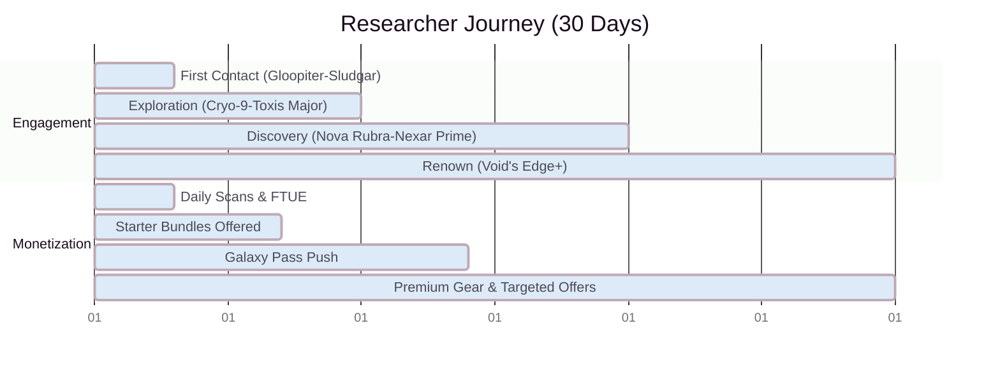

# Economy & Monetization

## Anti-P2W Philosophy

The contemporary mobile gaming market rejects overt "pay-to-win" mechanics, especially in competitive strategy environments. The monetization strategy for Goo Galaxy is built on the **SUV Framework**:

| Pillar      | Description                                                                     | Goo Galaxy Implementation                                                                            |
| :---------- | :------------------------------------------------------------------------------ | :--------------------------------------------------------------------------------------------------- |
| **Social**  | Items that enhance social interaction and self-expression.                      | Emotes, Researcher ID frames, Crew badges, shareable Expedition Logs.                                |
| **Utility** | Items that save time or reduce friction without affecting competitive fairness. | Capsule timer skips, extra Kit slots, Kit presets/loadout slots.                                     |
| **Vanity**  | Pure cosmetics with zero gameplay impact.                                       | Researcher gear (coats, helmets, species skins), specimen skins, starship themes, deploy animations. |

> **Golden Rule:** No purchasable item may ever increase a specimen's Assimilation Power, Energy generation rate, or provide any stat advantage in ranked expeditions. Blind Discovery (normalized levels) exists specifically to prove this commitment.

---

## Dual-Currency System

### Stardust (Soft Currency)

| Source                               | Amount             |
| :----------------------------------- | :----------------- |
| Expedition Cache                     | 50-200 Stardust    |
| Capsule Cycle (free timed capsules)  | 30-500 Stardust    |
| Sample Sharing (per specimen shared) | 5 Stardust + 1 XP  |
| Daily Discovery Bonus (first 5 wins) | 20 Stardust each   |
| Weekly Research Contracts            | 200-1,000 Stardust |

**Primary Sinks:** Specimen Enhancements (see cost table in `02_Mathematics_and_Balancing.md`), Galactic Market (basic tier).

### Nova Cores (Hard Currency)

| Source                                           | Amount                  |
| :----------------------------------------------- | :---------------------- |
| Real-Money Purchase                              | See pricing table below |
| Free in Milestone Capsules (Star System unlocks) | 10-50 Nova Cores        |
| Galaxy Pass Free Track (weekly)                  | 5-10 Nova Cores         |
| Symposium Top 3 Rewards                          | 50-200 Nova Cores       |
| Achievement Milestones                           | 10-100 Nova Cores       |

**Primary Sinks:** Galaxy Pass premium track, Galactic Market (premium tier), capsule timer acceleration, special event entries.

### Nova Core Pricing Table

| Pack             | Nova Cores | USD Price | Cores/USD | Bonus      |
| :--------------- | :--------: | :-------: | :-------: | :--------- |
| **Handful**      |     80     | USD 0.99  |   80.8    | —          |
| **Pouch**        |    500     | USD 4.99  |   100.2   | +25% value |
| **Bucket**       |   1,200    | USD 9.99  |   120.1   | +49% value |
| **Barrel**       |   2,500    | USD 19.99 |   125.1   | +55% value |
| **Tank**         |   6,500    | USD 49.99 |   130.0   | +61% value |
| **Galaxy Vault** |   14,000   | USD 99.99 |   140.0   | +73% value |

> **Anchor Strategy:** The USD 0.99 pack is intentionally the worst value. It exists to set a psychological anchor. The USD 4.99 and USD 9.99 packs are the **target conversion points** — high perceived value drives first-time purchase.

---

## The Capsule System

### Capsule Types

| Capsule              | Unlock Time | Specimens | Stardust |    Guaranteed Rare+    | Source                            |
| :------------------- | :---------: | :-------: | :------: | :--------------------: | :-------------------------------- |
| **Standard Capsule** |   3 hours   |     3     |  50-100  |           —            | Expedition (most common)          |
| **Enhanced Capsule** |   8 hours   |     5     | 100-300  |         1 Rare         | Expedition (1 in 4)               |
| **Premium Capsule**  |  12 hours   |     8     | 200-500  |         2 Rare         | Expedition (1 in 20)              |
| **Exotic Capsule**   |  24 hours   |    12     | 500-1000 |    1 Epic + 3 Rare     | Expedition (1 in 100)             |
| **Mythic Capsule**   |      —      |     1     |    —     | 1 Legendary guaranteed | Star System unlock milestone only |
| **Daily Scan**       |   4 hours   |     2     |  20-50   |           —            | Passive (no expedition required)  |

### The 240-Capsule Discovery Cycle

Capsules follow a **deterministic 240-capsule cycle**. The Researcher sees "random" capsules, but the sequence is fixed — guaranteeing fair rarity distribution for every consistent player.

### Capsule Bay

Researchers have **4 capsule bay slots** on their starship. Only **1 capsule** can be actively decapsulating at a time. Additional expedition capsules are queued (up to 4). If all bays are full and the queue is full, subsequent expedition victories award **Stardust only** (no capsule) — creating a natural incentive to return regularly.

---

## The Galaxy Pass

### Structure

Each Expedition Cycle (4 weeks) features a new Galaxy Pass with **35 tiers**, split into a Free Track and a Premium Track.

**Premium Pass Price:** 500 Nova Cores (USD 4.99 equivalent — the target conversion price point).

### Tier Rewards

|     Tier     | Free Track                   | Premium Track                                                  |
| :----------: | :--------------------------- | :------------------------------------------------------------- |
|      1       | 50 Stardust                  | 5 Nova Cores + 50 Stardust                                     |
|      5       | Standard Capsule             | Enhanced Capsule + Emote                                       |
|      10      | 100 Stardust                 | Exclusive Specimen Skin (Cycle-themed)                         |
|      15      | 2 Rare Specimens             | 500 Stardust + 10 Nova Cores                                   |
|      20      | Enhanced Capsule             | Premium Capsule + Starship Theme                               |
|      25      | 200 Stardust                 | 5 Epic Specimens + 20 Nova Cores                               |
|      30      | Premium Capsule              | Exotic Capsule + Exclusive Deploy Animation                    |
| 35 _(Final)_ | 500 Stardust + 10 Nova Cores | **Exclusive Researcher Gear** + 50 Nova Cores + Mythic Capsule |

### Galaxy Pass XP

- **20 XP per expedition victory** (capped at 200 XP/day from victories).
- **Daily Research Contracts** (3 per day): 50-100 XP each.
- **Weekly Expedition Milestones** (3 per week): 200-500 XP each.
- **Target pace:** A Researcher completing all dailies and winning ~10 expeditions/day reaches Tier 35 in 25 days (5 days buffer in a 30-day cycle).

---

## The 30-Day Researcher Journey

```mermaid
%%{init: {"theme":"base","themeVariables":{"primaryColor":"#F7E1E8","secondaryColor":"#DCEBF7","tertiaryColor":"#E4F3E1","primaryBorderColor":"#BFA9B5","lineColor":"#A8B6C8","primaryTextColor":"#4E4A57","clusterBkg":"#FAF5EA","clusterBorder":"#CDBFAF","edgeLabelBackground":"#FFF9F2","noteBkgColor":"#F7F1FA","noteTextColor":"#4E4A57","taskBkgColor":"#DCEBF7","taskTextColor":"#4E4A57","taskTextOutsideColor":"#4E4A57","sectionBkgColor":"#E4F3E1","sectionBorderColor":"#BCD0B9","gridColor":"#E8DDD3","todayLineColor":"#C7A7B5","actorBkg":"#F7E1E8","actorBorder":"#BFA9B5","actorTextColor":"#4E4A57","signalColor":"#A8B6C8","signalTextColor":"#4E4A57","labelBoxBkgColor":"#FFF9F2","labelBoxBorderColor":"#CDBFAF","labelTextColor":"#4E4A57"}}}%%
gantt
    title Researcher Journey (30 Days)
    dateFormat X
    axisFormat %d

    section Engagement
    First Contact (Gloopiter-Sludgar)  :a1, 0, 3
    Exploration (Cryo-9-Toxis Major)   :a2, 3, 10
    Discovery (Nova Rubra-Nexar Prime) :a3, 10, 20
    Renown (Void's Edge+)             :a4, 20, 30

    section Monetization
    Daily Scans & FTUE                 :m1, 0, 3
    Starter Bundles Offered            :m2, 3, 7
    Galaxy Pass Push                   :m3, 7, 14
    Premium Gear & Targeted Offers     :m4, 14, 30
```

| Timeline       | Phase         | Star Systems           | Meta-Game Focus                                            | Monetization Events                                                                                                                |
| :------------- | :------------ | :--------------------- | :--------------------------------------------------------- | :--------------------------------------------------------------------------------------------------------------------------------- |
| **Day 1-3**    | First Contact | Gloopiter-Sludgar-4    | Tutorial, core loop mastery. Learn Clone vs. Jump.         | High-velocity fast-unlock capsules (dopamine loops). Galaxy Pass free track introduced.                                            |
| **Day 4-10**   | Exploration   | Cryo-9-Toxis Major     | Kit-building experimentation. Unlock asymmetric specimens. | **Starter Bundle** (USD 2.99 — 500 Nova Cores + Stardust + Guaranteed Rare): highest conversion-rate offer. Galactic Market opens. |
| **Day 11-20**  | Discovery     | Nova Rubra-Nexar Prime | Social integration. Join Crews. Co-op objectives.          | Mid-tier progression wall. Premium Galaxy Pass push. Crew-specific Researcher ID frames and gear.                                  |
| **Day 21-30+** | Renown        | Void's Edge+           | High-stakes competitive ladder. Kit optimization.          | Exotic starship themes, legendary deploy animations. Targeted DNA Strand packs for specific Enhancements.                          |

### Starter Bundle Details

| Bundle                     | Price    | Contents                                                                             | Target                                                         |
| :------------------------- | :------- | :----------------------------------------------------------------------------------- | :------------------------------------------------------------- |
| **Welcome Kit**            | USD 0.99 | 100 Nova Cores + 500 Stardust + Standard Capsule                                     | Micro-conversion. "Break the seal" purchase.                   |
| **Researcher's Field Kit** | USD 2.99 | 500 Nova Cores + 2,000 Stardust + Enhanced Capsule + 1 Guaranteed Rare Specimen      | Primary conversion target. Best value in the game (once only). |
| **Star Captain's Vault**   | USD 9.99 | 1,500 Nova Cores + 10,000 Stardust + Premium Capsule + Exclusive Researcher ID Frame | Whale bait. Premium anchor.                                    |

> **Once-Only Rule:** Each Starter Bundle can only be purchased **once per account**. This prevents them from undermining the long-term economy while maximizing their conversion impact.

---

## Revenue Projection Model

### Assumptions

| Parameter                         | Value     |
| :-------------------------------- | :-------- |
| DAU (Month 1, post soft-launch)   | 50,000    |
| DAU (Month 6, post global launch) | 500,000   |
| Payer Conversion Rate             | 3%        |
| Average Monthly Spend (Payers)    | USD 15.00 |
| ARPDAU (blended)                  | USD 0.10  |

### Projected Monthly Revenue

|         Month          | DAU  | Payers |   Revenue   |
| :--------------------: | :--: | :----: | :---------: |
|    1 (Soft Launch)     | 50K  | 1,500  | USD 22,500  |
| 3 (Regional Expansion) | 150K | 4,500  | USD 67,500  |
|   6 (Global Launch)    | 500K | 15,000 | USD 225,000 |
|      12 (Mature)       | 300K | 12,000 | USD 180,000 |

> **Note:** These are conservative estimates. Actual revenue depends heavily on UA spend, retention optimization, and live-ops event cadence. The numbers serve as minimum viability targets for sustaining the development team.

---

## Cosmetic Shop (Vanity Vectors)

### Cosmetic Categories

| Category              | Price Range (Gems) | Description                                                                               |
| :-------------------- | :----------------: | :---------------------------------------------------------------------------------------- |
| **Goo Skins**         |      100-500       | Alternate appearances for troops on the hex grid. No stat changes.                        |
| **Board Themes**      |     500-1,500      | Full 3D environment swap (alien landscape, cyberpunk arena, underwater lab).              |
| **Deploy Animations** |      200-800       | Custom unit deployment VFX (drop pod, teleporter, hatching egg).                          |
| **Color Palettes**    |      100-300       | Alternate neon faction colors (within WCAG contrast guidelines).                          |
| **Emotes**            |       50-200       | Animated reactions sent during matches.                                                   |
| **Profile Frames**    |      100-500       | Decorative frames around player avatar in matchmaking screen.                             |
| **Mascots/Pets**      |    1,000-2,500     | Interactive companions on the board periphery. React to game state. Zero gameplay impact. |

### Shop Rotation

- **Featured Items:** 4 items refreshed every 48 hours, prominently displayed.
- **Daily Deals:** 2 items at 30% discount, refreshed every 24 hours.
- **Season Collection:** Themed cosmetics available for the full 30-day season.
- **Vault Items:** Retired seasonal items return periodically at full price (FOMO + exclusivity cycle).
