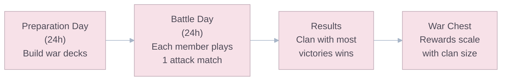
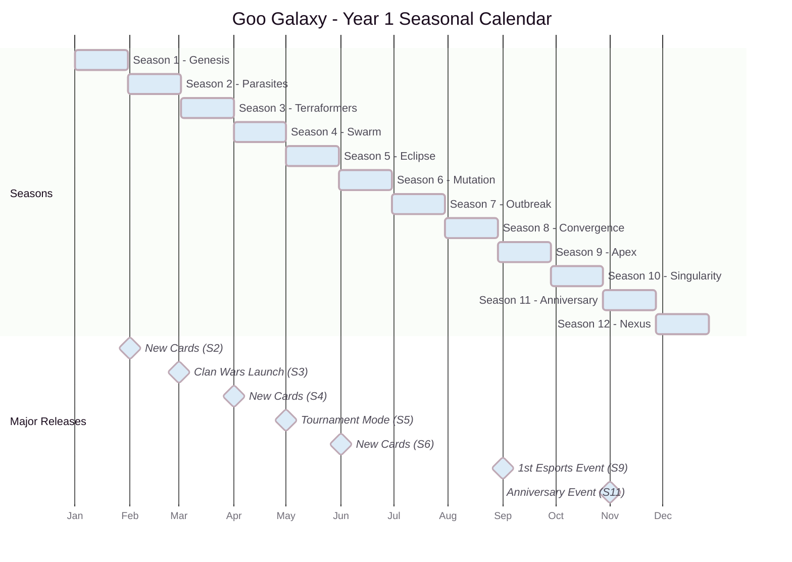

# Meta-Game, Retention & LiveOps

## Retention Architecture

### The Retention Challenge

The inherently repetitive nature of a 61-hex board game leads to player fatigue over a 30-90 day lifecycle. The retention architecture must address three horizons:

| Horizon        | Timeframe | Driver                        | Systems                                                |
| :------------- | :-------- | :---------------------------- | :----------------------------------------------------- |
| **Short-Term** | D1-D3     | Core loop satisfaction + FTUE | Tutorial, fast chests, first wins.                     |
| **Mid-Term**   | D7-D14    | Progression + Social hooks    | Arena unlocks, Clan integration, Galaxy Pass.          |
| **Long-Term**  | D30+      | Meta disruption + Community   | LiveOps events, Draft Mode, seasonal content, esports. |

### Engagement Loop

```mermaid
%%{init: {"theme":"base","themeVariables":{"primaryColor":"#F7E1E8","secondaryColor":"#DCEBF7","tertiaryColor":"#E4F3E1","primaryBorderColor":"#BFA9B5","lineColor":"#A8B6C8","primaryTextColor":"#4E4A57","clusterBkg":"#FAF5EA","clusterBorder":"#CDBFAF","edgeLabelBackground":"#FFF9F2","noteBkgColor":"#F7F1FA","noteTextColor":"#4E4A57","taskBkgColor":"#DCEBF7","taskTextColor":"#4E4A57","taskTextOutsideColor":"#4E4A57","sectionBkgColor":"#E4F3E1","sectionBorderColor":"#BCD0B9","gridColor":"#E8DDD3","todayLineColor":"#C7A7B5","actorBkg":"#F7E1E8","actorBorder":"#BFA9B5","actorTextColor":"#4E4A57","signalColor":"#A8B6C8","signalTextColor":"#4E4A57","labelBoxBkgColor":"#FFF9F2","labelBoxBorderColor":"#CDBFAF","labelTextColor":"#4E4A57"}}}%%
flowchart LR
    subgraph "Daily Loop (5-15 min)"
        D1["Log In"] --> D2["Collect Free Chest"]
        D2 --> D3["Complete 3 Daily Challenges"]
        D3 --> D4["Play 5-10 Matches"]
        D4 --> D5["Donate Cards to Clan"]
        D5 --> D6["Check Galaxy Pass Progress"]
    end

    subgraph "Weekly Loop (adds 30 min)"
        W1["Complete 3 Weekly Challenges"] --> W2["Participate in Weekend Event"] --> W3["Clan Co-Op Goal Check"]
    end

    subgraph "Seasonal Loop (4-week cycle)"
        S1["New Galaxy Pass Season"] --> S2["Season Reset & Trophy Compression"] --> S3["New Card Release"] --> S4["Seasonal Tournament"]
    end

    D6 -->|"Feeds weekly goals"| W1
    W3 -->|"Escalates into season beats"| S1
    S4 -->|"Resets motivation loop"| D1
```

---

## First-Time User Experience (FTUE)

The FTUE is designed around the principle of **"learn by doing, not by reading"**:

### FTUE Flow (First 15 Minutes)

```mermaid
%%{init: {"theme":"base","themeVariables":{"primaryColor":"#F7E1E8","secondaryColor":"#DCEBF7","tertiaryColor":"#E4F3E1","primaryBorderColor":"#BFA9B5","lineColor":"#A8B6C8","primaryTextColor":"#4E4A57","clusterBkg":"#FAF5EA","clusterBorder":"#CDBFAF","edgeLabelBackground":"#FFF9F2","noteBkgColor":"#F7F1FA","noteTextColor":"#4E4A57","taskBkgColor":"#DCEBF7","taskTextColor":"#4E4A57","taskTextOutsideColor":"#4E4A57","sectionBkgColor":"#E4F3E1","sectionBorderColor":"#BCD0B9","gridColor":"#E8DDD3","todayLineColor":"#C7A7B5","actorBkg":"#F7E1E8","actorBorder":"#BFA9B5","actorTextColor":"#4E4A57","signalColor":"#A8B6C8","signalTextColor":"#4E4A57","labelBoxBkgColor":"#FFF9F2","labelBoxBorderColor":"#CDBFAF","labelTextColor":"#4E4A57"}}}%%
flowchart LR
    A["Splash Screen<br/>(2 sec)"] --> B["Name + Avatar<br/>(skip-able)"]
    B --> C["Tutorial Match 1<br/>Deploy Subject Alpha<br/>(Clone only)"]
    C --> D["Tutorial Match 2<br/>Learn Jump mechanic<br/>+ first conversion"]
    D --> E["Tutorial Match 3<br/>Full match vs Easy AI<br/>(3 minutes)"]
    E --> F["First Victory Chest<br/>(instant unlock)"]
    F --> G["Deck Builder Intro<br/>(add Acid Crawler)"]
    G --> H["First PvP Match<br/>(Arena 1)"]
```

| Step         | Duration | Purpose                                     | Metric                       |
| :----------- | :------: | :------------------------------------------ | :--------------------------- |
| Tutorial 1   |  60 sec  | Teach Clone. One mechanic only.             | Completion rate target: >95% |
| Tutorial 2   |  90 sec  | Teach Jump + Conversion. Show cause/effect. | Completion rate target: >90% |
| Tutorial 3   | 180 sec  | Full match vs AI. Validate understanding.   | Completion rate target: >85% |
| First Chest  |  10 sec  | Instant dopamine reward. Zero timer.        | —                            |
| Deck Builder |  30 sec  | Show agency. Let player make first choice.  | —                            |
| First PvP    |    —     | The real game begins.                       | D1 retention hinge point.    |

> **Critical Rule:** No UI element, system, or feature is shown until the player needs it. The shop, clan system, Galaxy Pass, and cosmetics are progressively revealed as the player reaches each Arena threshold.

---

## Daily & Weekly Challenge System

### Daily Challenges (3 per day, refreshed at 00:00 UTC)

| Challenge Type    | Example                                   | XP Reward | Gold Reward |
| :---------------- | :---------------------------------------- | :-------: | :---------: |
| **Win-Based**     | "Win 3 matches"                           |  100 XP   |   50 Gold   |
| **Action-Based**  | "Convert 50 enemy hexes"                  |   75 XP   |   30 Gold   |
| **Card-Specific** | "Deploy Bio-Phalanx 5 times"              |   75 XP   |   40 Gold   |
| **Strategic**     | "Win a match using only Clone (no Jumps)" |  150 XP   |   80 Gold   |

- Players can **re-roll 1 challenge per day** for free (encourages engagement even when a challenge feels unappealing).
- Completing all 3 dailies awards a **Daily Bonus Chest** (equivalent to Silver Chest, instant unlock).

### Weekly Challenges (3 per week, refreshed Monday 00:00 UTC)

| Challenge Type | Example                          | XP Reward | Gold Reward |
| :------------- | :------------------------------- | :-------: | :---------: |
| **Endurance**  | "Win 20 matches this week"       |  500 XP   |  500 Gold   |
| **Mastery**    | "Achieve 3 Domination victories" |  400 XP   |  400 Gold   |
| **Social**     | "Donate 30 cards to your Lab"    |  300 XP   |  300 Gold   |

- Completing all 3 weeklies awards a **Weekly Mega Chest** (equivalent to Platinum Chest).

---

## Laboratories (Clans / Social System)

### Clan Structure

| Feature           | Details                                           |
| :---------------- | :------------------------------------------------ |
| **Clan Size**     | 50 members max                                    |
| **Minimum Arena** | Arena 3 (unlocked at 600 Trophies)                |
| **Roles**         | Leader → Co-Leader → Elder → Member               |
| **Clan Badge**    | Custom icon + color. Displayed on player profile. |

### Social Features

#### Card Donations

- Members can **request** specific card fragments (1 request every 8 hours).
- Other members can **donate** fragments they own (earn 5 Gold + 1 XP per donation).
- **Donation Limits:** 4 Common, 1 Rare per request. Epics and Legendaries are not donatable (to preserve their value).

#### Clan Chat

- Text chat with **age-aware restrictions**. Players under **16** use **pre-approved phrase chat only**. Players 16+ may use full text chat with filtering and moderation safeguards (see `10_Operations_Security_and_Legal.md`).
- Replay sharing — members can share match replays directly in clan chat.
- **Challenge Friends** — tap a clanmate's name to challenge them to a friendly match (no Trophies at stake).

#### Clan Administration & Moderation

| Role          | Permissions |
| :------------ | :---------- |
| **Leader**    | Invite or remove any non-leader member, edit clan settings, promote or demote roles, accept join requests, and disband the clan. |
| **Co-Leader** | Invite members, remove Elders or Members, accept join requests, start clan activities, and moderate chat. |
| **Elder**     | Invite members and help moderate replay sharing or phrase-chat misuse reports. |
| **Member**    | Participate in chat, donations, co-op goals, and friendly challenges. |

- If a Leader is inactive for **30 days**, leadership passes to the longest-tenured active Co-Leader.
- Clan audit logs must record kicks, promotions, join approvals, and clan setting changes.
- Under-16 chat uses phrase-only communication everywhere in the clan experience, including challenge invites and clan war coordination.

#### Co-Op Weekly Goals

Each week, the clan receives a **collective goal**:

| Goal Type           | Example                              | Reward (per member) |
| :------------------ | :----------------------------------- | :------------------ |
| **Conversion Goal** | "Collectively convert 100,000 hexes" | 200 Gold + 10 Gems  |
| **Victory Goal**    | "Collectively win 500 matches"       | 300 Gold + 15 Gems  |
| **Donation Goal**   | "Collectively donate 200 cards"      | 150 Gold + 5 Gems   |

- Progress bar is visible to all members. Social pressure drives participation.
- Clans that fail to reach the goal receive nothing — creating natural attrition of inactive members.

### Clan Wars (Post-Launch — Season 3+)

A weekly competitive format where clans face off:

---

## Time-Limited Events

Events are constrained to **weekends (Friday 18:00 UTC → Sunday 23:59 UTC)** to generate cyclical urgency and FOMO. They do NOT affect the competitive ladder.

### 1. Stage Swap (Dynamic Environment)

| Property      | Details                                                                                                                    |
| :------------ | :------------------------------------------------------------------------------------------------------------------------- |
| **Frequency** | Every 2 weeks                                                                                                              |
| **Mechanic**  | Specific hexes are designated as **unstable**. Every 30 seconds, sections collapse into voids or barriers erupt.           |
| **Effect**    | Forces players to abandon static strategies. Defensive anchors become liabilities. Mobility and adaptability are rewarded. |
| **Reward**    | Exclusive "Stage Swap" chest (unique cosmetic fragments).                                                                  |

**Example Maps:**

| Map Name           | Unstable Pattern                     | Strategic Impact                                      |
| :----------------- | :----------------------------------- | :---------------------------------------------------- |
| **Shifting Sands** | 4 random hexes collapse every 30 sec | Board shrinks over time. Favors aggressive play.      |
| **Eruption**       | 2 barrier walls emerge every 45 sec  | Board splits into segments. Favors defensive play.    |
| **Tidal Flow**     | 6-hex band sweeps across the board   | Moving danger zone. Favors mobility (Plasmic Leaper). |

### 2. Twisted Rules (Global Physics Alteration)

| Event Name         | Rule Change                                                     | Strategic Impact                                                                               |
| :----------------- | :-------------------------------------------------------------- | :--------------------------------------------------------------------------------------------- |
| **Scorched Earth** | Every troop leaves a permanent impassable hazard trail on Jump. | Board rapidly constricts. Cloning > Jumping. Spells become essential.                          |
| **Overload**       | Energy generation is **3x** from match start.                   | Hyper-aggressive, chaotic matches. APM is king. Heavy cards become viable.                     |
| **Mirror Match**   | Both players use the **same randomly generated deck**.          | Pure skill test. No deck advantage. Tests adaptability.                                        |
| **Giant Mode**     | All conversion radii are doubled (1→2 hexes).                   | Massive territory swings. Single moves can flip 15+ pieces. Volatile Mass becomes devastating. |

### 3. Draft Mode (Pure Skill)

| Property                | Details                                                                         |
| :---------------------- | :------------------------------------------------------------------------------ |
| **Frequency**           | Available every weekend (persistent event).                                     |
| **Format**              | Players do NOT use personal decks. Both players receive the same server-seeded sequence of draft offers. |
| **Level Normalization** | All cards normalized to **Tournament Standard (Level 9)**.                      |
| **Draft Process**       | 8 rounds of paired offers. In each round, both players choose 1 card from the same presented pair for their own deck. Picks are **not exclusive** to the opponent. No duplicate card IDs are allowed within a player's final draft deck. |
| **Reward**              | Draft-exclusive cosmetics + Gems. No chest drops (to avoid economy disruption). |

> **Purpose:** Combats P2W perception. Proves competitive integrity. Appeals to the "pure skill" audience — potential esports format.

### Draft Eligibility Rules

- The draft-eligible catalog is defined server-side and can differ from ranked.
- Offer pairs are generated from the current approved draft catalog using a deterministic match seed.
- If the live card catalog is temporarily too small to support a healthy draft offer space, Draft Mode should be disabled rather than padded with unapproved content.

---

## Seasonal Calendar (Year 1)

### Season Content Cadence

| Season | New Gameplay Content                      | New Event Type      | Galaxy Pass Theme | Major Feature         |
| :----: | :---------------------------------------- | :------------------ | :---------------- | :-------------------- |
|   1    | — (launch roster)                         | Stage Swap + Draft  | "Genesis"         | Global Launch         |
|   2    | Quarantine Drone + Ring Labyrinth         | Scorched Earth      | "Parasites"       | —                     |
|   3    | Purge Pulse                               | Overload            | "Terraformers"    | **Clan Wars**         |
|   4    | Detox Mycelium + Split Reactor            | Mirror Match        | "Swarm"           | —                     |
|   5    | —                                         | Giant Mode          | "Eclipse"         | **Tournament Mode**   |
|   6    | Phase Relay + Catalyst Wells (event-only) | New Stage Swap maps | "Mutation"        | —                     |
|   9    | 1 late-cycle high-skill card only         | —                   | "Apex"            | **1st Esports Event** |
|   11   | —                                         | Anniversary Special | "Anniversary"     | Anniversary Rewards   |

> **Cadence Rule:** Never release more than **2 gameplay-shifting elements** in the same season. For Goo Galaxy's team size and meta complexity, a smaller but more stable cadence is healthier than a constant flood of new cards.

---

## Push Notification Strategy

| Trigger                    | Timing                           | Message Example                                     | Frequency Cap |
| :------------------------- | :------------------------------- | :-------------------------------------------------- | :------------ |
| **Chest Ready**            | When unlock timer completes      | "Your Gold Chest is ready! Open it now."            | Max 4/day     |
| **Daily Challenges Reset** | 00:00 UTC + 2 hours              | "New challenges await, Researcher!"                 | 1/day         |
| **Clan Activity**          | When donation request is pending | "Your labmates need Acid Crawler fragments!"        | Max 2/day     |
| **Win Streak Lost**        | After 3+ consecutive losses      | — (NEVER notify on losses)                          | —             |
| **Event Start**            | Friday 18:00 UTC                 | "Stage Swap weekend is live! Test your skills."     | 1/event       |
| **Galaxy Pass Expiring**   | 3 days before season end         | "3 days left in Season X. Finish your Galaxy Pass!" | 1/season      |
| **Re-engagement (Lapsed)** | After 3 days inactive            | "Your Goo misses you! Come back for a free chest."  | 1/week max    |

> **Critical:** Never notify on negative events (losses, rank drops). Never exceed 4 notifications per day. Always offer a granular opt-out in Settings (per category, not all-or-nothing).
