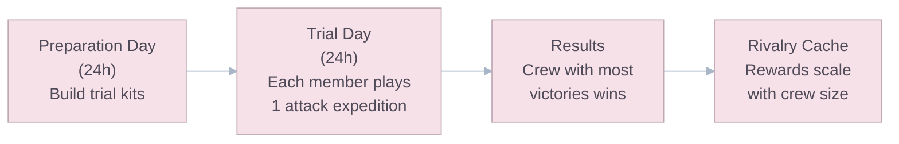
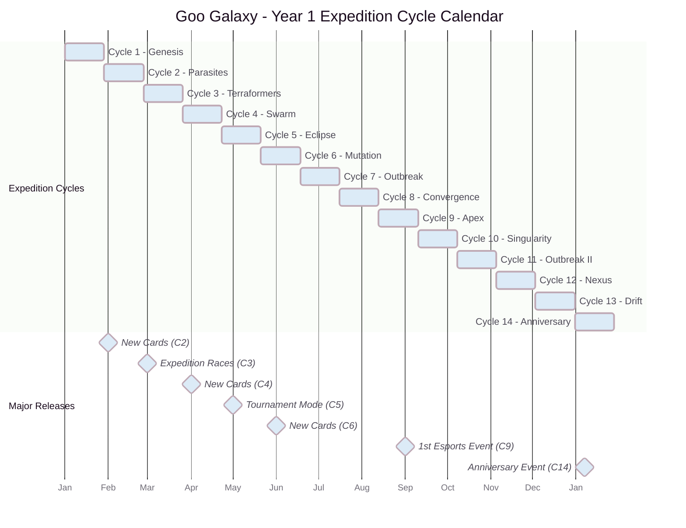

# Meta-Game, Retention & LiveOps

## Retention Architecture

### The Retention Challenge

The inherently repetitive nature of a 61-hex board game leads to player fatigue over a 30-90 day lifecycle. The retention architecture must address three horizons:

| Horizon        | Timeframe | Driver                        | Systems                                                           |
| :------------- | :-------- | :---------------------------- | :---------------------------------------------------------------- |
| **Short-Term** | D1-D3     | Core loop satisfaction + FTUE | Tutorial, fast capsules, first discoveries.                       |
| **Mid-Term**   | D7-D14    | Progression + Social hooks    | Star System unlocks, Crew integration, Galaxy Pass.               |
| **Long-Term**  | D30+      | Meta disruption + Community   | Galactic Phenomena, Blind Discovery, Expedition Cycles, Symposia. |

### Engagement Loop

```mermaid
%%{init: {"theme":"base","themeVariables":{"primaryColor":"#F7E1E8","secondaryColor":"#DCEBF7","tertiaryColor":"#E4F3E1","primaryBorderColor":"#BFA9B5","lineColor":"#A8B6C8","primaryTextColor":"#4E4A57","clusterBkg":"#FAF5EA","clusterBorder":"#CDBFAF","edgeLabelBackground":"#FFF9F2","noteBkgColor":"#F7F1FA","noteTextColor":"#4E4A57","taskBkgColor":"#DCEBF7","taskTextColor":"#4E4A57","taskTextOutsideColor":"#4E4A57","sectionBkgColor":"#E4F3E1","sectionBorderColor":"#BCD0B9","gridColor":"#E8DDD3","todayLineColor":"#C7A7B5","actorBkg":"#F7E1E8","actorBorder":"#BFA9B5","actorTextColor":"#4E4A57","signalColor":"#A8B6C8","signalTextColor":"#4E4A57","labelBoxBkgColor":"#FFF9F2","labelBoxBorderColor":"#CDBFAF","labelTextColor":"#4E4A57"}}}%%
flowchart LR
    subgraph "Daily Loop (25-45 min)"
        D1["Log In"] --> D2["Collect Daily Scan"]
        D2 --> D3["Complete 3 Daily Contracts"]
        D3 --> D4["Play 5-8 Expeditions"]
        D4 --> D5["Share Samples with Crew"]
        D5 --> D6["Check Galaxy Pass Progress"]
    end

    subgraph "Weekly Loop (adds 30 min)"
        W1["Complete 3 Weekly Contracts"] --> W2["Participate in Galactic Phenomenon"] --> W3["Crew Objective Check"]
    end

    subgraph "Expedition Cycle Loop (4-week cycle)"
        S1["New Galaxy Pass Cycle"] --> S2["Cycle Reset & DP Archival"] --> S3["New Specimen Discovery"] --> S4["Cycle Symposium"]
    end

    D6 -->|"Feeds weekly goals"| W1
    W3 -->|"Escalates into season beats"| S1
    S4 -->|"Resets motivation loop"| D1
```

---

## First-Time User Experience (FTUE)

The FTUE is designed around the principle of **"learn by doing, not by reading"**:

### FTUE Flow (First 15 Minutes)

```mermaid
%%{init: {"theme":"base","themeVariables":{"primaryColor":"#F7E1E8","secondaryColor":"#DCEBF7","tertiaryColor":"#E4F3E1","primaryBorderColor":"#BFA9B5","lineColor":"#A8B6C8","primaryTextColor":"#4E4A57","clusterBkg":"#FAF5EA","clusterBorder":"#CDBFAF","edgeLabelBackground":"#FFF9F2","noteBkgColor":"#F7F1FA","noteTextColor":"#4E4A57","taskBkgColor":"#DCEBF7","taskTextColor":"#4E4A57","taskTextOutsideColor":"#4E4A57","sectionBkgColor":"#E4F3E1","sectionBorderColor":"#BCD0B9","gridColor":"#E8DDD3","todayLineColor":"#C7A7B5","actorBkg":"#F7E1E8","actorBorder":"#BFA9B5","actorTextColor":"#4E4A57","signalColor":"#A8B6C8","signalTextColor":"#4E4A57","labelBoxBkgColor":"#FFF9F2","labelBoxBorderColor":"#CDBFAF","labelTextColor":"#4E4A57"}}}%%
flowchart LR
    A["Splash Screen<br/>(2 sec)"] --> B["Name + Avatar<br/>(skip-able)"]
    B --> C["Tutorial Match 1<br/>Deploy Subject Alpha<br/>(Clone only)"]
    C --> D["Tutorial Match 2<br/>Learn Jump mechanic<br/>+ first conversion"]
    D --> E["Tutorial Match 3<br/>Full match vs Easy AI<br/>(3 minutes)"]
    E --> F["First Expedition Cache<br/>(instant unlock)"]
    F --> G["Kit Builder Intro<br/>(add Acid Crawler)"]
    G --> H["First PvP Expedition<br/>(Gloopiter)"]
```

| Step          | Duration | Purpose                                        | Metric                       |
| :------------ | :------: | :--------------------------------------------- | :--------------------------- |
| Tutorial 1    |  60 sec  | Teach Clone. One mechanic only.                | Completion rate target: >95% |
| Tutorial 2    |  90 sec  | Teach Jump + Assimilation. Show cause/effect.  | Completion rate target: >90% |
| Tutorial 3    | 180 sec  | Full expedition vs AI. Validate understanding. | Completion rate target: >85% |
| First Capsule |  10 sec  | Instant dopamine reward. Zero timer.           | —                            |
| Kit Builder   |  30 sec  | Show agency. Let Researcher make first choice. | —                            |
| First PvP     |    —     | The real game begins.                          | D1 retention hinge point.    |

> **Critical Rule:** No UI element, system, or feature is shown until the Researcher needs it. The Galactic Market, Crew system, Galaxy Pass, and Expedition Gear are progressively revealed as the Researcher reaches each Star System threshold.

---

## Daily & Weekly Research Contracts

### Daily Contracts (3 per day, refreshed at 00:00 UTC)

| Contract Type         | Example                                         | Galaxy Pass XP | Stardust Reward |
| :-------------------- | :---------------------------------------------- | :------------: | :-------------: |
| **Discovery-Based**   | "Complete 3 expeditions"                        |     100 XP     |   50 Stardust   |
| **Action-Based**      | "Assimilate 50 enemy sectors"                   |     75 XP      |   30 Stardust   |
| **Specimen-Specific** | "Deploy Bio-Phalanx 5 times"                    |     75 XP      |   40 Stardust   |
| **Strategic**         | "Win an expedition using only Clone (no Jumps)" |     150 XP     |   80 Stardust   |

- Researchers can **re-roll 1 contract per day** for free.
- Completing all 3 dailies awards a **Daily Bonus Capsule** (equivalent to Standard Capsule, instant unlock).

### Weekly Expedition Milestones (3 per week, refreshed Monday 00:00 UTC)

| Milestone Type | Example                               | Galaxy Pass XP | Stardust Reward |
| :------------- | :------------------------------------ | :------------: | :-------------: |
| **Endurance**  | "Complete 20 expeditions this week"   |     500 XP     |  500 Stardust   |
| **Mastery**    | "Achieve 3 Total Assimilations"       |     400 XP     |  400 Stardust   |
| **Social**     | "Share 30 DNA Strands with your Crew" |     300 XP     |  300 Stardust   |

- Completing all 3 weeklies awards a **Weekly Mega Capsule** (equivalent to Premium Capsule).

---

## Crews (Social System)

### Crew Structure

| Feature                 | Details                                              |
| :---------------------- | :--------------------------------------------------- |
| **Crew Size**           | 50 Researchers max                                   |
| **Minimum Star System** | Cryo-9 (unlocked at 600 DP)                          |
| **Roles**               | Captain → First Officer → Science Officer → Crewmate |
| **Crew Badge**          | Custom icon + color. Displayed on Researcher ID.     |

### Social Features

#### Sample Sharing

- Members can **request** specific DNA Strands (1 request every 8 hours).
- Other members can **share** strands they own (earn 5 Stardust + 1 Galaxy Pass XP per share).
- **Sharing Limits:** 4 Common, 1 Rare per request. Epics and Legendaries are not shareable (to preserve their value).

#### Comms

- Text chat with **age-aware restrictions**. Researchers under **16** use **pre-approved phrase chat only**. Researchers 16+ may use full text chat with filtering and moderation safeguards (see `10_Operations_Security_and_Legal.md`).
- Expedition Log sharing — members can share replays directly in Comms.
- **Challenge Crewmate** — tap a crewmate's name to challenge them to a friendly expedition (no DP at stake).

#### Crew Administration & Moderation

| Role                | Permissions                                                                                                                       |
| :------------------ | :-------------------------------------------------------------------------------------------------------------------------------- |
| **Captain**         | Invite or remove any non-captain member, edit crew settings, promote or demote roles, accept join requests, and disband the crew. |
| **First Officer**   | Invite members, remove Science Officers or Crewmates, accept join requests, start crew activities, and moderate Comms.            |
| **Science Officer** | Invite members and help moderate Expedition Log sharing or phrase-chat misuse reports.                                            |
| **Crewmate**        | Participate in Comms, Sample Sharing, crew objectives, and friendly expeditions.                                                  |

- If a Captain is inactive for **30 days**, command passes to the longest-tenured active First Officer.
- Crew audit logs must record kicks, promotions, join approvals, and crew setting changes.
- Under-16 Comms uses phrase-only communication everywhere in the crew experience, including challenge invites and Expedition Race coordination.

#### Crew Objectives

Each week, the crew receives a **collective goal**:

| Goal Type               | Example                                   | Reward (per member)          |
| :---------------------- | :---------------------------------------- | :--------------------------- |
| **Assimilation Goal**   | "Collectively assimilate 100,000 sectors" | 200 Stardust + 10 Nova Cores |
| **Discovery Goal**      | "Collectively complete 500 expeditions"   | 300 Stardust + 15 Nova Cores |
| **Sample Sharing Goal** | "Collectively share 200 DNA Strands"      | 150 Stardust + 5 Nova Cores  |

- Progress bar is visible to all members. Social pressure drives participation.
- Crews that fail to reach the goal receive nothing — creating natural attrition of inactive members.

### Expedition Races (Post-Launch — Expedition Cycle 3+)

A weekly competitive format where two Crews face off. Formerly "Clan Wars":

```mermaid
%%{init: {"theme":"base","themeVariables":{"primaryColor":"#F7E1E8","secondaryColor":"#DCEBF7","tertiaryColor":"#E4F3E1","primaryBorderColor":"#BFA9B5","lineColor":"#A8B6C8","primaryTextColor":"#4E4A57","clusterBkg":"#FAF5EA","clusterBorder":"#CDBFAF","edgeLabelBackground":"#FFF9F2","noteBkgColor":"#F7F1FA","noteTextColor":"#4E4A57","taskBkgColor":"#DCEBF7","taskTextColor":"#4E4A57","taskTextOutsideColor":"#4E4A57","sectionBkgColor":"#E4F3E1","sectionBorderColor":"#BCD0B9","gridColor":"#E8DDD3","todayLineColor":"#C7A7B5","actorBkg":"#F7E1E8","actorBorder":"#BFA9B5","actorTextColor":"#4E4A57","signalColor":"#A8B6C8","signalTextColor":"#4E4A57","labelBoxBkgColor":"#FFF9F2","labelBoxBorderColor":"#CDBFAF","labelTextColor":"#4E4A57"}}}%%
flowchart LR
    A["Preparation Day<br/>(24h)<br/>Build trial kits"] --> B["Trial Day<br/>(24h)<br/>Each member plays<br/>1 attack expedition"]
    B --> C["Results<br/>Crew with most<br/>victories wins"]
    C --> D["Rivalry Cache<br/>Rewards scale<br/>with crew size"]
```

---

## Time-Limited Events

Galactic Phenomena are constrained to **weekends (Friday 18:00 UTC → Sunday 23:59 UTC)** to generate cyclical urgency and FOMO. They do NOT affect the competitive ladder.

### 1. Stage Swap (Dynamic Environment)

| Property      | Details                                                                                                                    |
| :------------ | :------------------------------------------------------------------------------------------------------------------------- |
| **Frequency** | Every 2 weeks                                                                                                              |
| **Mechanic**  | Specific hexes are designated as **unstable**. Every 30 seconds, sections collapse into voids or barriers erupt.           |
| **Effect**    | Forces players to abandon static strategies. Defensive anchors become liabilities. Mobility and adaptability are rewarded. |
| **Reward**    | Exclusive "Stage Swap" Capsule (unique cosmetic fragments).                                                                |

**Example Maps:**

| Map Name           | Unstable Pattern                     | Strategic Impact                                      |
| :----------------- | :----------------------------------- | :---------------------------------------------------- |
| **Shifting Sands** | 4 random hexes collapse every 30 sec | Board shrinks over time. Favors aggressive play.      |
| **Eruption**       | 2 barrier walls emerge every 45 sec  | Board splits into segments. Favors defensive play.    |
| **Tidal Flow**     | 6-hex band sweeps across the board   | Moving danger zone. Favors mobility (Plasmic Leaper). |

### 2. Twisted Rules (Global Physics Alteration)

| Event Name         | Rule Change                                                                                                       | Strategic Impact                                                                                                                    |
| :----------------- | :---------------------------------------------------------------------------------------------------------------- | :---------------------------------------------------------------------------------------------------------------------------------- |
| **Scorched Earth** | Every unit leaves a permanent impassable hazard trail on Jump.                                                    | Board rapidly constricts. Cloning > Jumping. Protocols become essential.                                                            |
| **Overload**       | Energy generation is **3x** from match start.                                                                     | Hyper-aggressive, chaotic matches. APM is king. Heavy cards become viable.                                                          |
| **Mirror Match**   | Both players use the **same randomly generated Kit**.                                                             | Pure skill test. No Kit advantage. Tests adaptability.                                                                              |
| **Giant Mode**     | Every card's conversion radius is raised to **2**, the engine maximum. Volatile Mass, already at 2, is unchanged. | Massive territory swings — one landing can flip up to 18 pieces. Levels the AoE playing field rather than amplifying Volatile Mass. |

### 3. Blind Discovery (Pure Skill)

| Property                | Details                                                                                                                                                                                                  |
| :---------------------- | :------------------------------------------------------------------------------------------------------------------------------------------------------------------------------------------------------- |
| **Frequency**           | Available every weekend (persistent event).                                                                                                                                                              |
| **Format**              | Researchers do NOT use personal Kits. Both receive the same server-seeded sequence of draft offers.                                                                                                      |
| **Level Normalization** | All specimens normalized to **Tournament Standard (Level 9)**.                                                                                                                                           |
| **Draft Process**       | 8 rounds of paired offers. In each round, both Researchers choose 1 specimen from the same presented pair. Picks are **not exclusive**. No duplicate specimen IDs within a Researcher's final draft Kit. |
| **Reward**              | Blind Discovery-exclusive Expedition Gear + Nova Cores. No capsule drops (to avoid economy disruption).                                                                                                  |

> **Purpose:** Combats P2W perception. Proves competitive integrity. Appeals to the "pure skill" audience — potential competitive research circuit format.

### Draft Eligibility Rules

- The draft-eligible catalog is defined server-side and can differ from ranked.
- Offer pairs are generated from the current approved draft catalog using a deterministic match seed.
- If the live card catalog is temporarily too small to support a healthy draft offer space, Blind Discovery should be disabled rather than padded with unapproved content.

---

## Seasonal Calendar (Year 1)

```mermaid
%%{init: {"theme":"base","themeVariables":{"primaryColor":"#F7E1E8","secondaryColor":"#DCEBF7","tertiaryColor":"#E4F3E1","primaryBorderColor":"#BFA9B5","lineColor":"#A8B6C8","primaryTextColor":"#4E4A57","clusterBkg":"#FAF5EA","clusterBorder":"#CDBFAF","edgeLabelBackground":"#FFF9F2","noteBkgColor":"#F7F1FA","noteTextColor":"#4E4A57","taskBkgColor":"#DCEBF7","taskTextColor":"#4E4A57","taskTextOutsideColor":"#4E4A57","sectionBkgColor":"#E4F3E1","sectionBorderColor":"#BCD0B9","gridColor":"#E8DDD3","todayLineColor":"#C7A7B5","actorBkg":"#F7E1E8","actorBorder":"#BFA9B5","actorTextColor":"#4E4A57","signalColor":"#A8B6C8","signalTextColor":"#4E4A57","labelBoxBkgColor":"#FFF9F2","labelBoxBorderColor":"#CDBFAF","labelTextColor":"#4E4A57"}}}%%
gantt
    title Goo Galaxy - Year 1 Expedition Cycle Calendar
    dateFormat YYYY-MM-DD
    axisFormat %b

    section Expedition Cycles
    Cycle 1 - Genesis           :s1, 2027-01-01, 28d
    Cycle 2 - Parasites         :s2, after s1, 28d
    Cycle 3 - Terraformers      :s3, after s2, 28d
    Cycle 4 - Swarm             :s4, after s3, 28d
    Cycle 5 - Eclipse           :s5, after s4, 28d
    Cycle 6 - Mutation          :s6, after s5, 28d
    Cycle 7 - Outbreak          :s7, after s6, 28d
    Cycle 8 - Convergence       :s8, after s7, 28d
    Cycle 9 - Apex              :s9, after s8, 28d
    Cycle 10 - Singularity      :s10, after s9, 28d
    Cycle 11 - Outbreak II      :s11, after s10, 28d
    Cycle 12 - Nexus            :s12, after s11, 28d
    Cycle 13 - Drift            :s13, after s12, 28d
    Cycle 14 - Anniversary      :s14, after s13, 28d

    section Major Releases
    New Cards (C2)              :milestone, 2027-02-01, 0d
    Expedition Races (C3)       :milestone, 2027-03-01, 0d
    New Cards (C4)              :milestone, 2027-04-01, 0d
    Tournament Mode (C5)        :milestone, 2027-05-01, 0d
    New Cards (C6)              :milestone, 2027-06-01, 0d
    1st Esports Event (C9)      :milestone, 2027-09-01, 0d
    Anniversary Event (C14)     :milestone, 2028-01-07, 0d
```

> **Anniversary lands in Cycle 14, not 11.** With Cycle 1 anchored at 2027-01-01 and 28-day cycles, the one-year mark (2028-01-01) falls inside Cycle 14 (2027-12-31 → 2028-01-27). Twelve 28-day cycles cover 336 days, so Year 1 needs **fourteen** cycles, not twelve.

### Expedition Cycle Content Cadence

> **Ordering, not dates.** This table gives the order features arrive in and the theme each cycle carries. **`09_MVP_And_Roadmap.md`'s Post-Launch LiveOps Roadmap is the authority on _when_** — it sequences the same features against the solo-developer schedule, and where the two disagree, chapter 09 wins. Crews, Blind Discovery, and Expedition Races are all post-launch there.

| Cycle | New Gameplay Content                      | New Event Type      | Galaxy Pass Theme | Major Feature         |
| :---: | :---------------------------------------- | :------------------ | :---------------- | :-------------------- |
|   1   | — (launch roster)                         | Stage Swap + Draft  | "Genesis"         | Global Launch         |
|   2   | Quarantine Drone + Ring Labyrinth         | Scorched Earth      | "Parasites"       | —                     |
|   3   | Purge Pulse                               | Overload            | "Terraformers"    | **Expedition Races**  |
|   4   | Detox Mycelium + Split Reactor            | Mirror Match        | "Swarm"           | —                     |
|   5   | —                                         | Giant Mode          | "Eclipse"         | **Tournament Mode**   |
|   6   | Phase Relay + Catalyst Wells (event-only) | New Stage Swap maps | "Mutation"        | —                     |
|   7   | —                                         | Rotating (no new)   | "Outbreak"        | —                     |
|   8   | 1 card **or** 1 map (not both)            | Rotating (no new)   | "Convergence"     | —                     |
|   9   | 1 late-cycle high-skill card only         | —                   | "Apex"            | **1st Esports Event** |
|  10   | —                                         | Rotating (no new)   | "Singularity"     | —                     |
|  11   | —                                         | Rotating (no new)   | "Outbreak II"     | —                     |
|  12   | 1 card **or** 1 map (not both)            | Rotating (no new)   | "Nexus"           | —                     |
|  14   | —                                         | Anniversary Special | "Anniversary"     | Anniversary Rewards   |

> **Cadence Rule:** Never release more than **2 gameplay-shifting elements** in the same Expedition Cycle. For a solo developer and this meta's complexity, a smaller but more stable cadence is healthier than a constant flood of new cards.

---

## Transmission Strategy (Push Notifications)

| Trigger                       | Timing                            | Message Example                                                         | Frequency Cap |
| :---------------------------- | :-------------------------------- | :---------------------------------------------------------------------- | :------------ |
| **Capsule Ready**             | When decapsulation completes      | "Your Enhanced Capsule is ready! Open it now."                          | Max 4/day     |
| **Daily Contracts Reset**     | 00:00 UTC + 2 hours               | "New Research Contracts await, Researcher!"                             | 1/day         |
| **Crew Activity**             | When Sample Share request pending | "Your crewmates need Acid Crawler DNA Strands!"                         | Max 2/day     |
| **Breakthrough Chain Lost**   | After 3+ consecutive losses       | — (NEVER notify on losses)                                              | —             |
| **Galactic Phenomenon Start** | Friday 18:00 UTC                  | "A Galactic Phenomenon is occurring this weekend! Join the expedition." | 1/event       |
| **Galaxy Pass Expiring**      | 3 days before cycle end           | "3 days left in this Expedition Cycle. Finish your Galaxy Pass!"        | 1/cycle       |
| **Re-engagement (Lapsed)**    | After 3 days inactive             | "The galaxy misses you, Researcher! Return for a Daily Scan."           | 1/week max    |

> **Critical:** Never notify on negative events (expedition recalls, DP drops). Never exceed 4 transmissions per day. Always offer granular opt-out in Settings (per category, not all-or-nothing).
