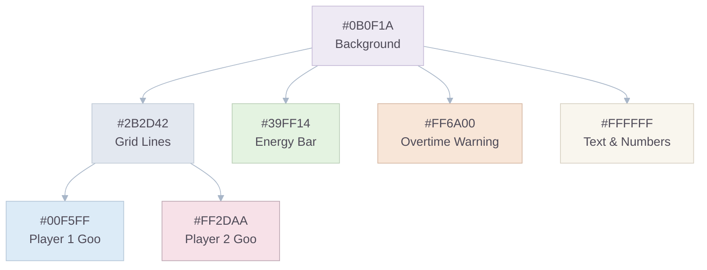
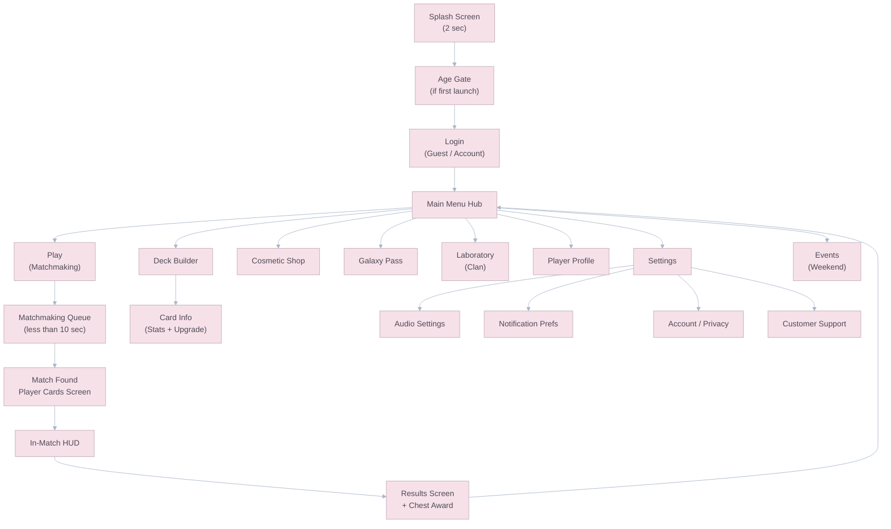
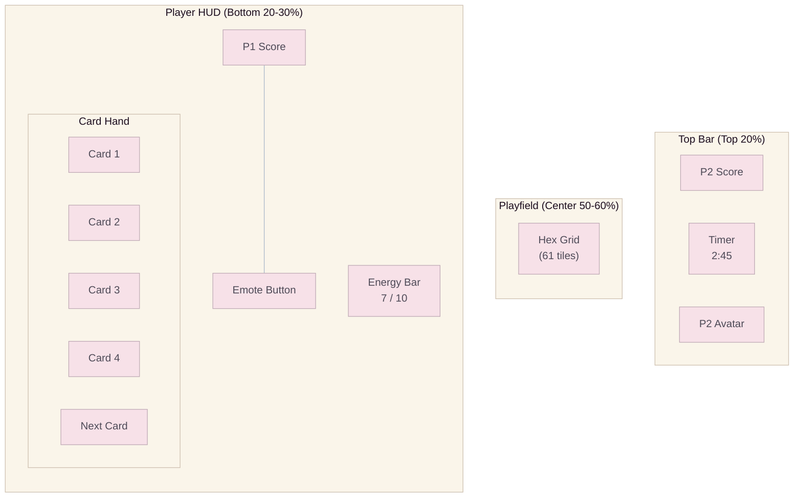

# Art Direction & UX

## Theme: The Corporate Laboratory & The Slime

The narrative foundation subverts two classic tropes — the "Mad Scientist" and the "Blob Monster" — into a fresh, commercially viable aesthetic.

### The Environment: Corporate Sterility

Instead of a sadistic dungeon, the setting is a **pristine, hyper-funded intergalactic corporate laboratory**. Characteristics:

- Sleek metallic surfaces with subtle hexagonal panel textures.
- Biohazard containment units glowing with soft neon accents.
- Observation decks with holographic data readouts.
- Experimentation is **bureaucratic**, not malicious — filed in triplicate.

### The Combatants: Sentient Slimes

The "Alien/Mutant Samples" are designed with:

- **Vibrant, bouncy idle animations** — gentle wobbling, eye-blinking, occasional stretching.
- **Expressive, oversized eyes** — the primary vehicle for personality.
- **Geometric simplicity** — rounded tear-drop or blob shapes. Easy to read at mobile scale.
- **Charming dissonance** — cute appearance contrasts with aggressive self-replicating behavior on the board.

> **IP Potential:** This duality (cute + aggressive) is critical for global appeal, merchandising, and cosmetic desirability. The slimes must be as recognizable and marketable as Clash Royale's King or Among Us's Crewmates.

---

## High-Contrast Color System (Cyber Neon)

Mobile game UIs must prioritize **instant readability**, especially in real-time PvP where split-second cognitive processing determines success. The color system follows a strict hierarchy:

### Color Palette

| Layer                | Purpose                                | Color(s)               | Hex Code(s)          | WCAG Contrast vs Background |
| :------------------- | :------------------------------------- | :--------------------- | :------------------- | :-------------------------: |
| **Background**       | "Deep Night Base" — dark foundation    | Charcoal / Space Black | `#0B0F1A`, `#1B1B1B` |        — (baseline)         |
| **Grid Lines**       | Hex boundaries — visible but recessive | Synthetic Slate        | `#2B2D42`            |       2.1:1 (subtle)        |
| **Player 1 Faction** | Goo color — high visual dominance      | Electric Cyan          | `#00F5FF`            |           12.8:1            |
| **Player 2 Faction** | Goo color — opposite wheel position    | Hot Magenta            | `#FF2DAA`            |            5.2:1            |
| **Critical UI**      | Energy bar, spell targeting            | Radioactive Lime       | `#39FF14`            |           11.4:1            |
| **Warning/Urgent**   | Low energy, overtime timer             | Warning Orange         | `#FF6A00`            |            5.7:1            |
| **Information**      | Timers, costs, scores                  | Pure White             | `#FFFFFF`            |           18.1:1            |
| **Negative/Error**   | Failed actions, loss screen            | Soft Red               | `#FF4444`            |            5.5:1            |
| **Positive/Success** | Wins, conversions, rank-ups            | Bright Gold            | `#FFD700`            |           11.0:1            |

> **Accessibility:** All text and interactive elements achieve a minimum **4.5:1 contrast ratio** against their backgrounds, per WCAG 2.1 Level AA (Section 1.4.3). Neon accents against the dark base provide maximum readability while maintaining the sci-fi aesthetic.

### Mermaid Documentation Palette

To keep the GDD visually consistent, all Mermaid diagrams in this documentation use a shared **pastel documentation palette** distinct from the in-game neon palette above.

| Token             | Use                         | Hex       |
| :---------------- | :-------------------------- | :-------- |
| **Rose Mist**     | Primary nodes               | `#F7E1E8` |
| **Powder Blue**   | Secondary nodes             | `#DCEBF7` |
| **Soft Mint**     | Success / positive emphasis | `#E4F3E1` |
| **Warm Sand**     | Clusters / containers       | `#FAF5EA` |
| **Peach Cream**   | Warning / accent nodes      | `#F8E6D8` |
| **Lavender Haze** | Tertiary highlight nodes    | `#EADFF7` |
| **Slate Ink**     | Text                        | `#4E4A57` |
| **Dusty Border**  | Lines / strokes             | `#A8B6C8` |

### Color Application Rules



1. **Never place Cyan text on Magenta background** (or vice versa). Faction colors are only used on the dark background.
2. **Status effects** use color overlays on the unit sprites: Frozen = blue shimmer, Rooted = green vines, Armored = white shell.
3. **Hex-state modifiers** use board overlays instead of unit overlays: Acid Puddle = bubbling toxic decal, Sealed = amber containment brackets on the blocked landing hex.
4. **Conversion animation** creates a brief flash of the converting player's color on the affected hexes — the "territory flip" must be instantly visible.

---

## Character Design Specifications

### Unit Visual Design

| Unit               | Shape                      | Size (relative) | Distinctive Feature                        | Animation Style                                 |
| :----------------- | :------------------------- | :-------------: | :----------------------------------------- | :---------------------------------------------- |
| **Subject Alpha**  | Round blob                 | 1.0x (baseline) | Simple round pupils                        | Bouncy, elastic idle wobble.                    |
| **Acid Crawler**   | Slug-like, elongated       |      1.1x       | Dripping texture, narrow angry eyes        | Slithering movement, drool particles.           |
| **Bio-Phalanx**    | Cubic/angular blob         |      1.3x       | Translucent shield aura, squared pupils    | Heavy, deliberate wobble. Shield glows on hit.  |
| **Volatile Mass**  | Spiky, pulsating sphere    |      1.2x       | Cracked surface with glowing internal core | Rapid vibration, unstable flickering.           |
| **Plasmic Leaper** | Teardrop with tendrils     |      1.0x       | Wispy trailing plasma tendrils             | Floaty, hovering idle. Smooth gliding movement. |
| **Apex Strain**    | Large, imposing golem-blob |      1.6x       | Crown-like protrusion, glowing red eyes    | Slow, weighty. Impact tremor on landing.        |

### Conversion Animation Sequence

1. **Impact Flash** (0.1 sec) — White flash on the landing hex.
2. **Color Wave** (0.3 sec) — Radial color spread from the landing point outward through affected hexes.
3. **Ownership Flip** (0.4 sec) — Converted enemy units visually "melt" and reform with the new owner's faction color, pupil marker, and control ring while **retaining their original unit silhouette** for gameplay readability.
4. **Score Pulse** (0.2 sec) — The score counter pulses with +N animation.

---

## Screen Flow



### Screen Descriptions

| Screen                | Key Elements                                                                                                          | Thumb Zone Priority                        |
| :-------------------- | :-------------------------------------------------------------------------------------------------------------------- | :----------------------------------------- |
| **Main Menu Hub**     | Player name, Trophy count, Arena badge. 6 navigation buttons in a radial or grid layout. Current chest slots visible. | All navigation within thumb reach.         |
| **Matchmaking Queue** | Animated "searching" effect. Trophy range indicator. Cancel button.                                                   | Cancel in easy reach (bottom-center).      |
| **Match Found**       | Both players' profiles, Trophy count, arena badge, equipped cosmetics. 3-second countdown.                            | Non-interactive. Just visual anticipation. |
| **In-Match HUD**      | See HUD layout below.                                                                                                 | Card hand and Energy bar in bottom 30%.    |
| **Results Screen**    | Win/Loss/Draw banner. Trophy change (+30/-25). Chest awarded (if win). "Play Again" and "Return" buttons.             | "Play Again" prominently in bottom-center. |
| **Deck Builder**      | 8-slot deck grid. Full card collection below. Sort/filter by rarity, cost, type. Average Elixir cost displayed.       | Drag-and-drop card placement.              |
| **Galaxy Pass**       | 35-tier horizontal scroll. Free track on top, Premium on bottom. Purchase button for Premium upgrade.                 | Horizontal scroll with momentum.           |

---

## Combat HUD Layout



### Layout Zoning Rule

- **Top 20%:** Timer, opponent identity, and opponent score only.
- **Center 50-60%:** Playfield remains visually dominant at all times.
- **Bottom 20-30%:** All primary player interactions live here: score, emote, Energy, and hand.

| Element          | Position                         | Size                                                                         |
| :--------------- | :------------------------------- | :--------------------------------------------------------------------------- |
| **Timer**        | Top-center                       | Large font, always visible. Turns red at <30 sec.                            |
| **Scores**       | Top-left (P2) / Bottom-left (P1) | Player's score always on their "home" side.                                  |
| **Energy Bar**   | Bottom, spanning full width      | Fills left→right. Shows numeric value. Glows green at 10/10 (waste warning). |
| **Card Hand**    | Bottom row, 4 cards + 1 "next"   | Cards show art, Energy cost badge, and rarity border.                        |
| **Emote Button** | Bottom-right                     | Small, unobtrusive. Opens radial emote selector.                             |

---

## Accessibility Features

### Colorblind Support

Relying solely on color for faction identification is insufficient. The following supplementary identifiers are mandatory:

| Identifier                  | Description                                                                                             |
| :-------------------------- | :------------------------------------------------------------------------------------------------------ |
| **Shape Markers**           | Player 1 units have **round pupils**. Player 2 units have **diamond/star pupils**.                      |
| **Hex Border Pattern**      | Player 1 controlled hexes have **solid borders**. Player 2 hexes have **dashed borders**.               |
| **Colorblind Palette Mode** | Settings toggle replaces Cyan/Magenta with **Blue/Orange** (optimized for deuteranopia and protanopia). |
| **High Contrast Mode**      | Increases grid line brightness and unit outline thickness.                                              |

### Other Accessibility

| Feature             | Description                                                                                   |
| :------------------ | :-------------------------------------------------------------------------------------------- |
| **Text Scaling**    | UI text respects system font size settings (iOS Dynamic Type, Android font scale).            |
| **Reduced Motion**  | Toggle to disable screen shake, particle effects, and non-essential animations.               |
| **Audio Cues**      | All visual status effects also have distinct audio cues (see `07_Audio_and_Sound_Design.md`). |
| **One-Handed Mode** | Optional layout shift that compresses the card hand to one side for single-hand play.         |

---

## Asset Pipeline & Naming Conventions

### Folder Structure (Art Assets)

```
Assets/
├── Art/
│   ├── UI/
│   │   ├── Icons/          # Card icons, status effect icons
│   │   ├── Frames/         # Profile frames, card rarity borders
│   │   ├── HUD/            # Energy bar, timer, buttons
│   │   └── Screens/        # Menu backgrounds, splash screen
│   ├── Units/
│   │   ├── SubjectAlpha/   # Sprites, animations, materials
│   │   ├── AcidCrawler/
│   │   ├── BioPhalanx/
│   │   ├── VolatileMass/
│   │   ├── PlasmicLeaper/
│   │   └── ApexStrain/
│   ├── Board/
│   │   ├── HexTiles/       # Hex tile sprites/meshes
│   │   ├── Environments/   # Board theme backgrounds
│   │   └── Effects/        # Conversion waves, hazard puddles
│   └── Cosmetics/
│       ├── Skins/
│       ├── Mascots/
│       ├── DeployAnimations/
│       └── BoardThemes/
```

### Naming Convention

```
{Category}_{Name}_{Variant}_{Size}.{ext}

Examples:
  UI_Icon_SubjectAlpha_128.png
  Unit_AcidCrawler_Idle_512.png
  Board_HexTile_Neutral_256.png
  Cosmetic_Skin_SubjectAlpha_Neon_512.png
  VFX_Conversion_CyanWave.prefab
```
