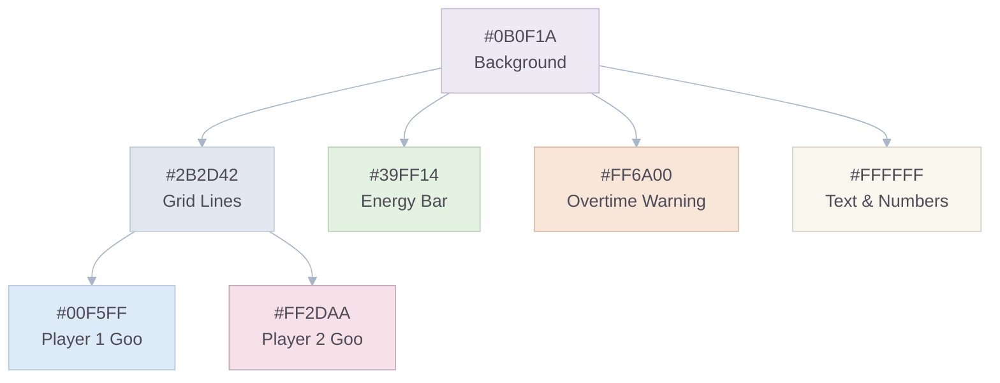
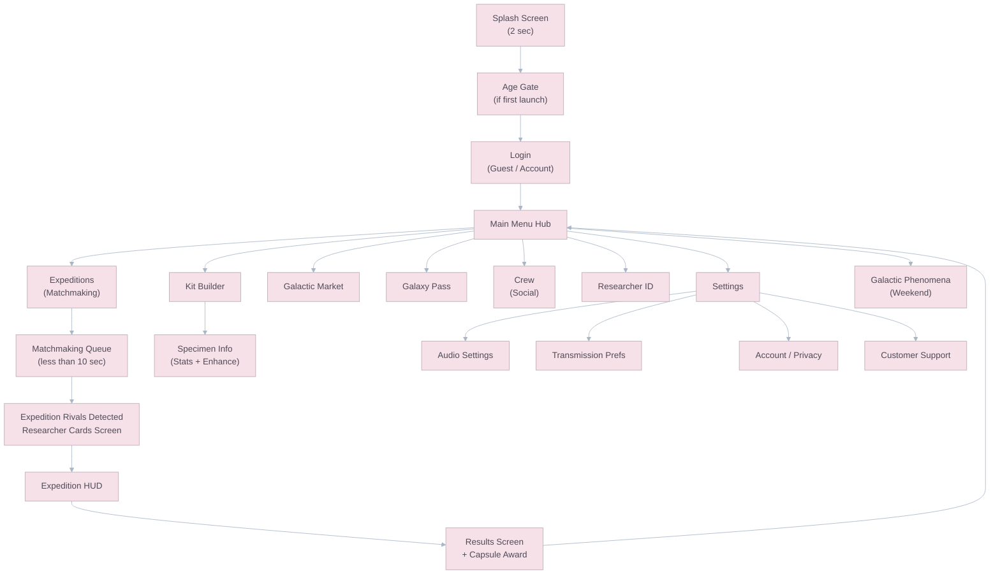
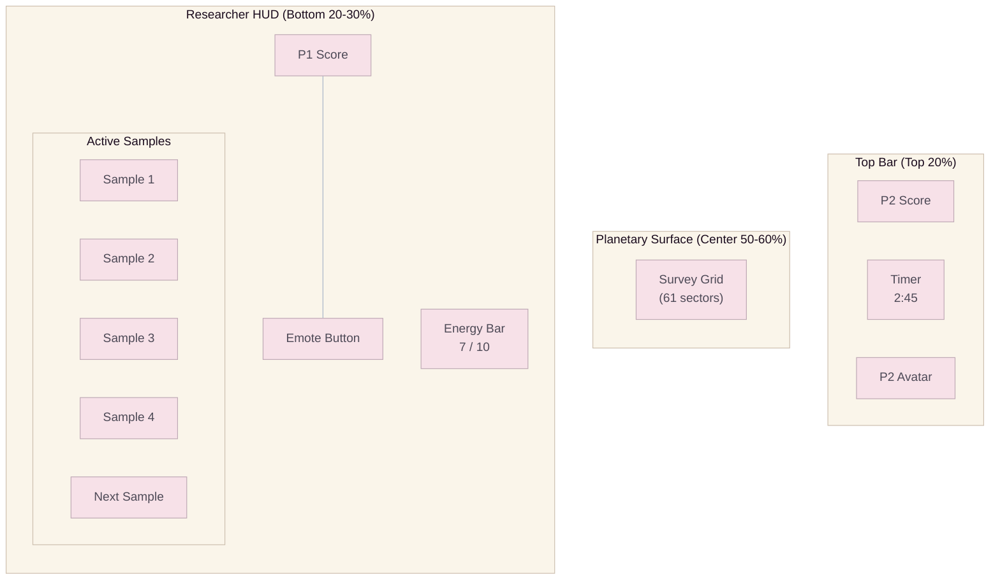

# Art Direction & UX

## Theme: Cosmic Discovery — Researchers & Specimens

The narrative foundation reimagines space exploration through a charming, comedic lens — **alien Researchers** travel the galaxy discovering, cataloging, and testing exotic slime life forms on uncharted planets. Think _Guardians of the Galaxy_ meets _Pokémon Snap_, with a science-comedy twist.

### The Researchers: Comical Alien Scientists

The player's avatar is a **charming, expressive alien Researcher** — part of an intergalactic collective of bumbling but brilliant scientists. Key design principles:

- **Non-human, instantly lovable designs** — round, squishy, big-eyed aliens in slightly-too-large lab coats and fogged-up helmets.
- **Expressive body language** — antennae that droop on defeat, goggles that pop off on Total Assimilation, gloves that are comically oversized.
- **Multiple species** for player choice and cosmetic variety — gelatinous (Dr. Bloop), insectoid (Doc Sparks), crystalline (Chief Glimmer), gaseous (Capt. Nebula), hedgehog-like (Prof. Quill).
- **Diegetic UI** — all HUD elements appear as holographic projections from the Researcher's equipment, reinforcing that _you_ are the scientist conducting the expedition.

> **IP Potential:** The Researchers are the primary IP vehicle — they appear on the main menu, in expedition intros, on the Galaxy Pass, and as emotes. They should be as recognizable and marketable as Clash Royale's King or Among Us's Crewmates.

### The Environment: Alien Planets & Deep Space

Instead of sterile lab rooms, expeditions take place on the surfaces of colorful, exotic planets:

- **Deep space backdrops** — nebulae, starfields, ringed planets on the horizon, twin moons.
- **Planetary surfaces** — each Star System has a distinct biome: gas giant cloud layers (Gloopiter), bioluminescent swamps (Sludgar-4), crystalline ice fields (Cryo-9), volcanic wastelands (Nova Rubra).
- **Holographic grid overlay** — the hex grid appears as a scanning projection cast onto the planetary surface by the Researcher's orbital starship.
- **Tone** — wonder and discovery, not sterile containment. The galaxy is vast, colorful, and _alive_.

### The Specimens: Sentient Slimes

The alien life forms discovered across the galaxy are designed with:

- **Vibrant, bouncy idle animations** — gentle wobbling, eye-blinking, occasional stretching.
- **Expressive, oversized eyes** — the primary vehicle for personality.
- **Geometric simplicity** — rounded tear-drop or blob shapes. Easy to read at mobile scale.
- **Charming dissonance** — cute appearance contrasts with aggressive self-replicating behavior during expeditions.
- **Color-coded by faction** — Player 1's specimens glow Electric Cyan; Player 2's glow Hot Magenta. Ownership is instantly readable.

---

## High-Contrast Color System (Cosmic Neon)

Mobile game UIs must prioritize **instant readability**, especially in real-time PvP where split-second cognitive processing determines success. The color system follows a strict hierarchy, optimized for deep space backgrounds:

### Color Palette

| Layer                | Purpose                                   | Color(s)               | Hex Code(s)          | WCAG Contrast vs Background |
| :------------------- | :---------------------------------------- | :--------------------- | :------------------- | :-------------------------: |
| **Background**       | "Deep Space" — cosmic void foundation     | Charcoal / Space Black | `#0B0F1A`, `#1B1B1B` |        — (baseline)         |
| **Grid Lines**       | Sector boundaries — visible but recessive | Synthetic Slate        | `#2B2D42`            |       2.1:1 (subtle)        |
| **Player 1 Faction** | Specimen color — high visual dominance    | Electric Cyan          | `#00F5FF`            |           12.8:1            |
| **Player 2 Faction** | Specimen color — opposite wheel position  | Hot Magenta            | `#FF2DAA`            |            5.2:1            |
| **Critical UI**      | Energy bar, protocol targeting            | Radioactive Lime       | `#39FF14`            |           11.4:1            |
| **Warning/Urgent**   | Low energy, overtime timer                | Warning Orange         | `#FF6A00`            |            5.7:1            |
| **Information**      | Timers, costs, scores                     | Pure White             | `#FFFFFF`            |           18.1:1            |
| **Negative/Error**   | Failed actions, expedition recalled       | Soft Red               | `#FF4444`            |            5.5:1            |
| **Positive/Success** | Discoveries, assimilations, warp jumps    | Bright Gold            | `#FFD700`            |           11.0:1            |

> **Accessibility:** All text and interactive elements achieve a minimum **4.5:1 contrast ratio** against their backgrounds, per WCAG 2.1 Level AA (Section 1.4.3). Neon accents against the deep space backdrop provide maximum readability while maintaining the cosmic sci-fi aesthetic.

### Mermaid Documentation Palette

To keep the GDD visually consistent, all Mermaid diagrams in this documentation use a shared **pastel documentation palette** distinct from the in-game neon palette above.

| Token             | Use                         | Hex       |
| :---------------- | :-------------------------- | :-------- |
| **Rose Mist**     | Primary nodes               | `#F7E1E8` |
| **Powder Blue**   | Secondary nodes             | `#DCEBF7` |
| **Soft Mint**     | Success / positive emphasis | `#E4F3E1` |
| **Warm Sand**     | Clusters / containers       | `#FAF5EA` |
| **Peach Cream**   | Warning / accent nodes      | `#F8E6D8` |
| **Lavender Haze** | Tertiary highlight nodes    | `#EADFF7` |
| **Slate Ink**     | Text                        | `#4E4A57` |
| **Dusty Border**  | Lines / strokes             | `#A8B6C8` |

### Color Application Rules


```mermaid
%%{init: {"theme":"base","themeVariables":{"primaryColor":"#F7E1E8","secondaryColor":"#DCEBF7","tertiaryColor":"#E4F3E1","primaryBorderColor":"#BFA9B5","lineColor":"#A8B6C8","primaryTextColor":"#4E4A57","clusterBkg":"#FAF5EA","clusterBorder":"#CDBFAF","edgeLabelBackground":"#FFF9F2","noteBkgColor":"#F7F1FA","noteTextColor":"#4E4A57","taskBkgColor":"#DCEBF7","taskTextColor":"#4E4A57","taskTextOutsideColor":"#4E4A57","sectionBkgColor":"#E4F3E1","sectionBorderColor":"#BCD0B9","gridColor":"#E8DDD3","todayLineColor":"#C7A7B5","actorBkg":"#F7E1E8","actorBorder":"#BFA9B5","actorTextColor":"#4E4A57","signalColor":"#A8B6C8","signalTextColor":"#4E4A57","labelBoxBkgColor":"#FFF9F2","labelBoxBorderColor":"#CDBFAF","labelTextColor":"#4E4A57"}}}%%
graph TD
    BG["#0B0F1A<br/>Background"] --> GRID["#2B2D42<br/>Grid Lines"]
    GRID --> P1["#00F5FF<br/>Player 1 Goo"]
    GRID --> P2["#FF2DAA<br/>Player 2 Goo"]
    BG --> UI["#39FF14<br/>Energy Bar"]
    BG --> WARN["#FF6A00<br/>Overtime Warning"]
    BG --> INFO["#FFFFFF<br/>Text & Numbers"]

    style BG fill:#EEEAF4,color:#4E4A57,stroke:#C7BCD8
    style GRID fill:#E3E8F0,color:#4E4A57,stroke:#C2CCD8
    style P1 fill:#DCEBF7,color:#4E4A57,stroke:#B7C8D9
    style P2 fill:#F7E1E8,color:#4E4A57,stroke:#BFA9B5
    style UI fill:#E4F3E1,color:#4E4A57,stroke:#BCD0B9
    style WARN fill:#F8E6D8,color:#4E4A57,stroke:#D7B9A4
    style INFO fill:#F9F6EE,color:#4E4A57,stroke:#D8D1C3
```

1. **Never place Cyan text on Magenta background** (or vice versa). Faction colors are only used on the dark background.
2. **Status effects** use color overlays on the unit sprites: Frozen = blue shimmer, Rooted = green vines, Armored = white shell.
3. **Hex-state modifiers** use board overlays instead of unit overlays: Acid Puddle = bubbling toxic decal, Sealed = amber containment brackets on the blocked landing hex.
4. **Conversion animation** creates a brief flash of the converting player's color on the affected hexes — the "territory flip" must be instantly visible.

---

## Character Design Specifications

### Researcher Visual Design (Player Avatars)

See `Space_Expedition_Naming_Proposal.md` §10 for the full Researcher cast. Key design specs:

| Researcher        | Species           | Size (relative) | Distinctive Feature                              | Animation Style                                    |
| :---------------- | :---------------- | :-------------: | :----------------------------------------------- | :------------------------------------------------- |
| **Dr. Bloop**     | Gelatinous blob   |      1.0x       | Oversized lab coat, perpetually fogged goggles   | Bouncy, squishy idle. Goggles fog up when excited. |
| **Prof. Quill**   | Hedgehog-like     |      0.9x       | Spines poke through coat, tiny round spectacles  | Precise, slightly grumpy movements.                |
| **Capt. Nebula**  | Gaseous entity    |      1.1x       | Contained in translucent helmet, flowing scarf   | Swirling, charismatic poses.                       |
| **Doc Sparks**    | Tiny insectoid    |      0.8x       | Four arms, constantly fidgeting with equipment   | Hyperactive, skittering idle. Drops things.        |
| **Chief Glimmer** | Crystalline being |      1.2x       | Faceted translucent body, elegant slow movements | Refracts light. Graceful, deliberate gestures.     |

### Specimen Visual Design

| Specimen           | Shape                      | Size (relative) | Distinctive Feature                        | Animation Style                                 |
| :----------------- | :------------------------- | :-------------: | :----------------------------------------- | :---------------------------------------------- |
| **Subject Alpha**  | Round blob                 | 1.0x (baseline) | Simple round pupils                        | Bouncy, elastic idle wobble.                    |
| **Acid Crawler**   | Slug-like, elongated       |      1.1x       | Dripping texture, narrow angry eyes        | Slithering movement, drool particles.           |
| **Bio-Phalanx**    | Cubic/angular blob         |      1.3x       | Translucent shield aura, squared pupils    | Heavy, deliberate wobble. Shield glows on hit.  |
| **Volatile Mass**  | Spiky, pulsating sphere    |      1.2x       | Cracked surface with glowing internal core | Rapid vibration, unstable flickering.           |
| **Plasmic Leaper** | Teardrop with tendrils     |      1.0x       | Wispy trailing plasma tendrils             | Floaty, hovering idle. Smooth gliding movement. |
| **Apex Strain**    | Large, imposing golem-blob |      1.6x       | Crown-like protrusion, glowing red eyes    | Slow, weighty. Impact tremor on landing.        |

### Conversion Animation Sequence

1. **Impact Flash** (0.1 sec) — White flash on the landing hex.
2. **Color Wave** (0.3 sec) — Radial color spread from the landing point outward through affected hexes.
3. **Ownership Flip** (0.4 sec) — Converted enemy units visually "melt" and reform with the new owner's faction color, pupil marker, and control ring while **retaining their original unit silhouette** for gameplay readability.
4. **Score Pulse** (0.2 sec) — The score counter pulses with +N animation.

---

## Screen Flow


```mermaid
%%{init: {"theme":"base","themeVariables":{"primaryColor":"#F7E1E8","secondaryColor":"#DCEBF7","tertiaryColor":"#E4F3E1","primaryBorderColor":"#BFA9B5","lineColor":"#A8B6C8","primaryTextColor":"#4E4A57","clusterBkg":"#FAF5EA","clusterBorder":"#CDBFAF","edgeLabelBackground":"#FFF9F2","noteBkgColor":"#F7F1FA","noteTextColor":"#4E4A57","taskBkgColor":"#DCEBF7","taskTextColor":"#4E4A57","taskTextOutsideColor":"#4E4A57","sectionBkgColor":"#E4F3E1","sectionBorderColor":"#BCD0B9","gridColor":"#E8DDD3","todayLineColor":"#C7A7B5","actorBkg":"#F7E1E8","actorBorder":"#BFA9B5","actorTextColor":"#4E4A57","signalColor":"#A8B6C8","signalTextColor":"#4E4A57","labelBoxBkgColor":"#FFF9F2","labelBoxBorderColor":"#CDBFAF","labelTextColor":"#4E4A57"}}}%%
flowchart TD
    SPLASH["Splash Screen<br/>(2 sec)"] --> AGE["Age Gate<br/>(if first launch)"]
    AGE --> LOGIN["Login<br/>(Guest / Account)"]
    LOGIN --> MAIN["Main Menu Hub"]

    MAIN --> PLAY["Expeditions<br/>(Matchmaking)"]
    MAIN --> KIT["Kit Builder"]
    MAIN --> MARKET["Galactic Market"]
    MAIN --> PASS["Galaxy Pass"]
    MAIN --> CREW["Crew<br/>(Social)"]
    MAIN --> PROFILE["Researcher ID"]
    MAIN --> SETTINGS["Settings"]
    MAIN --> PHENOMENA["Galactic Phenomena<br/>(Weekend)"]

    PLAY --> QUEUE["Matchmaking Queue<br/>(less than 10 sec)"]
    QUEUE --> FOUND["Expedition Rivals Detected<br/>Researcher Cards Screen"]
    FOUND --> GAME["Expedition HUD"]
    GAME --> RESULTS["Results Screen<br/>+ Capsule Award"]
    RESULTS --> MAIN

    KIT --> SPECIMEN_INFO["Specimen Info<br/>(Stats + Enhance)"]

    SETTINGS --> AUDIO["Audio Settings"]
    SETTINGS --> NOTIF["Transmission Prefs"]
    SETTINGS --> ACCOUNT["Account / Privacy"]
    SETTINGS --> SUPPORT["Customer Support"]
```

### Screen Descriptions

| Screen                | Key Elements                                                                                                                                             | Thumb Zone Priority                          |
| :-------------------- | :------------------------------------------------------------------------------------------------------------------------------------------------------- | :------------------------------------------- |
| **Main Menu Hub**     | Researcher callsign, DP count, Star System badge. 6 navigation buttons in a radial or grid layout. Capsule bay visible.                                  | All navigation within thumb reach.           |
| **Matchmaking Queue** | Animated "scanning" effect. DP range indicator. Cancel button.                                                                                           | Cancel in easy reach (bottom-center).        |
| **Expedition Rivals** | Both Researchers' IDs, DP count, Star System badge, equipped Expedition Gear. 3-second countdown.                                                        | Non-interactive. Just visual anticipation.   |
| **Expedition HUD**    | See HUD layout below.                                                                                                                                    | Active Samples and Energy bar in bottom 30%. |
| **Results Screen**    | Discovery Complete / Expedition Recalled / Stalemate banner. DP change (+30/-25). Capsule awarded (if win). "Embark Again" and "Return to Ship" buttons. | "Embark Again" prominently in bottom-center. |
| **Kit Builder**       | 8-specimen Kit grid. Full Catalog below. Sort/filter by rarity, cost, type. Average Energy cost displayed.                                               | Drag-and-drop specimen placement.            |
| **Galaxy Pass**       | 35-tier horizontal scroll. Free track on top, Premium on bottom. Purchase button for Premium upgrade.                                                    | Horizontal scroll with momentum.             |

---

## Expedition HUD Layout


```mermaid
%%{init: {"theme":"base","themeVariables":{"primaryColor":"#F7E1E8","secondaryColor":"#DCEBF7","tertiaryColor":"#E4F3E1","primaryBorderColor":"#BFA9B5","lineColor":"#A8B6C8","primaryTextColor":"#4E4A57","clusterBkg":"#FAF5EA","clusterBorder":"#CDBFAF","edgeLabelBackground":"#FFF9F2","noteBkgColor":"#F7F1FA","noteTextColor":"#4E4A57","taskBkgColor":"#DCEBF7","taskTextColor":"#4E4A57","taskTextOutsideColor":"#4E4A57","sectionBkgColor":"#E4F3E1","sectionBorderColor":"#BCD0B9","gridColor":"#E8DDD3","todayLineColor":"#C7A7B5","actorBkg":"#F7E1E8","actorBorder":"#BFA9B5","actorTextColor":"#4E4A57","signalColor":"#A8B6C8","signalTextColor":"#4E4A57","labelBoxBkgColor":"#FFF9F2","labelBoxBorderColor":"#CDBFAF","labelTextColor":"#4E4A57"}}}%%
flowchart TB
  subgraph TOP["Top Bar (Top 20%)"]
    direction LR
    P2S["P2 Score"]
    TIMER["Timer<br/>2:45"]
    P2A["P2 Avatar"]
  end

  subgraph MID["Planetary Surface (Center 50-60%)"]
    direction TB
    GRID["Survey Grid<br/>(61 sectors)"]
  end

  subgraph BOTTOM["Researcher HUD (Bottom 20-30%)"]
    direction TB
    META["P1 Score"] --- EMOTE["Emote Button"]
    ENERGY["Energy Bar<br/>7 / 10"]
    subgraph HAND["Active Samples"]
      direction LR
      C1["Sample 1"]
      C2["Sample 2"]
      C3["Sample 3"]
      C4["Sample 4"]
      NEXT["Next Sample"]
    end
  end
```

### Layout Zoning Rule

- **Top 20%:** Timer, opponent identity, and opponent score only.
- **Center 50-60%:** Planetary surface remains visually dominant at all times.
- **Bottom 20-30%:** All primary Researcher interactions live here: score, emote, Energy, and Active Samples.

| Element            | Position                         | Size                                                                         |
| :----------------- | :------------------------------- | :--------------------------------------------------------------------------- |
| **Timer**          | Top-center                       | Large font, always visible. Turns red at <30 sec.                            |
| **Scores**         | Top-left (P2) / Bottom-left (P1) | Researcher's score always on their "home" side.                              |
| **Energy Bar**     | Bottom, spanning full width      | Fills left→right. Shows numeric value. Glows green at 10/10 (waste warning). |
| **Active Samples** | Bottom row, 4 samples + 1 "next" | Samples show art, Energy cost badge, and rarity border.                      |
| **Emote Button**   | Bottom-right                     | Small, unobtrusive. Opens radial emote selector.                             |

---

## Accessibility Features

### Colorblind Support

Relying solely on color for faction identification is insufficient. The following supplementary identifiers are mandatory:

| Identifier                  | Description                                                                                             |
| :-------------------------- | :------------------------------------------------------------------------------------------------------ |
| **Shape Markers**           | Player 1 units have **round pupils**. Player 2 units have **diamond/star pupils**.                      |
| **Hex Border Pattern**      | Player 1 controlled hexes have **solid borders**. Player 2 hexes have **dashed borders**.               |
| **Colorblind Palette Mode** | Settings toggle replaces Cyan/Magenta with **Blue/Orange** (optimized for deuteranopia and protanopia). |
| **High Contrast Mode**      | Increases grid line brightness and unit outline thickness.                                              |

### Other Accessibility

| Feature             | Description                                                                                   |
| :------------------ | :-------------------------------------------------------------------------------------------- |
| **Text Scaling**    | UI text respects system font size settings (iOS Dynamic Type, Android font scale).            |
| **Reduced Motion**  | Toggle to disable screen shake, particle effects, and non-essential animations.               |
| **Audio Cues**      | All visual status effects also have distinct audio cues (see `07_Audio_and_Sound_Design.md`). |
| **One-Handed Mode** | Optional layout shift that compresses the card hand to one side for single-hand play.         |

---

## Asset Pipeline & Naming Conventions

### Folder Structure (Art Assets)

```
Assets/
├── Art/
│   ├── UI/
│   │   ├── Icons/          # Card icons, status effect icons
│   │   ├── Frames/         # Profile frames, card rarity borders
│   │   ├── HUD/            # Energy bar, timer, buttons
│   │   └── Screens/        # Menu backgrounds, splash screen
│   ├── Units/
│   │   ├── SubjectAlpha/   # Sprites, animations, materials
│   │   ├── AcidCrawler/
│   │   ├── BioPhalanx/
│   │   ├── VolatileMass/
│   │   ├── PlasmicLeaper/
│   │   └── ApexStrain/
│   ├── Board/
│   │   ├── HexTiles/       # Hex tile sprites/meshes
│   │   ├── Environments/   # Board theme backgrounds
│   │   └── Effects/        # Conversion waves, hazard puddles
│   └── Cosmetics/
│       ├── Skins/
│       ├── Mascots/
│       ├── DeployAnimations/
│       └── BoardThemes/
```

### Naming Convention

```
{Category}_{Name}_{Variant}_{Size}.{ext}

Examples:
  UI_Icon_SubjectAlpha_128.png
  Unit_AcidCrawler_Idle_512.png
  Board_HexTile_Neutral_256.png
  Cosmetic_Skin_SubjectAlpha_Neon_512.png
  VFX_Conversion_CyanWave.prefab
```
