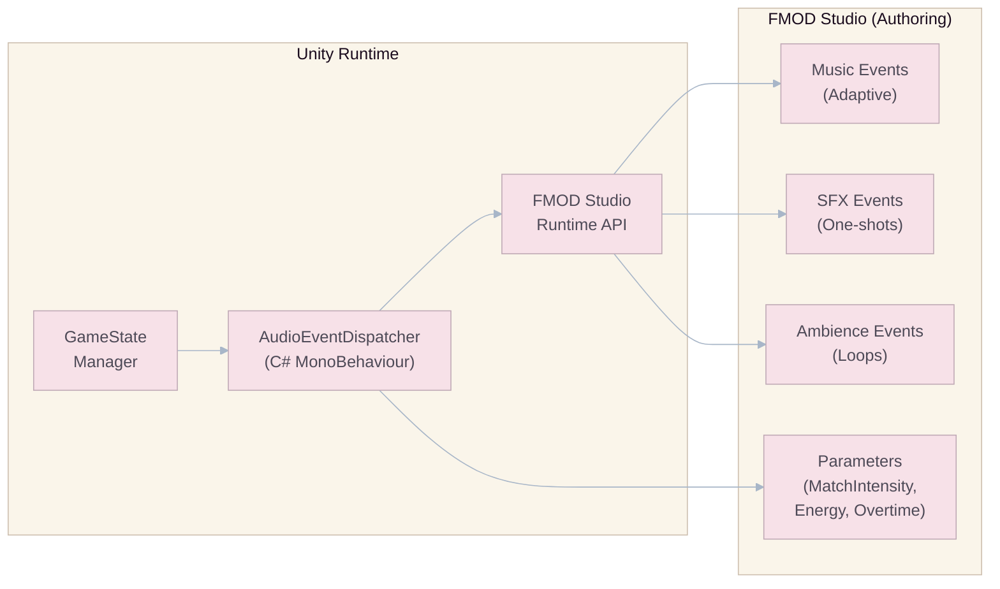
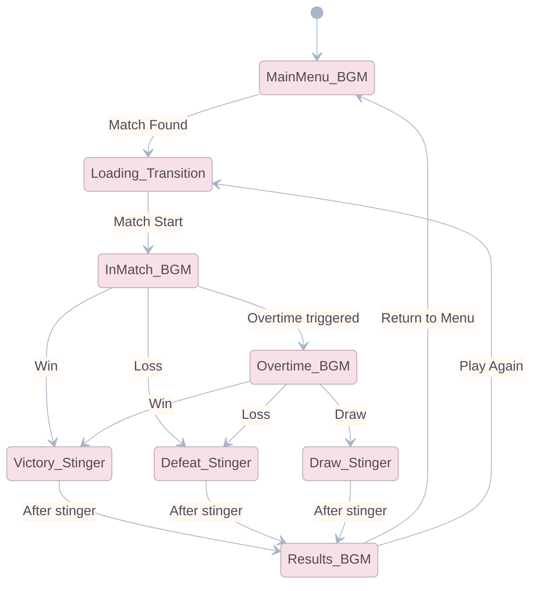

# Audio & Sound Design

## Audio Philosophy

Audio in Goo Galaxy serves three critical functions:

1. **Feedback ("Game Juice"):** Every player action must produce an immediate, satisfying audio response. Sound confirms inputs faster than visuals — the brain processes audio before visual stimuli.
2. **Atmosphere:** Reinforce the juxtaposition between the sterile corporate laboratory and the organic chaos of sentient slimes.
3. **Information:** Communicate board state changes (conversions, hazards, overtime) without requiring the player to visually scan the entire grid.

> **Core Rule:** If a player does something and nothing audibly responds, the game feels dead. Every action responds.

---

## Audio Middleware: FMOD Studio

### Why FMOD

| Criteria               | FMOD                                                    | Unity Built-in                    | Wwise                         |
| :--------------------- | :------------------------------------------------------ | :-------------------------------- | :---------------------------- |
| **Adaptive Music**     | Excellent (vertical layering + horizontal resequencing) | Basic (no native adaptive system) | Excellent                     |
| **Unity Integration**  | Native plugin, well-documented                          | N/A                               | Good but complex setup        |
| **License Cost**       | Free for revenue < USD 200K                             | Free                              | Free for indie, paid at scale |
| **Learning Curve**     | Moderate                                                | Low                               | High                          |
| **Mobile Performance** | Optimized                                               | Native                            | Optimized                     |

**Recommendation:** FMOD Studio for its balance of power, cost, and integration simplicity. The adaptive music system is essential for Goo Galaxy's dynamic match pacing.

### FMOD Integration Architecture



---

## Original Soundtrack (BGM)

### Adaptive Music System

The music dynamically responds to the match state using FMOD's **vertical layering** (adding/removing instrument tracks) and **parameter-driven transitions**.

#### FMOD Parameter: `MatchIntensity` (float, 0.0 - 1.0)

| Game State                   | `MatchIntensity` Value | Active Layers                                                          |
| :--------------------------- | :--------------------: | :--------------------------------------------------------------------- |
| **Pre-Match / Loading**      |          0.0           | Ambient pad only. Low drone.                                           |
| **Early Game (0:00 - 1:00)** |          0.2           | + Subtle rhythmic pulse. Light percussion.                             |
| **Mid Game (1:00 - 2:00)**   |          0.5           | + Melodic synth arpeggios. Mid percussion.                             |
| **Late Game (2:00 - 2:45)**  |          0.7           | + Full drum kit. Bassline intensifies.                                 |
| **Final 15 Seconds**         |          0.85          | + Stinger accents. Rising pitch tension.                               |
| **Overtime (Sudden Death)**  |          1.0           | **All layers at full intensity.** Tempo increases 15%. Distorted bass. |
| **Victory**                  |           —            | Triumphant stinger → fade to victory theme.                            |
| **Defeat**                   |           —            | Somber descending stinger → quiet defeat theme.                        |

#### FMOD Parameter: `TerritoryBalance` (float, -1.0 to 1.0)

| Value | Meaning                      | Musical Response                                         |
| :---- | :--------------------------- | :------------------------------------------------------- |
| -1.0  | Player is losing badly       | Minor key emphasis. Tension strings. Feeling of urgency. |
| 0.0   | Even match                   | Neutral/balanced orchestration.                          |
| +1.0  | Player is winning decisively | Major key emphasis. Triumphant brass swells. Confidence. |

> **Transition Rule:** All layer transitions are quantized to the next beat marker (4/4 time, 128 BPM base) to prevent jarring cuts. FMOD handles this automatically via sustain points.

### BGM by Context

| Context                  | Style                          | BPM | Key Instruments                                                                                    |
| :----------------------- | :----------------------------- | :-: | :------------------------------------------------------------------------------------------------- |
| **Main Menu / Lab View** | Ambient Synthwave              | 90  | Analog synth pads, subtle hi-hats, reverb-heavy arpeggios. Feels high-tech, expensive, mysterious. |
| **Deck Builder**         | Lo-fi Electronica              | 85  | Muted beats, warm bass, gentle chimes. Relaxed and contemplative.                                  |
| **In-Match (Base)**      | Electronic / Hybrid Orchestral | 128 | Layered from ambient drone to full electronic orchestra. See adaptive system above.                |
| **Overtime**             | Aggressive Electronic          | 148 | Distorted bass, rapid hi-hats, staccato strings. Heart-pounding urgency.                           |
| **Victory Theme**        | Triumphant Synthwave           | 140 | Major key fanfare, brass stabs, rising synth lead. 8-second stinger + 20-second loop.              |
| **Defeat Theme**         | Somber Ambient                 | 70  | Descending minor chord. Quiet. Brief. Not punishing.                                               |
| **Shop / Cosmetics**     | Upbeat Chiptune-Synth          | 110 | Playful, bouncy. Encourages browsing.                                                              |

---

## Sound Effects (SFX) Catalog

### Core Gameplay SFX

| Event                         | Sound Description                                      | Priority | Variation Count |
| :---------------------------- | :----------------------------------------------------- | :------: | :-------------: |
| **Deploy: Subject Alpha**     | Light elastic "squish" + bubble pop                    |   High   |        3        |
| **Deploy: Acid Crawler**      | Wet slither + acidic sizzle                            |   High   |        3        |
| **Deploy: Bio-Phalanx**       | Heavy thud + metallic shield clang                     |   High   |        3        |
| **Deploy: Volatile Mass**     | Unstable electrical crackle + ominous hum              |   High   |        2        |
| **Deploy: Plasmic Leaper**    | Ethereal whoosh + plasma sizzle                        |   High   |        3        |
| **Deploy: Apex Strain**       | Deep bass impact + ground tremor rumble                | Critical |        2        |
| **Conversion (1 piece)**      | Crisp pop/chime                                        | Critical |        5        |
| **Conversion (chain, 2-4)**   | Ascending pitch cascade (chimes pitch up sequentially) | Critical |        3        |
| **Conversion (mass, 5+)**     | Full cascading musical phrase + reverb swell           | Critical |        2        |
| **Clone Movement**            | Soft stretch + plop                                    |  Medium  |        3        |
| **Jump Movement**             | Springy launch + landing thud                          |  Medium  |        3        |
| **Acid Puddle Created**       | Bubbling acid + corrosive hiss                         |  Medium  |        2        |
| **Freeze (Cryo-Stasis)**      | Crystallization crackle + deep freeze whoosh           |   High   |        2        |
| **Sterilization Beam**        | High-energy laser charge + orbital strike blast        | Critical |        1        |
| **Armor Strip (Bio-Phalanx)** | Glass cracking + shield shatter                        |   High   |        2        |
| **Volatile Mass Explosion**   | Explosive burst + dissipation fizz                     | Critical |        2        |
| **Seismic Push (Apex)**       | Deep shockwave + units sliding across surface          | Critical |        1        |
| **Root Applied**              | Vine/tendril snap + sticky adhesion                    |  Medium  |        2        |

### Conversion Cascade — The Dopamine Engine

The **conversion sound** is the single most important SFX in the game. It must feel:

- **Satisfying:** Each pop is crisp and clean.
- **Musical:** When multiple pieces convert, the pops pitch up in a chromatic or pentatonic scale.
- **Escalating:** Mass conversions (5+ pieces) trigger a mini-musical phrase that functions as an audio reward.

```
Example: Converting 5 pieces
  Pop (C4) → Pop (D4) → Pop (E4) → Pop (G4) → Pop (A4)
  + Reverb tail + shimmer
  Total duration: 0.8 seconds
```

### UI & Menu SFX

| Event                       | Sound Description                                                           |
| :-------------------------- | :-------------------------------------------------------------------------- |
| **Button Press**            | Crisp digital click (tactile feedback).                                     |
| **Button Hover**            | Subtle synthetic swoosh.                                                    |
| **Screen Transition**       | Smooth whoosh with subtle reverb.                                           |
| **Card Drag Start**         | Soft magnetic pull.                                                         |
| **Card Drop (Valid)**       | Satisfying snap/lock.                                                       |
| **Card Drop (Invalid)**     | Gentle buzz/rejection. Short, not punishing.                                |
| **Chest Appear**            | Metallic materialization shimmer.                                           |
| **Chest Opening**           | Building anticipation rattle → dramatic lid burst → content reveal fanfare. |
| **Card Reveal (Common)**    | Brief chime.                                                                |
| **Card Reveal (Rare)**      | Ascending double chime.                                                     |
| **Card Reveal (Epic)**      | Dramatic orchestral hit + sparkle.                                          |
| **Card Reveal (Legendary)** | Full fanfare + bass drop + crowd roar.                                      |
| **Level Up**                | Ascending power chord + celebratory synth.                                  |
| **Trophy Gain**             | Uplifting ting + counter increment sound.                                   |
| **Trophy Loss**             | Soft descending tone. Brief. Not discouraging.                              |
| **Match Found**             | Alert chime + dramatic whoosh transition.                                   |
| **Overtime Warning**        | Alarm siren (2 pulses) + heartbeat bass.                                    |

---

## Ambient Audio

| Context              | Ambience Description                                                                                                   |
| :------------------- | :--------------------------------------------------------------------------------------------------------------------- |
| **Main Menu (Lab)**  | Distant ventilation hum, soft electrical buzz, occasional distant footsteps on metal, subtle beeping of lab equipment. |
| **In-Match (Board)** | Low-frequency lab drone, occasional pressurized gas release, distant containment alarms (very subtle).                 |
| **Overtime**         | Ambience cuts to near-silence, replaced by heartbeat-like bass pulse and emergency alarm undertone.                    |

---

## Audio Optimization for Mobile

| Technique            | Implementation                                                                                                                  |
| :------------------- | :------------------------------------------------------------------------------------------------------------------------------ |
| **Compression**      | All SFX compressed to Vorbis (quality 50-70). BGM streams from disk (no full load into memory).                                 |
| **Polyphony Limit**  | Maximum **16 simultaneous voices** on mobile. Priority system ensures critical SFX (conversions, deploys) always play.          |
| **Voice Stealing**   | When polyphony limit is reached, lowest-priority sounds are faded out to make room for high-priority events.                    |
| **Distance Culling** | Off-screen or distant-hex sounds are attenuated. Board is small enough that 3D positioning is not required — all sounds are 2D. |
| **Preloading**       | All in-match SFX are preloaded during the loading screen. Menu SFX are loaded on app start.                                     |
| **Audio Settings**   | Independent volume sliders for: Master, Music, SFX, UI Sounds. Mute toggle.                                                     |

---

## Audio State Machine



> **Implementation:** The `AudioEventDispatcher` MonoBehaviour listens to `GameState` change events and triggers the appropriate FMOD events. Parameters (`MatchIntensity`, `TerritoryBalance`) are updated every frame via `FMODUnity.RuntimeManager.StudioSystem.setParameterByName()`.
