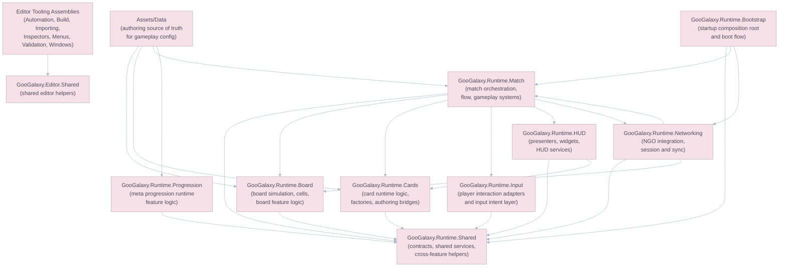
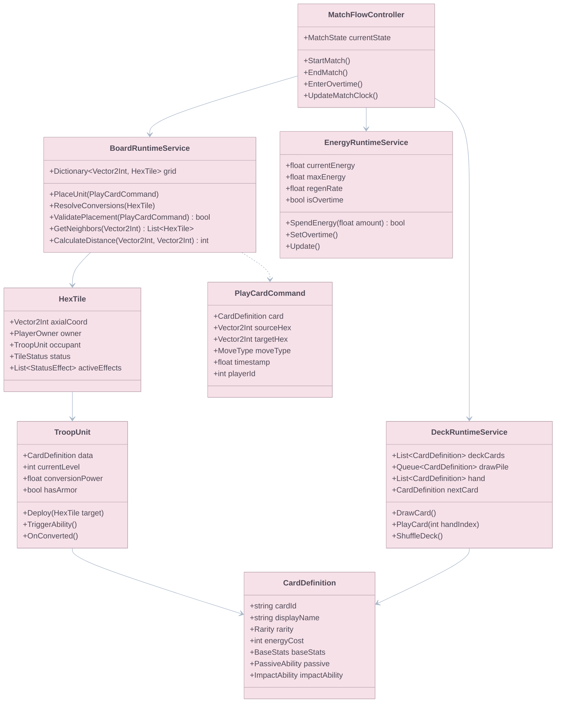
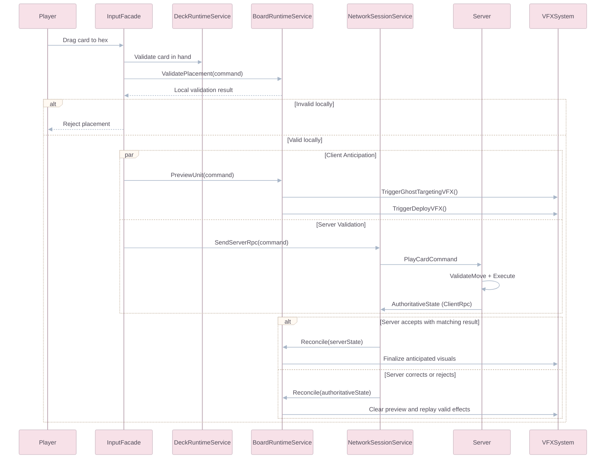
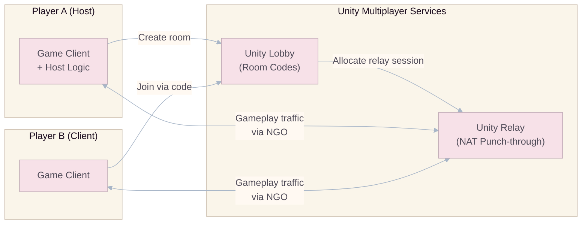
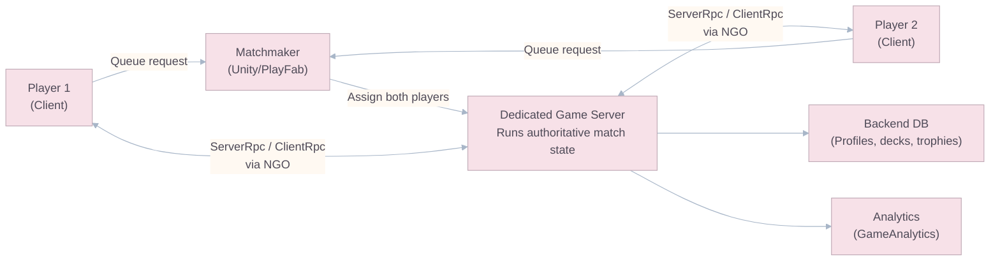
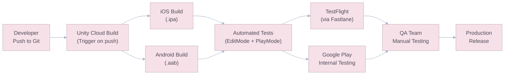

# Technical Architecture & Multiplayer

## Engine & Foundation

Goo Galaxy is built on **Unity 6 LTS**, using a GameObject/MonoBehaviour architecture with a deterministic rules layer for board simulation. The match board is bounded (61 hexes on the primary map), making it a good fit for authoritative server validation without requiring heavy ECS-style infrastructure in the MVP.

### Technology Stack

| Component             | Technology                    | Rationale                                                                              |
| :-------------------- | :---------------------------- | :------------------------------------------------------------------------------------- |
| **Engine**            | Unity 6 LTS                   | Mature mobile pipeline, URP support, broad tooling ecosystem.                          |
| **Language**          | C# (.NET Standard 2.1)        | Native Unity scripting language with strong testability for deterministic systems.     |
| **Networking**        | Netcode for GameObjects (NGO) | Official Unity networking stack; fits server-authoritative board actions well.         |
| **Session Services**  | Unity Multiplayer Services SDK | Preferred integration layer for sessions, Lobby, Relay, and Matchmaker in new Unity multiplayer projects. |
| **Backend**           | Unity Cloud / PlayFab         | Player identity, progression, economy, telemetry aggregation, and live config.         |
| **Audio**             | FMOD Studio                   | Adaptive music and scalable event-based audio integration.                             |
| **Analytics**         | GameAnalytics + Firebase      | Product KPIs, retention funneling, event instrumentation, and segmentation.            |
| **CI/CD**             | Unity Cloud Build + Fastlane  | Mobile build automation and distribution to TestFlight / Google Play Internal Testing. |
| **Version Control**   | Git + Git LFS                 | Clean source control for code plus large binary asset handling.                        |
| **Scripting Backend** | IL2CPP                        | Mobile-ready performance profile and required iOS build path.                          |

---

## Project Folder Structure

The repository now follows a feature-oriented runtime layout plus explicit content, data, and technical settings roots. This keeps gameplay code, authored data, and production assets separate without requiring a large future migration.

```text
Assets/
├── Art/
│   ├── Models/                 # Source and in-game models grouped by gameplay domain
│   └── Sprites/                # 2D gameplay, UI, and VFX sprite libraries
├── Audio/
│   ├── Music/                  # Long-form music tracks and adaptive stems
│   ├── SFX/                    # Gameplay, card, match, and UI sound effects
│   └── VO/                     # Voice-over and announcer content
├── Data/
│   ├── Board/                  # Board configs, tile definitions, map catalogs
│   ├── Cards/                  # Card definitions, balance sheets, catalogs
│   ├── Match/                  # Match rules, queue configs, flow settings
│   ├── Networking/             # Runtime payload schemas and networking config SOs
│   ├── Progression/            # Meta progression data and live-tuned config
│   └── Shared/                 # Cross-feature registries and global config assets
├── Editor/                     # Editor-only tooling and custom workflows
│   ├── Automation/             # Batch tasks, generators, setup scripts
│   ├── Build/                  # Build orchestration and release helpers
│   ├── Importing/              # AssetPostprocessor and import rules
│   ├── Inspectors/             # CustomEditor and PropertyDrawer code
│   ├── Menus/                  # Unity menu commands and quick actions
│   ├── Shared/                 # Shared editor-only helpers
│   ├── Validation/             # Project validation and content checks
│   └── Windows/                # EditorWindow tools and dashboards
├── Plugins/                    # Third-party SDKs and native/plugin dependencies
├── Prefabs/
│   ├── Board/                  # Board shells, presenters, and gameplay board prefabs
│   ├── Cards/                  # Unit and spell prefab variants
│   ├── HUD/                    # Reusable HUD screens and widgets
│   ├── Match/                  # Match flow and scene-level runtime prefabs
│   └── Shared/                 # Cross-feature reusable runtime prefabs
├── Resources/                  # Minimal runtime path-loaded assets only
│   ├── Bootstrap/              # Startup config, third-party bootstrap assets
│   ├── Shared/                 # Fallbacks and lightweight registries
│   └── UI/                     # Theme defaults and emergency UI fallback assets
├── Scenes/
│   ├── Bootstrap/              # Startup and service boot scenes
│   ├── Gameplay/               # Production gameplay scenes
│   └── Sandbox/                # Test and iteration scenes used during development
├── Scripts/
│   ├── Runtime/
│   │   ├── Board/              # Board simulation, views, commands, board services
│   │   ├── Bootstrap/          # App startup flow and runtime composition root
│   │   ├── Cards/              # Card runtime logic, authoring bridges, factories
│   │   ├── HUD/                # HUD presenters, components, views, services
│   │   ├── Input/              # Input adapters and interaction intent layer
│   │   ├── Match/              # Match orchestration, rules flow, systems
│   │   ├── Networking/         # NGO integration, session flow, sync systems
│   │   ├── Progression/        # Meta progression runtime feature code
│   │   └── Shared/             # Shared runtime services, contracts, and helpers
│   └── Tests/
│       ├── EditMode/           # Unit tests for deterministic logic and data validation
│       └── PlayMode/           # Integration tests for scene and networking flows
└── Settings/
    ├── Input/                 # Input actions and control maps
    ├── Networking/            # NGO runtime config assets
    ├── Profiles/              # Volume and other engine profile assets
    └── Rendering/             # URP pipeline assets and render templates
```

### Folder Responsibilities

| Folder        | Responsibility                                                                                                                                                                |
| :------------ | :---------------------------------------------------------------------------------------------------------------------------------------------------------------------------- |
| **Art**       | Stores visual content used by gameplay and UI. Keep source art grouped by use case, not by importer convenience.                                                              |
| **Audio**     | Stores music, SFX, and VO outside `Resources` so clips are referenced intentionally through prefabs, scenes, or authored data.                                                |
| **Data**      | Holds authored gameplay data such as `ScriptableObject` definitions, balance sheets, registries, and config assets. This is the canonical home for design-owned runtime data. |
| **Editor**    | Contains editor-only tooling used to validate, import, build, and inspect project content. It should never contain runtime gameplay logic.                                    |
| **Plugins**   | Contains third-party packages and native dependencies that should stay isolated from game-authored content.                                                                   |
| **Prefabs**   | Holds reusable runtime object graphs grouped by feature so prefab ownership stays aligned with gameplay domains.                                                              |
| **Resources** | Reserved for the small set of assets that must be loaded by path at startup or used as lightweight fallbacks. This folder must stay intentionally small.                      |
| **Scenes**    | Separates startup, production gameplay, and sandbox scenes so build flow and iteration flow do not get mixed together.                                                        |
| **Scripts**   | Holds runtime code organized by feature plus isolated test assemblies. The structure favors composition and domain ownership over generic technical buckets.                  |
| **Settings**  | Stores technical project assets such as input maps, rendering pipeline assets, networking config, and engine profiles.                                                        |

> **Repository Reality:** The current workspace already follows this feature-oriented `Assets` layout. Add new content inside these roots instead of reintroducing generic buckets like `Core`, `Managers`, `UI`, or large catch-all `Resources` folders.

> **Implementation Reminder:** The repo currently contains the runtime asmdef shells but not the final dependency wiring. Before gameplay implementation begins in earnest, explicitly wire assembly references and point the EditMode/PlayMode test assemblies at the runtime assemblies they validate.

### Assembly Definitions



> **Dependency Rule:** `Runtime.Shared` stays small and stable. Feature assemblies own their domain logic. `Match` orchestrates gameplay flow, `Networking` owns transport-facing concerns, `HUD` renders state and emits intents, and authored assets in `Assets/Data` remain the source of truth for tunable content.

---

## Runtime Feature Class Hierarchy



> **Placement Rule:** In the real project, these classes do not need to inherit from a single "manager" family. The intent is feature ownership: board logic lives under `Assets/Scripts/Runtime/Board`, match orchestration under `Assets/Scripts/Runtime/Match`, card runtime logic under `Assets/Scripts/Runtime/Cards`, and authored definitions under `Assets/Data`.

---

## Data Flow Pipeline



> **Implementation Note:** NGO supports server-authoritative play well, but full rollback prediction is an advanced custom layer. For Goo Galaxy's discrete board actions, use **client anticipation** (target highlights, ghost previews, optimistic local feedback) for MVP and add heavier reconciliation only if playtests prove it necessary.

## Multiplayer Services Integration

For new implementation work, Goo Galaxy should prefer the **Unity Multiplayer Services SDK** as the integration entry point above direct service-by-service setup.

### Why Prefer MPS SDK

- It unifies session creation, Lobby, Relay, and Matchmaker flows under one setup surface.
- It reduces manual service glue code for host-client testing and later dedicated-server migration.
- It keeps the project aligned with Unity's current multiplayer guidance for Unity 6 era projects.

NGO remains the runtime transport and state-sync layer for board actions. MPS SDK owns the **session lifecycle**, not the gameplay simulation.

---

## Networking Architecture

### MVP Phase: Host-Client via MPS SDK Sessions



- **Suitable for:** Trusted playtesters, closed beta.
- **Limitation:** Host has latency advantage. No anti-cheat.
- **Preferred setup:** Create or join sessions through **MPS SDK**, with Lobby and Relay configured behind the session flow.

### Production Phase: Dedicated Server-Authoritative



### Match Resilience & Reconnect

- Every live match keeps an authoritative command log and latest authoritative board snapshot.
- Clients that disconnect may reconnect to the same session within the gameplay grace window defined in `01_Mechanics_and_Core_Gameplay.md`.
- Rejoining clients receive the latest authoritative snapshot first, then any remaining unresolved presentation events.
- A reconnection never trusts client-predicted state. The server is always the source of truth.

### Replay Integrity

- Replays are reconstructed from the authoritative command log, not from client video capture.
- Every command entry should include match ID, acting player, card ID, source, target, move type, config version, and authoritative timestamp.
- Replay files must be versioned against the rules/config build that produced them so old replays remain reproducible after balance changes.

### NetworkVariable Strategy

Critical game state synchronized via `NetworkVariable<T>`:

```csharp
public class NetworkedHexTile : NetworkBehaviour
{
    public NetworkVariable<int> OwnerId = new(
        readPerm: NetworkVariableReadPermission.Everyone,
        writePerm: NetworkVariableWritePermission.Server
    );

    public NetworkVariable<int> OccupantCardId = new(
        readPerm: NetworkVariableReadPermission.Everyone,
        writePerm: NetworkVariableWritePermission.Server
    );

    public NetworkVariable<TileStatus> Status = new(
        readPerm: NetworkVariableReadPermission.Everyone,
        writePerm: NetworkVariableWritePermission.Server
    );
}
```

| Data                | Sync Method                      | Frequency           |
| :------------------ | :------------------------------- | :------------------ |
| Hex ownership       | `NetworkVariable<int>`           | On change           |
| Unit presence       | `NetworkVariable<int>` (card ID) | On change           |
| Tile status effects | `NetworkVariable<TileStatus>`    | On change           |
| Energy levels       | `NetworkVariable<float>`         | Every 0.5 sec       |
| Match timer         | `NetworkVariable<float>`         | Every 1.0 sec       |
| Score               | `NetworkVariable<int>`           | On change           |
| Match state         | `ClientRpc` broadcast            | On state transition |

---

## Performance Budgets

| Metric                  | Target                 | Minimum Spec Device           |
| :---------------------- | :--------------------- | :---------------------------- |
| **Frame Rate**          | 60 FPS stable          | iPhone SE (2020) / Galaxy A14 |
| **Draw Calls**          | < 100 per frame        | —                             |
| **Triangles**           | < 50,000 per frame     | —                             |
| **Memory (Runtime)**    | < 300 MB               | —                             |
| **App Size (Download)** | < 150 MB               | —                             |
| **App Size (Install)**  | < 500 MB               | —                             |
| **Loading Time**        | < 5 sec (cold start)   | —                             |
| **Match Load Time**     | < 3 sec                | —                             |
| **Network Bandwidth**   | < 5 KB/s per player    | 3G connection                 |
| **Battery Drain**       | < 15% per hour of play | —                             |

### Optimization Strategies

| Strategy                    | Implementation                                                                                                                                           |
| :-------------------------- | :------------------------------------------------------------------------------------------------------------------------------------------------------- |
| **Object Pooling**          | All VFX particles, conversion animations, and hazard indicators are pre-allocated and recycled. Zero runtime `Instantiate()`/`Destroy()` during matches. |
| **Texture Compression**     | ASTC format on all mobile targets. Max texture size: 512x512 for units, 1024x1024 for board backgrounds.                                                 |
| **Sprite Atlasing**         | All UI sprites packed into texture atlases. One atlas per screen to minimize draw calls.                                                                 |
| **GetComponent Caching**    | All `GetComponent<T>()` calls cached in `Awake()`. Never called in `Update()`.                                                                           |
| **GC Allocation Avoidance** | No string concatenation in hot paths. No LINQ in gameplay code. Pre-allocated lists/arrays for neighbor queries.                                         |
| **Audio Streaming**         | BGM streams from disk. SFX decompressed on load. Max 16 simultaneous voices.                                                                             |
| **LOD for VFX**             | On low-end devices, particle count halved and secondary effects disabled.                                                                                |

---

## DevOps & CI/CD Pipeline



### Branch Strategy

Goo Galaxy should use a lightweight **GitHub Flow** model: a single stable `main` branch plus short-lived topic branches merged through pull requests.

| Branch      | Purpose                                                                                        | Merge Target                  |
| :---------- | :--------------------------------------------------------------------------------------------- | :---------------------------- |
| `main`      | Always-stable branch. Every commit should remain buildable and releasable to internal testers. | —                             |
| `feature/*` | New gameplay, UI, tooling, docs, or refactor work.                                             | `main`                        |
| `fix/*`     | Bug fixes, regressions, or production issues discovered during testing.                        | `main`                        |
| `chore/*`   | CI, dependency updates, project organization, asset pipeline, and non-feature maintenance.     | `main`                        |
| `spike/*`   | Short-lived technical exploration or prototype branches that may be discarded after learning.  | `main` or close without merge |

- Branch from `main` for every new task.
- Open small PRs back into `main` as soon as the work is coherent and testable.
- Ship internal builds, QA builds, and tagged releases from `main`.
- Do not keep a long-lived `develop` branch.
- Do not create separate `release/*` branches unless a publishing platform forces a temporary stabilization branch.
