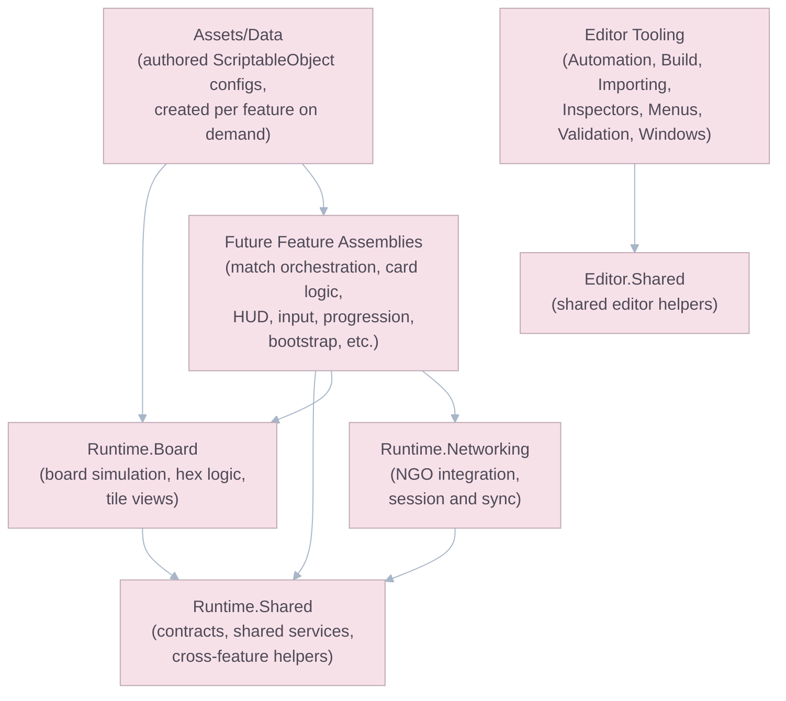
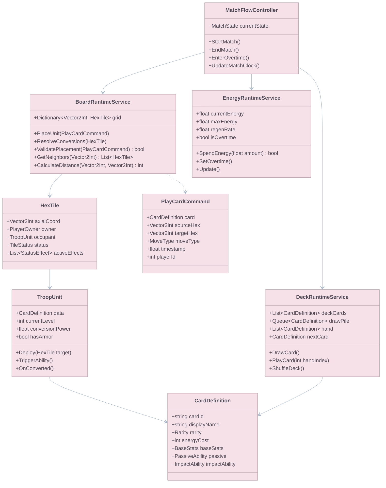
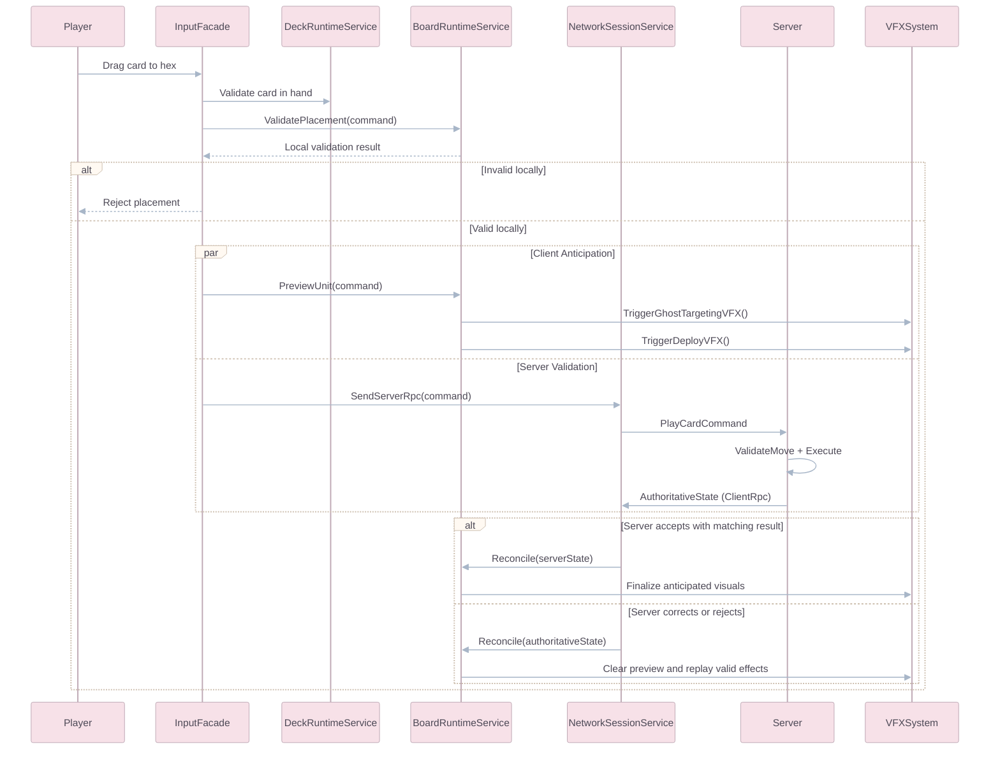
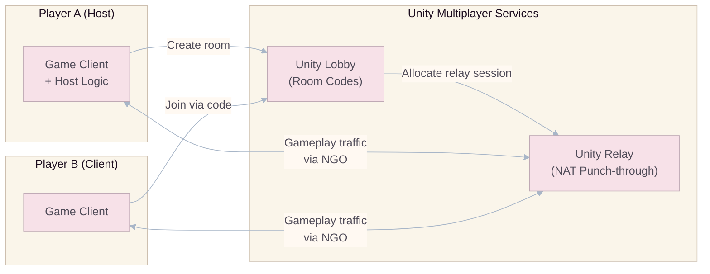
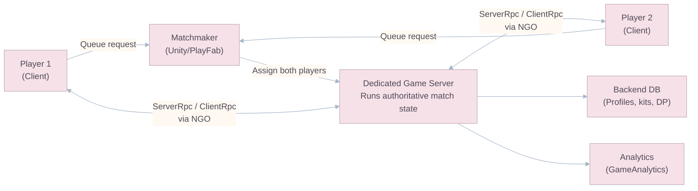
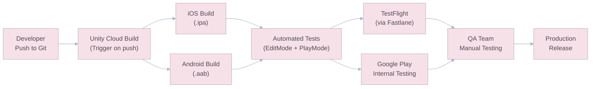

# Technical Architecture & Multiplayer

## Engine & Foundation

Goo Galaxy is built on **Unity 6 LTS**, following a **SOLID + MVP (Model-View-Presenter)** architecture grounded in **GameObject/MonoBehaviour** composition. All gameplay systems are plain C# classes assembled on GameObjects. The board simulation uses a deterministic rules layer that runs independently from presentation, keeping the match bounded (61 hexes on the primary map) and server-authoritative validation straightforward. Feature domains are separated into assemblies with clear dependency direction (`Shared` ← everyone else), and each domain owns its Models, Presenters, and Views inline — not in separate technical buckets.

### Technology Stack

| Component             | Technology                     | Rationale                                                                                                 |
| :-------------------- | :----------------------------- | :-------------------------------------------------------------------------------------------------------- |
| **Engine**            | Unity 6 LTS                    | Mature mobile pipeline, URP support, broad tooling ecosystem.                                             |
| **Language**          | C# (.NET Standard 2.1)         | Native Unity scripting language with strong testability for deterministic systems.                        |
| **Networking**        | Netcode for GameObjects (NGO)  | Official Unity networking stack; fits server-authoritative board actions well.                            |
| **Session Services**  | Unity Multiplayer Services SDK | Preferred integration layer for sessions, Lobby, Relay, and Matchmaker in new Unity multiplayer projects. |
| **Backend**           | Unity Cloud / PlayFab          | Player identity, progression, economy, telemetry aggregation, and live config.                            |
| **Audio**             | FMOD Studio                    | Adaptive music and scalable event-based audio integration.                                                |
| **Analytics**         | GameAnalytics + Firebase       | Product KPIs, retention funneling, event instrumentation, and segmentation.                               |
| **CI/CD**             | Unity Cloud Build + Fastlane   | Mobile build automation and distribution to TestFlight / Google Play Internal Testing.                    |
| **Version Control**   | Git + Git LFS                  | Clean source control for code plus large binary asset handling.                                           |
| **Scripting Backend** | IL2CPP                         | Mobile-ready performance profile and required iOS build path.                                             |

---

## Project Folder Structure

The repository follows a feature-oriented runtime layout plus explicit content, data, and technical settings roots. This keeps gameplay code, authored data, and production assets separate.

> **On-demand rule:** Subfolders under `Assets/Scripts/Runtime/` are created only when a feature domain needs code. The three runtime assemblies present today are `Board`, `Networking`, and `Shared`. Additional feature assemblies (match orchestration, card logic, HUD, input, progression, etc.) are scaffolded when their respective systems are implemented — not pre-allocated. The same applies to `Data/` and `Prefabs/` subfolders: each is created alongside the feature it serves.

```text
Assets/
├── Art/
│   ├── Models/                 # Source and in-game models
│   └── Sprites/                # 2D gameplay, UI, and VFX sprite libraries
├── Audio/
│   ├── Music/                  # Long-form music tracks and adaptive stems
│   ├── SFX/                    # Gameplay, card, match, and UI sound effects
│   └── VO/                     # Voice-over and announcer content
├── Data/                       # Authored ScriptableObject assets (subfolders created per feature on demand)
├── Editor/                     # Editor-only tooling and custom workflows
│   ├── Automation/             # Batch tasks, generators, setup scripts
│   ├── Build/                  # Build orchestration and release helpers
│   ├── Importing/              # AssetPostprocessor and import rules
│   ├── Inspectors/             # CustomEditor and PropertyDrawer code
│   ├── Menus/                  # Unity menu commands and quick actions
│   ├── Shared/                 # Shared editor-only helpers
│   ├── Validation/             # Project validation and content checks
│   └── Windows/                # EditorWindow tools and dashboards
├── Plugins/                    # Third-party SDKs and native/plugin dependencies
│   └── Roslyn/                 # Roslyn analyzer DLLs for code quality
├── Prefabs/                    # Reusable runtime prefabs (subfolders created per feature on demand)
├── Scenes/
│   ├── Bootstrap/              # Startup and service boot scenes
│   ├── Gameplay/               # Production gameplay scenes
│   └── Sandbox/                # Test and iteration scenes used during development
├── Scripts/
│   ├── Runtime/
│   │   ├── Board/              # GooGalaxy.Runtime.Board — board simulation, hex logic, tile views
│   │   ├── Networking/         # GooGalaxy.Runtime.Networking — NGO integration, session flow, sync
│   │   └── Shared/             # GooGalaxy.Runtime.Shared — cross-feature contracts, helpers, services
│   └── Tests/
│       ├── EditMode/           # Unit tests for deterministic logic and data validation
│       └── PlayMode/           # Integration tests for scene and networking flows
└── Settings/
    ├── Input/                  # Input actions and control maps
    ├── Networking/             # NGO runtime config assets
    ├── Profiles/               # Volume and other engine profile assets
    └── Rendering/              # URP pipeline assets and render templates
```

### Folder Responsibilities

| Folder       | Responsibility                                                                                                                                                                  |
| :----------- | :------------------------------------------------------------------------------------------------------------------------------------------------------------------------------ |
| **Art**      | Visual content grouped by use case (`Models/`, `Sprites/`). Not organized by importer convenience.                                                                              |
| **Audio**    | Music, SFX, and VO stored outside `Resources` — referenced intentionally through prefabs, scenes, or authored data.                                                             |
| **Data**     | Authored `ScriptableObject` definitions, balance sheets, registries, and config assets. The canonical home for design-tunable values. Subfolders created per feature on demand. |
| **Editor**   | Editor-only tooling (Automation, Build, Importing, Inspectors, Menus, Shared, Validation, Windows). Never contains runtime gameplay logic.                                      |
| **Plugins**  | Third-party SDKs and native dependencies isolated from game-authored content. Currently hosts Roslyn analyzers.                                                                 |
| **Prefabs**  | Reusable runtime object graphs. Subfolders created per feature on demand.                                                                                                       |
| **Scenes**   | Separates startup (`Bootstrap/`), production gameplay (`Gameplay/`), and sandbox iteration scenes (`Sandbox/`).                                                                 |
| **Scripts**  | Runtime code organized by feature domain (`Board`, `Networking`, `Shared`) plus isolated test assemblies (`EditMode/`, `PlayMode/`). New feature folders added on demand.       |
| **Settings** | Technical project assets: input maps, URP pipeline assets, networking config, engine profiles.                                                                                  |

> **Repository Reality:** The current workspace follows this feature-oriented `Assets` layout. Add new content inside these roots. Do not reintroduce generic buckets like `Core`, `Managers`, `UI`, or large catch-all `Resources` folders.

> **On-demand scaffolding:** When a new feature domain needs code (e.g., `Cards`, `Match`, `HUD`), create both the runtime assembly folder (`Assets/Scripts/Runtime/{Feature}/` with its `.asmdef`) and the data folder (`Assets/Data/{Feature}/`) in the same changeset. Prefab and test folders follow when the feature has prefabs or tests to place.

### Assembly Definitions

The runtime assembly graph follows a strict dependency direction: **`Shared` ← everything else**. `Shared` has zero dependencies on other feature assemblies. Cross-feature references (e.g., match orchestration depending on board logic) are wired only when both assemblies exist.


```mermaid
%%{init: {"theme":"base","themeVariables":{"primaryColor":"#F7E1E8","secondaryColor":"#DCEBF7","tertiaryColor":"#E4F3E1","primaryBorderColor":"#BFA9B5","lineColor":"#A8B6C8","primaryTextColor":"#4E4A57","clusterBkg":"#FAF5EA","clusterBorder":"#CDBFAF","edgeLabelBackground":"#FFF9F2","noteBkgColor":"#F7F1FA","noteTextColor":"#4E4A57","taskBkgColor":"#DCEBF7","taskTextColor":"#4E4A57","taskTextOutsideColor":"#4E4A57","sectionBkgColor":"#E4F3E1","sectionBorderColor":"#BCD0B9","gridColor":"#E8DDD3","todayLineColor":"#C7A7B5","actorBkg":"#F7E1E8","actorBorder":"#BFA9B5","actorTextColor":"#4E4A57","signalColor":"#A8B6C8","signalTextColor":"#4E4A57","labelBoxBkgColor":"#FFF9F2","labelBoxBorderColor":"#CDBFAF","labelTextColor":"#4E4A57"}}}%%
graph TD
    SHARED["Runtime.Shared<br/>(contracts, shared services,<br/>cross-feature helpers)"]
    BOARD["Runtime.Board<br/>(board simulation, hex logic,<br/>tile views)"] --> SHARED
    NET["Runtime.Networking<br/>(NGO integration,<br/>session and sync)"] --> SHARED
    FEATURE["Future Feature Assemblies<br/>(match orchestration, card logic,<br/>HUD, input, progression,<br/>bootstrap, etc.)"] --> SHARED
    FEATURE --> BOARD
    FEATURE --> NET
    DATA["Assets/Data<br/>(authored ScriptableObject configs,<br/>created per feature on demand)"] --> BOARD
    DATA --> FEATURE
    ESHARED["Editor.Shared<br/>(shared editor helpers)"]
    ETOOLS["Editor Tooling<br/>(Automation, Build, Importing,<br/>Inspectors, Menus, Validation, Windows)"] --> ESHARED
```

> **Dependency Rule:** `Runtime.Shared` stays small and stable — contracts, interfaces, shared enums, and cross-feature helpers. It never depends on other feature assemblies. Each feature assembly owns its domain logic, and authored assets in `Assets/Data` remain the single source of truth for tunable content.

---

## Runtime Feature Class Hierarchy


```mermaid
%%{init: {"theme":"base","themeVariables":{"primaryColor":"#F7E1E8","secondaryColor":"#DCEBF7","tertiaryColor":"#E4F3E1","primaryBorderColor":"#BFA9B5","lineColor":"#A8B6C8","primaryTextColor":"#4E4A57","clusterBkg":"#FAF5EA","clusterBorder":"#CDBFAF","edgeLabelBackground":"#FFF9F2","noteBkgColor":"#F7F1FA","noteTextColor":"#4E4A57","taskBkgColor":"#DCEBF7","taskTextColor":"#4E4A57","taskTextOutsideColor":"#4E4A57","sectionBkgColor":"#E4F3E1","sectionBorderColor":"#BCD0B9","gridColor":"#E8DDD3","todayLineColor":"#C7A7B5","actorBkg":"#F7E1E8","actorBorder":"#BFA9B5","actorTextColor":"#4E4A57","signalColor":"#A8B6C8","signalTextColor":"#4E4A57","labelBoxBkgColor":"#FFF9F2","labelBoxBorderColor":"#CDBFAF","labelTextColor":"#4E4A57"}}}%%
classDiagram
    class MatchFlowController {
        +MatchState currentState
        +StartMatch()
        +EndMatch()
        +EnterOvertime()
        +UpdateMatchClock()
    }

    class BoardRuntimeService {
        +Dictionary~Vector2Int, HexTile~ grid
        +PlaceUnit(PlayCardCommand)
        +ResolveConversions(HexTile)
        +ValidatePlacement(PlayCardCommand) bool
        +GetNeighbors(Vector2Int) List~HexTile~
        +CalculateDistance(Vector2Int, Vector2Int) int
    }

    class HexTile {
        +Vector2Int axialCoord
        +PlayerOwner owner
        +TroopUnit occupant
        +TileStatus status
        +List~StatusEffect~ activeEffects
    }

    class TroopUnit {
        +CardDefinition data
        +int currentLevel
        +float conversionPower
        +bool hasArmor
        +Deploy(HexTile target)
        +TriggerAbility()
        +OnConverted()
    }

    class CardDefinition {
        +string cardId
        +string displayName
        +Rarity rarity
        +int energyCost
        +BaseStats baseStats
        +PassiveAbility passive
        +ImpactAbility impactAbility
    }

    class EnergyRuntimeService {
        +float currentEnergy
        +float maxEnergy
        +float regenRate
        +bool isOvertime
        +SpendEnergy(float amount) bool
        +SetOvertime()
        +Update()
    }

    class DeckRuntimeService {
        +List~CardDefinition~ deckCards
        +Queue~CardDefinition~ drawPile
        +List~CardDefinition~ hand
        +CardDefinition nextCard
        +DrawCard()
        +PlayCard(int handIndex)
        +ShuffleDeck()
    }

    class PlayCardCommand {
        +CardDefinition card
        +Vector2Int sourceHex
        +Vector2Int targetHex
        +MoveType moveType
        +float timestamp
        +int playerId
    }

    MatchFlowController --> BoardRuntimeService
    MatchFlowController --> EnergyRuntimeService
    MatchFlowController --> DeckRuntimeService
    BoardRuntimeService --> HexTile
    HexTile --> TroopUnit
    TroopUnit --> CardDefinition
    DeckRuntimeService --> CardDefinition
    BoardRuntimeService ..> PlayCardCommand
```

> **Placement Rule:** These classes illustrate domain ownership boundaries, not inheritance hierarchies. Board logic lives under `Assets/Scripts/Runtime/Board`, authored definitions under `Assets/Data`, and future domains (match orchestration, card logic, HUD, etc.) follow the same pattern — created on demand. Each domain follows SOLID + MVP: Models hold data/state, Views (UI Toolkit) render and emit events, Presenters handle logic between them — all composed via `MonoBehaviour` GameObjects.

---

## Data Flow Pipeline


```mermaid
%%{init: {"theme":"base","themeVariables":{"primaryColor":"#F7E1E8","secondaryColor":"#DCEBF7","tertiaryColor":"#E4F3E1","primaryBorderColor":"#BFA9B5","lineColor":"#A8B6C8","primaryTextColor":"#4E4A57","clusterBkg":"#FAF5EA","clusterBorder":"#CDBFAF","edgeLabelBackground":"#FFF9F2","noteBkgColor":"#F7F1FA","noteTextColor":"#4E4A57","taskBkgColor":"#DCEBF7","taskTextColor":"#4E4A57","taskTextOutsideColor":"#4E4A57","sectionBkgColor":"#E4F3E1","sectionBorderColor":"#BCD0B9","gridColor":"#E8DDD3","todayLineColor":"#C7A7B5","actorBkg":"#F7E1E8","actorBorder":"#BFA9B5","actorTextColor":"#4E4A57","signalColor":"#A8B6C8","signalTextColor":"#4E4A57","labelBoxBkgColor":"#FFF9F2","labelBoxBorderColor":"#CDBFAF","labelTextColor":"#4E4A57"}}}%%
sequenceDiagram
    participant Player
    participant InputFacade
    participant DeckRuntimeService
    participant BoardRuntimeService
    participant NetworkSessionService
    participant Server
    participant VFXSystem

    Player->>InputFacade: Drag card to hex
    InputFacade->>DeckRuntimeService: Validate card in hand
    InputFacade->>BoardRuntimeService: ValidatePlacement(command)
    BoardRuntimeService-->>InputFacade: Local validation result

    alt Invalid locally
        InputFacade-->>Player: Reject placement
    else Valid locally
        par Client Anticipation
            InputFacade->>BoardRuntimeService: PreviewUnit(command)
            BoardRuntimeService->>VFXSystem: TriggerGhostTargetingVFX()
            BoardRuntimeService->>VFXSystem: TriggerDeployVFX()
        and Server Validation
            InputFacade->>NetworkSessionService: SendServerRpc(command)
            NetworkSessionService->>Server: PlayCardCommand
            Server->>Server: ValidateMove + Execute
            Server->>NetworkSessionService: AuthoritativeState (ClientRpc)
        end

        alt Server accepts with matching result
            NetworkSessionService->>BoardRuntimeService: Reconcile(serverState)
            BoardRuntimeService->>VFXSystem: Finalize anticipated visuals
        else Server corrects or rejects
            NetworkSessionService->>BoardRuntimeService: Reconcile(authoritativeState)
            BoardRuntimeService->>VFXSystem: Clear preview and replay valid effects
        end
    end
```

> **Implementation Note:** NGO supports server-authoritative play well, but full rollback prediction is an advanced custom layer. For Goo Galaxy's discrete board actions, use **client anticipation** (target highlights, ghost previews, optimistic local feedback) for MVP and add heavier reconciliation only if playtests prove it necessary.

## Multiplayer Services Integration

For new implementation work, Goo Galaxy should prefer the **Unity Multiplayer Services SDK** as the integration entry point above direct service-by-service setup.

### Why Prefer MPS SDK

- It unifies session creation, Lobby, Relay, and Matchmaker flows under one setup surface.
- It reduces manual service glue code for host-client testing and later dedicated-server migration.
- It keeps the project aligned with Unity's current multiplayer guidance for Unity 6 era projects.

NGO remains the runtime transport and state-sync layer for board actions. MPS SDK owns the **session lifecycle**, not the gameplay simulation.

---

## Networking Architecture

### MVP Phase: Host-Client via MPS SDK Sessions


```mermaid
%%{init: {"theme":"base","themeVariables":{"primaryColor":"#F7E1E8","secondaryColor":"#DCEBF7","tertiaryColor":"#E4F3E1","primaryBorderColor":"#BFA9B5","lineColor":"#A8B6C8","primaryTextColor":"#4E4A57","clusterBkg":"#FAF5EA","clusterBorder":"#CDBFAF","edgeLabelBackground":"#FFF9F2","noteBkgColor":"#F7F1FA","noteTextColor":"#4E4A57","taskBkgColor":"#DCEBF7","taskTextColor":"#4E4A57","taskTextOutsideColor":"#4E4A57","sectionBkgColor":"#E4F3E1","sectionBorderColor":"#BCD0B9","gridColor":"#E8DDD3","todayLineColor":"#C7A7B5","actorBkg":"#F7E1E8","actorBorder":"#BFA9B5","actorTextColor":"#4E4A57","signalColor":"#A8B6C8","signalTextColor":"#4E4A57","labelBoxBkgColor":"#FFF9F2","labelBoxBorderColor":"#CDBFAF","labelTextColor":"#4E4A57"}}}%%
flowchart LR
    subgraph "Player A (Host)"
        HA["Game Client<br/>+ Host Logic"]
    end
    subgraph "Unity Multiplayer Services"
        RELAY["Unity Relay<br/>(NAT Punch-through)"]
        LOBBY["Unity Lobby<br/>(Room Codes)"]
    end
    subgraph "Player B (Client)"
        HB["Game Client"]
    end

    HA -->|"Create room"| LOBBY
    HB -->|"Join via code"| LOBBY
    LOBBY -->|"Allocate relay session"| RELAY
    HA <-->|"Gameplay traffic<br/>via NGO"| RELAY
    HB <-->|"Gameplay traffic<br/>via NGO"| RELAY
```

- **Suitable for:** Trusted playtesters, closed beta.
- **Limitation:** Host has latency advantage. No anti-cheat.
- **Preferred setup:** Create or join sessions through **MPS SDK**, with Lobby and Relay configured behind the session flow.

### Production Phase: Dedicated Server-Authoritative


```mermaid
%%{init: {"theme":"base","themeVariables":{"primaryColor":"#F7E1E8","secondaryColor":"#DCEBF7","tertiaryColor":"#E4F3E1","primaryBorderColor":"#BFA9B5","lineColor":"#A8B6C8","primaryTextColor":"#4E4A57","clusterBkg":"#FAF5EA","clusterBorder":"#CDBFAF","edgeLabelBackground":"#FFF9F2","noteBkgColor":"#F7F1FA","noteTextColor":"#4E4A57","taskBkgColor":"#DCEBF7","taskTextColor":"#4E4A57","taskTextOutsideColor":"#4E4A57","sectionBkgColor":"#E4F3E1","sectionBorderColor":"#BCD0B9","gridColor":"#E8DDD3","todayLineColor":"#C7A7B5","actorBkg":"#F7E1E8","actorBorder":"#BFA9B5","actorTextColor":"#4E4A57","signalColor":"#A8B6C8","signalTextColor":"#4E4A57","labelBoxBkgColor":"#FFF9F2","labelBoxBorderColor":"#CDBFAF","labelTextColor":"#4E4A57"}}}%%
flowchart LR
    P1["Player 1<br/>(Client)"] -->|"Queue request"| MM["Matchmaker<br/>(Unity/PlayFab)"]
    P2["Player 2<br/>(Client)"] -->|"Queue request"| MM
    MM -->|"Assign both players"| GS["Dedicated Game Server<br/>Runs authoritative match state"]
    GS <-->|"ServerRpc / ClientRpc<br/>via NGO"| P1
    GS <-->|"ServerRpc / ClientRpc<br/>via NGO"| P2
    GS --> DB["Backend DB<br/>(Profiles, kits, DP)"]
    GS --> AN["Analytics<br/>(GameAnalytics)"]
```

### Match Resilience & Reconnect

- Every live match keeps an authoritative command log and latest authoritative board snapshot.
- Clients that disconnect may reconnect to the same session within the gameplay grace window defined in `01_Mechanics_and_Core_Gameplay.md`.
- Rejoining clients receive the latest authoritative snapshot first, then any remaining unresolved presentation events.
- A reconnection never trusts client-predicted state. The server is always the source of truth.

### Replay Integrity

- Replays are reconstructed from the authoritative command log, not from client video capture.
- Every command entry should include match ID, acting player, card ID, source, target, move type, config version, and authoritative timestamp.
- Replay files must be versioned against the rules/config build that produced them so old replays remain reproducible after balance changes.

### NetworkVariable Strategy

Critical game state synchronized via `NetworkVariable<T>`:

```csharp
public class NetworkedHexTile : NetworkBehaviour
{
    public NetworkVariable<int> OwnerId = new(
        readPerm: NetworkVariableReadPermission.Everyone,
        writePerm: NetworkVariableWritePermission.Server
    );

    public NetworkVariable<int> OccupantCardId = new(
        readPerm: NetworkVariableReadPermission.Everyone,
        writePerm: NetworkVariableWritePermission.Server
    );

    public NetworkVariable<TileStatus> Status = new(
        readPerm: NetworkVariableReadPermission.Everyone,
        writePerm: NetworkVariableWritePermission.Server
    );
}
```

| Data                | Sync Method                      | Frequency           |
| :------------------ | :------------------------------- | :------------------ |
| Hex ownership       | `NetworkVariable<int>`           | On change           |
| Unit presence       | `NetworkVariable<int>` (card ID) | On change           |
| Tile status effects | `NetworkVariable<TileStatus>`    | On change           |
| Energy levels       | `NetworkVariable<float>`         | Every 0.5 sec       |
| Match timer         | `NetworkVariable<float>`         | Every 1.0 sec       |
| Score               | `NetworkVariable<int>`           | On change           |
| Match state         | `ClientRpc` broadcast            | On state transition |

---

## Performance Budgets

| Metric                  | Target                 | Minimum Spec Device           |
| :---------------------- | :--------------------- | :---------------------------- |
| **Frame Rate**          | 60 FPS stable          | iPhone SE (2020) / Galaxy A14 |
| **Draw Calls**          | < 100 per frame        | —                             |
| **Triangles**           | < 50,000 per frame     | —                             |
| **Memory (Runtime)**    | < 300 MB               | —                             |
| **App Size (Download)** | < 150 MB               | —                             |
| **App Size (Install)**  | < 500 MB               | —                             |
| **Loading Time**        | < 5 sec (cold start)   | —                             |
| **Match Load Time**     | < 3 sec                | —                             |
| **Network Bandwidth**   | < 5 KB/s per player    | 3G connection                 |
| **Battery Drain**       | < 15% per hour of play | —                             |

### Optimization Strategies

| Strategy                    | Implementation                                                                                                                                           |
| :-------------------------- | :------------------------------------------------------------------------------------------------------------------------------------------------------- |
| **Object Pooling**          | All VFX particles, conversion animations, and hazard indicators are pre-allocated and recycled. Zero runtime `Instantiate()`/`Destroy()` during matches. |
| **Texture Compression**     | ASTC format on all mobile targets. Max texture size: 512x512 for units, 1024x1024 for board backgrounds.                                                 |
| **Sprite Atlasing**         | All UI sprites packed into texture atlases. One atlas per screen to minimize draw calls.                                                                 |
| **GetComponent Caching**    | All `GetComponent<T>()` calls cached in `Awake()`. Never called in `Update()`.                                                                           |
| **GC Allocation Avoidance** | No string concatenation in hot paths. No LINQ in gameplay code. Pre-allocated lists/arrays for neighbor queries.                                         |
| **Audio Streaming**         | BGM streams from disk. SFX decompressed on load. Max 16 simultaneous voices.                                                                             |
| **LOD for VFX**             | On low-end devices, particle count halved and secondary effects disabled.                                                                                |

---

## DevOps & CI/CD Pipeline


```mermaid
%%{init: {"theme":"base","themeVariables":{"primaryColor":"#F7E1E8","secondaryColor":"#DCEBF7","tertiaryColor":"#E4F3E1","primaryBorderColor":"#BFA9B5","lineColor":"#A8B6C8","primaryTextColor":"#4E4A57","clusterBkg":"#FAF5EA","clusterBorder":"#CDBFAF","edgeLabelBackground":"#FFF9F2","noteBkgColor":"#F7F1FA","noteTextColor":"#4E4A57","taskBkgColor":"#DCEBF7","taskTextColor":"#4E4A57","taskTextOutsideColor":"#4E4A57","sectionBkgColor":"#E4F3E1","sectionBorderColor":"#BCD0B9","gridColor":"#E8DDD3","todayLineColor":"#C7A7B5","actorBkg":"#F7E1E8","actorBorder":"#BFA9B5","actorTextColor":"#4E4A57","signalColor":"#A8B6C8","signalTextColor":"#4E4A57","labelBoxBkgColor":"#FFF9F2","labelBoxBorderColor":"#CDBFAF","labelTextColor":"#4E4A57"}}}%%
flowchart LR
    DEV["Developer<br/>Push to Git"] --> CI["Unity Cloud Build<br/>(Trigger on push)"]
    CI --> BUILD_IOS["iOS Build<br/>(.ipa)"]
    CI --> BUILD_AND["Android Build<br/>(.aab)"]
    BUILD_IOS --> TEST["Automated Tests<br/>(EditMode + PlayMode)"]
    BUILD_AND --> TEST
    TEST --> DIST_IOS["TestFlight<br/>(via Fastlane)"]
    TEST --> DIST_AND["Google Play<br/>Internal Testing"]
    DIST_IOS --> QA["QA Team<br/>Manual Testing"]
    DIST_AND --> QA
    QA --> RELEASE["Production<br/>Release"]
```

### Branch Strategy

Goo Galaxy should use a lightweight **GitHub Flow** model: a single stable `main` branch plus short-lived topic branches merged through pull requests.

| Branch      | Purpose                                                                                        | Merge Target                  |
| :---------- | :--------------------------------------------------------------------------------------------- | :---------------------------- |
| `main`      | Always-stable branch. Every commit should remain buildable and releasable to internal testers. | —                             |
| `feature/*` | New gameplay, UI, tooling, docs, or refactor work.                                             | `main`                        |
| `fix/*`     | Bug fixes, regressions, or production issues discovered during testing.                        | `main`                        |
| `chore/*`   | CI, dependency updates, project organization, asset pipeline, and non-feature maintenance.     | `main`                        |
| `spike/*`   | Short-lived technical exploration or prototype branches that may be discarded after learning.  | `main` or close without merge |

- Branch from `main` for every new task.
- Open small PRs back into `main` as soon as the work is coherent and testable.
- Ship internal builds, QA builds, and tagged releases from `main`.
- Do not keep a long-lived `develop` branch.
- Do not create separate `release/*` branches unless a publishing platform forces a temporary stabilization branch.

---

## Network Simulation & Quality of Experience (QoE)

### Alpha QA: Network Condition Testing

Multiplayer on mobile devices operates under highly variable network conditions (3G/4G/5G, public Wi-Fi, tunnels, elevators). The Alpha phase must validate that the game remains playable under real-world conditions, not just ideal lab settings.

**Tool:** Unity Transport Network Simulator (built into the Unity Transport package). This allows QA to inject controlled latency, jitter, and packet loss without physical hardware.

### QoE Thresholds

| Tier         | Latency Range |  Jitter  | Packet Loss | Player Experience                                                      |  HUD Indicator  |
| :----------- | :-----------: | :------: | :---------: | :--------------------------------------------------------------------- | :-------------: |
| **Ideal**    |   < 100 ms    | < 10 ms  |   < 0.5%    | Responsive. Client prediction feels instant.                           | 🟢 Green Wi-Fi  |
| **Good**     |  100-200 ms   | 10-30 ms |   0.5-2%    | Client prediction covers the gap. Minor ghosting on fast deploys.      | 🟡 Yellow Wi-Fi |
| **Playable** |  200-300 ms   | 30-50 ms |    2-5%     | Noticeable delay. "Poor Connection" warning shown to player.           | 🟠 Orange Wi-Fi |
| **Poor**     |   > 300 ms    | > 50 ms  |    > 5%     | Match pauses. Reconnect prompt offered. If unresolved in 30s, forfeit. |  🔴 Red Wi-Fi   |

### Network Health Indicator (HUD)

A small Wi-Fi icon in the top-right corner of the match HUD shows the player's current connection quality using the color tiers above. This is a **cosmetic-only client-side indicator** — the server is always authoritative regardless of what the client displays.

- Tapping the icon opens a tooltip with the current latency in milliseconds.
- If the connection drops to **Poor** for more than 5 seconds, the icon pulses and a "Reconnecting..." overlay appears.

### Alpha Test Matrix

| Test Scenario               | Parameters                 | Duration per Tester | Success Criteria                               |
| :-------------------------- | :------------------------- | :-----------------: | :--------------------------------------------- |
| **Ideal Wi-Fi**             | <50ms latency, 0% loss     |      3 matches      | Baseline for comparison                        |
| **4G Mobile Data**          | 50-150ms, variable jitter  |      5 matches      | All matches complete without disconnect        |
| **3G / Weak Signal**        | 150-300ms, 2-5% loss       |      3 matches      | Matches remain playable (QoE ≥ Playable)       |
| **Wi-Fi with Interference** | 50-200ms spikes, 1-3% loss |      3 matches      | No disconnects; client prediction masks jitter |
| **NAT Traversal Failure**   | Relay fallback             |      1 session      | Relay connection succeeds within 10s           |

---

## Official Folder & Assembly Convention

The project follows a **feature-oriented runtime layout** where code lives under `Assets/Scripts/Runtime/{Feature}/` and authored data lives under `Assets/Data/{Feature}/`. The following conventions are the **official project standard** and must be followed for all new content.

### Runtime Code Convention

Feature assemblies are created on demand. Currently only these exist:

```
Assets/
└── Scripts/
    └── Runtime/
        ├── Board/          # GooGalaxy.Runtime.Board.asmdef
        ├── Networking/     # GooGalaxy.Runtime.Networking.asmdef
        └── Shared/         # GooGalaxy.Runtime.Shared.asmdef
```

When a feature needs code, create the folder + `.asmdef` together under `Assets/Scripts/Runtime/{Feature}/`. The naming convention is `GooGalaxy.Runtime.{Feature}`. Examples of future feature domains: match orchestration, card/deck logic, UI Toolkit HUD, input interpretation, meta progression, and bootstrap initialization — each created when needed, not before.

### Key Rules

| Rule                                                            | Explanation                                                                                                                                                              |
| :-------------------------------------------------------------- | :----------------------------------------------------------------------------------------------------------------------------------------------------------------------- |
| **`Scripts/` is an organizational container, not a namespace.** | The folder name `Scripts` has no semantic meaning to Unity. Assembly boundaries are defined solely by `.asmdef` files.                                                   |
| **One `.asmdef` per feature folder.**                           | Each folder under `Scripts/Runtime/` contains exactly one Assembly Definition asset that declares its dependencies.                                                      |
| **`Runtime.Shared` stays small and stable.**                    | It contains only contracts, interfaces, shared structs/enums, and cross-feature helpers. It must NOT depend on any other feature assembly.                               |
| **Feature assemblies own their domain.**                        | Board owns hex grid logic. Match orchestration owns gameplay flow. Card logic owns deck/specimen runtime. No circular dependencies.                                      |
| **Authored data is NOT code.**                                  | `Assets/Data/` holds `ScriptableObject` assets and JSON configs. It is the canonical source of truth for design-tunable values. Subfolders created per feature.          |
| **New features are scaffolded on demand.**                      | When a feature domain needs code, create `Assets/Scripts/Runtime/{Feature}/` with its `.asmdef` and `Assets/Data/{Feature}/` together. Don't pre-allocate empty folders. |
| **Editor code is separate.**                                    | Editor-only tooling lives under `Assets/Editor/{ToolDomain}/`. Never reference editor assemblies from runtime assemblies.                                                |
| **GameObject/MonoBehaviour + SOLID + MVP.**                     | Each domain uses plain C# classes composed on `MonoBehaviour` GameObjects. Models hold data, Views (UI Toolkit) render, Presenters mediate.                              |

> **Why this matters:** This convention prevents the common Unity anti-pattern of sprawling `Core/`, `Managers/`, and `UI/` folders that accumulate unrelated code. Feature ownership stays clear, dependency graphs stay auditable, and new contributors can locate code without tribal knowledge. The SOLID + MVP pattern keeps each domain independently testable — Models can be unit-tested without Unity, Presenters can be tested with mocked Views, and Views stay thin.
