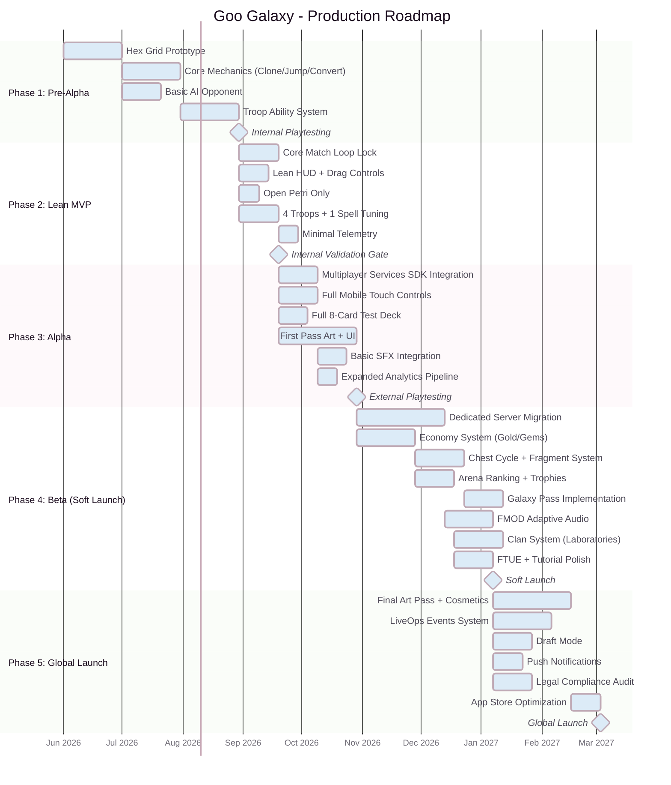

# MVP & Roadmap

## MVP Purpose & Goals

The MVP answers one critical question: **Is the core gameplay loop fun and engaging?**

Before investing in meta-game systems, economies, and full server infrastructure, the MVP serves as a playable **vertical slice** distributed to a closed group of external playtesters on personal smartphones.

### Validation Targets

| Question                                     | Success Criteria                            | Measurement                |
| :------------------------------------------- | :------------------------------------------ | :------------------------- |
| Is Clone vs. Jump intuitive?                 | >85% of testers understand within 2 matches | Post-session survey        |
| Is the 3-minute match pacing correct?        | Average match length 2:30-3:30              | Server-side telemetry      |
| Does Overtime feel exciting?                 | >70% of testers rate Overtime positively    | Survey + session recording |
| Is the drag-and-drop UX natural on mobile?   | <5% miss-deploys per match (invalid drops)  | Client-side analytics      |
| Do asymmetric troop abilities feel balanced? | No single card with >60% win rate           | Match outcome data         |
| Is the Komi system effective?                | P1 vs P2 win rate within 45-55%             | Match outcome data         |

---

## Validation Scope

The roadmap now distinguishes between two early validation stages:

- **Lean MVP:** the smallest playable version used to prove the board, timing, and loop are fun.
- **Alpha:** the first externally shareable vertical slice, adding networking, broader content, and stronger instrumentation.

### Lean MVP Scope

#### Included

| Area                 | Scope                                                                                |
| :------------------- | :----------------------------------------------------------------------------------- |
| **Core Loop**        | Real-time deployment on the 61-hex grid with simultaneous play.                      |
| **Ruleset**          | Clone, Jump, standard conversions, Energy system, Overtime, and Domination.          |
| **Map Pool**         | **Open Petri** only.                                                                 |
| **Roster**           | **4 Troops + 1 Spell** chosen from the launch roster for clarity-focused validation: Subject Alpha, Acid Crawler, Bio-Phalanx, Volatile Mass, and Cryo-Stasis. |
| **Play Environment** | Internal sessions, local tests, or trusted closed sessions.                          |
| **Visuals**          | Readability-first board, units, highlights, and basic HUD only.                      |
| **Controls**         | Drag, deploy, cancel, and target highlighting.                                       |
| **Audio**            | Critical feedback SFX only. Placeholder music acceptable.                            |
| **Analytics**        | Minimal telemetry: match start, match end, duration, win/loss, invalid drops.        |

#### Excluded

| Area                                      | Reason                                                                    |
| :---------------------------------------- | :------------------------------------------------------------------------ |
| External mobile multiplayer at scale      | Too many networking variables too early can hide whether the loop is fun. |
| Full 8-card roster                        | Too many interactions for first-pass validation.                          |
| Long-press inspect and UX polish features | Nice to have, but not required to prove the loop.                         |
| Economy, progression, social, LiveOps     | Not relevant to core-fun validation.                                      |

#### Success Criteria

1. Testers understand Clone vs. Jump quickly.
2. The board remains readable under simultaneous pressure.
3. Players voluntarily want an immediate rematch.

### Alpha Scope

#### Included

| Area           | Scope                                                                                                         |
| :------------- | :------------------------------------------------------------------------------------------------------------ |
| **Core Loop**  | Full real-time match flow on 61-hex grid.                                                                     |
| **Ruleset**    | Clone, Jump, conversion system, Energy economy, Overtime, and Domination.                                     |
| **Roster**     | Fixed 8-card deck: 6 Troops + 2 Spells. All units available to testers.                                       |
| **Networking** | Host-Client sessions via **Unity Multiplayer Services SDK** with NGO gameplay sync and Relay-backed connectivity. Room codes for external testers. |
| **Visuals**    | Readability-first "First Pass" assets using the Cyber Neon color system. No content-complete polish required. |
| **Controls**   | Full mobile touch: drag-and-drop deploy, long-press inspect, tap cancel.                                      |
| **Audio**      | Basic SFX (deploy, convert, overtime warning). Placeholder BGM. No adaptive music.                            |
| **Analytics**  | Lightweight telemetry: match outcomes, P1/P2 win rate, card usage, match duration.                            |

#### Excluded

| Area                                        | Reason                                                     |
| :------------------------------------------ | :--------------------------------------------------------- |
| Monetization (Gems, Shop, Galaxy Pass)      | Not needed for fun validation. Would confuse test results. |
| Meta-Game Progression (Upgrades, Fragments) | All cards at Level 1. Tests pure mechanics.                |
| Social Features (Clans, Chat, Donations)    | Requires backend infrastructure. Not core loop.            |
| Dedicated Servers / Anti-Cheat              | Alpha uses trusted testers only. P2P is sufficient.        |
| LiveOps Events (Stage Swap, Twisted Rules)  | Post-launch feature. Core loop must be validated first.    |
| Advanced Audio (FMOD adaptive music)        | Placeholder music acceptable for Alpha.                    |

---

## Production Roadmap

### Phase Details

#### Phase 1: Core Prototyping (Pre-Alpha) — ~3 months

| Deliverable                                     | Description                                                                                                      | Owner                |
| :---------------------------------------------- | :--------------------------------------------------------------------------------------------------------------- | :------------------- |
| Hex Grid Implementation                         | Axial coordinate system, `Dictionary<Vector2Int, HexTile>`, neighbor lookup, distance calculation.               | Engineering          |
| Clone/Jump/Conversion Logic                     | Core Ataxx mechanics. Unit placement, movement validation, conversion resolution.                                | Engineering          |
| Basic AI                                        | Random-move AI for local PvE testing. No intelligence required — just valid random moves.                        | Engineering          |
| Troop Ability System                            | Implement all 6 troop passives and 2 spells. `Assets/Data/Cards` authoring pipeline plus runtime feature wiring. | Engineering + Design |
| **Gate:** Internal team sign-off on "game feel" | Does the core loop feel satisfying? Are conversions visually clear and rewarding?                                | All                  |

#### Phase 2: Lean MVP — ~1 to 2 months

| Deliverable                       | Description                                                                | Owner                |
| :-------------------------------- | :------------------------------------------------------------------------- | :------------------- |
| Core Match Loop                   | Clone, Jump, conversion resolution, Overtime, and Domination all playable. | Engineering          |
| Lean Control Layer                | Drag-to-deploy, cancel, target highlights, and basic readable HUD.         | Engineering + UX     |
| Reduced Validation Roster         | Four troops plus one spell for low-noise testing of the fundamentals.      | Engineering + Design |
| Minimal Visual Feedback           | Readable units, hex ownership states, and critical effects only.           | Art + UX             |
| Minimal Telemetry                 | Match start/end, duration, invalid drops, rematch intent.                  | Engineering          |
| **Gate:** Internal fun validation | Players understand the loop quickly and voluntarily want another match.    | Design + QA          |

#### Phase 3: Alpha Vertical Slice — ~2 to 3 months

| Deliverable                                                     | Description                                                                     | Owner                |
| :-------------------------------------------------------------- | :------------------------------------------------------------------------------ | :------------------- |
| Multiplayer Services SDK + NGO                                  | Session-based host-client multiplayer with Lobby and Relay managed through MPS SDK. Room codes for external testers. | Engineering          |
| Full Mobile Touch Controls                                      | Drag-and-drop, long-press inspect, tap cancel. Thumb-zone optimized layout.     | Engineering + UX     |
| Full 8-Card Validation Deck                                     | 6 troops + 2 spells available for broader interaction testing.                  | Engineering + Design |
| First Pass Art + UI                                             | Readability-first units, board states, and HUD using the Cyber Neon palette.    | Art + UX             |
| Analytics Pipeline                                              | Match outcome tracking, card usage, P1/P2 win rate, match duration.             | Engineering          |
| **Gate:** External playtest (TestFlight / Google Play Internal) | Qualitative feedback on fun, pacing, balance. Quantitative P1/P2 win rate data. | QA + Design          |

#### Phase 4: Systems & Soft Launch (Beta) — ~4 months

| Deliverable                               | Description                                                                      | Owner                |
| :---------------------------------------- | :------------------------------------------------------------------------------- | :------------------- |
| Dedicated Server Migration                | Move from P2P to server-authoritative NGO. Client prediction + reconciliation.   | Engineering          |
| Simulation Harness + Map Rotation Tooling | Monte Carlo balance sims, map-class dashboards, and live pool rotation controls. | Engineering + Design |
| Economy System                            | Gold/Gem dual currency. Chest cycle. Fragment upgrades.                          | Engineering + Design |
| Arena Ranking + Trophies                  | 10-Arena Trophy Road. Matchmaking by Trophy range. Season resets.                | Engineering          |
| Galaxy Pass                               | 35-tier Battle Pass with free/premium tracks. Season-themed rewards.             | Engineering + Design |
| FMOD Adaptive Audio                       | Full adaptive music system. Complete SFX catalog.                                | Audio + Engineering  |
| Clan System                               | Laboratories. Card donations, co-op goals, clan chat.                            | Engineering          |
| FTUE Polish                               | Tutorial flow, progressive feature unlocking, onboarding analytics.              | Design + UX          |
| **Gate:** Soft Launch in test markets     | D1 >35%, D7 >15%, D30 >5%. P1/P2 win rate 49-51%. No critical bugs.              | All                  |

### Post-MVP Content Gates

After the MVP proves the core loop, new gameplay content should graduate through a stricter funnel than cosmetic or economy work:

| Gate                    | Requirement                                                                           | Failure Response                                   |
| :---------------------- | :------------------------------------------------------------------------------------ | :------------------------------------------------- |
| **Concept Gate**        | New card/map solves a specific meta weakness and lists at least 2 existing counters.  | Redesign before prototype.                         |
| **Simulation Gate**     | Equal-skill sims show win rate within target bands across all ranked map classes.     | Tune parameters or cut feature.                    |
| **Internal Scrim Gate** | Team playtests confirm the mechanic is readable in real time on mobile.               | Simplify VFX/UI or redesign effect.                |
| **Soft-Launch Gate**    | Live usage and win rate stay healthy for 14 days with no oppressive map-local spikes. | Pull from ranked; leave in event queue or disable. |

> **Roadmap Principle:** Cosmetics, economies, and social features can launch in bundles. Competitive mechanics should ship one controlled variable at a time.

**Soft Launch Markets:**

| Region          | Purpose                                            | Expected CPI  |
| :-------------- | :------------------------------------------------- | :------------ |
| **Philippines** | Server stress testing, ad tolerance testing        | USD 0.30-0.50 |
| **Poland**      | Mid-core audience validation, monetization testing | USD 0.80-1.20 |
| **Canada**      | Western market proxy, economy validation           | USD 2.00-3.50 |

#### Phase 5: LiveOps & Global Launch — ~3 months

| Deliverable                                        | Description                                                                              | Owner                |
| :------------------------------------------------- | :--------------------------------------------------------------------------------------- | :------------------- |
| Final Art Pass                                     | 3D board environments, premium cosmetics, all mascots/pets, deploy animations.           | Art                  |
| LiveOps Events                                     | Stage Swap, Twisted Rules, Draft Mode. Event scheduling system.                          | Engineering + Design |
| Legal Compliance                                   | GDPR, COPPA, loot box transparency, age gate. See `10_Operations_Security_and_Legal.md`. | Legal + Engineering  |
| ASO (App Store Optimization)                       | Screenshots, preview videos, keyword optimization, localized store pages.                | Marketing            |
| **Gate:** Global Launch on App Store + Google Play | All KPIs met in soft launch. No P0/P1 bugs. Legal review passed.                         | All                  |

---

## Team Structure

| Role                         | Count | Responsibility                                                        |
| :--------------------------- | :---: | :-------------------------------------------------------------------- |
| **Game Director / Producer** |   1   | Vision, priorities, roadmap. Final decision-maker on design disputes. |
| **Game Designer**            |   1   | Balance, card design, economy tuning, event design, FTUE.             |
| **Unity Engineers**          |   3   | Core gameplay, networking, UI, backend integration.                   |
| **Technical Artist**         |   1   | Shader development, VFX, performance optimization, art pipeline.      |
| **2D/3D Artists**            |   2   | Character design, environment art, UI art, cosmetics.                 |
| **UX Designer**              |   1   | Screen flows, wireframes, usability testing, accessibility.           |
| **Audio Designer**           |   1   | FMOD integration, music composition/sourcing, SFX creation.           |
| **QA Engineer**              |   1   | Manual testing, automated test creation, device testing matrix.       |
| **Community / Marketing**    |   1   | Social media, community management, soft launch UA, ASO.              |

**Total Core Team: 12 people**

---

## Risk Assessment Matrix

| Risk                              | Likelihood |  Impact  | Mitigation                                                                                                              |
| :-------------------------------- | :--------: | :------: | :---------------------------------------------------------------------------------------------------------------------- |
| **Core loop not fun**             |   Medium   | Critical | Validate in Phase 2 Lean MVP before investing in Alpha networking and content breadth.                                  |
| **P1/P2 imbalance persists**      |   Medium   |   High   | Komi is tunable server-side. Adjust every 2 weeks based on live data.                                                   |
| **Networking latency on mobile**  |    High    |   High   | Client prediction + server reconciliation. Graceful degradation on poor connections. Bot substitution if >15 sec queue. |
| **Meta-game stale after 30 days** |   Medium   |   High   | Seasonal content cadence. New cards every 2 seasons. LiveOps events every weekend.                                      |
| **Monetization perceived as P2W** |    Low     | Critical | Draft Mode proves fairness. Cosmetic-first philosophy. Community communication.                                         |
| **Legal compliance (loot box)**   |   Medium   | Critical | Display all drop rates. Age gate. Region-specific variants. Legal review before launch.                                 |
| **App store rejection**           |    Low     |   High   | Follow Apple/Google guidelines strictly. Automated screenshot testing.                                                  |
| **Scope creep**                   |    High    |  Medium  | Strict Lean MVP cutline. No Alpha-only features added before the internal fun gate is passed.                           |
| **Key person dependency**         |   Medium   |   High   | Document all systems. Code review required. Knowledge sharing sessions bi-weekly.                                       |

### Go / No-Go Criteria per Gate

| Gate                  | Go Criteria                                                                                        | No-Go Action                                 |
| :-------------------- | :------------------------------------------------------------------------------------------------- | :------------------------------------------- |
| **Phase 1 → Phase 2** | Core rules are implemented and the team can test complete matches internally.                      | Keep prototyping. Do not formalize MVP yet.  |
| **Phase 2 → Phase 3** | Internal players want immediate rematches. Board readability is stable. No core mechanic failures. | Redesign the loop or reduce roster further.  |
| **Phase 3 → Phase 4** | External testers complete stable matches with acceptable reconnect behavior, command validation, and balanced P1/P2 results. | Fix simulation, networking, or Komi before expanding economy scope. |
| **Phase 3 → Phase 4** | External testers rate fun ≥ 7/10. P1/P2 win rate 45-55%. No game-breaking network bugs.            | Iterate on Alpha. Do NOT proceed to systems. |
| **Phase 4 → Phase 5** | Soft launch D1 >35%, D7 >12%. ARPDAU > USD 0.05. Server stability 99.5% uptime.                    | Iterate on economy, FTUE, or kill project.   |
| **Phase 5 → Global**  | All soft launch KPIs sustained for 30 days. Legal review passed. No P0 bugs.                       | Delay launch. Fix issues. Re-evaluate.       |
