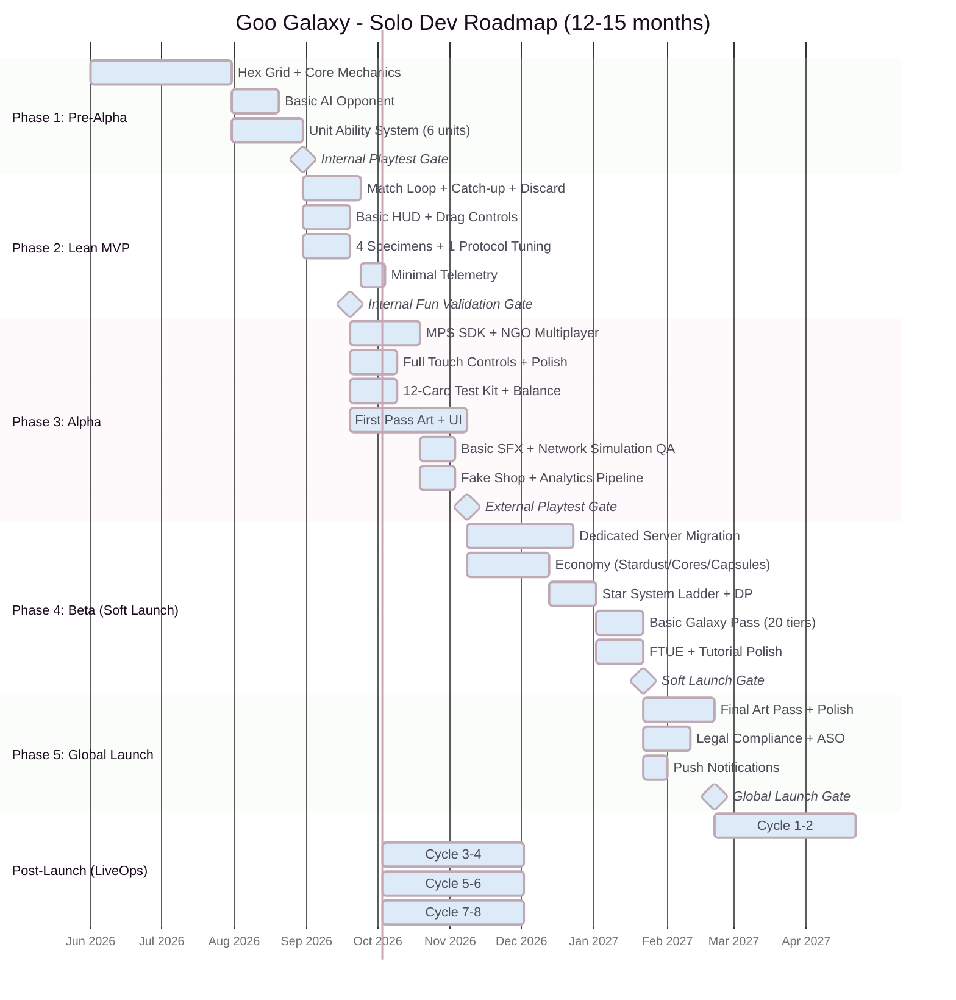

# MVP & Roadmap

## MVP Purpose & Goals

The MVP answers one critical question: **Is the core gameplay loop fun and engaging?**

Before investing in meta-game systems, economies, and full server infrastructure, the MVP serves as a playable **vertical slice** distributed to a closed group of external playtesters on personal smartphones.

### Validation Targets

| Question                                           | Success Criteria                                                                                                                                                                                              | Measurement                |
| :------------------------------------------------- | :------------------------------------------------------------------------------------------------------------------------------------------------------------------------------------------------------------ | :------------------------- |
| Is Clone vs. Jump intuitive?                       | >85% of testers understand within 2 matches                                                                                                                                                                   | Post-session survey        |
| Is the 3-minute match pacing correct?              | Average match length 2:30-3:30                                                                                                                                                                                | Server-side telemetry      |
| Does the Catch-Up Bonus create comebacks?          | Comeback rate increases 5-10pp vs. no bonus                                                                                                                                                                   | Match outcome analysis     |
| Is Card Discard (Sample Purge) used strategically? | >30% of players use it at least once/match                                                                                                                                                                    | Client-side analytics      |
| Does Overtime feel exciting?                       | >70% of testers rate Overtime positively                                                                                                                                                                      | Survey + session recording |
| Is the drag-and-drop UX natural on mobile?         | <5% miss-deploys per match (invalid drops)                                                                                                                                                                    | Client-side analytics      |
| Do asymmetric specimen abilities feel balanced?    | No single card with >60% win rate                                                                                                                                                                             | Match outcome data         |
| Is the board genuinely fair to both Researchers?   | P1 vs P2 win rate within 45-55% at MVP sample sizes; the live target is the tighter 49-51% band. **Komi is 0 on Open Petri** — a skew here is an implementation-ordering defect, not something to compensate. | Match outcome data         |
| Do testers engage with the Fake Shop?              | >50% of testers "purchase" ≥1 item                                                                                                                                                                            | Fake Shop telemetry        |

---

## Validation Scope

The roadmap now distinguishes between two early validation stages:

- **Lean MVP:** the smallest playable version used to prove the board, timing, and loop are fun.
- **Alpha:** the first externally shareable vertical slice, adding networking, broader content, and stronger instrumentation.

### Lean MVP Scope

#### Included

| Area                 | Scope                                                                                                                                                                                                                                              |
| :------------------- | :------------------------------------------------------------------------------------------------------------------------------------------------------------------------------------------------------------------------------------------------- |
| **Core Loop**        | Real-time deployment on the 61-hex grid with simultaneous play.                                                                                                                                                                                    |
| **Ruleset**          | Deploy, Clone, Jump, standard conversions, Energy system, Containment Breach Protocol (catch-up), Sample Purge, Overtime, and the Domination **win condition**. The +50% DP bonus is _not_ in scope — Discovery Points do not exist until Phase 4. |
| **Map Pool**         | **Open Petri** only.                                                                                                                                                                                                                               |
| **Roster**           | **4 Specimens + 1 Protocol** chosen from the launch roster for clarity-focused validation: Subject Alpha, Acid Crawler, Bio-Phalanx, Volatile Mass, and Cryo-Stasis.                                                                               |
| **Play Environment** | Internal sessions, local tests, or trusted closed sessions.                                                                                                                                                                                        |
| **Visuals**          | Readability-first board, units, highlights, and basic HUD only.                                                                                                                                                                                    |
| **Controls**         | Drag, deploy, cancel, and target highlighting.                                                                                                                                                                                                     |
| **Audio**            | Critical feedback SFX only. Placeholder music acceptable.                                                                                                                                                                                          |
| **Analytics**        | Minimal telemetry: match start, match end, duration, win/loss, invalid drops.                                                                                                                                                                      |

#### Excluded

| Area                                      | Reason                                                                    |
| :---------------------------------------- | :------------------------------------------------------------------------ |
| External mobile multiplayer at scale      | Too many networking variables too early can hide whether the loop is fun. |
| Full 8-card roster                        | Too many interactions for first-pass validation.                          |
| Long-press inspect and UX polish features | Nice to have, but not required to prove the loop.                         |
| Economy, progression, social, LiveOps     | Not relevant to core-fun validation.                                      |

#### Success Criteria

1. Testers understand Clone vs. Jump quickly.
2. The board remains readable under simultaneous pressure.
3. Players voluntarily want an immediate rematch.

### Alpha Scope

#### Included

| Area           | Scope                                                                                                                                                                                   |
| :------------- | :-------------------------------------------------------------------------------------------------------------------------------------------------------------------------------------- |
| **Core Loop**  | Full real-time match flow on the 61-sector surface. Includes Catch-Up Bonus, Sample Purge, and the Domination win condition. The +50% DP bonus still waits for Phase 4, when DP exists. |
| **Ruleset**    | Clone, Jump, conversion system, Energy economy, Overtime, Containment Breach Protocol, and Domination.                                                                                  |
| **Roster**     | **12-card test Kit:** 6 Specimens + 2 Protocols (launch) + 4 simple variant cards for Kit-building diversity.                                                                           |
| **Networking** | Host-Client sessions via **Unity Multiplayer Services SDK** with NGO gameplay sync and Relay-backed connectivity. Room codes for external testers.                                      |
| **Visuals**    | Readability-first "First Pass" assets using the Cosmic Neon color system. No content-complete polish required.                                                                          |
| **Controls**   | Full mobile touch: drag-and-drop deploy, swipe-to-discard, long-press inspect, tap cancel.                                                                                              |
| **Audio**      | Basic SFX (deploy, convert, overtime warning, catch-up activation). Placeholder BGM. No adaptive music.                                                                                 |
| **Analytics**  | Lightweight telemetry: match outcomes, P1/P2 win rate, card usage, match duration, catch-up activation count.                                                                           |
| **Network QA** | Unity Transport Network Simulator tests following QoE thresholds (see `08_Technical_Architecture_and_Multiplayer.md`).                                                                  |
| **Fake Shop**  | Galactic Market UI with real Nova Core prices. Testers receive free Nova Cores. Qualitative data collected on purchase intent, value perception, and cosmetic desirability.             |

#### Excluded

| Area                                                            | Reason                                                                                          |
| :-------------------------------------------------------------- | :---------------------------------------------------------------------------------------------- |
| Real-money purchases (Nova Cores, Galactic Market, Galaxy Pass) | Fake Shop validates monetization intent without real transactions. Real purchases come in Beta. |
| Meta-Game Progression (Enhancements, DNA Strands)               | All cards at Level 1. Tests pure mechanics.                                                     |
| Social Features (Crews, Comms, Sample Sharing)                  | Requires backend infrastructure. Deferred to post-launch (Season 3-4).                          |
| Dedicated Servers / Anti-Cheat                                  | Alpha uses trusted testers only. P2P is sufficient.                                             |
| LiveOps Events (Stage Swap, Twisted Rules)                      | Deferred to post-launch (Season 1-2). Core loop must be validated first.                        |
| Advanced Audio (FMOD adaptive music)                            | Placeholder music acceptable for Alpha.                                                         |

---

## Production Roadmap (Solo Developer — Minimal Scope)

> **Context:** This roadmap is calibrated for a **single developer** handling all engineering, design, and integration — see [Staffing Model](#staffing-model) below. Art and audio are sourced externally. The scope is deliberately minimal at launch — PvP 1v1 with the **8-card launch roster** (6 Specimens + 2 Protocols), basic economy, no Crews, no PvE — to ship within 12-15 months. All deferred features are sequenced as post-launch LiveOps.

> **Reading the Gantt vs. the phase durations.** The two measure different things and will not agree. Each phase heading below states its **calendar duration** — how long that phase occupies the schedule, including the serial dependency on the previous gate. The Gantt bars are **individual task durations**, and tasks inside a phase run in parallel, so resolving its `after` chain end-to-end lands around **month 9** rather than month 15. The phase headings are authoritative for planning; the Gantt is a task-level view with slack for the integration, debugging, and rework a solo developer absorbs between bars. The post-launch table below is anchored to the phase headings — **Month 16 is the first post-launch month**.

```mermaid
%%{init: {"theme":"base","themeVariables":{"primaryColor":"#F7E1E8","secondaryColor":"#DCEBF7","tertiaryColor":"#E4F3E1","primaryBorderColor":"#BFA9B5","lineColor":"#A8B6C8","primaryTextColor":"#4E4A57","clusterBkg":"#FAF5EA","clusterBorder":"#CDBFAF","edgeLabelBackground":"#FFF9F2","noteBkgColor":"#F7F1FA","noteTextColor":"#4E4A57","taskBkgColor":"#DCEBF7","taskTextColor":"#4E4A57","taskTextOutsideColor":"#4E4A57","sectionBkgColor":"#E4F3E1","sectionBorderColor":"#BCD0B9","gridColor":"#E8DDD3","todayLineColor":"#C7A7B5","actorBkg":"#F7E1E8","actorBorder":"#BFA9B5","actorTextColor":"#4E4A57","signalColor":"#A8B6C8","signalTextColor":"#4E4A57","labelBoxBkgColor":"#FFF9F2","labelBoxBorderColor":"#CDBFAF","labelTextColor":"#4E4A57"}}}%%
gantt
    title Goo Galaxy - Solo Dev Roadmap (12-15 months)
    dateFormat YYYY-MM-DD
    axisFormat %b %Y

    section Phase 1: Pre-Alpha
    Hex Grid + Core Mechanics           :p1a, 2026-06-01, 60d
    Basic AI Opponent                   :p1b, after p1a, 20d
    Unit Ability System (6 units)     :p1c, after p1a, 30d
    Internal Playtest Gate              :milestone, after p1c, 0d

    section Phase 2: Lean MVP
    Match Loop + Catch-up + Discard     :p2a, after p1c, 25d
    Basic HUD + Drag Controls           :p2b, after p1c, 20d
    4 Specimens + 1 Protocol Tuning    :p2c, after p1c, 20d
    Minimal Telemetry                   :p2d, after p2a, 10d
    Internal Fun Validation Gate        :milestone, after p2c, 0d

    section Phase 3: Alpha
    MPS SDK + NGO Multiplayer           :p3a, after p2c, 30d
    Full Touch Controls + Polish        :p3b, after p2c, 20d
    12-Card Test Kit + Balance          :p3c, after p2c, 20d
    First Pass Art + UI                 :p3d, after p2c, 50d
    Basic SFX + Network Simulation QA   :p3e, after p3a, 15d
    Fake Shop + Analytics Pipeline      :p3f, after p3a, 15d
    External Playtest Gate              :milestone, after p3d, 0d

    section Phase 4: Beta (Soft Launch)
    Dedicated Server Migration          :p4a, after p3d, 45d
    Economy (Stardust/Cores/Capsules)   :p4b, after p3d, 35d
    Star System Ladder + DP             :p4c, after p4b, 20d
    Basic Galaxy Pass (20 tiers)        :p4d, after p4c, 20d
    FTUE + Tutorial Polish              :p4e, after p4c, 20d
    Soft Launch Gate                    :milestone, after p4e, 0d

    section Phase 5: Global Launch
    Final Art Pass + Polish             :p5a, after p4e, 30d
    Legal Compliance + ASO              :p5b, after p4e, 20d
    Push Notifications                  :p5c, after p4e, 10d
    Global Launch Gate                  :milestone, after p5a, 0d

    section Post-Launch (LiveOps)
    Cycle 1-2: Cards + Events           :s1, after p5a, 60d
    Cycle 3-4: Crews + Blind Discovery  :s2, after s1, 60d
    Cycle 5-6: Races + Premium Pass     :s3, after s2, 60d
    Cycle 7-8: PvE + Tournaments        :s4, after s3, 60d
```

### Phase Details

#### Phase 1: Core Prototyping (Pre-Alpha) — ~4 months

| Deliverable                                | Description                                                                                                    | Notes (Solo Dev)                                    |
| :----------------------------------------- | :------------------------------------------------------------------------------------------------------------- | :-------------------------------------------------- |
| Hex Grid Implementation                    | Axial coordinate system, `Dictionary<HexCoordinates, HexCell>`, neighbor lookup, distance calculation.         | Use Red Blob Games reference implementation.        |
| Clone/Jump/Conversion Logic                | Core Ataxx mechanics. Unit placement, movement validation, conversion resolution.                              | Prioritize correctness over performance.            |
| Basic AI                                   | Random-move AI for local PvE testing. No intelligence required — just valid random moves.                      | Essential for solo testing without multiplayer.     |
| Specimen Ability System                    | Implement all 6 Specimen passives and 2 Protocols. `Assets/Data/Cards` authoring pipeline (ScriptableObjects). | Build the authoring pipeline early — it pays off.   |
| **Gate:** Internal sign-off on "game feel" | Does the core loop feel satisfying alone? Are conversions visually clear?                                      | If it's not fun vs. AI, it won't be fun vs. humans. |

#### Phase 2: Lean MVP — ~2 months

| Deliverable                       | Description                                                                    | Notes (Solo Dev)                                                                                        |
| :-------------------------------- | :----------------------------------------------------------------------------- | :------------------------------------------------------------------------------------------------------ |
| Core Match Loop                   | Deploy, Clone, Jump, conversion resolution, Overtime, Domination all playable. | Include the Catch-Up Bonus and Sample Purge. Domination ends the match; its DP bonus waits for Phase 4. |
| Lean Control Layer                | Drag-to-deploy, cancel, target highlights, and basic readable HUD.             | Use Unity UI Toolkit or simple IMGUI for speed.                                                         |
| Reduced Validation Roster         | Four units + one Protocol for low-noise testing of the fundamentals.           | Subject Alpha, Acid Crawler, Bio-Phalanx, Volatile Mass, Cryo-Stasis.                                   |
| Minimal Visual Feedback           | Readable units, hex ownership states, and critical effects only.               | Placeholder art acceptable. Focus on clarity.                                                           |
| Minimal Telemetry                 | Match start/end, duration, invalid drops, rematch intent.                      | JSON file logging is sufficient.                                                                        |
| **Gate:** Internal fun validation | Players (friends/family) understand the loop quickly and want a rematch.       | N = 5-10 is enough for qualitative signal.                                                              |

#### Phase 3: Alpha Vertical Slice — ~3 months

| Deliverable                                                     | Description                                                                                                                                                           | Notes (Solo Dev)                                                           |
| :-------------------------------------------------------------- | :-------------------------------------------------------------------------------------------------------------------------------------------------------------------- | :------------------------------------------------------------------------- |
| Multiplayer Services SDK + NGO                                  | Session-based host-client multiplayer with Lobby and Relay. Room codes.                                                                                               | Follow MPS SDK quickstart. Expect 2-3 weeks of debugging.                  |
| Full Mobile Touch Controls                                      | Drag-and-drop, long-press inspect, tap cancel, card discard swipe.                                                                                                    | Thumb-zone optimized. Test on real device daily.                           |
| 12-Card Validation Kit                                          | Expanded roster for broader interaction testing.                                                                                                                      | Add 4 simple variant cards for Kit-building diversity.                     |
| First Pass Art + UI                                             | Readability-first units, board states, and HUD using the Cosmic Neon palette.                                                                                         | Use asset store or freelance artist for key assets.                        |
| Basic SFX + Network Simulation QA                               | Deploy, convert, overtime SFX. Unity Transport Network Simulator tests.                                                                                               | Follow QoE thresholds from `08_Technical_Architecture_and_Multiplayer.md`. |
| **Fake Shop (Monetization Test)**                               | Galactic Market UI with Nova Core prices. Testers receive free Nova Cores. Measure: which items do they "buy"? Do they understand value? Do cosmetics feel desirable? | Critical: validates monetization assumptions before Beta investment.       |
| Analytics Pipeline                                              | Match outcome tracking, card usage, P1/P2 win rate, match duration, Fake Shop purchases.                                                                              | GameAnalytics free tier.                                                   |
| **Gate:** External playtest (TestFlight / Google Play Internal) | Qualitative feedback on fun, pacing, balance. Quantitative P1/P2 win rate data. Fake Shop purchase behavior data.                                                     | N = 30-50 external testers.                                                |

#### Phase 4: Systems & Soft Launch (Beta) — ~4 months

| Deliverable                               | Description                                                                                                                                                                                                   | Notes (Solo Dev)                                        |
| :---------------------------------------- | :------------------------------------------------------------------------------------------------------------------------------------------------------------------------------------------------------------ | :------------------------------------------------------ |
| Dedicated Server Migration                | Move from P2P to server-authoritative NGO. Client prediction + reconciliation.                                                                                                                                | Use Unity Game Server Hosting or a cheap VPS.           |
| Economy System                            | Stardust/Nova Core dual currency. Capsule cycle shortened to 120 for Beta (the shipping target is the 240-Capsule Discovery Cycle in `04_Economy_and_Monetization.md`). DNA Strand Enhancements, Levels 1-10. | Start simple. Complexity can scale post-launch.         |
| Star System Ladder + DP                   | Full 10-Star-System ladder (see `02_Mathematics_and_Balancing.md`). Matchmaking by DP range.                                                                                                                  | Ranges and unlocks are data, not per-system content.    |
| Basic Galaxy Pass                         | 20-tier free track only (Premium track added post-launch).                                                                                                                                                    | Validate pass engagement before building premium.       |
| FTUE + Tutorial Polish                    | Progressive unlocking. "Learn by doing" flow.                                                                                                                                                                 | Record playtester sessions to find friction points.     |
| **Gate:** Soft Launch in 1-2 test markets | D1 >35%, D7 >15%, D30 >5%. P1/P2 win rate 49-51%. No critical bugs.                                                                                                                                           | Use the markets in the Soft Launch Markets table below. |

#### Phase 5: Global Launch Prep — ~2 months

| Deliverable                | Description                                                                         | Notes (Solo Dev)                                            |
| :------------------------- | :---------------------------------------------------------------------------------- | :---------------------------------------------------------- |
| Final Art Pass + Cosmetics | Polish units, board, and HUD. Add first batch of premium cosmetics (skins, emotes). | Cosmetic shop goes live with global launch.                 |
| Legal Compliance Audit     | GDPR, COPPA, loot box disclosure, age gate, privacy policy.                         | Use the checklist in `10_Operations_Security_and_Legal.md`. |
| App Store Optimization     | Screenshots, description, keywords for Apple App Store + Google Play.               | Hire a freelance ASO specialist if budget allows.           |
| Push Notifications         | Capsule ready, daily reset, re-engagement (lapsed 3+ days).                         | Use Firebase Cloud Messaging.                               |
| **Gate:** Global Launch    | All compliance checkboxes ticked. Crash rate <1%. Store pages live.                 | Soft launch data should de-risk the global launch.          |

---

### Post-Launch LiveOps Roadmap

> **This table is the authority on when a feature ships.** `05_Meta_Game_Retention_and_LiveOps.md` describes the same features in the order they make sense to a Researcher, and `02_Mathematics_and_Balancing.md` lists Star System unlocks for the complete product. Where they imply an earlier date than this table, **this table wins** — a feature gated behind a Star System only becomes reachable once the cycle below has shipped it. Month 16 is the first post-launch month.

Features intentionally deferred from launch to keep the MVP scope manageable. These are sequenced by player impact and development dependency. Each block spans two 28-day Expedition Cycles (~2 months), so the month ranges below are approximate and deliberately carry slack.

| Season    |   Timeline   | Features                                                                                                               | Rationale                                                                                                     |
| :-------- | :----------: | :--------------------------------------------------------------------------------------------------------------------- | :------------------------------------------------------------------------------------------------------------ |
| **S1-S2** | Months 16-18 | Expand the roster toward 10 cards (Quarantine Drone, Purge Pulse). Basic weekend events (Stage Swap). Bug fixes.       | Card variety is the #1 post-launch request, but the Cadence Rule caps it at ~1 card per cycle.                |
| **S3-S4** | Months 19-21 | Crew System. Blind Discovery. New map (Ring Labyrinth).                                                                | Social features kick in after the solo experience is polished. Blind Discovery signals competitive integrity. |
| **S5-S6** | Months 22-24 | Expedition Races. Galaxy Pass Premium Track. Push notification refinement.                                             | Expedition Races require stable Crews first. Premium Pass requires proven free-pass engagement.               |
| **S7-S8** | Months 25-27 | PvE Expeditions. Puzzle Lab — hand-authored board states with a fixed Energy budget and a win target. Tournament Mode. | PvE broadens the audience. Tournaments test esports viability.                                                |
| **S9+**   |  Months 28+  | Advanced features: reactive cards, replay gallery, advanced cosmetics.                                                 | Mature game. Player feedback drives priorities.                                                               |

---

## Kill Switch & Pivot Criteria

Before significant investment in production (Phase 2+), the project must have documented criteria for when to stop, pivot, or radically rescope. These criteria are reviewed at every Phase Gate.

### Kill Switch Thresholds

| Metric                         | Threshold                                                                                           | Action                                                                                                                                   |
| :----------------------------- | :-------------------------------------------------------------------------------------------------- | :--------------------------------------------------------------------------------------------------------------------------------------- |
| **D1 Retention (Soft Launch)** | < 25% after 2 iterations of FTUE improvement                                                        | Halt global launch prep. Investigate root cause. If unfixable, consider pivot or cancel.                                                 |
| **Net Promoter Score (Alpha)** | NPS < 0 ("Detractors" outnumber "Promoters")                                                        | The core loop is not resonating. Redesign the fundamental experience before proceeding.                                                  |
| **CPI vs. LTV (Soft Launch)**  | CPI > LTV for 3 consecutive months                                                                  | The game cannot be profitably marketed. Pivot monetization model or reduce scope to hobby project.                                       |
| **Critical Bug Rate**          | > 1 crash per 100 matches for > 7 days                                                              | Halt new feature work. Dedicate full effort to stability.                                                                                |
| **P1 vs P2 Win Rate**          | Outside 40-60% after the ordering suspects in `02_Mathematics_and_Balancing.md` have been ruled out | A fairness problem no symmetric board should be able to produce. Re-examine the simultaneity model before considering a turn-based mode. |

### Pivot Options

If the core PvP loop fails to engage but the underlying tech and art are solid:

| Pivot Direction       | Description                                                                                                                                                                                                                         | Effort |
| :-------------------- | :---------------------------------------------------------------------------------------------------------------------------------------------------------------------------------------------------------------------------------- | :----: |
| **PvE Roguelike**     | Transform into a single-player Kit-building roguelike using the same hex grid and card mechanics.                                                                                                                                   | Medium |
| **Puzzle Game**       | Ship as a premium single-player puzzle game: hand-authored board states with a fixed Energy budget and a target ("flip every enemy in 3 actions"). Reuses the grid, cards, and resolvers; removes networking, economy, and LiveOps. |  Low   |
| **Async Multiplayer** | Replace real-time with turn-based async (Words With Friends model). Retain all card/board logic.                                                                                                                                    | Medium |
| **Tech Spin-off**     | Open-source the hex grid framework and card system as a Unity asset store package.                                                                                                                                                  |  Low   |

> **Process:** Kill switch and pivot criteria are reviewed at the end of Phase 1, Phase 2, and Phase 3. The developer must make an explicit "go / pivot / stop" decision at each gate before proceeding to the next phase. This is a solo project — there is no sunk-cost committee to override the decision.

> **Roadmap Principle:** Cosmetics, economies, and social features can launch in bundles. Competitive mechanics should ship one controlled variable at a time.

**Soft Launch Markets:**

| Region          | Purpose                                            | Expected CPI  |
| :-------------- | :------------------------------------------------- | :------------ |
| **Philippines** | Server stress testing, ad tolerance testing        | USD 0.30-0.50 |
| **Poland**      | Mid-core audience validation, monetization testing | USD 0.80-1.20 |
| **Canada**      | Western market proxy, economy validation           | USD 2.00-3.50 |

## Staffing Model

Goo Galaxy is a **solo project**. One developer owns engineering, design, and integration; art and audio are sourced externally (asset store, freelancers, or procedural generation). Everything in this GDD — the phase durations, the launch scope, the kill-switch thresholds, and the deliberate exclusion of Crews and PvE from launch — is calibrated against that constraint.

| Function                      | Owner     | Sourcing                                                                                                     |
| :---------------------------- | :-------- | :----------------------------------------------------------------------------------------------------------- |
| Engineering, design, live-ops | Developer | In-house.                                                                                                    |
| 2D/3D art, VFX                | Developer | Asset store or freelance, integrated in-house. Budget-gated.                                                 |
| Music and SFX                 | Developer | Licensed libraries or freelance. FMOD integration in-house.                                                  |
| Legal review (GDPR/COPPA/ASA) | Developer | External counsel, engaged once before soft launch. Not optional — see `10_Operations_Security_and_Legal.md`. |
| ASO and store listings        | Developer | Freelance if budget allows; otherwise in-house.                                                              |

> **Consequences to hold onto:** there is no reviewer, no QA function, and no on-call rotation. That is why `10_Operations_Security_and_Legal.md`'s incident tiers state response targets rather than escalation chains, and why "key person dependency" below is mitigated by written documentation and automated tests rather than by knowledge sharing.

---

## Risk Assessment Matrix

| Risk                              | Likelihood |  Impact  | Mitigation                                                                                                                                                          |
| :-------------------------------- | :--------: | :------: | :------------------------------------------------------------------------------------------------------------------------------------------------------------------ |
| **Core loop not fun**             |   Medium   | Critical | Validate in Phase 2 Lean MVP before investing in Alpha networking and content breadth.                                                                              |
| **P1/P2 imbalance persists**      |   Medium   |   High   | On symmetric maps: audit server tie-breaking and within-tick client order first. Komi is the lever for asymmetric maps only, and is server-tunable when those ship. |
| **Networking latency on mobile**  |    High    |   High   | Client prediction + server reconciliation. Graceful degradation on poor connections. Bot substitution if >15 sec queue.                                             |
| **Meta-game stale after 30 days** |   Medium   |   High   | Seasonal content cadence. New cards every 2 seasons. LiveOps events every weekend.                                                                                  |
| **Monetization perceived as P2W** |    Low     | Critical | Blind Discovery proves fairness. Cosmetic-first philosophy. Community communication.                                                                                |
| **Legal compliance (loot box)**   |   Medium   | Critical | Display all drop rates. Age gate. Region-specific variants. Legal review before launch.                                                                             |
| **App store rejection**           |    Low     |   High   | Follow Apple/Google guidelines strictly. Automated screenshot testing.                                                                                              |
| **Scope creep**                   |    High    |  Medium  | Strict Lean MVP cutline. No Alpha-only features added before the internal fun gate is passed.                                                                       |
| **Key person dependency**         |    High    | Critical | Unavoidable on a solo project. Mitigate with written system docs, automated tests as executable specification, and no undocumented tribal state.                    |

### Go / No-Go Criteria per Gate

| Gate                  | Go Criteria                                                                                                                                                                 | No-Go Action                                                                                |
| :-------------------- | :-------------------------------------------------------------------------------------------------------------------------------------------------------------------------- | :------------------------------------------------------------------------------------------ |
| **Phase 1 → Phase 2** | Core rules are implemented and complete matches can be played internally, end to end.                                                                                       | Keep prototyping. Do not formalize MVP yet.                                                 |
| **Phase 2 → Phase 3** | Internal players want immediate rematches. Board readability is stable. No core mechanic failures.                                                                          | Redesign the loop or reduce roster further.                                                 |
| **Phase 3 → Phase 4** | External testers complete stable matches with acceptable reconnect behavior and command validation. Fun rated ≥ 7/10. P1/P2 win rate 45-55%. No game-breaking network bugs. | Fix simulation, networking, or command-ordering determinism before expanding economy scope. |
| **Phase 4 → Phase 5** | Soft launch D1 >35%, D7 >15%, D30 >5%. ARPDAU > USD 0.015 (Conservative scenario floor). Server stability 99.5% uptime.                                                     | Iterate on economy, FTUE, or kill project.                                                  |
| **Phase 5 → Global**  | All soft launch KPIs sustained for 30 days. Legal review passed. No P0 bugs.                                                                                                | Delay launch. Fix issues. Re-evaluate.                                                      |
