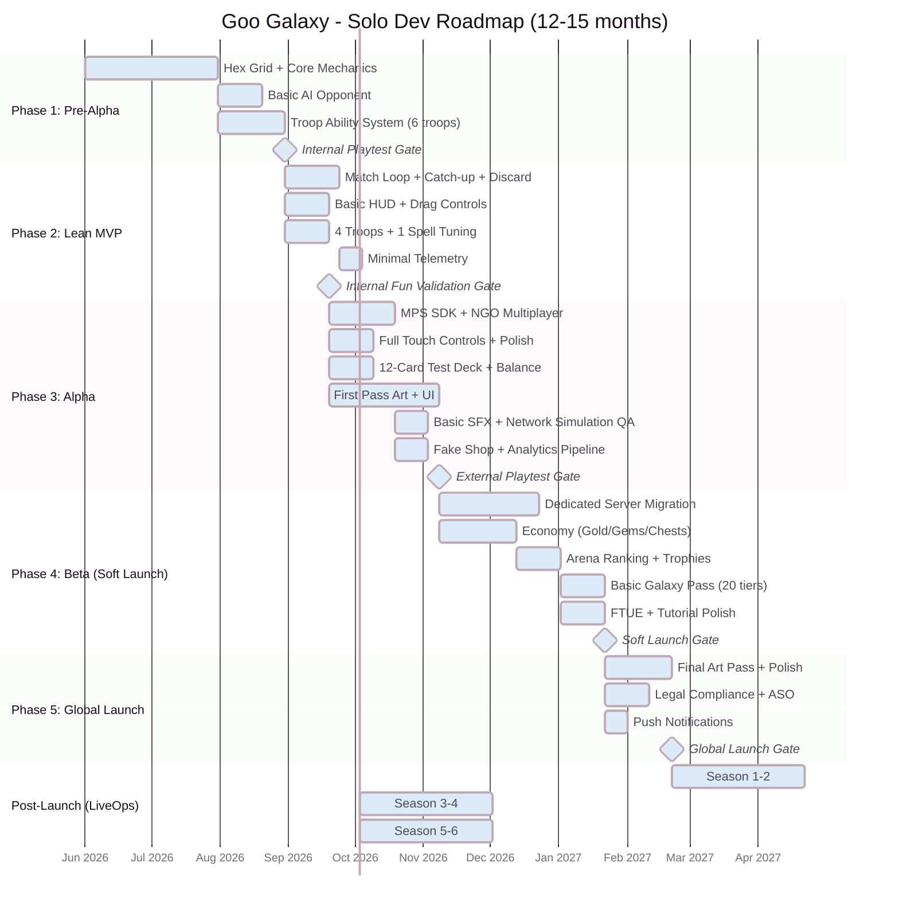

# MVP & Roadmap

## MVP Purpose & Goals

The MVP answers one critical question: **Is the core gameplay loop fun and engaging?**

Before investing in meta-game systems, economies, and full server infrastructure, the MVP serves as a playable **vertical slice** distributed to a closed group of external playtesters on personal smartphones.

### Validation Targets

| Question                                           | Success Criteria                            | Measurement                |
| :------------------------------------------------- | :------------------------------------------ | :------------------------- |
| Is Clone vs. Jump intuitive?                       | >85% of testers understand within 2 matches | Post-session survey        |
| Is the 3-minute match pacing correct?              | Average match length 2:30-3:30              | Server-side telemetry      |
| Does the Catch-Up Bonus create comebacks?          | Comeback rate increases 5-10pp vs. no bonus | Match outcome analysis     |
| Is Card Discard (Sample Purge) used strategically? | >30% of players use it at least once/match  | Client-side analytics      |
| Does Overtime feel exciting?                       | >70% of testers rate Overtime positively    | Survey + session recording |
| Is the drag-and-drop UX natural on mobile?         | <5% miss-deploys per match (invalid drops)  | Client-side analytics      |
| Do asymmetric troop abilities feel balanced?       | No single card with >60% win rate           | Match outcome data         |
| Is the Komi system effective?                      | P1 vs P2 win rate within 45-55%             | Match outcome data         |
| Do testers engage with the Fake Shop?              | >50% of testers "purchase" ≥1 item          | Fake Shop telemetry        |

---

## Validation Scope

The roadmap now distinguishes between two early validation stages:

- **Lean MVP:** the smallest playable version used to prove the board, timing, and loop are fun.
- **Alpha:** the first externally shareable vertical slice, adding networking, broader content, and stronger instrumentation.

### Lean MVP Scope

#### Included

| Area                 | Scope                                                                                                                                                                   |
| :------------------- | :---------------------------------------------------------------------------------------------------------------------------------------------------------------------- |
| **Core Loop**        | Real-time deployment on the 61-hex grid with simultaneous play.                                                                                                         |
| **Ruleset**          | Clone, Jump, standard conversions, Energy system, Containment Breach Protocol (catch-up), Sample Purge (card discard), Overtime, and Domination with +50% Trophy Bonus. |
| **Map Pool**         | **Open Petri** only.                                                                                                                                                    |
| **Roster**           | **4 Troops + 1 Spell** chosen from the launch roster for clarity-focused validation: Subject Alpha, Acid Crawler, Bio-Phalanx, Volatile Mass, and Cryo-Stasis.          |
| **Play Environment** | Internal sessions, local tests, or trusted closed sessions.                                                                                                             |
| **Visuals**          | Readability-first board, units, highlights, and basic HUD only.                                                                                                         |
| **Controls**         | Drag, deploy, cancel, and target highlighting.                                                                                                                          |
| **Audio**            | Critical feedback SFX only. Placeholder music acceptable.                                                                                                               |
| **Analytics**        | Minimal telemetry: match start, match end, duration, win/loss, invalid drops.                                                                                           |

#### Excluded

| Area                                      | Reason                                                                    |
| :---------------------------------------- | :------------------------------------------------------------------------ |
| External mobile multiplayer at scale      | Too many networking variables too early can hide whether the loop is fun. |
| Full 8-card roster                        | Too many interactions for first-pass validation.                          |
| Long-press inspect and UX polish features | Nice to have, but not required to prove the loop.                         |
| Economy, progression, social, LiveOps     | Not relevant to core-fun validation.                                      |

#### Success Criteria

1. Testers understand Clone vs. Jump quickly.
2. The board remains readable under simultaneous pressure.
3. Players voluntarily want an immediate rematch.

### Alpha Scope

#### Included

| Area           | Scope                                                                                                                                                               |
| :------------- | :------------------------------------------------------------------------------------------------------------------------------------------------------------------ |
| **Core Loop**  | Full real-time match flow on 61-hex grid. Includes Catch-Up Bonus, Card Discard, and Domination Bonus.                                                              |
| **Ruleset**    | Clone, Jump, conversion system, Energy economy, Overtime, Containment Breach Protocol, and Domination.                                                              |
| **Roster**     | **12-card test deck:** 6 Troops + 2 Spells (launch) + 4 simple variant cards for deck-building diversity.                                                           |
| **Networking** | Host-Client sessions via **Unity Multiplayer Services SDK** with NGO gameplay sync and Relay-backed connectivity. Room codes for external testers.                  |
| **Visuals**    | Readability-first "First Pass" assets using the Cyber Neon color system. No content-complete polish required.                                                       |
| **Controls**   | Full mobile touch: drag-and-drop deploy, swipe-to-discard, long-press inspect, tap cancel.                                                                          |
| **Audio**      | Basic SFX (deploy, convert, overtime warning, catch-up activation). Placeholder BGM. No adaptive music.                                                             |
| **Analytics**  | Lightweight telemetry: match outcomes, P1/P2 win rate, card usage, match duration, catch-up activation count.                                                       |
| **Network QA** | Unity Transport Network Simulator tests following QoE thresholds (see `08_Technical_Architecture_and_Multiplayer.md`).                                              |
| **Fake Shop**  | **NEW (P25):** Shop UI with real Gem prices. Testers receive free Gems. Qualitative data collected on purchase intent, value perception, and cosmetic desirability. |

#### Excluded

| Area                                           | Reason                                                                                          |
| :--------------------------------------------- | :---------------------------------------------------------------------------------------------- |
| Real-money purchases (Gems, Shop, Galaxy Pass) | Fake Shop validates monetization intent without real transactions. Real purchases come in Beta. |
| Meta-Game Progression (Upgrades, Fragments)    | All cards at Level 1. Tests pure mechanics.                                                     |
| Social Features (Clans, Chat, Donations)       | Requires backend infrastructure. Deferred to post-launch (Season 3-4).                          |
| Dedicated Servers / Anti-Cheat                 | Alpha uses trusted testers only. P2P is sufficient.                                             |
| LiveOps Events (Stage Swap, Twisted Rules)     | Deferred to post-launch (Season 1-2). Core loop must be validated first.                        |
| Advanced Audio (FMOD adaptive music)           | Placeholder music acceptable for Alpha.                                                         |

---

## Production Roadmap (Solo Developer — Minimal Scope)

> **Context:** This roadmap is calibrated for a **single developer** handling all engineering, design, and integration. Art and audio are sourced externally (asset store, freelancers, or procedural generation). The scope is deliberately minimal at launch — PvP 1v1 with 12 cards, basic economy, no clans, no PvE — to ship within 12-15 months. All deferred features are sequenced as post-launch LiveOps.

```mermaid
%%{init: {"theme":"base","themeVariables":{"primaryColor":"#F7E1E8","secondaryColor":"#DCEBF7","tertiaryColor":"#E4F3E1","primaryBorderColor":"#BFA9B5","lineColor":"#A8B6C8","primaryTextColor":"#4E4A57","clusterBkg":"#FAF5EA","clusterBorder":"#CDBFAF","edgeLabelBackground":"#FFF9F2","noteBkgColor":"#F7F1FA","noteTextColor":"#4E4A57","taskBkgColor":"#DCEBF7","taskTextColor":"#4E4A57","taskTextOutsideColor":"#4E4A57","sectionBkgColor":"#E4F3E1","sectionBorderColor":"#BCD0B9","gridColor":"#E8DDD3","todayLineColor":"#C7A7B5","actorBkg":"#F7E1E8","actorBorder":"#BFA9B5","actorTextColor":"#4E4A57","signalColor":"#A8B6C8","signalTextColor":"#4E4A57","labelBoxBkgColor":"#FFF9F2","labelBoxBorderColor":"#CDBFAF","labelTextColor":"#4E4A57"}}}%%
gantt
    title Goo Galaxy - Solo Dev Roadmap (12-15 months)
    dateFormat YYYY-MM-DD
    axisFormat %b %Y

    section Phase 1: Pre-Alpha
    Hex Grid + Core Mechanics           :p1a, 2026-06-01, 60d
    Basic AI Opponent                   :p1b, after p1a, 20d
    Troop Ability System (6 troops)     :p1c, after p1a, 30d
    Internal Playtest Gate              :milestone, after p1c, 0d

    section Phase 2: Lean MVP
    Match Loop + Catch-up + Discard     :p2a, after p1c, 25d
    Basic HUD + Drag Controls           :p2b, after p1c, 20d
    4 Troops + 1 Spell Tuning           :p2c, after p1c, 20d
    Minimal Telemetry                   :p2d, after p2a, 10d
    Internal Fun Validation Gate        :milestone, after p2c, 0d

    section Phase 3: Alpha
    MPS SDK + NGO Multiplayer           :p3a, after p2c, 30d
    Full Touch Controls + Polish        :p3b, after p2c, 20d
    12-Card Test Deck + Balance         :p3c, after p2c, 20d
    First Pass Art + UI                 :p3d, after p2c, 50d
    Basic SFX + Network Simulation QA   :p3e, after p3a, 15d
    Fake Shop + Analytics Pipeline      :p3f, after p3a, 15d
    External Playtest Gate              :milestone, after p3d, 0d

    section Phase 4: Beta (Soft Launch)
    Dedicated Server Migration          :p4a, after p3d, 45d
    Economy (Gold/Gems/Chests)          :p4b, after p3d, 35d
    Arena Ranking + Trophies            :p4c, after p4b, 20d
    Basic Galaxy Pass (20 tiers)        :p4d, after p4c, 20d
    FTUE + Tutorial Polish              :p4e, after p4c, 20d
    Soft Launch Gate                    :milestone, after p4e, 0d

    section Phase 5: Global Launch
    Final Art Pass + Polish             :p5a, after p4e, 30d
    Legal Compliance + ASO              :p5b, after p4e, 20d
    Push Notifications                  :p5c, after p4e, 10d
    Global Launch Gate                  :milestone, after p5a, 0d

    section Post-Launch (LiveOps)
    Season 1-2: Cards + Events          :s1, after p5a, 60d
    Season 3-4: Clans + Draft Mode      :s2, after s1, 60d
    Season 5-6: Clan Wars + PvE         :s3, after s2, 60d
```

### Phase Details

#### Phase 1: Core Prototyping (Pre-Alpha) — ~4 months

| Deliverable                                | Description                                                                                              | Notes (Solo Dev)                                    |
| :----------------------------------------- | :------------------------------------------------------------------------------------------------------- | :-------------------------------------------------- |
| Hex Grid Implementation                    | Axial coordinate system, `Dictionary<Vector2Int, HexTile>`, neighbor lookup, distance calculation.       | Use Red Blob Games reference implementation.        |
| Clone/Jump/Conversion Logic                | Core Ataxx mechanics. Unit placement, movement validation, conversion resolution.                        | Prioritize correctness over performance.            |
| Basic AI                                   | Random-move AI for local PvE testing. No intelligence required — just valid random moves.                | Essential for solo testing without multiplayer.     |
| Troop Ability System                       | Implement all 6 troop passives and 2 spells. `Assets/Data/Cards` authoring pipeline (ScriptableObjects). | Build the authoring pipeline early — it pays off.   |
| **Gate:** Internal sign-off on "game feel" | Does the core loop feel satisfying alone? Are conversions visually clear?                                | If it's not fun vs. AI, it won't be fun vs. humans. |

#### Phase 2: Lean MVP — ~2 months

| Deliverable                       | Description                                                              | Notes (Solo Dev)                                                         |
| :-------------------------------- | :----------------------------------------------------------------------- | :----------------------------------------------------------------------- |
| Core Match Loop                   | Clone, Jump, conversion resolution, Overtime, Domination all playable.   | Include Catch-Up Bonus (P1) + Card Discard (P3) + Domination Bonus (P4). |
| Lean Control Layer                | Drag-to-deploy, cancel, target highlights, and basic readable HUD.       | Use Unity UI Toolkit or simple IMGUI for speed.                          |
| Reduced Validation Roster         | Four troops + one spell for low-noise testing of the fundamentals.       | Subject Alpha, Acid Crawler, Bio-Phalanx, Volatile Mass, Cryo-Stasis.    |
| Minimal Visual Feedback           | Readable units, hex ownership states, and critical effects only.         | Placeholder art acceptable. Focus on clarity.                            |
| Minimal Telemetry                 | Match start/end, duration, invalid drops, rematch intent.                | JSON file logging is sufficient.                                         |
| **Gate:** Internal fun validation | Players (friends/family) understand the loop quickly and want a rematch. | N = 5-10 is enough for qualitative signal.                               |

#### Phase 3: Alpha Vertical Slice — ~3 months

| Deliverable                                                     | Description                                                                                                                                              | Notes (Solo Dev)                                                           |
| :-------------------------------------------------------------- | :------------------------------------------------------------------------------------------------------------------------------------------------------- | :------------------------------------------------------------------------- |
| Multiplayer Services SDK + NGO                                  | Session-based host-client multiplayer with Lobby and Relay. Room codes.                                                                                  | Follow MPS SDK quickstart. Expect 2-3 weeks of debugging.                  |
| Full Mobile Touch Controls                                      | Drag-and-drop, long-press inspect, tap cancel, card discard swipe.                                                                                       | Thumb-zone optimized. Test on real device daily.                           |
| 12-Card Validation Deck                                         | Expanded roster for broader interaction testing.                                                                                                         | Add 4 simple variant cards for deck-building diversity.                    |
| First Pass Art + UI                                             | Readability-first units, board states, and HUD using Cyber Neon palette.                                                                                 | Use asset store or freelance artist for key assets.                        |
| Basic SFX + Network Simulation QA                               | Deploy, convert, overtime SFX. Unity Transport Network Simulator tests.                                                                                  | Follow QoE thresholds from `08_Technical_Architecture_and_Multiplayer.md`. |
| **Fake Shop (Monetization Test)**                               | **NEW:** Shop UI with Gems prices. Testers receive free Gems. Measure: which items do they "buy"? Do they understand value? Do cosmetics feel desirable? | Critical: validates monetization assumptions before Beta investment.       |
| Analytics Pipeline                                              | Match outcome tracking, card usage, P1/P2 win rate, match duration, Fake Shop purchases.                                                                 | GameAnalytics free tier.                                                   |
| **Gate:** External playtest (TestFlight / Google Play Internal) | Qualitative feedback on fun, pacing, balance. Quantitative P1/P2 win rate data. Fake Shop purchase behavior data.                                        | N = 30-50 external testers.                                                |

#### Phase 4: Systems & Soft Launch (Beta) — ~4 months

| Deliverable                               | Description                                                                                         | Notes (Solo Dev)                                    |
| :---------------------------------------- | :-------------------------------------------------------------------------------------------------- | :-------------------------------------------------- |
| Dedicated Server Migration                | Move from P2P to server-authoritative NGO. Client prediction + reconciliation.                      | Use Unity Game Server Hosting or a cheap VPS.       |
| Economy System                            | Gold/Gem dual currency. Chest cycle (simplified: 120-chest cycle). Fragment upgrades (Levels 1-10). | Start simple. Complexity can scale post-launch.     |
| Arena Ranking + Trophies                  | 8-Arena Trophy Road (reduced from 10). Matchmaking by Trophy range.                                 | Fewer arenas = less content to build per arena.     |
| Basic Galaxy Pass                         | 20-tier free track only (Premium track added post-launch).                                          | Validate pass engagement before building premium.   |
| FTUE + Tutorial Polish                    | Progressive unlocking. "Learn by doing" flow.                                                       | Record playtester sessions to find friction points. |
| **Gate:** Soft Launch in 1-2 test markets | D1 >35%, D7 >15%, D30 >5%. P1/P2 win rate 49-51%. No critical bugs.                                 | Use a small geo (e.g., Philippines, Brazil).        |

#### Phase 5: Global Launch Prep — ~2 months

| Deliverable                | Description                                                                         | Notes (Solo Dev)                                            |
| :------------------------- | :---------------------------------------------------------------------------------- | :---------------------------------------------------------- |
| Final Art Pass + Cosmetics | Polish units, board, and HUD. Add first batch of premium cosmetics (skins, emotes). | Cosmetic shop goes live with global launch.                 |
| Legal Compliance Audit     | GDPR, COPPA, loot box disclosure, age gate, privacy policy.                         | Use the checklist in `10_Operations_Security_and_Legal.md`. |
| App Store Optimization     | Screenshots, description, keywords for Apple App Store + Google Play.               | Hire a freelance ASO specialist if budget allows.           |
| Push Notifications         | Chest ready, daily reset, re-engagement (lapsed 3+ days).                           | Use Firebase Cloud Messaging.                               |
| **Gate:** Global Launch    | All compliance checkboxes ticked. Crash rate <1%. Store pages live.                 | Soft launch data should de-risk the global launch.          |

---

### Post-Launch LiveOps Roadmap

Features intentionally deferred from launch to keep the MVP scope manageable. These are sequenced by player impact and development dependency.

| Season    |   Timeline   | Features                                                                 | Rationale                                                                                                |
| :-------- | :----------: | :----------------------------------------------------------------------- | :------------------------------------------------------------------------------------------------------- |
| **S1-S2** | Months 16-18 | Expand roster to 16 cards. Basic weekend events (Stage Swap). Bug fixes. | Card variety is the #1 post-launch player request. Events drive re-engagement.                           |
| **S3-S4** | Months 19-21 | Clan System (Laboratories). Draft Mode. New map (Ring Labyrinth).        | Social features kick in after the solo experience is polished. Draft Mode signals competitive integrity. |
| **S5-S6** | Months 22-24 | Clan Wars. Galaxy Pass Premium Track. Push notification refinement.      | Clan Wars requires stable clans first. Premium Pass requires proven free-pass engagement.                |
| **S7-S8** | Months 25-27 | PvE Expeditions. Puzzle Lab. Tournament Mode.                            | PvE broadens the audience. Tournaments test esports viability.                                           |
| **S9+**   |  Months 28+  | Advanced features: reactive cards, replay gallery, advanced cosmetics.   | Mature game. Player feedback drives priorities.                                                          |

---

## Kill Switch & Pivot Criteria

Before significant investment in production (Phase 2+), the project must have documented criteria for when to stop, pivot, or radically rescope. These criteria are reviewed at every Phase Gate.

### Kill Switch Thresholds

| Metric                         | Threshold                                    | Action                                                                                             |
| :----------------------------- | :------------------------------------------- | :------------------------------------------------------------------------------------------------- |
| **D1 Retention (Soft Launch)** | < 25% after 2 iterations of FTUE improvement | Halt global launch prep. Investigate root cause. If unfixable, consider pivot or cancel.           |
| **Net Promoter Score (Alpha)** | NPS < 0 ("Detractors" outnumber "Promoters") | The core loop is not resonating. Redesign the fundamental experience before proceeding.            |
| **CPI vs. LTV (Soft Launch)**  | CPI > LTV for 3 consecutive months           | The game cannot be profitably marketed. Pivot monetization model or reduce scope to hobby project. |
| **Critical Bug Rate**          | > 1 crash per 100 matches for > 7 days       | Halt new feature work. Dedicate full effort to stability.                                          |
| **P1 vs P2 Win Rate**          | Outside 40-60% after Komi tuning             | Fundamental first-mover problem. Consider turn-based mode or resign from real-time.                |

### Pivot Options

If the core PvP loop fails to engage but the underlying tech and art are solid:

| Pivot Direction       | Description                                                                                        | Effort |
| :-------------------- | :------------------------------------------------------------------------------------------------- | :----: |
| **PvE Roguelike**     | Transform into a single-player deck-building roguelike using the same hex grid and card mechanics. | Medium |
| **Puzzle Game**       | Ship as a premium puzzle game (Puzzle Lab only). Remove networking, economy, and LiveOps.          |  Low   |
| **Async Multiplayer** | Replace real-time with turn-based async (Words With Friends model). Retain all card/board logic.   | Medium |
| **Tech Spin-off**     | Open-source the hex grid framework and card system as a Unity asset store package.                 |  Low   |

> **Process:** Kill switch and pivot criteria are reviewed at the end of Phase 1, Phase 2, and Phase 3. The developer must make an explicit "go / pivot / stop" decision at each gate before proceeding to the next phase. This is a solo project — there is no sunk-cost committee to override the decision.

> **Roadmap Principle:** Cosmetics, economies, and social features can launch in bundles. Competitive mechanics should ship one controlled variable at a time.

**Soft Launch Markets:**

| Region          | Purpose                                            | Expected CPI  |
| :-------------- | :------------------------------------------------- | :------------ |
| **Philippines** | Server stress testing, ad tolerance testing        | USD 0.30-0.50 |
| **Poland**      | Mid-core audience validation, monetization testing | USD 0.80-1.20 |
| **Canada**      | Western market proxy, economy validation           | USD 2.00-3.50 |

#### Phase 5: LiveOps & Global Launch — ~3 months

| Deliverable                                        | Description                                                                              | Owner                |
| :------------------------------------------------- | :--------------------------------------------------------------------------------------- | :------------------- |
| Final Art Pass                                     | 3D board environments, premium cosmetics, all mascots/pets, deploy animations.           | Art                  |
| LiveOps Events                                     | Stage Swap, Twisted Rules, Draft Mode. Event scheduling system.                          | Engineering + Design |
| Legal Compliance                                   | GDPR, COPPA, loot box transparency, age gate. See `10_Operations_Security_and_Legal.md`. | Legal + Engineering  |
| ASO (App Store Optimization)                       | Screenshots, preview videos, keyword optimization, localized store pages.                | Marketing            |
| **Gate:** Global Launch on App Store + Google Play | All KPIs met in soft launch. No P0/P1 bugs. Legal review passed.                         | All                  |

---

## Team Structure

| Role                         | Count | Responsibility                                                        |
| :--------------------------- | :---: | :-------------------------------------------------------------------- |
| **Game Director / Producer** |   1   | Vision, priorities, roadmap. Final decision-maker on design disputes. |
| **Game Designer**            |   1   | Balance, card design, economy tuning, event design, FTUE.             |
| **Unity Engineers**          |   3   | Core gameplay, networking, UI, backend integration.                   |
| **Technical Artist**         |   1   | Shader development, VFX, performance optimization, art pipeline.      |
| **2D/3D Artists**            |   2   | Character design, environment art, UI art, cosmetics.                 |
| **UX Designer**              |   1   | Screen flows, wireframes, usability testing, accessibility.           |
| **Audio Designer**           |   1   | FMOD integration, music composition/sourcing, SFX creation.           |
| **QA Engineer**              |   1   | Manual testing, automated test creation, device testing matrix.       |
| **Community / Marketing**    |   1   | Social media, community management, soft launch UA, ASO.              |

**Total Core Team: 12 people**

---

## Risk Assessment Matrix

| Risk                              | Likelihood |  Impact  | Mitigation                                                                                                              |
| :-------------------------------- | :--------: | :------: | :---------------------------------------------------------------------------------------------------------------------- |
| **Core loop not fun**             |   Medium   | Critical | Validate in Phase 2 Lean MVP before investing in Alpha networking and content breadth.                                  |
| **P1/P2 imbalance persists**      |   Medium   |   High   | Komi is tunable server-side. Adjust every 2 weeks based on live data.                                                   |
| **Networking latency on mobile**  |    High    |   High   | Client prediction + server reconciliation. Graceful degradation on poor connections. Bot substitution if >15 sec queue. |
| **Meta-game stale after 30 days** |   Medium   |   High   | Seasonal content cadence. New cards every 2 seasons. LiveOps events every weekend.                                      |
| **Monetization perceived as P2W** |    Low     | Critical | Draft Mode proves fairness. Cosmetic-first philosophy. Community communication.                                         |
| **Legal compliance (loot box)**   |   Medium   | Critical | Display all drop rates. Age gate. Region-specific variants. Legal review before launch.                                 |
| **App store rejection**           |    Low     |   High   | Follow Apple/Google guidelines strictly. Automated screenshot testing.                                                  |
| **Scope creep**                   |    High    |  Medium  | Strict Lean MVP cutline. No Alpha-only features added before the internal fun gate is passed.                           |
| **Key person dependency**         |   Medium   |   High   | Document all systems. Code review required. Knowledge sharing sessions bi-weekly.                                       |

### Go / No-Go Criteria per Gate

| Gate                  | Go Criteria                                                                                                                  | No-Go Action                                                        |
| :-------------------- | :--------------------------------------------------------------------------------------------------------------------------- | :------------------------------------------------------------------ |
| **Phase 1 → Phase 2** | Core rules are implemented and the team can test complete matches internally.                                                | Keep prototyping. Do not formalize MVP yet.                         |
| **Phase 2 → Phase 3** | Internal players want immediate rematches. Board readability is stable. No core mechanic failures.                           | Redesign the loop or reduce roster further.                         |
| **Phase 3 → Phase 4** | External testers complete stable matches with acceptable reconnect behavior, command validation, and balanced P1/P2 results. | Fix simulation, networking, or Komi before expanding economy scope. |
| **Phase 3 → Phase 4** | External testers rate fun ≥ 7/10. P1/P2 win rate 45-55%. No game-breaking network bugs.                                      | Iterate on Alpha. Do NOT proceed to systems.                        |
| **Phase 4 → Phase 5** | Soft launch D1 >35%, D7 >12%. ARPDAU > USD 0.05. Server stability 99.5% uptime.                                              | Iterate on economy, FTUE, or kill project.                          |
| **Phase 5 → Global**  | All soft launch KPIs sustained for 30 days. Legal review passed. No P0 bugs.                                                 | Delay launch. Fix issues. Re-evaluate.                              |
