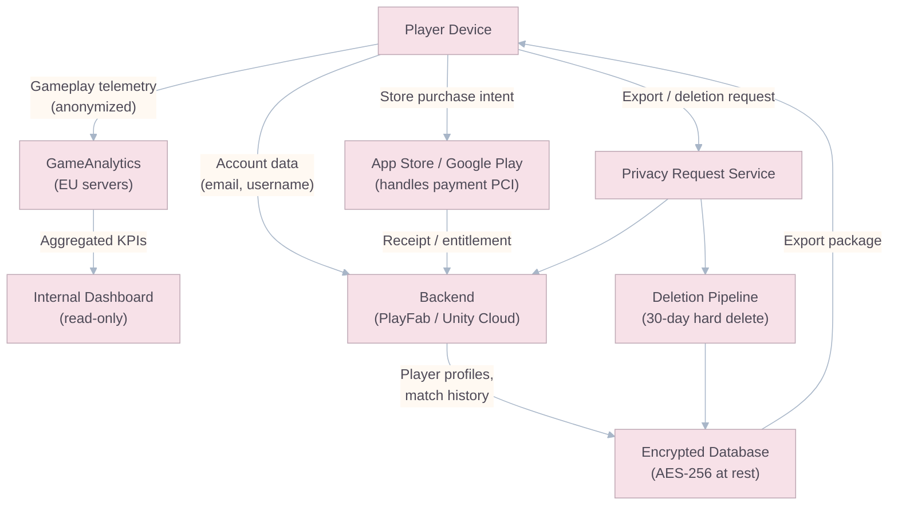
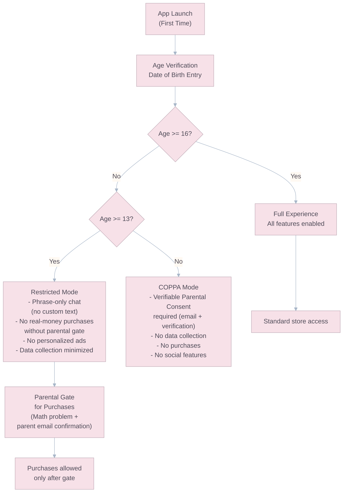
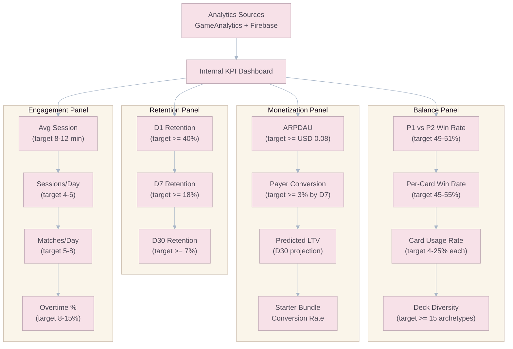

# Operations, Security & Legal Compliance

## Regulatory Landscape (2026)

The mobile gaming industry faces intensifying global regulation across three primary domains: **data privacy**, **child protection**, and **monetization transparency**. Goo Galaxy must be designed for compliance from day one — retrofitting compliance is exponentially more expensive and risky.

---

## Data Privacy (GDPR, LGPD, CCPA)

### Requirements Matrix

| Regulation    | Region          | Key Requirements                                                                                                                                                                             | Penalty                                                           |
| :------------ | :-------------- | :------------------------------------------------------------------------------------------------------------------------------------------------------------------------------------------- | :---------------------------------------------------------------- |
| **GDPR**      | EU/EEA + UK     | Explicit consent where required. Right to access, rectify, delete. Appoint a privacy owner and determine with counsel whether a formal DPO is legally required. 72-hour breach notification. | Up to 4% of global annual revenue or EUR 20M.                     |
| **LGPD**      | Brazil          | Similar to GDPR. Explicit consent where required. Right to deletion. Designate a responsible privacy contact/encarregado.                                                                    | Up to 2% of Brazilian revenue or BRL 50M.                         |
| **CCPA/CPRA** | California, USA | Right to know, delete, opt-out of sale. No discrimination for exercising rights.                                                                                                             | USD 2,500 per unintentional violation, USD 7,500 per intentional. |

### Implementation Checklist

| Requirement                 | Implementation                                                                                                                                              |
| :-------------------------- | :---------------------------------------------------------------------------------------------------------------------------------------------------------- |
| **Consent at First Launch** | A clear, non-pre-checked consent dialog before any data collection begins. Granular options: analytics, personalized ads, crash reporting.                  |
| **Privacy Policy**          | Accessible from: (1) app store listing, (2) login screen, (3) in-game Settings. Written in plain language.                                                  |
| **Right to Access**         | In-game Settings → "Request My Data" button. System exports all player data (profile, match history, purchase history) as downloadable JSON within 30 days. |
| **Right to Deletion**       | In-game Settings → "Delete My Account" button. Permanently deletes all player data within 30 days. Confirmation dialog with warning.                        |
| **Data Minimization**       | Only collect data necessary for gameplay and analytics. No location data. No contact list access. No microphone/camera.                                     |
| **Breach Notification**     | Automated alert system. If a breach is detected, affected users are notified within 72 hours (GDPR) via email and in-app notification.                      |

### Data Flow Diagram



> **Data Residency:** All EU player data must be stored on servers within the EU/EEA to comply with GDPR data transfer requirements. Use region-specific backend instances.

---

## Child Protection (COPPA, AADC, PEGI)

### Regulatory Context (2026)

The FTC's **amended COPPA Rule** was published in April 2025, became effective on **June 23, 2025**, and has a broad compliance deadline of **April 22, 2026** for most new obligations. The changes materially expand requirements around children's data handling:

- Broader definition of "personal information" (including additional biometric identifiers and expanded disclosure obligations).
- Enhanced parental consent requirements.
- Stricter data retention and security obligations.
- Monetized random-reward systems used by minors create elevated enforcement and platform-policy risk; treat under-16 monetization as a **counsel-reviewed, region-specific policy surface** rather than a one-size-fits-all global rule.

### Age Gate Implementation



### Child Safety Features

| Feature                     |           Under 13 (COPPA)           |                         13-15 (Teen)                          |               16+ (Standard)                |
| :-------------------------- | :----------------------------------: | :-----------------------------------------------------------: | :-----------------------------------------: |
| Chat mode                   |      Pre-approved phrases only       |                   Pre-approved phrases only                   | Full text with profanity and safety filters |
| Real-money purchases        |               Blocked                | Parental gate or hard block, depending on region/legal review |                   Allowed                   |
| Personalized ads            |               Blocked                |                            Blocked                            |               Opt-in consent                |
| Social features (Clans)     |               Blocked                |                       Limited (no DMs)                        |                    Full                     |
| Data collection (analytics) | Verifiable parental consent required |                           Minimized                           |              Standard consent               |
| Loot box purchases          |               Blocked                |                   Parental consent required                   |     Allowed (with drop rate disclosure)     |
| Push notifications          |               Blocked                |                  Limited (game events only)                   |      Full (with per-category opt-out)       |

### Chat Retention Policy

- For players under **16**, chat is limited to curated phrase sets and should be stored only as short-lived moderation logs.
- For players under **13**, social features remain disabled unless explicitly permitted by the applicable compliance flow.
- For players **16+**, full text chat requires profanity filtering, abuse reporting, mute tools, and retention policies reviewed by legal.

---

## Loot Box Transparency & Monetization Compliance

### Global Regulatory Status (2026)

| Region              | Requirement                                                                                                                                    | Status                                                                               |
| :------------------ | :--------------------------------------------------------------------------------------------------------------------------------------------- | :----------------------------------------------------------------------------------- |
| **EU**              | Non-binding "Key Principles on In-game Virtual Currencies" — clear pricing in real currency. Digital Fairness Act may restrict/ban loot boxes. | Active discussion. Prepare for worst case.                                           |
| **UK (ASA)**        | **Mandatory disclosure** of loot box presence before download. Enforcement begins May 2026.                                                    | Comply immediately.                                                                  |
| **Belgium**         | Paid loot boxes **banned** (classified as gambling).                                                                                           | Remove paid loot boxes for Belgian players.                                          |
| **Netherlands**     | Paid loot boxes with transferable items banned.                                                                                                | Goo Galaxy items are non-transferable — likely compliant. Verify with local counsel. |
| **Germany**         | Federal Council resolution calling for 18+ age rating for games with loot boxes.                                                               | Monitor. Prepare 18+ variant if needed.                                              |
| **Apple App Store** | Drop rates must be disclosed before purchase.                                                                                                  | Mandatory.                                                                           |
| **Google Play**     | Drop rates must be disclosed before purchase.                                                                                                  | Mandatory.                                                                           |

### Drop Rate Disclosure Implementation

All chest contents must display **exact drop probabilities** before the player commits to opening/purchasing:

```json
{
  "chestType": "Gold Chest",
  "dropRates": {
    "common_fragments": {
      "min": 3,
      "max": 8,
      "probability": 1.0
    },
    "rare_fragments": {
      "min": 1,
      "max": 3,
      "probability": 1.0
    },
    "epic_fragments": {
      "min": 0,
      "max": 1,
      "probability": 0.1
    },
    "legendary_fragments": {
      "min": 0,
      "max": 1,
      "probability": 0.01
    },
    "gold": {
      "min": 100,
      "max": 300,
      "probability": 1.0
    }
  },
  "note": "Probabilities are per-chest. Gold Chest always contains at least 1 Rare card."
}
```

This information must be accessible via:

1. **Info button** on every chest in the UI (tap to see full drop table).
2. **Shop page** for any chest or bundle available for purchase.
3. **Help/FAQ section** in Settings.

### Belgium Compliance

For Belgian players, the monetization system must be modified:

- **Chests earned through gameplay** (free chests, victory chests) remain unchanged — they are not "purchased."
- **Chests available for purchase with Gems** are replaced with **direct purchase** options — players buy specific card fragments directly, removing the random element.
- The Galaxy Pass premium track rewards remain unchanged (they are not randomized — each tier has a fixed, known reward).

---

## Security & Anti-Cheat

### Server-Authoritative Security Model

| Threat                                          | Mitigation                                                                                                                                                                   |
| :---------------------------------------------- | :--------------------------------------------------------------------------------------------------------------------------------------------------------------------------- |
| **Memory Editing** (GameGuardian, Cheat Engine) | All game logic runs on the server. Client is a "dumb terminal" rendering the server's state. Energy, score, conversions, and timer are server-controlled `NetworkVariables`. |
| **Packet Spoofing** (fake ServerRpcs)           | Server validates every `MoveCommand` against the authoritative board state. Invalid commands are silently rejected. Repeated invalid commands flag the account.              |
| **Speed Hacking** (modified game clock)         | Server owns the match timer. Client timer is cosmetic only. Desync > 2 seconds triggers a resynchronization.                                                                 |
| **Data Mining** (unreleased content)            | IL2CPP compilation (required for iOS) obfuscates C# code. Unreleased card data is NOT included in the client build — loaded from server on release day.                      |
| **Bot Accounts**                                | CAPTCHA on account creation (if not using Apple/Google sign-in). Rate-limiting on match queue. Behavioral analysis (perfect play patterns, inhuman APM).                     |
| **Replay Tampering**                            | Replays are reconstructed from authoritative command logs and validated against stored config version plus match hash before sharing or spectating.                          |

### Anti-Smurfing System

| Signal                             | Detection Method                                     | Action                                                        |
| :--------------------------------- | :--------------------------------------------------- | :------------------------------------------------------------ |
| Experienced player in low Arena    | Win rate >80% in Arenas 1-3 with advanced deck usage | Accelerated Trophy gain (3x) until appropriate Arena reached. |
| Intentional losing                 | >10 consecutive surrenders within 1 hour             | Account flagged. Temporary queue ban (30 min).                |
| Multiple accounts from same device | Device fingerprinting (IDFV on iOS, Android ID)      | Warning on first detection. Restriction on second.            |

---

## Analytics & KPI Tracking

### Analytics Platform: GameAnalytics + Firebase

| Tool                   | Role                                                                                                                        |
| :--------------------- | :-------------------------------------------------------------------------------------------------------------------------- |
| **GameAnalytics**      | Game-specific KPIs: retention, session metrics, progression funnels, balance metrics. Free tier sufficient for soft launch. |
| **Firebase Analytics** | Cross-platform attribution, user segmentation, A/B testing, push notification targeting.                                    |
| **Custom Dashboard**   | Internal Grafana/Metabase dashboard pulling from both sources. Real-time balance monitoring.                                |

### KPI Dashboard Structure



### Key Events Tracked

| Event              | Parameters                                                 | Purpose               |
| :----------------- | :--------------------------------------------------------- | :-------------------- |
| `match_start`      | P1_trophies, P2_trophies, arena, mode                      | Matchmaking analysis  |
| `match_end`        | winner, P1_score, P2_score, duration, overtime, domination | Balance + pacing      |
| `card_deployed`    | card_id, hex_q, hex_r, move_type, energy_spent             | Card usage + strategy |
| `conversion_event` | converting_card, pieces_converted, hex_positions           | Balance + meta        |
| `chest_opened`     | chest_type, contents, source                               | Economy tracking      |
| `purchase`         | item_id, currency, amount, real_money_value                | Monetization          |
| `tutorial_step`    | step_number, completed, time_spent                         | FTUE funnel           |
| `arena_promoted`   | new_arena, trophies                                        | Progression pacing    |
| `session_start`    | device_model, os_version, connection_type                  | Technical health      |
| `session_end`      | duration, matches_played, chests_earned                    | Engagement depth      |

---

## Soft Launch Operations

### Pre-Launch Checklist

| Item                                            | Status | Owner                |
| :---------------------------------------------- | :----: | :------------------- |
| Privacy policy published (all regions)          |   ☐    | Legal                |
| Age gate functional and tested                  |   ☐    | Engineering          |
| Drop rates visible for all chests               |   ☐    | Engineering + Design |
| COPPA parental consent flow tested              |   ☐    | Engineering + QA     |
| Belgium variant (no paid loot boxes) prepared   |   ☐    | Engineering          |
| Server capacity tested (target: 10K concurrent) |   ☐    | DevOps               |
| Crash rate < 1% on device test matrix           |   ☐    | QA                   |
| App Store / Google Play listing compliant       |   ☐    | Marketing + Legal    |
| Customer support pipeline established           |   ☐    | Operations           |
| Incident response plan documented               |   ☐    | All                  |

### Incident Response

| Severity | Definition                                    | Response Time | Escalation                   |
| :------- | :-------------------------------------------- | :------------ | :--------------------------- |
| **P0**   | Service outage affecting all players          | < 30 min      | All-hands. CEO notification. |
| **P1**   | Game-breaking bug affecting >10% of matches   | < 2 hours     | Engineering lead + Producer. |
| **P2**   | Significant bug affecting progression/economy | < 8 hours     | Engineering team.            |
| **P3**   | Minor cosmetic/UI bug                         | Next sprint   | Standard backlog.            |

- P0 and P1 incidents require a written postmortem, owner assignment, and rollback decision log.
- Match integrity incidents must explicitly document whether rankings, Trophies, or economy rollbacks are required.
